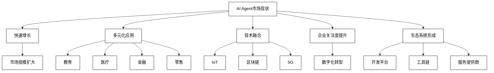
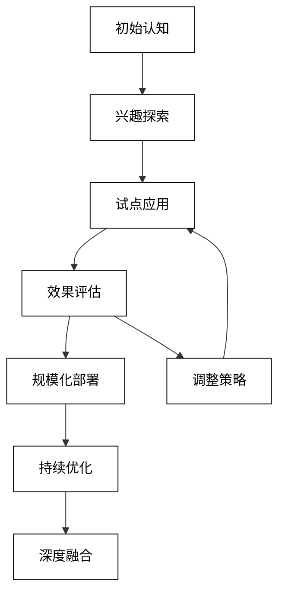
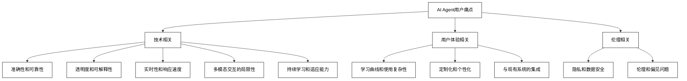
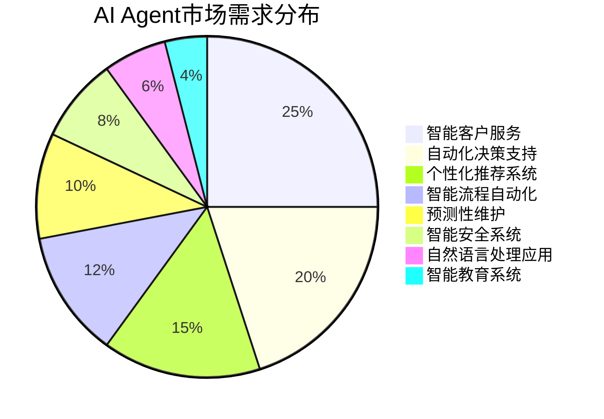
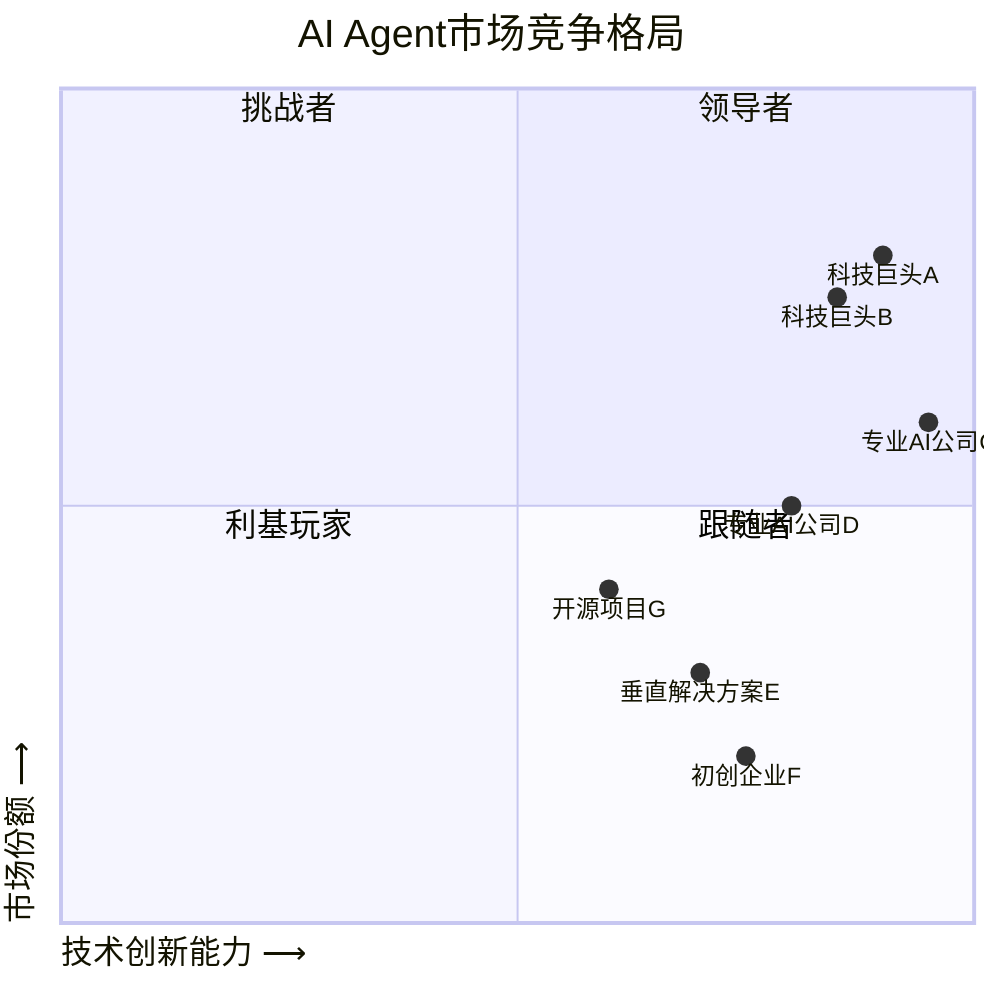
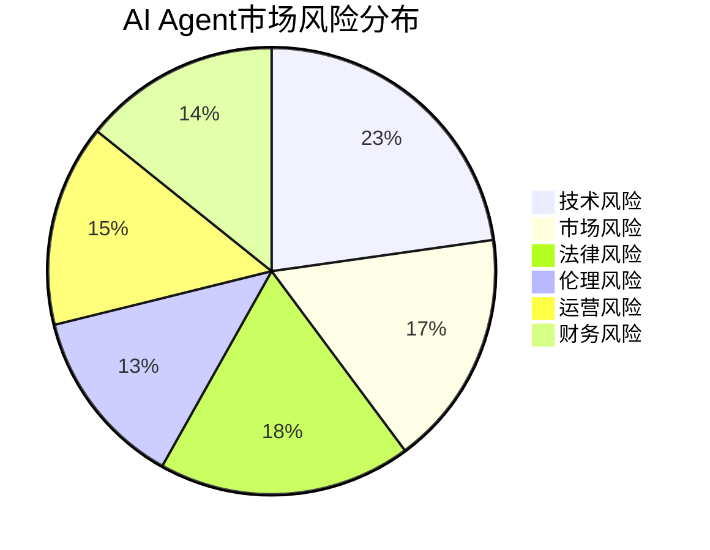

# 第13章 AI Agent的市场分析与预测

**关键词**：AI Agent、市场分析、发展趋势、市场需求、竞争格局、SWOT分析

**摘要**：本文深入探讨了AI Agent的市场现状、规模与发展趋势，分析了市场需求与机会，以及市场竞争与风险。通过对AI Agent能够解决的问题、企业用户态度、用户痛点和市场需求的全面剖析，为读者提供了AI Agent市场的全景图。同时，文章还运用SWOT分析方法，从多个维度评估了AI Agent市场的优势、劣势、机会和威胁，为相关企业和投资者提供了战略决策参考。

## 13.1 AI Agent的市场现状、规模与发展趋势

### 13.1.1 AI Agent的市场现状

AI Agent作为人工智能领域的前沿技术，正在迅速改变各行各业的运营模式和服务方式。目前，AI Agent市场呈现出以下几个显著特征：

1. **快速增长**：随着大语言模型（LLM）和机器学习技术的进步，AI Agent的应用范围不断扩大，市场规模呈现爆发式增长。

2. **多元化应用**：AI Agent已经渗透到教育、医疗、金融、零售等多个领域，为各行业带来创新解决方案。

3. **技术融合**：AI Agent正与物联网（IoT）、区块链、5G等新兴技术深度融合，创造出更加智能和高效的应用场景。

4. **企业关注度提升**：越来越多的企业开始重视AI Agent技术，将其纳入数字化转型战略。

5. **生态系统逐步形成**：围绕AI Agent的开发平台、工具链和服务提供商正在形成一个完整的生态系统。

为了更直观地展示AI Agent市场的现状，我们可以通过以下Mermaid流程图来呈现：



**市场现状分析**：

1. **技术成熟度**：
   AI Agent技术正处于快速发展阶段，但仍未完全成熟。大语言模型（如GPT-3、GPT-4）的突破为AI Agent提供了强大的基础，但在特定领域的专业知识和复杂任务处理方面仍有提升空间。

2. **应用领域分布**：
    - 客户服务：智能客服、虚拟助手
    - 金融：风险评估、投资顾问、欺诈检测
    - 医疗：诊断辅助、健康管理
    - 教育：个性化学习、智能辅导
    - 零售：个性化推荐、库存管理
    - 制造业：预测性维护、质量控制

3. **市场参与者**：
    - 科技巨头：Google、Microsoft、Amazon、IBM等
    - 专业AI公司：OpenAI、Anthropic、DeepMind等
    - 初创企业：专注于特定领域或功能的AI Agent开发
    - 传统企业：积极探索AI Agent在各自行业的应用

4. **投资热度**：
   根据CB Insights的数据，2023年全球AI领域的风险投资达到了创纪录的水平，其中AI Agent相关项目占据了相当大的比例。这表明投资者对AI Agent技术的未来充满信心。

5. **用户接受度**：
   随着AI技术的普及，用户对AI Agent的接受度正在逐步提高。然而，在某些领域（如医疗诊断、金融决策）仍存在信任障碍，需要进一步的技术验证和教育。

6. **法律和伦理挑战**：
   AI Agent的广泛应用也带来了一系列法律和伦理问题，如数据隐私、决策透明度、责任归属等。各国正在积极制定相关法规以应对这些挑战。

7. **标准化进程**：
   AI Agent领域的标准化工作正在进行中，但仍处于早期阶段。IEEE、ISO等国际组织已经开始制定AI相关标准，但特定于AI Agent的标准还有待完善。

8. **人才市场**：
   AI Agent领域的人才需求旺盛，特别是在机器学习、自然语言处理、知识图谱等方面的专家。高校和企业正在加大相关人才的培养力度。

9. **开源生态**：
   开源AI Agent框架和工具（如Rasa、Botpress等）正在蓬勃发展，为开发者和企业提供了低成本的入门途径，推动了整个生态系统的发展。

10. **跨行业合作**：
    AI Agent的发展正在促进不同行业间的合作。例如，医疗AI公司与保险公司合作开发健康管理Agent，金融机构与零售商合作开发智能支付Agent等。

为了更好地理解AI Agent市场的复杂性，我们可以通过以下数学模型来描述市场增长：

假设AI Agent市场的增长遵循logistic增长模型，其数学表达式为：

$$
P(t) = \frac{K}{1 + (\frac{K}{P_0} - 1)e^{-rt}}
$$

其中：
- $P(t)$ 是时间 $t$ 时的市场规模
- $K$ 是市场容量（最大可能的市场规模）
- $P_0$ 是初始市场规模
- $r$ 是增长率
- $t$ 是时间

这个模型反映了AI Agent市场在初期快速增长，然后随着市场饱和逐渐放缓的特征。通过调整参数，我们可以模拟不同情景下的市场增长轨迹。

**最佳实践Tips**：
1. 密切关注AI Agent技术的最新进展，特别是大语言模型的突破。
2. 评估AI Agent在您所在行业的潜在应用，制定相应的实施策略。
3. 重视数据隐私和安全，确保AI Agent的使用符合相关法规。
4. 投资AI人才培养，建立跨学科团队以应对AI Agent带来的挑战。
5. 参与行业标准的制定，为AI Agent的长期发展贡献力量。

### 13.1.2 AI Agent的市场规模与发展趋势

AI Agent市场正处于快速增长阶段，其市场规模和发展趋势值得我们深入探讨。以下是对AI Agent市场规模的详细分析和未来发展趋势的预测：

**市场规模分析**：

1. **全球市场规模**：
   根据Grand View Research的报告，全球AI Agent市场规模预计将从2023年的约50亿美元增长到2030年的超过300亿美元，年复合增长率(CAGR)约为25%。

2. **区域分布**：
    - 北美：目前占据最大市场份额，约40%
    - 欧洲：第二大市场，约30%
    - 亚太地区：增长最快的地区，预计到2030年将占25%以上的市场份额
    - 其他地区：约5%

3. **行业分布**：
    - 金融服务：25%
    - 零售和电子商务：20%
    - 医疗保健：15%
    - 制造业：10%
    - 教育：10%
    - 其他（如旅游、娱乐等）：20%

4. **按技术类型划分**：
    - 基于规则的AI Agent：30%
    - 机器学习型AI Agent：40%
    - 深度学习型AI Agent：30%

为了更直观地展示市场规模的增长趋势，我们可以使用以下数学模型：

假设AI Agent市场规模的增长遵循指数增长模型，其数学表达式为：

$$
M(t) = M_0 \cdot (1 + r)^t
$$

其中：
- $M(t)$ 是 $t$ 年后的市场规模
- $M_0$ 是初始市场规模（2023年的50亿美元）
- $r$ 是年增长率（25%）
- $t$ 是年数

使用这个模型，我们可以预测未来几年的市场规模：

- 2024年：$50 \cdot (1 + 0.25)^1 = 62.5$ 亿美元
- 2025年：$50 \cdot (1 + 0.25)^2 = 78.125$ 亿美元
- 2026年：$50 \cdot (1 + 0.25)^3 = 97.656$ 亿美元
- ...
- 2030年：$50 \cdot (1 + 0.25)^7 \approx 305.18$ 亿美元

这个简化模型展示了AI Agent市场的快速增长潜力。然而，实际增长可能会受到多种因素的影响，导致增长曲线呈现更复杂的形态。

**发展趋势预测**：

1. **技术融合加速**：
   AI Agent将与其他前沿技术如5G、边缘计算、区块链等深度融合，创造出更智能、更高效的应用场景。

   ```mermaid
   graph TD
       A[AI Agent] --> B[5G]
       A --> C[边缘计算]
       A --> D[区块链]
       A --> E[IoT]
       B --> F[低延迟实时交互]
       C --> G[本地化处理]
       D --> H[安全可信数据交换]
       E --> I[智能设备协同]

   %% 自定义样式
   classDef default fill:#ffffff,stroke:#000000,color:#000000;
   ```

2. **多模态交互**：
   未来的AI Agent将不再局限于文本交互，而是能够理解和生成图像、语音、视频等多种模态的信息，提供更自然、更丰富的用户体验。

3. **自主学习能力增强**：
   AI Agent将具备更强的自主学习能力，能够从与用户的交互中不断优化自身性能，适应不同场景和需求。

4. **个性化和情感智能**：
   AI Agent将更加注重个性化服务和情感智能，能够理解用户的情绪状态，提供更贴心、更人性化的服务。

5. **跨语言和跨文化能力**：
   随着全球化的深入，AI Agent将具备更强的跨语言和跨文化交流能力，为国际业务提供支持。

6. **安全性和隐私保护升级**：
   随着对AI安全和隐私问题的关注增加，未来的AI Agent将采用更先进的加密技术和隐私保护机制。

7. **行业专业化**：
   将出现更多针对特定行业和领域的专业AI Agent，如法律顾问Agent、医疗诊断Agent等。

8. **生态系统的成熟**：
   围绕AI Agent的开发工具、平台和服务将形成完整的生态系统，降低开发门槛，促进创新。

9. **人机协作模式演进**：
   AI Agent将不再仅仅是人类的替代品，而是成为人类的智能助手，形成新型的人机协作模式。

10. **伦理和监管框架完善**：
    随着AI Agent的广泛应用，相关的伦理准则和监管框架将逐步完善，确保AI Agent的可控性和可信性。

为了量化这些趋势的影响，我们可以使用以下数学模型来评估AI Agent的性能提升：

假设AI Agent的性能指标 $P$ 由多个因素组成，可以表示为：

$$
P = \sum_{i=1}^n w_i \cdot f_i(t)
$$

其中：
- $w_i$ 是每个因素的权重
- $f_i(t)$ 是随时间变化的因素函数
- $n$ 是影响因素的数量

例如，我们可以定义以下因素：
- $f_1(t)$：计算能力
- $f_2(t)$：数据质量
- $f_3(t)$：算法效率
- $f_4(t)$：多模态能力
- $f_5(t)$：安全性

每个因素可能有不同的增长模式，如线性增长、指数增长或S型增长。通过调整这些因素的权重和增长函数，我们可以模拟不同情景下AI Agent性能的整体提升趋势。

**最佳实践Tips**：
1. 制定长期AI战略，将AI Agent作为核心组成部分。
2. 投资多模态AI技术，为未来的交互模式做准备。
3. 重视AI伦理和安全性培训，确保AI Agent的可信和可控。
4. 探索AI Agent在特定行业的深度应用，打造专业化解决方案。
5. 建立跨学科团队，结合领域专家和AI技术人才，推动AI Agent的创新应用。

**小结**：
AI Agent市场正处于高速增长期，其发展趋势呈现出技术融合、多模态交互、自主学习、个性化服务等特征。市场规模预计将在未来几年内实现显著增长，各行业对AI Agent的需求不断增加。然而，这一领域的发展也面临着技术、伦理和监管等多方面的挑战。企业和投资者需要密切关注市场动态，制定合适的战略以把握AI Agent带来的巨大机遇。

## 13.2 AI Agent的市场需求与机会

### 13.2.1 AI Agent能够解决什么问题

AI Agent作为人工智能技术的前沿应用，具有强大的问题解决能力，可以在多个领域为企业和个人用户提供价值。以下是AI Agent能够解决的主要问题类型：

1. **信息处理和分析**
    - 大规模数据处理：AI Agent可以快速处理和分析海量数据，从中提取有价值的信息。
    - 自然语言理解：能够理解和解析人类语言，实现更自然的人机交互。
    - 文本摘要和生成：自动生成报告、新闻稿或内容摘要，提高信息传播效率。

2. **决策支持**
    - 风险评估：在金融、保险等领域，AI Agent可以分析复杂因素，提供准确的风险评估。
    - 投资建议：基于市场数据和个人偏好，提供个性化的投资策略。
    - 诊断辅助：在医疗领域，AI Agent可以辅助医生进行疾病诊断和治疗方案制定。

3. **流程自动化**
    - 客户服务：24/7全天候提供智能客服支持，处理常见查询和问题。
    - 工作流程优化：分析和优化业务流程，提高运营效率。
    - 智能调度：在物流、交通等领域实现资源的智能分配和调度。

4. **个性化推荐**
    - 产品推荐：基于用户行为和偏好，提供个性化的产品和服务推荐。
    - 内容定制：为用户提供量身定制的新闻、娱乐内容等。
    - 学习路径规划：在教育领域，为学生制定个性化的学习计划和资源推荐。

5. **预测和预防**
    - 预测性维护：在制造业中，预测设备故障并提前安排维护。
    - 欺诈检测：在金融和电子商务领域，实时检测和预防欺诈行为。
    - 疾病预防：分析健康数据，提供个性化的健康建议和预防措施。

6. **智能交互**
    - 虚拟助手：提供个人生活和工作的智能辅助。
    - 情感计算：识别和响应用户的情绪状态，提供更人性化的交互体验。
    - 多语言翻译：实时跨语言沟通和翻译服务。

7. **创意和创新支持**
    - 创意生成：在设计、广告等领域提供创意灵感和方案。
    - 科研辅助：协助科研人员进行文献综述、实验设计等工作。
    - 产品创新：通过分析市场趋势和用户需求，提供产品创新建议。

8. **环境监测和控制**
    - 智能家居：控制和优化家庭设备的运行，提高能源效率。
    - 环境保护：监测和分析环境数据，提供污染控制和生态保护建议。
    - 智慧城市：优化城市交通、能源使用和公共服务。

为了更好地理解AI Agent解决问题的能力，我们可以使用以下数学模型来描述其效率提升：

假设在某个特定领域，人工处理问题的效率为 $E_h$，AI Agent处理问题的效率为 $E_a$。我们可以定义效率提升因子 $\eta$ 为：

$$
\eta = \frac{E_a}{E_h}
$$

通常情况下，$\eta > 1$，表示AI Agent能够提高处理效率。

我们可以进一步将效率 $E$ 分解为速度 $S$ 和准确率 $A$ 的函数：

$$
E = f(S, A)
$$

一个简单的模型可以是：

$$
E = S \cdot A
$$

假设AI Agent能够将处理速度提高 $k$ 倍，准确率提高 $m$ 倍，那么效率提升因子可以表示为：

$$
\eta = \frac{S_a \cdot A_a}{S_h \cdot A_h} = k \cdot m
$$

这个模型说明，AI Agent通过同时提高处理速度和准确率，可以实现效率的倍增。

**最佳实践Tips**：
1. 明确定义问题：在应用AI Agent之前，清晰地定义需要解决的具体问题。
2. 数据质量保证：确保AI Agent训练和运行所需的数据质量和数量。
3. 持续优化：定期评估AI Agent的性能，并根据反馈进行优化。
4. 人机协作：设计合理的人机协作机制，发挥AI Agent和人类各自的优势。
5. 跨领域应用：探索AI Agent在不同领域的应用可能性，实现知识迁移。

### 13.2.2 企业用户对AI Agent的态度

企业用户对AI Agent的态度是复杂且多样的，这种态度会随着技术的发展和应用经验的积累而不断变化。以下是企业用户对AI Agent的主要态度类型及其影响因素：

1. **积极拥抱**
    - 特点：这类企业用户对AI Agent持高度开放和积极的态度，将其视为核心竞争力的来源。
    - 影响因素：
        - 高度的技术创新意识
        - 充足的资金和技术资源
        - 面临激烈的市场竞争压力
    - 典型行业：科技、金融、电子商务

2. **谨慎观望**
    - 特点：对AI Agent持有兴趣，但在全面采用前希望看到更多成功案例和ROI证明。
    - 影响因素：
        - 对技术风险的担忧
        - 现有系统的替换成本考虑
        - 行业监管要求
    - 典型行业：制造业、传统零售、中小企业

3. **选择性应用**
    - 特点：在特定领域或部门试点应用AI Agent，逐步评估和扩展。
    - 影响因素：
        - 业务流程的复杂性
        - 数据安全和隐私考虑
        - 员工技能水平
    - 典型行业：医疗保健、教育、政府部门

4. **抵触或怀疑**
    - 特点：对AI Agent持怀疑态度，担心其可能带来的负面影响。
    - 影响因素：
        - 对就业影响的担忧
        - 对AI伦理和安全性的顾虑
        - 传统文化和管理模式的惯性
    - 典型行业：部分传统服务业、小型家族企业

5. **被动接受**
    - 特点：在行业趋势或竞争压力下被动采用AI Agent。
    - 影响因素：
        - 客户需求的变化
        - 行业标准的演变
        - 供应链合作伙伴的要求
    - 典型行业：汽车零部件、传统制造业

为了量化企业用户对AI Agent的态度，我们可以设计一个态度评分模型：

$$
A = w_1P + w_2R + w_3I + w_4C + w_5E
$$

其中：
- $A$ 是总体态度得分
- $P$ 是感知有用性得分
- $R$ 是感知风险得分
- $I$ 是创新倾向得分
- $C$ 是成本考虑得分
- $E$ 是外部压力得分
- $w_1, w_2, w_3, w_4, w_5$ 是各因素的权重

每个因素的得分可以通过调查问卷或数据分析获得，范围可以设定为0-10。权重的总和应该等于1。

例如，一个具体的评分可能是：

$$
A = 0.3 \cdot 8 + 0.2 \cdot 6 + 0.2 \cdot 7 + 0.15 \cdot 5 + 0.15 \cdot 9 = 7.05
$$

这个得分表明该企业对AI Agent持相对积极的态度。

**企业态度的演变趋势**：

1. **认知深化**：随着对AI Agent的了解加深，企业用户的态度会从模糊到具体，从单一到多元。

2. **期望调整**：初期可能存在过高期望，随后会调整到更现实的水平。

3. **应用范围扩大**：从单点试验逐步扩展到多个业务领域。

4. **关注点转移**：从技术本身转向业务价值和长期战略影响。

5. **协作模式优化**：逐步形成更有效的人机协作模式。

为了可视化企业态度的演变，我们可以使用以下Mermaid流程图：



**最佳实践Tips**：
1. 开展AI Agent意识培训，提高企业各层级对技术的理解。
2. 制定清晰的AI战略，将AI Agent与企业长期发展目标对齐。
3. 建立跨部门的AI Agent应用评估机制，全面考虑技术、业务和人力资源影响。
4. 鼓励创新文化，为AI Agent的试验和应用创造宽松环境。
5. 重视变革管理，帮助员工适应AI Agent带来的工作方式变化。

### 13.2.3 AI Agent的用户痛点

尽管AI Agent技术不断进步，但在实际应用中仍然存在一些用户痛点。理解和解决这些痛点对于AI Agent的广泛采用和持续发展至关重要。以下是AI Agent用户面临的主要痛点：

1. **准确性和可靠性**
    - 问题：AI Agent有时会产生错误或不一致的输出。
    - 影响：降低用户信任，可能导致决策错误。
    - 解决方向：改进算法，增加训练数据质量，引入人工审核机制。

2. **透明度和可解释性**
    - 问题：AI Agent的决策过程往往是黑盒操作，用户难以理解。
    - 影响：增加使用障碍，尤其在高风险决策领域。
    - 解决方向：开发可解释AI技术，提供决策依据的详细说明。

3. **隐私和数据安全**
    - 问题：AI Agent需要处理大量个人和敏感数据。
    - 影响：引发用户对隐私泄露和数据滥用的担忧。
    - 解决方向：实施严格的数据保护措施，采用隐私保护AI技术。

4. **定制化和个性化**
    - 问题：通用AI Agent难以满足特定领域或个人的独特需求。
    - 影响：限制AI Agent在专业领域的应用效果。
    - 解决方向：开发可定制的AI Agent框架，支持领域专家知识的融入。

5. **学习曲线和使用复杂性**
    - 问题：某些AI Agent系统操作复杂，需要专业知识。
    - 影响：提高使用门槛，减少潜在用户群。
    - 解决方向：优化用户界面，提供直观的操作指南和培训。

6. **与现有系统的集成**
    - 问题：AI Agent与企业现有IT系统的兼容性问题。
    - 影响：增加部署难度和成本。
    - 解决方向：开发标准化接口，提供灵活的集成方案。

7. **实时性和响应速度**
    - 问题：某些复杂任务的处理时间较长。
    - 影响：影响用户体验，限制在实时场景中的应用。
    - 解决方向：优化算法效率，利用边缘计算技术。

8. **多模态交互的局限性**
    - 问题：大多数AI Agent主要依赖文本交互，缺乏多模态能力。
    - 影响：限制了在某些场景下的应用效果。
    - 解决方向：开发多模态AI技术，提升语音、图像、视频处理能力。

9. **伦理和偏见问题**
    - 问题：AI Agent可能继承或放大训练数据中的偏见。
    - 影响：导致不公平或歧视性的决策。
    - 解决方向：实施AI伦理审查，使用去偏见技术优化训练数据。

10. **持续学习和适应能力**
    - 问题：AI Agent难以适应快速变化的环境和新情况。
    - 影响：长期使用效果下降，需要频繁更新。
    - 解决方向：开发在线学习算法，实现持续优化机制。

为了量化这些痛点的影响，我们可以使用以下数学模型：

定义用户满意度 $S$ 为各痛点影响因子的函数：

$$
S = f(A, T, P, C, L, I, R, M, E, D)
$$

其中：
- $A$: 准确性
- $T$: 透明度
- $P$: 隐私保护
- $C$: 定制化程度
- $L$: 学习难度
- $I$: 集成难度
- $R$: 响应速度
- $M$: 多模态能力
- $E$: 伦理表现
- $D$: 适应能力

我们可以使用加权平均模型来计算总体满意度：

$$
S = \sum_{i=1}^n w_i \cdot F_i
$$

其中 $w_i$ 是每个因素的权重，$F_i$ 是每个因素的得分（范围0-10）。

例如，一个具体的满意度计算可能是：

$$
S = 0.2 \cdot 8 + 0.15 \cdot 7 + 0.1 \cdot 9 + 0.1 \cdot 6 + 0.1 \cdot 5 + 0.1 \cdot 6 + 0.05 \cdot 8 + 0.05 \cdot 5 + 0.1 \cdot 7 + 0.05 \cdot 6 = 6.95
$$

这个得分表明用户对AI Agent的总体满意度为中等偏上。

为了可视化用户痛点的关系和影响，我们可以使用以下Mermaid图表：



**最佳实践Tips**：
1. 建立用户反馈机制，及时收集和分析用户痛点。
2. 优先解决影响用户信任和核心功能的痛点。
3. 采用迭代开发方法，逐步改进AI Agent性能。
4. 提供透明的性能指标和限制说明，管理用户期望。
5. 投资于AI伦理研究，确保AI Agent的公平性和可信度。

### 13.2.4 AI Agent的市场需求

AI Agent的市场需求正在快速增长，这种增长既来自于技术进步带来的新可能性，也源于各行业对提高效率和创新的迫切需求。以下是AI Agent市场需求的主要方面：

1. **智能客户服务**
    - 需求描述：全天候、多语言、个性化的客户服务支持。
    - 市场规模：预计到2025年，全球智能客服市场将达到190亿美元。
    - 驱动因素：客户期望的提高、人力成本上升、服务质量一致性要求。

2. **自动化决策支持**
    - 需求描述：在金融、医疗等领域提供快速、准确的决策建议。
    - 市场规模：预计到2026年，AI决策支持系统市场将达到110亿美元。
    - 驱动因素：数据复杂性增加、决策速度要求提高、风险管理需求。

3. **个性化推荐系统**
    - 需求描述：电商、内容平台的精准个性化推荐。
    - 市场规模：预计到2025年，AI推荐系统市场将达到120亿美元。
    - 驱动因素：用户体验优化、转化率提升需求、内容过载问题。

4. **智能流程自动化**
    - 需求描述：自动化复杂的业务流程，提高运营效率。
    - 市场规模：预计到2027年，智能流程自动化市场将达到300亿美元。
    - 驱动因素：人力成本上升、流程复杂性增加、数字化转型需求。

5. **预测性维护**
    - 需求描述：在制造业和基础设施领域预测设备故障。
    - 市场规模：预计到2026年，AI预测性维护市场将达到230亿美元。
    - 驱动因素：设备停机成本高昂、维护效率提升需求、物联网技术普及。

6. **智能安全系统**
    - 需求描述：网络安全、物理安全的智能监控和威胁检测。
    - 市场规模：预计到2025年，AI安全市场将达到460亿美元。
    - 驱动因素：网络威胁增加、隐私保护要求提高、实时响应需求。

7. **自然语言处理应用**
    - 需求描述：文本分析、语音识别、机器翻译等NLP应用。
    - 市场规模：预计到2026年，NLP市场将达到430亿美元。
    - 驱动因素：多语言沟通需求、内容分析需求、语音交互技术发展。

8. **智能教育系统**
    - 需求描述：个性化学习路径、智能辅导、教育资源推荐。
    - 市场规模：预计到2025年，AI教育市场将达到200亿美元。
    - 驱动因素：远程教育需求增加、个性化学习趋势、教育资源优化需求。

为了量化AI Agent的市场需求，我们可以使用以下数学模型：

假设AI Agent在某个领域的市场需求 $D$ 是多个因素的函数：

$$
D = f(T, C, R, A, M)
$$

其中：
- $T$: 技术成熟度
- $C$: 成本效益
- $R$: 监管环境
- $A$: 用户接受度
- $M$: 市场竞争程度

我们可以使用一个简化的线性模型来估算需求：

$$
D = w_1T + w_2C + w_3R + w_4A - w_5M
$$

其中 $w_1, w_2, w_3, w_4, w_5$ 是各因素的权重。

例如，对于智能客户服务领域，我们可能有：

$$
D = 0.3 \cdot 8 + 0.25 \cdot 7 + 0.15 \cdot 6 + 0.2 \cdot 9 - 0.1 \cdot 5 = 6.8
$$

这个得分表明智能客户服务领域的AI Agent有较高的市场需求。

为了可视化AI Agent的市场需求分布，我们可以使用以下Mermaid图表：



**最佳实践Tips**：
1. 进行定期的市场需求调研，识别新兴的AI Agent应用场景。
2. 关注行业特定的需求，开发针对性的AI Agent解决方案。
3. 建立跨行业合作伙伴关系，共同开发和推广AI Agent应用。
4. 投资于可扩展的AI Agent平台，以快速响应不同领域的需求。
5. 重视用户教育和培训，提高市场对AI Agent的认知和接受度。

## 13.3 AI Agent的市场竞争与风险

### 13.3.1 AI Agent的市场竞争

AI Agent市场的竞争格局正在快速演变，涉及多个层面的参与者，从科技巨头到专业AI公司，再到新兴创业企业。以下是AI Agent市场竞争的主要特征和参与者分析：

1. **市场参与者类型**
   a) 科技巨头：如Google、Microsoft、Amazon、IBM等
   b) 专业AI公司：如OpenAI、Anthropic、DeepMind等
   c) 垂直领域解决方案提供商：专注于特定行业的AI Agent开发商
   d) 开源社区：如Rasa、Botpress等开源AI Agent框架的贡献者
   e) 初创企业：专注于创新AI Agent应用的新兴公司

2. **竞争维度**
   a) 技术创新：核心算法、模型性能、多模态能力
   b) 应用场景：通用vs专业、横向vs纵向
   c) 数据优势：数据量、数据质量、数据多样性
   d) 生态系统：开发者社区、合作伙伴网络
   e) 用户体验：易用性、个性化、响应速度
   f) 成本效益：部署成本、运营成本、ROI

3. **市场策略分析**
   a) 平台化战略：构建AI Agent开发和部署平台
   b) 垂直整合：提供端到端的AI Agent解决方案
   c) 开源+商业模式：通过开源吸引开发者，提供增值服务
   d) API经济：提供AI Agent能力的API服务
   e) 合作共赢：与行业领先企业合作，共同开发应用

4. **竞争格局演变趋势**
   a) 技术壁垒提高：核心技术成为关键竞争力
   b) 行业整合加速：通过并购扩大市场份额和技术储备
   c) 生态系统竞争：从单点产品竞争转向生态系统竞争
   d) 专业化分工：在特定领域或功能上的深度专业化
   e) 全球化竞争：跨国公司与本土企业的竞争加剧

为了量化分析市场竞争，我们可以使用以下数学模型：

定义市场竞争力指数 $C$ 为多个因素的函数：

$$
C = f(T, M, D, E, U, F)
$$

其中：
- $T$: 技术创新能力
- $M$: 市场份额
- $D$: 数据优势
- $E$: 生态系统强度
- $U$: 用户体验
- $F$: 财务实力

我们可以使用加权平均模型来计算总体竞争力：

$$
C = w_1T + w_2M + w_3D + w_4E + w_5U + w_6F
$$

其中 $w_i$ 是每个因素的权重，各因素得分范围为0-10。

例如，对于一家AI Agent公司的竞争力评估可能是：

$$
C = 0.25 \cdot 9 + 0.2 \cdot 7 + 0.15 \cdot 8 + 0.15 \cdot 6 + 0.15 \cdot 8 + 0.1 \cdot 7 = 7.65
$$

这个得分表明该公司在AI Agent市场具有较强的竞争力。

为了可视化AI Agent市场的竞争格局，我们可以使用以下Mermaid图表：



**最佳实践Tips**：
1. 持续投资核心技术研发，保持技术领先优势。
2. 构建强大的生态系统，吸引开发者和合作伙伴。
3. 关注垂直领域的深度应用，打造差异化竞争优势。
4. 重视用户体验优化，提高产品粘性和用户忠诚度。
5. 积极探索新兴应用场景，抢占市场先机。

### 13.3.2 AI Agent的市场风险

尽管AI Agent市场前景广阔，但也面临着多方面的风险。识别和管理这些风险对于企业的长期成功至关重要。以下是AI Agent市场的主要风险：

1. **技术风险**
    - 技术快速迭代：现有技术可能很快被新技术取代
    - 性能不稳定：AI Agent在复杂环境中可能表现不一致
    - 安全漏洞：AI系统可能存在被攻击或滥用的风险

2. **市场风险**
    - 市场过热：投资泡沫可能导致市场调整
    - 竞争加剧：新进入者和跨界竞争加剧利润压力
    - 用户接受度：部分用户可能对AI技术持怀疑态度

3. **法律和合规风险**
    - 隐私保护：数据使用和隐私保护相关的法律风险
    - 责任界定：AI决策错误导致的责任归属问题
    - 行业监管：不同行业对AI应用的监管要求不同

4. **伦理风险**
    - 偏见和歧视：AI系统可能产生或放大社会偏见
    - 透明度问题：AI决策过程的不透明可能引发质疑
    - 就业影响：AI可能导致某些工作岗位被取代

5. **运营风险**
    - 数据质量：训练数据的质量和代表性问题
    - 集成难度：与现有系统集成的技术和成本挑战
    - 人才短缺：AI专业人才的稀缺和高成本

6. **财务风险**
    - 高投入：AI研发和部署需要大量资金投入
    - 回报周期长：AI项目可能需要较长时间才能实现盈利
    - 估值波动：AI公司估值可能因市场情绪变化而大幅波动

为了量化分析市场风险，我们可以使用风险矩阵模型：

定义风险指数 $R$ 为风险发生概率 $P$ 和影响程度 $I$ 的函数：

$$
R = P \times I
$$

对于每种风险类型，我们可以评估其概率和影响，例如：

| 风险类型 | 概率 (P) | 影响 (I) | 风险指数 (R) |
|---------|---------|---------|-------------|
| 技术风险 | 0.7     | 8       | 5.6         |
| 市场风险 | 0.6     | 7       | 4.2         |
| 法律风险 | 0.5     | 9       | 4.5         |
| 伦理风险 | 0.4     | 8       | 3.2         |
| 运营风险 | 0.6     | 6       | 3.6         |
| 财务风险 | 0.5     | 7       | 3.5         |

总体风险指数可以通过加权平均计算：

$$
R_{total} = \sum_{i=1}^n w_i R_i
$$

其中 $w_i$ 是每种风险类型的权重。

为了可视化AI Agent市场的风险分布，我们可以使用以下Mermaid图表：



**风险管理策略**：

1. 技术风险管理
    - 持续投资研发，保持技术领先性
    - 建立严格的安全测试和漏洞管理流程
    - 采用模块化设计，提高系统灵活性和可升级性

2. 市场风险管理
    - 多元化产品线，分散市场风险
    - 加强市场调研，及时调整产品策略
    - 建立强大的品牌和用户教育体系

3. 法律和合规风险管理
    - 建立专门的法律合规团队
    - 积极参与行业标准和法规制定
    - 实施严格的数据治理和隐私保护措施

4. 伦理风险管理
    - 成立AI伦理委员会，制定伦理准则
    - 增加AI决策过程的透明度和可解释性
    - 定期进行伦理审计和偏见检测

5. 运营风险管理
    - 建立数据质量管理体系
    - 制定详细的系统集成和迁移计划
    - 投资AI人才培养和retention计划

6. 财务风险管理
    - 制定阶段性投资计划，控制现金流
    - 多元化融资渠道，降低资金风险
    - 建立严格的项目ROI评估机制

**最佳实践Tips**：
1. 建立全面的风险评估和监控体系，定期更新风险矩阵。
2. 培养跨学科团队，综合考虑技术、业务和伦理风险。
3. 与监管机构保持积极沟通，参与行业标准制定。
4. 重视用户反馈，建立快速响应机制处理潜在风险。
5. 保持技术和市场的敏感性，及时调整战略应对新兴风险。

### 13.3.3 AI Agent市场的SWOT分析

SWOT分析是一种战略规划工具，用于评估一个项目或商业venture的优势（Strengths）、劣势（Weaknesses）、机会（Opportunities）和威胁（Threats）。下面我们对AI Agent市场进行SWOT分析：

**优势（Strengths）**：

1. 技术创新：AI技术的快速发展为AI Agent提供了强大的技术支持。
2. 效率提升：AI Agent可以显著提高各行业的运营效率和决策质量。
3. 24/7可用性：AI Agent可以提供全天候不间断的服务。
4. 可扩展性：AI Agent可以轻松扩展以处理大规模任务和用户需求。
5. 数据驱动：AI Agent能够从海量数据中学习和优化，持续提升性能。

**劣势（Weaknesses）**：

1. 技术局限：在处理高度复杂或需要情感理解的任务时仍有不足。
2. 高初始成本：开发和部署AI Agent系统需要大量前期投资。
3. 数据依赖：AI Agent的性能严重依赖于训练数据的质量和数量。
4. 解释性不足：部分AI模型的决策过程难以解释，影响用户信任。
5. 标准化缺失：AI Agent领域尚未形成统一的标准和最佳实践。

**机会（Opportunities）**：

1. 市场扩张：AI Agent在各行业的应用潜力巨大，市场规模持续增长。
2. 新兴应用：5G、IoT等技术的发展为AI Agent创造了新的应用场景。
3. 个性化需求：消费者对个性化服务的需求增加，为AI Agent提供了机会。
4. 自动化趋势：全球自动化趋势为AI Agent的广泛应用创造了有利环境。
5. 跨行业融合：AI Agent有潜力推动不同行业间的创新融合。

**威胁（Threats）**：

1. 伦理担忧：AI的伦理问题可能引发社会争议和监管限制。
2. 安全风险：AI系统可能成为网络攻击的目标，威胁数据安全。
3. 就业影响：AI Agent可能导致某些工作岗位被取代，引发社会问题。
4. 技术垄断：少数公司可能垄断核心AI技术，限制市场竞争。
5. 监管不确定性：AI相关法规的不确定性可能影响行业发展。

为了量化SWOT分析结果，我们可以使用以下评分模型：

对每个因素进行重要性（1-5分）和影响程度（-2到+2分）的评分，然后计算总分：

$$
Score = \sum_{i=1}^n Importance_i \times Impact_i
$$

例如：

| 类别 | 因素 | 重要性 | 影响程度 | 得分 |
|-----|-----|-------|---------|-----|
| S   | 技术创新 | 5 | +2 | 10 |
| W   | 高初始成本 | 4 | -1 | -4 |
| O   | 市场扩张 | 5 | +2 | 10 |
| T   | 伦理担忧 | 3 | -1 | -3 |

总分 = 10 + (-4) + 10 + (-3) = 13

正分表示有利因素大于不利因素，AI Agent市场总体前景乐观。

为了可视化SWOT分析结果，我们可以使用以下Mermaid图表：

```mermaid
quadrantChart
    title AI Agent市场SWOT分析
    x-axis 不利 --> 有利
    y-axis 外部 --> 内部
    quadrant-1 威胁 (T)
    quadrant-2 机会 (O)
    quadrant-3 劣势 (W)
    quadrant-4 优势 (S)
    "伦理担忧": [-0.6, 0.7]
    "安全风险": [-0.7, 0.6]
    "就业影响": [-0.5, 0.8]
    "市场扩张": [0.8, 0.9]
    "新兴应用": [0.7, 0.8]
    "个性化需求": [0.6, 0.7]
    "技术局限": [-0.5, -0.6]
    "高初始成本": [-0.6, -0.7]
    "数据依赖": [-0.4, -0.5]
    "技术创新": [0.9, -0.8]
    "效率提升": [0.8, -0.7]
    "可扩展性": [0.7, -0.6]
```

**基于SWOT分析的战略建议**：

1. 利用优势抓住机会：
    - 加大技术创新投入，开发新的AI Agent应用场景
    - 利用效率提升优势，重点开拓自动化需求强烈的行业市场

2. 利用优势应对威胁：
    - 强化AI Agent的安全性和可靠性，应对安全风险
    - 开发有助于创造新就业机会的AI Agent应用，缓解就业影响

3. 克服劣势把握机会：
    - 开发更具解释性的AI模型，提高用户信任度
    - 推动行业标准化，降低开发和部署成本

4. 克服劣势规避威胁：
    - 加强AI伦理研究，主动应对伦理担忧
    - 探索新的商业模式，降低高初始成本带来的市场准入障碍

**最佳实践Tips**：
1. 定期进行SWOT分析，及时调整战略方向。
2. 重视跨学科合作，综合考虑技术、市场和社会因素。
3. 积极参与行业对话和政策制定，塑造有利的发展环境。
4. 投资长期研发，平衡短期利益和长期竞争力。
5. 建立灵活的组织结构，快速响应市场变化和新机会。

通过全面的SWOT分析，企业可以更好地把握AI Agent市场的机遇，规避潜在风险，制定有效的发展战略。