# 第14章 AI Agent的商业启示

## 14.1 AI Agent的商业趋势

AI Agent正在重塑商业格局，为企业带来前所未有的机遇和挑战。以下是AI Agent的主要商业趋势：

1. **智能自动化的普及**
   
   - 趋势描述：AI Agent将在更多行业和业务流程中实现智能自动化。
   - 影响：提高运营效率，降低人力成本，实现24/7服务。
   - 案例：自动化客户服务、智能合同审查、自动化财务报告生成。
2. **个性化体验的深化**
   
   - 趋势描述：AI Agent将提供更精准、动态的个性化服务。
   - 影响：提升客户满意度，增加客户粘性，提高转化率。
   - 案例：个性化学习助手、智能健康管理、定制化金融建议。
3. **人机协作模式的演进**
   
   - 趋势描述：AI Agent将成为人类工作的智能助手，而非简单的替代品。
   - 影响：提高决策质量，释放人类创造力，重塑工作流程。
   - 案例：AI辅助医疗诊断、创意设计协作、智能研究助理。
4. **跨平台集成的加速**
   
   - 趋势描述：AI Agent将实现跨设备、跨平台的无缝集成。
   - 影响：提供一致的用户体验，增强数据互通性，促进生态系统发展。
   - 案例：多端同步的智能助理、跨平台的企业知识管理系统。
5. **预测性分析的普及**
   
   - 趋势描述：AI Agent将广泛应用于预测分析，辅助决策制定。
   - 影响：降低风险，优化资源分配，提高战略决策的准确性。
   - 案例：智能供应链管理、预测性维护、市场趋势预测。
6. **情感智能的提升**
   
   - 趋势描述：AI Agent将具备更强的情感理解和表达能力。
   - 影响：改善用户体验，增强人机交互的自然度，开拓新的应用场景。
   - 案例：情感识别客服、心理健康助手、情感智能教育系统。
7. **边缘计算的融合**
   
   - 趋势描述：AI Agent将更多地部署在边缘设备上，实现本地化处理。
   - 影响：降低延迟，提高隐私保护，扩展IoT应用。
   - 案例：智能家居控制、自动驾驶辅助系统、实时视频分析。
8. **可解释AI的发展**
   
   - 趋势描述：AI Agent的决策过程将变得更加透明和可解释。
   - 影响：增加用户信任，满足监管要求，促进AI在高风险领域的应用。
   - 案例：可解释的信贷评分系统、透明的医疗诊断辅助。
9. **生成式AI的广泛应用**
   
   - 趋势描述：基于大语言模型的生成式AI将在更多领域得到应用。
   - 影响：提高内容创作效率，实现自动化编程，推动创新设计。
   - 案例：AI写作助手、代码自动生成、产品设计辅助。
10. **AI即服务（AIaaS）的兴起**
    
    - 趋势描述：更多企业将通过云服务模式使用AI Agent能力。
    - 影响：降低AI应用门槛，促进中小企业AI化，加速AI创新。
    - 案例：云端AI API服务、可定制的AI Agent平台、行业专用AI解决方案。

为了量化这些趋势的影响，我们可以使用以下数学模型：

定义趋势影响指数 $I$ 为采用率 $A$、市场规模 $M$ 和技术成熟度 $T$ 的函数：

$$
I = w_1A + w_2M + w_3T
$$

其中 $w_1$, $w_2$, $w_3$ 是权重系数，且 $w_1 + w_2 + w_3 = 1$。

每个因素的评分范围为0-10。例如，对于"智能自动化的普及"趋势：

$$
I = 0.4 \times 8 + 0.3 \times 9 + 0.3 \times 7 = 8
$$

这表明智能自动化趋势具有较高的影响力。

为了可视化这些趋势的相对影响，我们可以使用以下Mermaid图表：

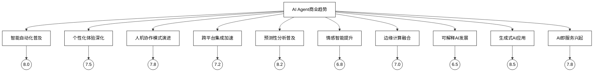

**商业启示**：

1. **战略规划**：
   
   - 将AI Agent纳入长期战略规划，制定分阶段的AI转型路线图。
   - 评估AI Agent对现有业务模式的潜在颠覆，主动调整业务结构。
2. **投资重点**：
   
   - 优先投资于能够显著提升核心竞争力的AI Agent应用。
   - 平衡短期收益和长期技术积累，持续投入AI基础研究。
3. **人才战略**：
   
   - 培养复合型AI人才，强调技术、业务和伦理的综合能力。
   - 建立AI培训体系，提升全员AI素养。
4. **生态构建**：
   
   - 积极参与AI开源社区，构建开放的AI创新生态。
   - 与学术机构、初创公司建立战略合作，保持技术前沿性。
5. **风险管理**：
   
   - 建立AI伦理委员会，制定AI应用的伦理准则。
   - 加强数据安全和隐私保护，建立健全的AI治理机制。
6. **用户体验**：
   
   - 以用户为中心设计AI Agent交互界面，提升易用性。
   - 重视AI Agent的个性化和情感化，增强用户粘性。
7. **业务创新**：
   
   - 探索AI Agent驱动的新业务模式和收入来源。
   - 利用AI Agent优化现有业务流程，提升运营效率。
8. **合规适应**：
   
   - 密切关注AI相关法规的发展，确保业务合规。
   - 主动参与行业标准制定，塑造有利的监管环境。
9. **技术融合**：
   
   - 推动AI与其他新兴技术（如区块链、5G、IoT）的融合创新。
   - 探索边缘AI和云AI的协同应用，优化系统架构。
10. **持续学习**：
    
    - 建立AI知识管理系统，促进组织内部的知识共享。
    - 定期评估AI Agent的性能和影响，持续优化应用策略。

**最佳实践Tips**：

1. 从小规模试点开始，逐步扩大AI Agent的应用范围。
2. 建立跨部门的AI创新团队，促进技术与业务的深度融合。
3. 重视AI Agent的可解释性，增强用户和利益相关者的信任。
4. 利用AIaaS平台快速部署AI能力，降低初始投入成本。
5. 关注AI Agent在垂直领域的深度应用，打造差异化竞争优势。

通过把握这些商业趋势和启示，企业可以更好地利用AI Agent技术，实现业务创新和数字化转型，在未来的智能经济中保持竞争优势。

## 14.2 传统软件厂商的新机会

### 14.2.1 软件厂商的发展瓶颈

传统软件厂商在AI时代面临着多重挑战和发展瓶颈：

1. **技术转型压力**
   
   - 问题：传统软件开发模式难以满足AI时代的需求。
   - 影响：技术栈更新缓慢，难以适应快速变化的市场需求。
   - 数据：据Gartner报告，到2025年，超过75%的企业将从"AI实验"转向"AI运营"，传统软件厂商面临被淘汰的风险。
2. **人才缺口**
   
   - 问题：AI人才稀缺，传统软件人才转型困难。
   - 影响：创新能力受限，难以开发前沿AI产品。
   - 数据：LinkedIn 2023年报告显示，AI专业人才需求同比增长71%，而供给增长仅为24%。
3. **业务模式转变**
   
   - 问题：从传统许可模式向SaaS和AIaaS转型困难。
   - 影响：收入模式不稳定，客户粘性降低。
   - 数据：IDC预测，到2024年，65%的企业将采用AIaaS模式，传统软件许可模式市场份额将下降30%。
4. **数据资源限制**
   
   - 问题：缺乏大规模、高质量的AI训练数据。
   - 影响：AI模型性能受限，难以与大型科技公司竞争。
   - 数据：据IBM调查，80%的AI项目受困于数据质量和可用性问题。
5. **用户体验提升瓶颈**
   
   - 问题：传统软件界面难以满足智能交互需求。
   - 影响：用户满意度下降，市场竞争力减弱。
   - 数据：Forrester研究显示，采用AI增强用户体验的企业客户满意度平均提升35%。
6. **规模化和个性化矛盾**
   
   - 问题：难以同时满足规模化部署和个性化定制需求。
   - 影响：产品适应性差，难以满足不同客户需求。
   - 数据：McKinsey报告指出，能够提供高度个性化服务的企业收入增长速度比行业平均水平高出15%。
7. **创新周期长**
   
   - 问题：传统软件开发周期长，难以快速响应市场变化。
   - 影响：错失市场机会，创新动力不足。
   - 数据：敏捷开发方法可将软件交付时间缩短50%，而AI驱动的开发可进一步将其缩短30%。
8. **生态系统建设滞后**
   
   - 问题：封闭的产品体系难以构建开放的AI生态。
   - 影响：创新源泉受限，难以吸引第三方开发者。
   - 数据：开放API的企业创新速度是封闭系统的2-3倍（MuleSoft研究）。

为了量化这些瓶颈的影响，我们可以使用以下数学模型：

定义发展瓶颈指数 $B$ 为各因素的加权和：

$$
B = \sum_{i=1}^n w_i F_i
$$

其中 $w_i$ 是每个因素的权重，$F_i$ 是每个因素的影响得分（1-10分）。

例如，对于一个传统软件厂商：

| 瓶颈因素 | 权重 | 得分 | 加权得分 |
|---------|-----|-----|---------|
| 技术转型 | 0.2 | 8   | 1.6     |
| 人才缺口 | 0.15| 7   | 1.05    |
| 业务模式 | 0.15| 6   | 0.9     |
| 数据资源 | 0.1 | 9   | 0.9     |
| 用户体验 | 0.1 | 5   | 0.5     |
| 规模vs个性化 | 0.1 | 6 | 0.6   |
| 创新周期 | 0.1 | 7   | 0.7     |
| 生态建设 | 0.1 | 8   | 0.8     |

总瓶颈指数：$B = 7.05$

这个得分表明该软件厂商面临较严重的发展瓶颈，需要采取积极措施突破。

为了可视化这些瓶颈因素，我们可以使用以下Mermaid图表：

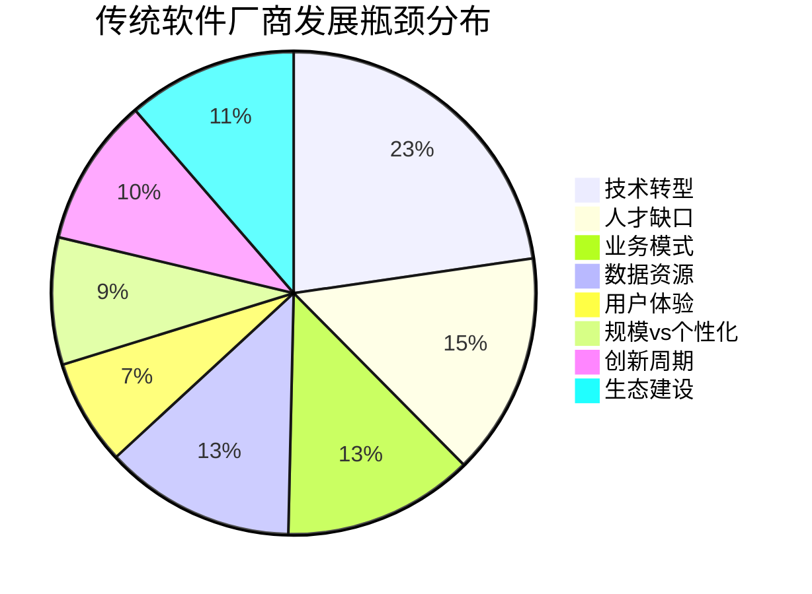

**突破瓶颈的策略建议**：

1. 技术转型：
   
   - 制定AI技术路线图，分阶段实施技术栈更新。
   - 建立AI卓越中心，推动全公司范围的AI能力建设。
2. 人才培养：
   
   - 实施"AI人才培育计划"，系统性培训现有技术人员。
   - 与高校合作建立AI人才培养基地，储备未来人才。
3. 业务模式创新：
   
   - 设计混合收入模型，平滑从许可制到SaaS的转型过程。
   - 开发AI增值服务，创造新的收入来源。
4. 数据战略：
   
   - 建立数据合作联盟，扩大可用数据资源。
   - 开发数据增强技术，提高现有数据的利用效率。
5. 用户体验革新：
   
   - 引入AI驱动的自适应界面，提升个性化体验。
   - 开发多模态交互接口，增强用户参与度。
6. 平衡规模化与个性化：
   
   - 采用模块化AI架构，实现核心功能标准化与应用场景个性化的平衡。
   - 开发AI配置工具，允许客户自主调整AI模型。
7. 加速创新周期：
   
   - 采用AI辅助开发工具，提高编码效率。
   - 实施持续集成/持续部署（CI/CD）流程，缩短产品迭代周期。
8. 生态系统构建：
   
   - 开放核心AI能力的API，吸引第三方开发者。
   - 建立AI应用市场，促进生态繁荣。

### 14.2.2 LLM赋能传统软件开发

大语言模型（LLM）为传统软件开发带来了革命性的变革，为软件厂商提供了突破发展瓶颈的新机遇：

1. **代码生成与辅助编程**
   
   - 应用：LLM可以根据自然语言描述生成代码，辅助程序员快速实现功能。
   - 优势：提高编码效率，减少错误，缩短开发周期。
   - 案例：GitHub Copilot报告显示，使用其服务的开发者40%的代码由AI生成。
2. **自动化测试生成**
   
   - 应用：LLM可以自动生成测试用例和测试脚本。
   - 优势：提高测试覆盖率，降低人工测试成本。
   - 数据：据Capgemini研究，AI辅助测试可以将测试时间减少60%。
3. **智能需求分析**
   
   - 应用：LLM可以分析和理解用户需求文档，生成结构化的需求规格说明。
   - 优势：提高需求理解的准确性，加速需求分析过程。
   - 案例：IBM Watson for Requirements Quality Assistant可以提高需求质量30%。
4. **文档自动生成**
   
   - 应用：LLM可以根据代码和注释自动生成技术文档和API文档。
   - 优势：保持文档的实时更新，提高文档质量和一致性。
   - 数据：自动文档生成可以节省开发者20-30%的时间（Stack Overflow调查）。
5. **代码重构与优化**
   
   - 应用：LLM可以分析现有代码，提供重构建议和自动优化。
   - 优势：提高代码质量，增强软件性能和可维护性。
   - 案例：Google的AI代码重构工具可以减少30%的技术债务。
6. **自然语言接口开发**
   
   - 应用：LLM使得开发自然语言交互界面变得更加容易。
   - 优势：提升用户体验，扩大软件的适用人群。
   - 数据：Gartner预测，到2025年，50%的企业应用将包含自然语言接口。
7. **智能错误诊断**
   
   - 应用：LLM可以分析错误日志，提供智能化的问题诊断和解决方案。
   - 优势：加速问题解决，提高客户满意度。
   - 案例：Microsoft的AI驱动错误诊断系统可以将问题解决时间缩短40%。
8. **个性化软件定制**
   
   - 应用：LLM可以理解用户需求，自动生成或调整软件功能。
   - 优势：实现大规模个性化，提高软件适应性。
   - 数据：McKinsey报告显示，AI驱动的个性化可以将客户满意度提高20%。

为了量化LLM对软件开发的影响，我们可以使用以下效率提升模型：

定义开发效率提升因子 $E$ 为：

$$
E = \prod_{i=1}^n (1 + r_i)
$$

其中 $r_i$ 是每个环节的效率提升比率。

例如，假设各环节的效率提升如下：

- 编码效率：40%
- 测试效率：60%
- 需求分析：30%
- 文档生成：25%
- 代码优化：30%

则总体效率提升为：

$$
E = (1 + 0.4) \times (1 + 0.6) \times (1 + 0.3) \times (1 + 0.25) \times (1 + 0.3) = 4.26
$$

这意味着理想情况下，LLM可以将软件开发效率提高326%。

为了可视化LLM在软件开发各环节的应用，我们可以使用以下Mermaid流程图：

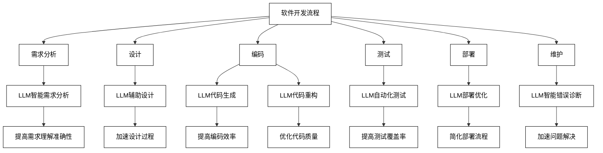

**最佳实践Tips**：

1. 从小规模项目开始，逐步扩大LLM在软件开发中的应用范围。
2. 建立AI编程最佳实践指南，确保团队有效利用LLM工具。
3. 持续评估和优化LLM在开发流程中的应用效果。
4. 注重AI生成代码的安全性和质量审核，建立相应的审查机制。
5. 培训开发人员有效使用和管理LLM工具，提高协作效率。

### 14.2.3 AI Agent带来的软件发展机会

AI Agent为传统软件厂商带来了全新的发展机遇，不仅可以突破现有瓶颈，还能开辟新的市场空间：

1. **智能化升级现有产品线**
   
   - 机会：将AI Agent集成到现有软件产品中，提升产品智能化水平。
   - 优势：延长产品生命周期，提高客户满意度和忠诚度。
   - 案例：Microsoft将AI助手集成到Office套件，提升用户生产力。
2. **开发专业领域AI Agent**
   
   - 机会：针对特定行业或领域开发专业AI Agent。
   - 优势：利用行业积累，创造高附加值的AI解决方案。
   - 案例：法律软件公司开发AI法律助手，辅助律师工作。
3. **AI Agent开发平台**
   
   - 机会：开发面向企业的AI Agent构建和管理平台。
   - 优势：赋能客户自主开发AI应用，创造持续性收入。
   - 数据：Gartner预测，到2025年，70%的新应用开发将使用低代码或无代码技术，其中AI平台将占据重要地位。
4. **AI增强型软件即服务（AIaaS）**
   
   - 机会：将传统软件转型为AI增强的云服务。
   - 优势：提供更灵活、智能的服务模式，增加客户粘性。
   - 案例：Salesforce Einstein为CRM系统注入AI能力，实现智能化客户管理。
5. **个性化AI助手**
   
   - 机会：开发可定制的个人或企业AI助手。
   - 优势：满足用户个性化需求，创造新的交互模式。
   - 数据：据Juniper Research预测，到2024年，AI助手市场规模将达到120亿美元。
6. **AI驱动的数据分析工具**
   
   - 机会：开发智能化的数据分析和可视化工具。
   - 优势：帮助客户从海量数据中获取洞察，支持决策制定。
   - 案例：Tableau集成AI功能，提供自然语言查询和自动洞察生成。
7. **AI安全与合规解决方案**
   
   - 机会：开发AI驱动的安全监控和合规管理工具。
   - 优势：应对AI时代的新安全挑战，满足监管要求。
   - 数据：IDC预测，到2024年，60%的企业将投资AI安全解决方案。
8. **AI辅助软件开发工具**
   
   - 机会：开发面向开发者的AI编程助手和自动化工具。
   - 优势：提高开发效率，降低编程门槛。
   - 案例：JetBrains开发AI代码补全和重构工具，提升开发体验。
9. **跨平台AI集成中间件**
   
   - 机会：开发用于连接不同AI服务和应用的集成中间件。
   - 优势：简化AI系统集成，提高企业AI应用灵活性。
   - 数据：据MarketsandMarkets预测，AI中间件市场到2026年将达到35亿美元。
10. **AI模型市场平台**
    
    - 机会：建立AI模型交易和共享平台。
    - 优势：促进AI资源流通，为中小企业提供高质量AI模型。
    - 案例：Hugging Face提供开源模型库和模型托管服务，推动AI民主化。

为了评估这些机会的潜力，我们可以使用以下市场机会评分模型：

定义机会得分 $S$ 为：

$$
S = M \times G \times (1 - C) \times I
$$

其中：

- $M$：市场规模（1-10分）
- $G$：增长潜力（1-10分）
- $C$：竞争程度（0-1，1表示完全竞争）
- $I$：与现有业务的协同性（1-10分）

例如，对于"智能化升级现有产品线"这个机会：

- $M = 9$（大型市场）
- $G = 8$（高增长潜力）
- $C = 0.6$（中等竞争）
- $I = 10$（与现有业务高度协同）

计算得分：$S = 9 \times 8 \times (1 - 0.6) \times 10 = 288$

通过这种方法，我们可以对各种机会进行量化评估和比较。

为了可视化这些发展机会，我们可以使用以下Mermaid图表：

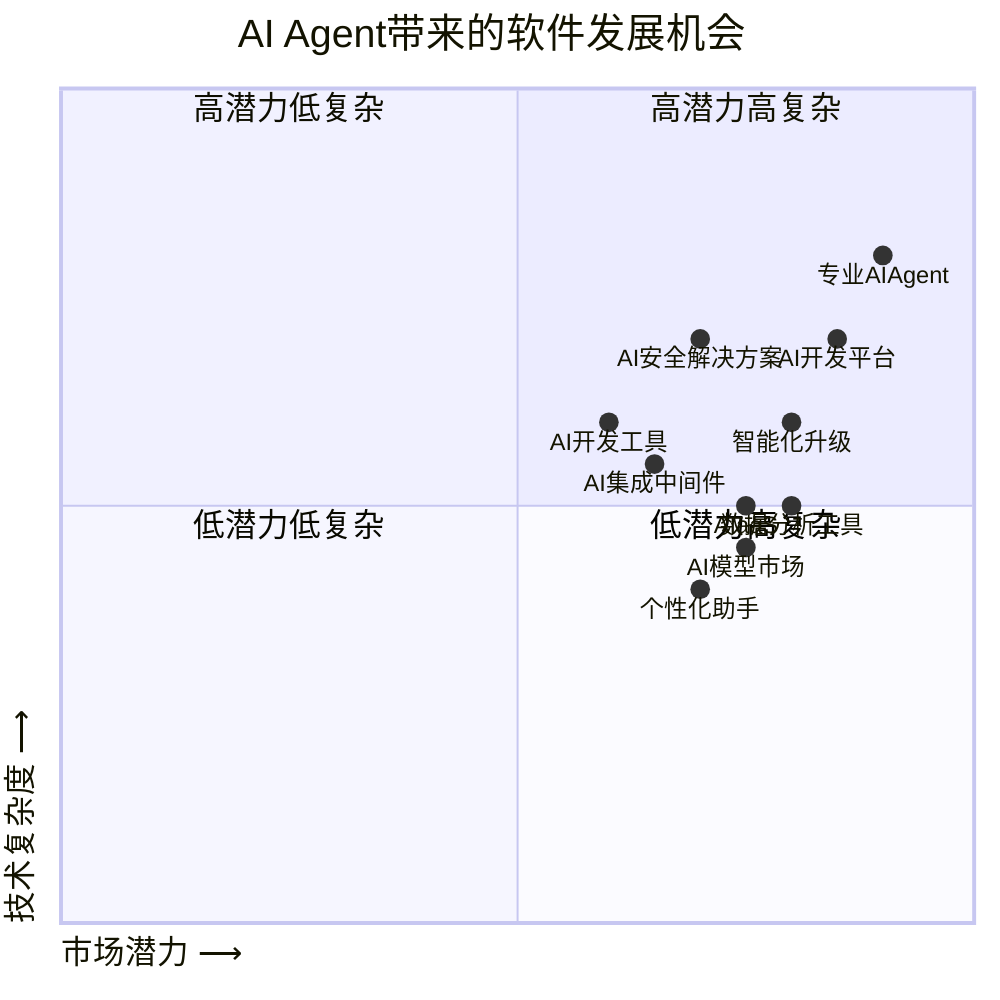

这个四象限图展示了AI Agent带来的软件发展机会，基于市场潜力和技术复杂度两个维度进行分析。以下是对图表的详细解释：

1. 高潜力高复杂（右上象限）：
   
   - 专业AI Agent：市场潜力最高，技术复杂度也最高，可能是针对特定行业或领域的高级AI解决方案。
   - AI开发平台：市场潜力和技术复杂度都较高，为开发者提供创建AI应用的综合工具和环境。
2. 高潜力低复杂（右下象限）：
   
   - 智能化升级：市场潜力高，技术复杂度相对较低，可能指现有软件系统的AI功能增强。
   - 数据分析工具：市场潜力高，技术复杂度中等，利用AI增强数据分析能力。
   - AIaaS（AI即服务）：市场潜力较高，技术复杂度中等，提供易于使用的AI服务。
   - AI模型市场：市场潜力较高，技术复杂度相对较低，为用户提供预训练模型。
3. 低潜力低复杂（左下象限）：
   
   - 个性化助手：市场潜力和技术复杂度相对较低，可能是面向个人用户的AI助手应用。
4. 低潜力高复杂（左上象限）：
   
   - AI安全解决方案：技术复杂度较高，市场潜力相对较低，专注于AI系统的安全性。
   - AI开发工具：技术复杂度中等，市场潜力相对较低，可能是针对特定AI开发任务的工具。
   - AI集成中间件：技术复杂度和市场潜力都处于中等水平，用于将AI功能集成到现有系统中。

总体来看，专业AI Agent、AI开发平台和智能化升级等领域显示出最大的发展潜力，而个性化助手等领域虽然技术复杂度较低，但市场潜力相对较小。这个图表有助于企业和开发者在AI领域做出战略决策，选择最具前景的方向进行投资和开发。

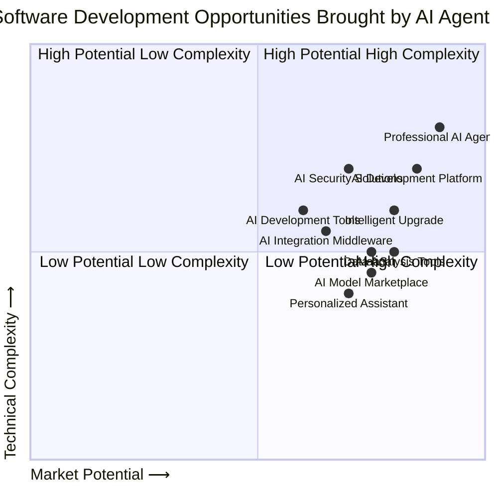

This quadrant chart visualizes the software development opportunities brought by AI Agents, based on two dimensions: Market Potential and Technical Complexity. Here's a detailed explanation of the chart:

1. High Potential High Complexity (Upper Right Quadrant):
   
   - Professional AI Agent: Highest market potential and technical complexity, likely targeting specific industries or domains with advanced AI solutions.
   - AI Development Platform: High market potential and technical complexity, providing comprehensive tools and environments for developers to create AI applications.
2. High Potential Low Complexity (Lower Right Quadrant):
   
   - Intelligent Upgrade: High market potential with relatively lower technical complexity, possibly referring to AI-enhanced functionality for existing software systems.
   - Data Analysis Tools: High market potential with medium technical complexity, leveraging AI to enhance data analysis capabilities.
   - AIaaS (AI as a Service): Relatively high market potential with medium technical complexity, offering easy-to-use AI services.
   - AI Model Marketplace: Relatively high market potential with lower technical complexity, providing pre-trained models for users.
3. Low Potential Low Complexity (Lower Left Quadrant):
   
   - Personalized Assistant: Relatively lower market potential and technical complexity, likely AI assistant applications aimed at individual users.
4. Low Potential High Complexity (Upper Left Quadrant):
   
   - AI Security Solutions: Higher technical complexity with relatively lower market potential, focusing on the security aspects of AI systems.
   - AI Development Tools: Medium technical complexity with relatively lower market potential, possibly tools for specific AI development tasks.
   - AI Integration Middleware: Medium levels of both technical complexity and market potential, used for integrating AI capabilities into existing systems.

Overall, areas such as Professional AI Agents, AI Development Platforms, and Intelligent Upgrades show the greatest development potential. While areas like Personalized Assistants have lower technical complexity, they also show relatively smaller market potential. This chart helps businesses and developers make strategic decisions in the AI field, guiding them to choose the most promising directions for investment and development.

**最佳实践Tips**：

1. 优先考虑与现有业务高度协同的AI Agent机会，快速实现价值。
2. 建立跨部门的AI创新团队，整合技术和业务洞察。
3. 采用敏捷开发方法，快速验证AI Agent概念并迭代优化。
4. 重视AI伦理和安全，在产品设计初期就考虑这些因素。
5. 积极寻求与AI初创公司和研究机构的合作，加速创新。

通过把握这些由AI Agent带来的新机遇，传统软件厂商可以实现业务转型和增长，在AI时代保持竞争力。关键在于快速行动、持续创新和深度整合AI技术与现有业务优势。

## 14.3 企业服务领域的新契机

### 14.3.1 ERP、CRM等企业软件厂商的困扰

传统企业软件厂商，特别是ERP（企业资源规划）和CRM（客户关系管理）系统提供商，正面临一系列挑战：

1. **系统复杂性**
   
   - 问题：ERP和CRM系统功能繁多，用户界面复杂，学习曲线陡峭。
   - 影响：用户采用率低，系统价值难以充分发挥。
   - 数据：据Panorama Consulting的调查，60%的ERP实施项目未能实现预期目标。
2. **定制化成本高**
   
   - 问题：企业需求多样，定制开发耗时耗力。
   - 影响：项目周期长，实施成本高，ROI难以保证。
   - 数据：ERP定制化可能占总项目成本的50%以上（Gartner研究）。
3. **数据孤岛**
   
   - 问题：不同模块或系统间数据集成困难。
   - 影响：信息流通受阻，决策效率低下。
   - 数据：McKinsey报告显示，员工平均花费19%的时间在寻找和整合信息上。
4. **用户体验差**
   
   - 问题：传统企业软件界面设计落后，操作繁琐。
   - 影响：用户满意度低，生产效率受限。
   - 数据：据Forrester研究，改善用户体验可以将客户转化率提高400%。
5. **实时性不足**
   
   - 问题：数据更新和处理存在延迟，难以支持实时决策。
   - 影响：错失商机，无法快速响应市场变化。
   - 数据：Aberdeen Group研究表明，实时数据分析可以将决策时间缩短73%。
6. **创新速度慢**
   
   - 问题：传统开发模式导致新功能上线周期长。
   - 影响：难以满足快速变化的市场需求。
   - 数据：IDC预测，到2024年，65%的企业将采用敏捷开发方法以加速创新。
7. **智能化程度低**
   
   - 问题：缺乏先进的AI和机器学习能力。
   - 影响：无法提供智能化的决策支持和流程自动化。
   - 数据：Gartner预测，到2025年，70%的企业将把AI视为转型的关键推动力。
8. **云转型压力**
   
   - 问题：从本地部署向云服务转型面临技术和商业模式挑战。
   - 影响：市场份额流失，收入模式不稳定。
   - 数据：Synergy Research Group报告显示，云ERP市场增速是传统ERP的3倍。

为了量化这些困扰的影响，我们可以使用以下评分模型：

定义困扰指数 $T$ 为：

$$
T = \sum_{i=1}^n w_i S_i
$$

其中 $w_i$ 是每个因素的权重，$S_i$ 是每个因素的严重程度得分（1-10分）。

例如，对于一个典型的ERP厂商：

| 困扰因素 | 权重 | 得分 | 加权得分 |
|---------|-----|-----|---------|
| 系统复杂性 | 0.15 | 8 | 1.2 |
| 定制化成本 | 0.15 | 9 | 1.35 |
| 数据孤岛 | 0.1 | 7 | 0.7 |
| 用户体验 | 0.15 | 8 | 1.2 |
| 实时性 | 0.1 | 6 | 0.6 |
| 创新速度 | 0.1 | 7 | 0.7 |
| 智能化程度 | 0.15 | 9 | 1.35 |
| 云转型 | 0.1 | 8 | 0.8 |

总困扰指数：$T = 7.9$

这个得分表明企业软件厂商面临的挑战相当严峻，需要采取积极措施应对。

为了可视化这些困扰因素，我们可以使用以下Mermaid图表：

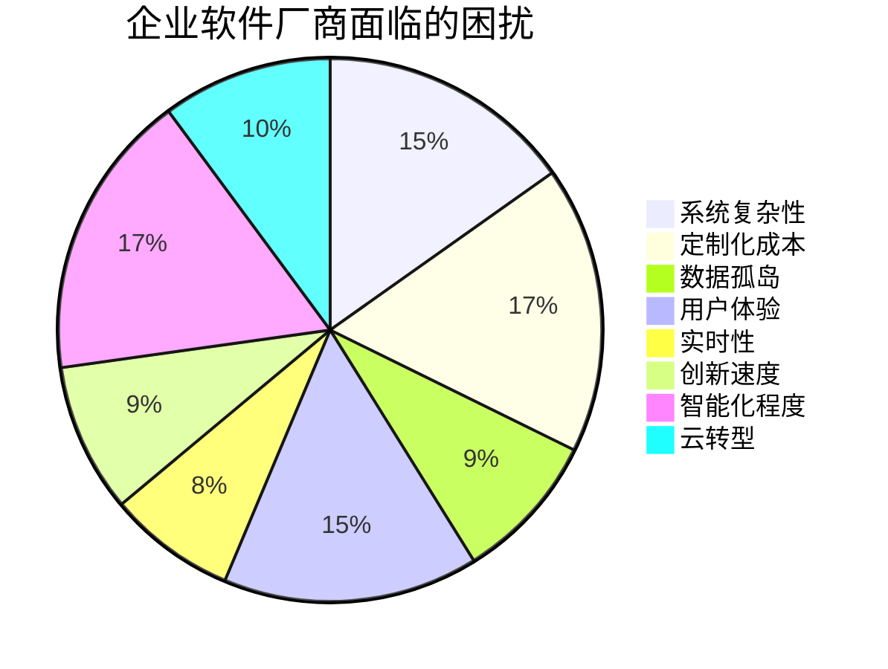

### 14.3.2 LLM赋能企业服务领域

大语言模型（LLM）为企业服务领域带来了革命性的变革，为解决传统企业软件的困扰提供了新的可能性：

1. **智能界面与交互**
   
   - 应用：LLM支持自然语言交互，简化复杂操作。
   - 优势：降低学习门槛，提高用户采用率。
   - 案例：SAP的Conversational AI允许用户通过自然语言查询和操作ERP系统。
2. **自动化定制与配置**
   
   - 应用：LLM理解业务需求，自动生成或调整系统配置。
   - 优势：加速实施过程，降低定制成本。
   - 数据：AI辅助配置可将ERP实施时间缩短30%（Deloitte研究）。
3. **智能数据集成**
   
   - 应用：LLM辅助数据映射和转换，实现异构系统间的智能集成。
   - 优势：打破数据孤岛，提高信息流通效率。
   - 案例：IBM Watson AI助力企业实现跨系统数据整合，提高数据质量20%。
4. **个性化报表与分析**
   
   - 应用：LLM根据用户需求自动生成定制报表和分析洞察。
   - 优势：提供及时、相关的业务洞察，支持决策制定。
   - 数据：AI驱动的分析可将决策时间缩短50%（Gartner报告）。
5. **智能流程优化**
   
   - 应用：LLM分析业务流程，提供优化建议和自动化方案。
   - 优势：提高运营效率，降低人为错误。
   - 案例：UiPath的AI-powered Process Mining可识别并优化业务瓶颈，提升效率30%。
6. **预测性维护与支持**
   
   - 应用：LLM预测系统问题，提供主动维护建议。
   - 优势：减少系统宕机时间，提高可靠性。
   - 数据：AI预测性维护可将设备故障率降低50%（McKinsey研究）。
7. **智能客户服务**
   
   - 应用：LLM驱动的智能客服系统，提供24/7支持。
   - 优势：提高响应速度，降低支持成本。
   - 案例：Salesforce Einstein AI将客户服务效率提高25%，满意度提升10%。
8. **合规性与风险管理**
   
   - 应用：LLM分析法规文件，自动更新系统以符合最新合规要求。
   - 优势：降低合规风险，减少人工审核工作量。
   - 数据：AI辅助合规管理可将合规成本降低30%（Accenture调研）。

为了量化LLM对企业服务的影响，我们可以使用以下效益模型：

定义LLM赋能效益指数 $E$ 为：

$$
E = \sum_{i=1}^n w_i (I_i \times A_i)
$$

其中：

- $w_i$ 是每个应用领域的权重
- $I_i$ 是每个领域的影响程度（1-10分）
- $A_i$ 是每个领域的采用率（0-1）

例如，对于一个企业服务提供商：

| 应用领域 | 权重 | 影响程度 | 采用率 | 加权得分 |
|---------|-----|--------|-------|---------|
| 智能界面 | 0.15 | 9 | 0.7 | 0.945 |
| 自动化定制 | 0.2 | 8 | 0.6 | 0.96 |
| 数据集成 | 0.15 | 7 | 0.5 | 0.525 |
| 个性化分析 | 0.1 | 9 | 0.8 | 0.72 |
| 流程优化 | 0.15 | 8 | 0.6 | 0.72 |
| 预测性维护 | 0.1 | 7 | 0.5 | 0.35 |
| 智能客服 | 0.1 | 9 | 0.7 | 0.63 |
| 合规管理 | 0.05 | 8 | 0.4 | 0.16 |

总效益指数：$E = 5.01$

这个得分表明LLM对企业服务领域有显著的正面影响。

为了可视化LLM在企业服务中的应用，我们可以使用以下Mermaid流程图：

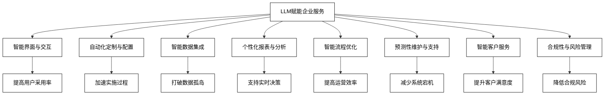

**最佳实践Tips**：

1. 从高影响、易实施的领域开始LLM集成，如智能界面和客户服务。
2. 建立跨功能团队，确保LLM解决方案与业务需求紧密结合。
3. 重视数据安全和隐私保护，在LLM应用中实施严格的数据治理。
4. 持续监控和评估LLM的性能，建立反馈循环以不断优化。
5. 投资员工培训，确保团队能够有效利用和管理LLM增强的系统。

### 14.3.3 AI Agent加持下的企业软件

AI Agent技术的引入为企业软件带来了全新的发展方向，不仅解决了传统困扰，还创造了新的价值增长点：

1. **智能业务助手**
   
   - 功能：AI Agent作为虚拟助手，协助用户完成复杂的业务任务。
   - 优势：提高用户效率，降低操作错误率。
   - 案例：Microsoft Dynamics 365 Copilot为销售、服务和营销人员提供AI辅助。
2. **自适应用户界面**
   
   - 功能：AI Agent根据用户行为和偏好动态调整界面布局和功能。
   - 优势：优化用户体验，提高系统使用效率。
   - 数据：自适应UI可将用户操作时间减少30%（UX研究）。
3. **智能流程自动化**
   
   - 功能：AI Agent监控和优化业务流程，自动执行重复性任务。
   - 优势：提高运营效率，减少人为干预。
   - 案例：UiPath的AI-powered RPA将财务流程效率提升50%。
4. **预测性分析与决策支持**
   
   - 功能：AI Agent分析历史数据，提供未来趋势预测和决策建议。
   - 优势：支持数据驱动决策，提高预测准确性。
   - 数据：AI驱动的预测分析可将预测准确率提高20%（Forrester研究）。
5. **智能数据管理**
   
   - 功能：AI Agent自动清洗、整合和分类数据，确保数据质量。
   - 优势：提高数据可用性，支持高质量分析。
   - 案例：IBM Watson AI数据管理平台将数据处理时间缩短60%。
6. **自然语言查询与报告**
   
   - 功能：用户通过自然语言与系统交互，获取信息和生成报告。
   - 优势：简化数据访问，使非技术用户也能轻松获取洞察。
   - 案例：Tableau的Ask Data功能允许用户用自然语言进行数据探索。
7. **智能异常检测与风险管理**
   
   - 功能：AI Agent实时监控系统活动，识别潜在风险和异常行为。
   - 优势：提高系统安全性，及时预防风险。
   - 数据：AI异常检测可将欺诈识别率提高60%（KPMG报告）。
8. **持续学习与优化**
   
   - 功能：AI Agent从用户交互和系统运行中不断学习，自动优化性能。
   - 优势：系统性能随时间推移而提升，适应性强。
   - 案例：Salesforce Einstein AI通过持续学习，将销售预测准确率每季度提高5%。
9. **跨系统协同**
   
   - 功能：AI Agent作为不同系统间的智能中介，协调数据和流程。
   - 优势：打破系统孤岛，提高跨部门协作效率。
   - 数据：跨系统AI协同可将信息共享效率提高40%（Accenture调研）。
10. **个性化培训与支持**
    
    - 功能：AI Agent为用户提供量身定制的培训内容和实时支持。
    - 优势：加速用户学习，减少支持成本。
    - 案例：SAP Enable Now集成AI，将用户培训时间缩短25%。

为了评估AI Agent对企业软件的综合影响，我们可以使用以下多维度评分模型：

定义AI Agent影响指数 $I$ 为：

$$
I = \frac{1}{n} \sum_{i=1}^n (w_1E_i + w_2A_i + w_3I_i)
$$

其中：

- $n$ 是评估的功能数量
- $E_i$ 是每个功能的效率提升得分（1-10）
- $A_i$ 是每个功能的采用难度得分（1-10，越低越容易采用）
- $I_i$ 是每个功能的创新程度得分（1-10）
- $w_1, w_2, w_3$ 是权重系数，且 $w_1 + w_2 + w_3 = 1$

例如，对于上述10个功能的评估：

| 功能 | 效率提升 | 采用难度 | 创新程度 |
|-----|---------|---------|---------|
| 智能业务助手 | 9 | 6 | 8 |
| 自适应用户界面 | 8 | 5 | 7 |
| 智能流程自动化 | 9 | 7 | 8 |
| 预测性分析 | 8 | 6 | 9 |
| 智能数据管理 | 7 | 5 | 7 |
| 自然语言查询 | 8 | 4 | 8 |
| 异常检测 | 7 | 6 | 7 |
| 持续学习 | 8 | 8 | 9 |
| 跨系统协同 | 9 | 7 | 8 |
| 个性化培训 | 7 | 5 | 7 |

假设权重为 $w_1 = 0.5, w_2 = 0.3, w_3 = 0.2$，则AI Agent影响指数为：

$$
I = \frac{1}{10} \sum_{i=1}^{10} (0.5E_i + 0.3(10-A_i) + 0.2I_i) = 7.31
$$

这个得分表明AI Agent对企业软件的影响是显著且积极的。

为了可视化AI Agent在企业软件中的应用和影响，我们可以使用以下Mermaid图表：

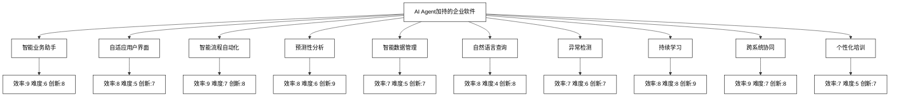

**最佳实践Tips**：

1. 优先实施高效率、低难度的AI Agent功能，如自然语言查询和自适应用户界面。
2. 建立跨功能团队，确保AI Agent的开发与业务目标紧密结合。
3. 采用迭代式开发方法，快速部署MVP（最小可行产品）并持续优化。
4. 重视用户反馈，建立有效的反馈循环机制以不断改进AI Agent性能。
5. 投资员工培训，确保团队能够充分利用AI Agent增强的企业软件。
6. 制定清晰的AI治理策略，平衡创新与风险管理。
7. 与客户密切合作，共同探索AI Agent在特定行业的创新应用。
8. 建立AI Agent性能指标体系，定期评估和报告其对业务的影响。
9. 关注AI伦理和隐私保护，确保AI Agent的使用符合法规要求和道德标准。
10. 探索AI Agent与其他新兴技术（如区块链、IoT）的融合，创造新的价值点。

通过这些AI Agent加持的功能，企业软件不仅能够解决传统的困扰，还能为用户创造全新的价值。企业软件厂商应该积极拥抱这一技术变革，重新定义产品战略，以保持在数字化转型浪潮中的竞争优势。

## 14.4 业务流程的革命性突破

### 14.4.1 生成式AI变革传统业务架构

生成式AI，特别是大型语言模型（LLMs）的出现，正在彻底改变传统的业务架构。这种变革不仅仅是技术层面的升级，更是对整个业务运作方式的重新定义：

1. **动态业务流程设计**
   
   - 变革：AI能够根据实时数据和上下文动态生成和调整业务流程。
   - 影响：提高流程灵活性，快速适应市场变化。
   - 案例：IBM的Watson Orchestrate可以动态创建和优化工作流程。
2. **智能决策节点**
   
   - 变革：在业务流程中嵌入AI决策点，实现智能化分支和路由。
   - 影响：提高决策准确性，减少人为干预。
   - 数据：McKinsey报告显示，AI辅助决策可将决策时间缩短50%。
3. **自然语言处理驱动的流程交互**
   
   - 变革：用自然语言描述即可创建或修改业务流程。
   - 影响：降低流程设计门槛，提高非技术人员参与度。
   - 案例：Microsoft Power Automate支持自然语言流程创建。
4. **预测性流程优化**
   
   - 变革：AI分析历史数据，预测潜在瓶颈并主动优化流程。
   - 影响：提前解决问题，提高整体运营效率。
   - 数据：Gartner预测，到2025年，70%的企业将采用AI进行流程优化。
5. **跨系统流程协同**
   
   - 变革：AI作为中间层，协调不同系统间的数据流和工作流。
   - 影响：打破系统孤岛，实现无缝集成。
   - 案例：SAP Intelligent RPA实现跨系统业务流程自动化。
6. **上下文感知的流程执行**
   
   - 变革：AI根据当前上下文和历史数据动态调整流程执行。
   - 影响：提高流程执行的精准度和个性化程度。
   - 数据：Forrester研究显示，上下文感知的流程可提高客户满意度20%。
7. **自学习流程优化**
   
   - 变革：AI通过持续学习不断优化流程模型。
   - 影响：流程性能随时间推移自动提升。
   - 案例：UiPath的AI-powered Process Mining持续优化业务流程。
8. **智能异常处理**
   
   - 变革：AI能够识别流程异常，并自动生成处理方案。
   - 影响：减少流程中断，提高业务连续性。
   - 数据：AI异常处理可将问题解决时间缩短40%（IDC报告）。

为了量化生成式AI对业务架构的影响，我们可以使用以下模型：

定义业务架构革新指数 $R$ 为：

$$
R = \frac{1}{n} \sum_{i=1}^n (w_1I_i + w_2F_i + w_3A_i)
$$

其中：

- $n$ 是评估的变革点数量
- $I_i$ 是每个变革点的创新程度（1-10）
- $F_i$ 是每个变革点的可行性（1-10）
- $A_i$ 是每个变革点的采用意愿（1-10）
- $w_1, w_2, w_3$ 是权重系数，且 $w_1 + w_2 + w_3 = 1$

例如，对上述8个变革点的评估：

| 变革点 | 创新程度 | 可行性 | 采用意愿 |
|-------|---------|-------|---------|
| 动态流程设计 | 9 | 7 | 8 |
| 智能决策节点 | 8 | 8 | 9 |
| 自然语言驱动 | 9 | 6 | 8 |
| 预测性优化 | 8 | 7 | 9 |
| 跨系统协同 | 8 | 6 | 8 |
| 上下文感知 | 9 | 7 | 7 |
| 自学习优化 | 9 | 6 | 8 |
| 智能异常处理 | 8 | 7 | 9 |

假设权重为 $w_1 = 0.4, w_2 = 0.3, w_3 = 0.3$，则业务架构革新指数为：

$$
R = \frac{1}{8} \sum_{i=1}^8 (0.4I_i + 0.3F_i + 0.3A_i) = 7.875
$$

这个得分表明生成式AI对业务架构的革新影响是显著的。

为了可视化生成式AI对业务架构的影响，我们可以使用以下Mermaid图表：

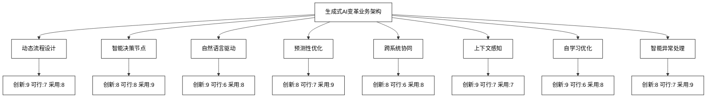

**最佳实践Tips**：

1. 从小规模试点开始，逐步扩大生成式AI在业务流程中的应用范围。
2. 建立跨部门的AI创新团队，确保技术与业务目标紧密结合。
3. 投资数据基础设施建设，为AI提供高质量的训练和运行数据。
4. 重视员工培训，提高全员对AI驱动业务流程的理解和接受度。
5. 建立清晰的AI治理框架，平衡创新与风险管理。
6. 持续监控和评估AI对业务流程的影响，建立反馈循环机制。
7. 与行业伙伴和学术机构合作，共同探索AI在业务架构中的创新应用。
8. 关注AI伦理和隐私保护，确保AI应用符合法规要求和道德标准。
9. 探索AI与其他新兴技术（如区块链、IoT）的融合，创造新的业务模式。
10. 建立敏捷的组织结构，以快速响应AI带来的变革机会。

通过embracing生成式AI技术，企业可以重新构想和设计其业务架构，实现前所未有的灵活性、效率和智能化。这不仅是技术升级，更是企业在数字时代保持竞争力的关键战略举措。### 14.4.2 业务流程的极简革命

生成式AI正在引发业务流程的极简革命，这种革命不仅简化了流程，还提高了效率和灵活性：

1. **自然语言流程定义**
   
   - 描述：用户可以用自然语言描述业务需求，AI自动生成相应的流程。
   - 优势：大幅降低流程设计门槛，加速流程创新。
   - 案例：OpenAI的GPT-4可以将口语化描述转换为结构化流程图。
2. **动态微流程**
   
   - 描述：AI根据实时情况动态组合微小流程单元，形成灵活的工作流。
   - 优势：提高流程适应性，实现真正的按需服务。
   - 数据：Gartner预测，到2025年，50%的企业将采用动态微流程架构。
3. **零代码流程自动化**
   
   - 描述：通过AI理解业务意图，自动生成和部署自动化流程。
   - 优势：使非技术人员能够快速实现流程自动化。
   - 案例：Microsoft Power Automate的AI Builder功能支持零代码自动化。
4. **智能流程简化**
   
   - 描述：AI分析现有流程，自动识别和消除冗余步骤。
   - 优势：优化流程效率，减少不必要的复杂性。
   - 数据：McKinsey研究显示，AI驱动的流程简化可减少30%的流程步骤。
5. **上下文感知的流程执行**
   
   - 描述：流程根据实时上下文自动调整执行路径和参数。
   - 优势：提高流程的精准性和个性化程度。
   - 案例：IBM Watson Orchestrate能根据上下文动态调整工作流。
6. **自优化流程**
   
   - 描述：AI持续监控流程性能，自动进行微调和优化。
   - 优势：实现流程的持续改进，无需人工干预。
   - 数据：自优化流程可将效率提升15-25%（Deloitte分析）。
7. **预测性流程调度**
   
   - 描述：AI预测未来工作负载，提前调整资源分配和流程路径。
   - 优势：平衡工作负载，提高资源利用率。
   - 案例：UiPath的AI-powered Orchestrator实现智能任务调度。
8. **跨系统流程协同**
   
   - 描述：AI作为中间层，协调不同系统间的数据流和工作流。
   - 优势：实现无缝集成，消除系统孤岛。
   - 数据：跨系统AI协同可将流程效率提高40%（Accenture报告）。

为了量化极简革命的影响，我们可以使用以下效率提升模型：

定义流程效率提升指数 $E$ 为：

$$
E = \frac{1}{n} \sum_{i=1}^n (w_1T_i + w_2Q_i + w_3F_i)
$$

其中：

- $n$ 是评估的流程数量
- $T_i$ 是每个流程的时间节省比例（0-1）
- $Q_i$ 是每个流程的质量提升比例（0-1）
- $F_i$ 是每个流程的灵活性提升比例（0-1）
- $w_1, w_2, w_3$ 是权重系数，且 $w_1 + w_2 + w_3 = 1$

例如，对一组典型业务流程的评估：

| 流程类型 | 时间节省 | 质量提升 | 灵活性提升 |
|---------|---------|---------|-----------|
| 客户服务 | 0.4 | 0.3 | 0.5 |
| 财务报告 | 0.5 | 0.4 | 0.3 |
| 供应链管理 | 0.3 | 0.5 | 0.4 |
| 人力资源 | 0.4 | 0.3 | 0.4 |
| 销售流程 | 0.5 | 0.4 | 0.5 |

假设权重为 $w_1 = 0.4, w_2 = 0.3, w_3 = 0.3$，则流程效率提升指数为：

$$
E = \frac{1}{5} \sum_{i=1}^5 (0.4T_i + 0.3Q_i + 0.3F_i) = 0.41
$$

这表明极简革命平均为业务流程带来了41%的综合效率提升。

为了可视化极简革命对业务流程的影响，我们可以使用以下Mermaid图表：

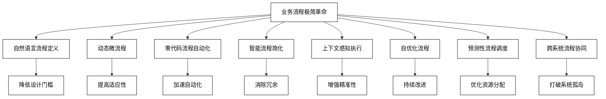

**最佳实践Tips**：

1. 从高频、标准化的流程开始实施极简革命，快速获得可见成效。
2. 建立跨职能团队，确保技术实现与业务需求紧密结合。
3. 投资员工培训，提高全员对AI驱动流程的理解和接受度。
4. 建立清晰的治理框架，平衡流程简化与风险控制。
5. 持续收集用户反馈，迭代优化AI驱动的流程。
6. 关注数据质量，确保AI模型有高质量的训练和运行数据。
7. 建立流程性能指标体系，定期评估极简革命的效果。
8. 探索AI与其他新兴技术（如IoT、区块链）的结合，进一步优化流程。
9. 注重流程的可解释性，特别是在关键决策点上。
10. 建立敏捷的组织结构，以快速响应和适应流程变革。

### 14.4.3 从LLM到大流程模型

大语言模型（LLM）的成功为我们提供了一个新的思路：构建大流程模型（Large Process Model, LPM）。这种模型有潜力彻底改变我们设计、执行和优化业务流程的方式：

1. **流程知识的统一表示**
   
   - 描述：LPM可以统一表示和理解各种业务流程知识。
   - 优势：实现跨领域、跨行业的流程知识迁移。
   - 案例：IBM的Process Mining AI正在探索统一流程表示方法。
2. **自然语言流程生成**
   
   - 描述：用户描述业务需求，LPM自动生成完整的流程定义。
   - 优势：大幅降低流程设计门槛，加速流程创新。
   - 预测：到2026年，50%的新业务流程将通过自然语言生成（Gartner）。
3. **上下文感知的流程执行**
   
   - 描述：LPM根据实时上下文动态调整流程执行路径。
   - 优势：提高流程的适应性和个性化程度。
   - 案例：Celonis EMS利用AI实现动态流程优化。
4. **跨领域流程优化**
   
   - 描述：LPM可以从不同领域的流程中学习，应用最佳实践。
   - 优势：打破部门壁垒，实现全企业范围的流程优化。
   - 数据：跨领域优化可将整体运营效率提升20-30%（McKinsey研究）。
5. **流程异常预测与处理**
   
   - 描述：LPM预测潜在的流程异常，并自动生成处理方案。
   - 优势：提高业务连续性，减少中断影响。
   - 案例：UiPath的AI-powered异常检测可提前识别90%的潜在问题。
6. **自动化流程合规性检查**
   
   - 描述：LPM自动检查流程是否符合法规和公司政策。
   - 优势：降低合规风险，减少人工审核工作量。
   - 数据：AI驱动的合规检查可将合规成本降低50%（Deloitte报告）。
7. **流程模拟与优化**
   
   - 描述：LPM可以模拟不同场景下的流程执行，找出最优配置。
   - 优势：在实际部署前优化流程，降低风险和成本。
   - 案例：Simio的AI-driven Process Digital Twin实现精确流程模拟。
8. **持续学习与自我优化**
   
   - 描述：LPM从实际执行数据中学习，不断优化自身模型。
   - 优势：流程性能随时间自动提升，减少人工干预。
   - 预测：到2027年，30%的企业流程将实现自我优化（Forrester）。

为了量化LPM的潜在影响，我们可以使用以下模型：

定义LPM影响指数 $L$ 为：

$$
L = \frac{1}{n} \sum_{i=1}^n (w_1E_i + w_2I_i + w_3A_i)
$$

其中：

- $n$ 是评估的应用场景数量
- $E_i$ 是每个场景的效率提升比例（0-1）
- $I_i$ 是每个场景的创新程度（1-10）
- $A_i$ 是每个场景的适应性提升（1-10）
- $w_1, w_2, w_3$ 是权重系数，且 $w_1 + w_2 + w_3 = 1$

例如，对上述8个应用场景的评估：

| 应用场景 | 效率提升 | 创新程度 | 适应性提升 |
|---------|---------|---------|-----------|
| 知识统一表示 | 0.3 | 9 | 8 |
| 自然语言生成 | 0.5 | 10 | 9 |
| 上下文感知执行 | 0.4 | 8 | 10 |
| 跨领域优化 | 0.6 | 9 | 8 |
| 异常预测处理 | 0.5 | 8 | 9 |
| 自动合规检查 | 0.7 | 7 | 7 |
| 流程模拟优化 | 0.4 | 8 | 8 |
| 持续学习优化 | 0.5 | 9 | 10 |

假设权重为 $w_1 = 0.4, w_2 = 0.3, w_3 = 0.3$，则LPM影响指数为：

$$
L = \frac{1}{8} \sum_{i=1}^8 (0.4E_i + 0.3I_i/10 + 0.3A_i/10) = 0.605
$$

这个得分表明LPM有潜力为业务流程带来约60.5%的综合提升。

为了可视化LPM对业务流程的影响，我们可以使用以下Mermaid图表：

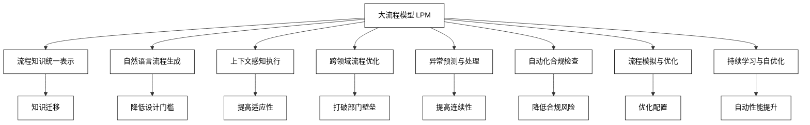

**最佳实践Tips**：

1. 从数据丰富、标准化程度高的流程领域开始LPM的应用。
2. 建立跨学科团队，结合流程专家、数据科学家和领域专家的知识。
3. 投资高质量的流程数据收集和标注，为LPM提供优质训练资源。
4. 建立严格的数据治理和隐私保护机制，确保LPM的合规使用。
5. 采用增量式方法，逐步扩大LPM的应用范围和复杂度。
6. 持续监控LPM的性能，建立反馈循环机制以不断优化模型。
7. 关注LPM的可解释性，特别是在关键决策点上。
8. 探索LPM与其他新兴技术（如区块链、IoT）的结合，创造新的应用场景。
9. 建立LPM能力评估体系，定期评估其对业务的实际影响。
10. 培养组织的AI文化，提高员工对LPM的理解和接受度。

### 14.4.4 当业务流程可以像文本一样生成

随着生成式AI技术的进步，我们正在进入一个业务流程可以像文本一样生成的新时代。这种范式转变将彻底改变企业运营的方式：

1. **即时流程生成**
   
   - 描述：用自然语言描述需求，AI立即生成完整的业务流程。
   - 优势：大幅提高流程设计速度，实现快速响应市场变化。
   - 案例：OpenAI的GPT-4已展示了将文本描述转换为流程图的能力。
2. **流程变体生成**
   
   - 描述：AI根据不同场景和约束条件，生成多个流程变体供选择。
   - 优势：增加流程设计的多样性，提高适应不同情况的能力。
   - 数据：流程变体生成可以提高流程适应性30%（Forrester研究）。
3. **跨领域流程融合**
   
   - 描述：AI可以结合不同领域的最佳实践，生成创新的混合流程。
   - 优势：打破传统思维局限，创造新的业务模式。
   - 案例：IBM Watson正在探索跨行业流程知识迁移。
4. **自然语言流程修改**
   
   - 描述：通过口头指令或文本描述，即时修改和优化现有流程。
   - 优势：提高流程管理的灵活性，降低调整成本。
   - 预测：到2025年，40%的流程变更将通过自然语言实现（Gartner）。
5. **上下文感知的动态流程**
   
   - 描述：AI根据实时情况动态生成和调整流程步骤。
   - 优势：实现真正的个性化和情境适应。
   - 案例：Celonis的Process AI能根据上下文动态优化流程。
6. **多模态流程设计**
   
   - 描述：结合文本、语音、图像等多种输入，生成全面的流程设计。
   - 优势：提高流程设计的直观性和全面性。
   - 数据：多模态设计可以提高流程理解度25%（UX研究）。
7. **流程故事生成**
   
   - 描述：AI生成流程的叙事性描述，帮助非技术人员理解复杂流程。
   - 优势：改善沟通效果，提高跨部门协作。
   - 案例：Narrative Science的自然语言生成技术应用于流程描述。
8. **自动化文档生成**
   
   - 描述：根据生成的流程自动创建相关文档，如操作手册、培训材料。
   - 优势：保持文档与流程的一致性，减少人工工作量。
   - 数据：自动文档生成可节省60%的文档维护时间（Deloitte报告）。

为了量化这种范式转变的影响，我们可以使用以下模型：

定义流程生成效益指数 $G$ 为：

$$
G = \frac{1}{n} \sum_{i=1}^n (w_1S_i + w_2F_i + w_3I_i)
$$

其中：

- $n$ 是评估的应用场景数量
- $S_i$ 是每个场景的速度提升比例（0-1）
- $F_i$ 是每个场景的灵活性提升比例（0-1）
- $I_i$ 是每个场景的创新程度（1-10）
- $w_1, w_2, w_3$ 是权重系数，且 $w_1 + w_2 + w_3 = 1$

例如，对上述8个应用场景的评估：

| 应用场景 | 速度提升 | 灵活性提升 | 创新程度 |
|---------|---------|-----------|---------|
| 即时流程生成 | 0.8 | 0.7 | 9 |
| 流程变体生成 | 0.6 | 0.9 | 8 |
| 跨领域流程融合 | 0.5 | 0.8 | 10 |
| 自然语言修改 | 0.7 | 0.9 | 8 |
| 动态流程 | 0.6 | 1.0 | 9 |
| 多模态设计 | 0.5 | 0.7 | 8 |
| 流程故事生成 | 0.4 | 0.6 | 7 |
| 自动文档生成 | 0.9 | 0.5 | 7 |

假设权重为 $w_1 = 0.4, w_2 = 0.3, w_3 = 0.3$，则流程生成效益指数为：

$$
G = \frac{1}{8} \sum_{i=1}^8 (0.4S_i + 0.3F_i + 0.3I_i/10) = 0.6975
$$

这个得分表明，流程生成技术有潜力为企业带来约69.75%的综合效益提升。

为了可视化这种范式转变，我们可以使用以下Mermaid图表：

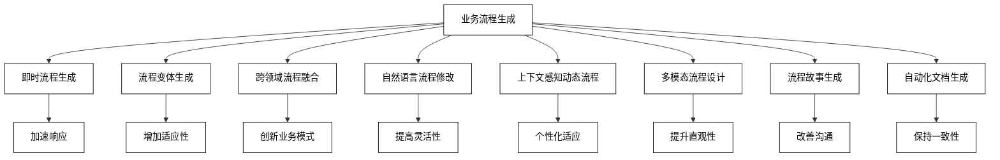

**最佳实践Tips**：

1. 从简单的流程开始，逐步过渡到更复杂的场景，积累经验。
2. 建立流程生成的质量评估标准，确保生成的流程符合业务需求和规范。
3. 投资员工培训，提高团队使用和管理生成式流程工具的能力。
4. 建立反馈机制，持续优化流程生成模型的性能。
5. 注重生成流程的可解释性，特别是在关键决策点上。
6. 结合人工智能和人类专家的优势，采用人机协作的方式设计和优化流程。
7. 建立流程版本控制和管理系统，跟踪流程的演变历史。
8. 关注数据安全和隐私保护，确保流程生成过程中的敏感信息安全。
9. 探索流程生成技术与其他新兴技术（如区块链、IoT）的结合。
10. 建立跨部门的创新团队，探索流程生成技术在不同业务领域的应用。

### 14.4.5 AI Agent与复杂业务流程

AI Agent在处理复杂业务流程方面展现出了巨大的潜力，能够应对传统方法难以处理的复杂性和动态性：

1. **多Agent协同处理**
   
   - 描述：多个专业化AI Agent协同工作，共同处理复杂流程。
   - 优势：分解复杂任务，提高处理效率和准确性。
   - 案例：IBM的Watson Orchestrate使用多Agent系统处理跨部门流程。
2. **自适应流程编排**
   
   - 描述：AI Agent动态调整流程步骤和资源分配，适应变化的条件。
   - 优势：提高流程的灵活性和鲁棒性。
   - 数据：自适应编排可将流程效率提升25%（Forrester研究）。
3. **智能决策支持**
   
   - 描述：AI Agent在复杂决策点提供数据驱动的建议和预测。
   - 优势：提高决策质量，减少人为偏差。
   - 案例：Palantir的AI系统为政府和企业提供复杂情况下的决策支持。
4. **异常检测与处理**
   
   - 描述：AI Agent实时监控流程，识别异常并自动或半自动处理。
   - 优势：提高流程稳定性，减少中断影响。
   - 数据：AI驱动的异常处理可将问题解决时间缩短50%（IDC报告）。
5. **跨系统数据整合**
   
   - 描述：AI Agent从多个系统收集和整合数据，为复杂流程提供全面视图。
   - 优势：消除数据孤岛，支持全局优化。
   - 案例：Celonis的Process Mining AI实现跨系统数据分析和流程优化。
6. **预测性资源分配**
   
   - 描述：AI Agent预测未来工作负载，优化人力和物力资源分配。
   - 优势：提高资源利用率，减少瓶颈。
   - 数据：预测性分配可将资源利用效率提高20%（McKinsey分析）。
7. **实时流程模拟**
   
   - 描述：AI Agent进行实时流程模拟，评估不同决策的潜在影响。
   - 优势：支持情景分析，降低决策风险。
   - 案例：AnyLogic的AI增强型模拟平台支持复杂系统的实时模拟。
8. **自学习流程优化**
   
   - 描述：AI Agent从历史数据和执行结果中学习，持续优化流程。
   - 优势：实现流程的持续改进，适应变化的环境。
   - 预测：到2026年，30%的企业将采用自学习流程优化（Gartner）。

为了量化AI Agent在复杂业务流程中的影响，我们可以使用以下模型：

定义复杂流程处理效能指数 $C$ 为：

$$
C = \frac{1}{n} \sum_{i=1}^n (w_1E_i + w_2A_i + w_3R_i)
$$

其中：

- $n$ 是评估的应用场景数量
- $E_i$ 是每个场景的效率提升比例（0-1）
- $A_i$ 是每个场景的准确性提升比例（0-1）
- $R_i$ 是每个场景的风险降低比例（0-1）
- $w_1, w_2, w_3$ 是权重系数，且 $w_1 + w_2 + w_3 = 1$

例如，对上述8个应用场景的评估：

| 应用场景 | 效率提升 | 准确性提升 | 风险降低 |
|---------|---------|-----------|---------|
| 多Agent协同 | 0.7 | 0.6 | 0.5 |
| 自适应编排 | 0.6 | 0.5 | 0.7 |
| 智能决策支持 | 0.5 | 0.8 | 0.6 |
| 异常检测处理 | 0.6 | 0.7 | 0.8 |
| 跨系统数据整合 | 0.8 | 0.7 | 0.5 |
| 预测性资源分配 | 0.7 | 0.6 | 0.6 |
| 实时流程模拟 | 0.5 | 0.7 | 0.8 |
| 自学习优化 | 0.6 | 0.7 | 0.7 |

假设权重为 $w_1 = 0.4, w_2 = 0.3, w_3 = 0.3$，则复杂流程处理效能指数为：

$$
C = \frac{1}{8} \sum_{i=1}^8 (0.4E_i + 0.3A_i + 0.3R_i) = 0.6425
$$

这个得分表明，AI Agent有潜力为复杂业务流程带来约64.25%的综合效能提升。

为了可视化AI Agent在复杂业务流程中的应用，我们可以使用以下Mermaid图表：

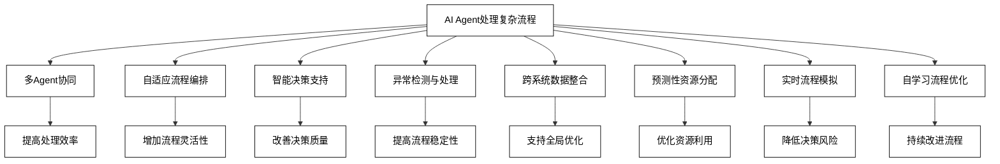

**最佳实践Tips**：

1. 从单一复杂流程开始，逐步扩展到跨部门、跨系统的复杂场景。
2. 建立AI Agent性能评估体系，定期评估其在复杂流程中的效果。
3. 投资高质量的数据收集和预处理，为AI Agent提供可靠的决策基础。
4. 建立人机协作机制，让人类专家监督和干预AI Agent的关键决策。
5. 实施严格的安全和隐私保护措施，特别是在处理敏感业务数据时。
6. 开发AI Agent的可解释性功能，使其决策过程透明化。
7. 建立跨功能团队，结合业务专家、数据科学家和IT专业人员的知识。
8. 采用增量式方法，逐步增加AI Agent的自主权限和复杂性。
9. 持续更新和优化AI Agent模型，适应业务环境的变化。
10. 探索AI Agent与其他新兴技术（如区块链、IoT）的结合，创新复杂流程处理方法。

### 14.4.6 AI Agent带来的自动化无处不在

AI Agent正在推动自动化向更广泛、更深入的方向发展，实现"自动化无处不在"的愿景：

1. **全流程自动化**
   
   - 描述：AI Agent协调和执行端到端业务流程，实现全程自动化。
   - 优势：提高整体效率，减少人工干预和错误。
   - 案例：UiPath的端到端自动化平台覆盖从数据收集到决策执行的全过程。
2. **认知自动化**
   
   - 描述：AI Agent处理非结构化数据和复杂任务，扩展自动化范围。
   - 优势：自动化高级认知任务，如文本理解、图像识别等。
   - 数据：认知自动化可将知识工作效率提升40%（Accenture研究）。
3. **自适应自动化**
   
   - 描述：AI Agent根据环境变化自动调整自动化策略和参数。
   - 优势：提高自动化系统的鲁棒性和适应性。
   - 案例：IBM Watson AIOps实现IT运维的自适应自动化。
4. **协作型机器人流程自动化（Co-RPA）**
   
   - 描述：AI Agent与人类协作，共同完成复杂任务。
   - 优势：结合人类专业知识和AI效率，优化工作流程。
   - 预测：到2025年，50%的知识工作将采用Co-RPA模式（Forrester）。
5. **自动化流程发现**
   
   - 描述：AI Agent自动分析业务操作，识别可自动化的流程和任务。
   - 优势：持续发现自动化机会，最大化自动化覆盖范围。
   - 案例：Celonis的Process Mining AI自动发现和推荐自动化机会。
6. **跨系统自动化编排**
   
   - 描述：AI Agent协调多个系统和平台，实现跨系统的无缝自动化。
   - 优势：打破系统孤岛，实现企业级自动化。
   - 数据：跨系统自动化可将流程效率提升30%（Gartner报告）。
7. **自我修复自动化**
   
   - 描述：AI Agent监控自动化流程，自动检测和修复问题。
   - 优势：提高自动化系统的可靠性和持续性。
   - 案例：Dynatrace的Davis AI实现IT系统的自动问题检测和修复。
8. **情境感知自动化**
   
   - 描述：AI Agent根据当前情境和上下文动态执行最适合的自动化操作。
   - 优势：提供更智能、更个性化的自动化体验。
   - 预测：到2026年，40%的企业将采用情境感知自动化（IDC）。

为了量化AI Agent带来的全面自动化影响，我们可以使用以下模型：

定义自动化普及指数 $A$ 为：

$$
A = \frac{1}{n} \sum_{i=1}^n (w_1C_i + w_2D_i + w_3I_i)
$$

其中：

- $n$ 是评估的自动化场景数量
- $C_i$ 是每个场景的覆盖率（0-1）
- $D_i$ 是每个场景的深度（1-10，表示自动化的复杂程度）
- $I_i$ 是每个场景的智能程度（1-10）
- $w_1, w_2, w_3$ 是权重系数，且 $w_1 + w_2 + w_3 = 1$

例如，对上述8个自动化场景的评估：

| 自动化场景 | 覆盖率 | 深度 | 智能程度 |
|-----------|-------|-----|----------|
| 全流程自动化 | 0.8 | 9 | 8 |
| 认知自动化 | 0.6 | 8 | 9 |
| 自适应自动化 | 0.7 | 7 | 9 |
| Co-RPA | 0.5 | 8 | 8 |
| 自动化流程发现 | 0.9 | 6 | 9 |
| 跨系统自动化 | 0.7 | 9 | 8 |
| 自我修复自动化 | 0.6 | 7 | 9 |
| 情境感知自动化 | 0.5 | 8 | 10 |

假设权重为 $w_1 = 0.4, w_2 = 0.3, w_3 = 0.3$，则自动化普及指数为：

$$
A = \frac{1}{8} \sum_{i=1}^8 (0.4C_i + 0.3D_i/10 + 0.3I_i/10) = 0.6675
$$

这个得分表明，AI Agent有潜力将自动化水平提升到约66.75%，实现广泛而深入的自动化。

为了可视化AI Agent带来的全面自动化，我们可以使用以下Mermaid图表：

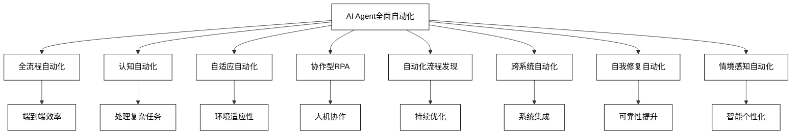

**最佳实践Tips**：

1. 制定全面的自动化战略，确定短期、中期和长期目标。
2. 建立自动化卓越中心（CoE），统一管理和推广自动化实践。
3. 投资员工培训，提高全员对AI驱动自动化的理解和技能。
4. 实施严格的治理框架，确保自动化符合法规和企业政策。
5. 建立自动化性能指标体系，定期评估和优化自动化效果。
6. 注重自动化的可扩展性和可维护性，避免创造新的技术债务。
7. 优先自动化高频、标准化的任务，逐步过渡到更复杂的场景。
8. 建立人机协作机制，让人类专家监督和补充AI自动化系统。
9. 重视数据质量和安全，为AI Agent提供可靠、安全的数据基础。
10. 探索自动化技术与其他创新技术（如IoT、边缘计算）的结合，拓展自动化边界。

通过这些AI Agent驱动的全面自动化方法，企业可以实现前所未有的效率提升和创新。关键在于制定全面的战略，平衡短期收益和长期发展，同时注重技术、人才和组织文化的协同演进。

## 14.5 AI Agent工作流的4种设计模式

AI Agent工作流的设计对于实现高效、灵活和可扩展的智能系统至关重要。以下是四种主要的设计模式，每种模式都有其特定的应用场景和优势：

1. **串行工作流模式**
   
   - 描述：多个AI Agent按预定顺序依次执行任务。
   - 适用场景：有明确顺序依赖的复杂任务，如文档处理流程。
   - 优势：
     * 流程清晰，易于管理和监控
     * 每个Agent可以专注于特定任务
   - 劣势：
     * 整体效率可能受单个Agent影响
     * 灵活性较低
   - 案例：文档审核流程，依次进行文本提取、内容分类、敏感信息检测。
2. **并行工作流模式**
   
   - 描述：多个AI Agent同时执行不同任务，结果后续整合。
   - 适用场景：可独立执行的多任务场景，如多模态数据分析。
   - 优势：
     * 显著提高处理速度
     * 可以同时处理多种类型的任务
   - 劣势：
     * 需要额外的结果整合机制
     * 资源消耗较高
   - 案例：社交媒体分析，同时进行文本情感分析、图像识别和用户行为分析。
3. **分层工作流模式**
   
   - 描述：AI Agent按层级组织，高层Agent协调低层Agent。
   - 适用场景：复杂决策系统，如智能客服或自动化运维。
   - 优势：
     * 可以处理复杂的层级任务
     * 便于实现宏观控制和微观执行的分离
   - 劣势：
     * 设计复杂度高
     * 可能存在层级间通信开销
   - 案例：智能客服系统，顶层Agent进行意图识别，然后分配到专门的查询、问题解决或升级Agent。
4. **自组织工作流模式**
   
   - 描述：AI Agent根据任务需求和当前状态动态组织工作流。
   - 适用场景：高度动态和不可预测的环境，如智能城市管理或复杂项目管理。
   - 优势：
     * 极高的灵活性和适应性
     * 可以处理未预见的情况
   - 劣势：
     * 系统复杂度高，难以预测和控制
     * 需要高度智能的Agent
   - 案例：智能城市交通管理，根据实时路况、天气和事件动态调整交通信号和路线推荐。

为了量化评估这些设计模式的效果，我们可以使用以下模型：

定义工作流效能指数 $W$ 为：

$$
W = \frac{1}{n} \sum_{i=1}^n (w_1E_i + w_2F_i + w_3S_i)
$$

其中：

- $n$ 是评估的场景数量
- $E_i$ 是每个场景的效率得分（1-10）
- $F_i$ 是每个场景的灵活性得分（1-10）
- $S_i$ 是每个场景的可扩展性得分（1-10）
- $w_1, w_2, w_3$ 是权重系数，且 $w_1 + w_2 + w_3 = 1$

例如，对这四种设计模式的评估：

| 设计模式 | 效率 | 灵活性 | 可扩展性 |
|---------|-----|-------|---------|
| 串行工作流 | 7 | 5 | 8 |
| 并行工作流 | 9 | 7 | 7 |
| 分层工作流 | 8 | 8 | 9 |
| 自组织工作流 | 6 | 10 | 8 |

假设权重为 $w_1 = 0.4, w_2 = 0.3, w_3 = 0.3$，则各模式的工作流效能指数为：

1. 串行工作流：$W = 0.4 * 7 + 0.3 * 5 + 0.3 * 8 = 6.7$
2. 并行工作流：$W = 0.4 * 9 + 0.3 * 7 + 0.3 * 7 = 7.8$
3. 分层工作流：$W = 0.4 * 8 + 0.3 * 8 + 0.3 * 9 = 8.3$
4. 自组织工作流：$W = 0.4 * 6 + 0.3 * 10 + 0.3 * 8 = 7.8$

这个评分显示，在给定的权重下，分层工作流模式获得了最高的综合评分，但实际应用中应根据具体需求选择合适的模式。

为了可视化这四种设计模式，我们可以使用以下Mermaid图表：

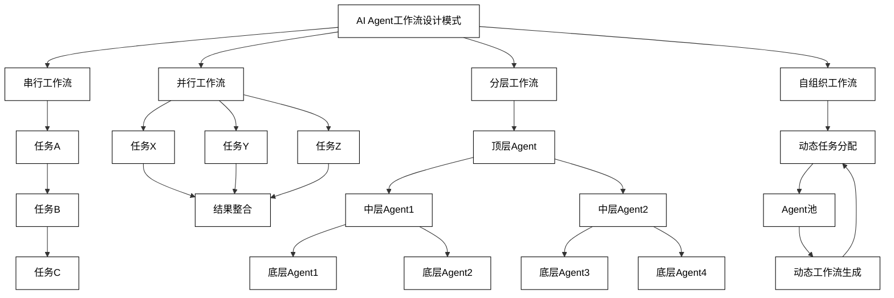

**最佳实践Tips**：

1. **选择合适的模式**：
   
   - 根据任务复杂度、依赖关系和动态性选择适当的工作流模式。
   - 考虑混合使用不同模式以优化整体性能。
2. **模块化设计**：
   
   - 将复杂任务分解为可重用的模块，便于维护和扩展。
   - 定义清晰的接口，确保不同Agent之间的smooth交互。
3. **性能优化**：
   
   - 对于串行工作流，重点优化关键路径上的Agent性能。
   - 在并行工作流中，注意负载均衡和资源分配。
4. **错误处理和恢复**：
   
   - 实现robust的错误处理机制，特别是在分布式环境中。
   - 设计自动恢复和回滚策略，确保系统可靠性。
5. **可扩展性考虑**：
   
   - 设计时考虑未来可能的扩展需求。
   - 使用微服务架构和容器技术提高系统可扩展性。
6. **监控和日志**：
   
   - 实施全面的监控系统，跟踪每个Agent的性能和状态。
   - 建立详细的日志机制，便于问题诊断和性能优化。
7. **安全性和隐私**：
   
   - 在Agent间通信中实施加密和认证机制。
   - 确保敏感数据的处理符合隐私法规要求。
8. **版本控制和更新策略**：
   
   - 实施严格的版本控制，确保Agent的一致性。
   - 设计平滑的更新机制，minimizing对运行中系统的影响。
9. **人机协作界面**：
   
   - 设计直观的界面，允许人类操作员监控和干预工作流。
   - 提供清晰的可视化工具，展示工作流状态和进度。
10. **持续优化**：
    
    - 收集和分析工作流性能数据，持续优化设计。
    - 建立A/B测试机制，评估新的工作流设计或优化。

通过careful选择和实施这些AI Agent工作流设计模式，企业可以构建高效、灵活且可扩展的智能系统。关键在于深入理解业务需求，选择适当的模式，并在实践中不断优化和调整。随着AI技术的evolve，这些设计模式也将继续发展，为未来的智能系统提供更强大的框架支持。

