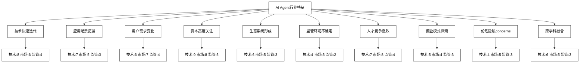

## 第四部分　创投启示

### 第15章　AI Agent行业的创业与投资

AI Agent行业正处于快速发展的阶段，吸引了大量创业者和投资者的关注。本章将从创业和投资的角度深入探讨AI Agent行业，分析行业现状、创业机会、投资趋势以及未来发展方向。

#### 15.1　从创业角度看AI Agent行业

##### 15.1.1　AI Agent行业初期阶段的特征

AI Agent行业正处于快速发展的初期阶段，展现出以下显著特征：

1. **技术快速迭代**
   - 描述：AI基础模型和Agent技术快速更新，性能持续提升。
   - 影响：创业公司需要保持技术敏感性，快速适应新技术。
   - 数据：OpenAI的GPT模型从GPT-3到GPT-4，参数规模增加100倍，性能大幅提升。

2. **应用场景不断拓展**
   - 描述：AI Agent从单一任务向多领域、复杂场景扩展。
   - 影响：为创业公司提供了广阔的市场机会和创新空间。
   - 案例：从简单的客服chatbot到复杂的智能助理如GitHub Copilot。

3. **用户需求快速变化**
   - 描述：随着AI能力提升，用户期望和需求不断evolve。
   - 影响：创业公司需要敏锐捕捉市场需求，快速调整产品策略。
   - 数据：据Gartner预测，到2025年，50%的知识工作者将daily使用AI助手。

4. **资本高度关注**
   - 描述：AI Agent领域吸引大量风险投资和战略投资。
   - 影响：为创业公司提供了充足的资金支持，但也加剧了竞争。
   - 数据：2022年全球AI创业公司融资总额超过1000亿美元（CB Insights）。

5. **生态系统正在形成**
   - 描述：围绕AI Agent的开发工具、平台和服务生态正在建立。
   - 影响：创业公司可以利用现有生态加速产品开发，也可以在生态中寻找定位。
   - 案例：Hugging Face提供的开源模型和工具生态。

6. **监管环境不确定**
   - 描述：AI相关法规和政策仍在制定和完善中。
   - 影响：创业公司需要密切关注政策变化，确保合规性。
   - 案例：欧盟AI Act的制定对AI应用的影响。

7. **人才竞争激烈**
   - 描述：AI人才，特别是高端人才供不应求。
   - 影响：创业公司在人才招聘和保留方面面临挑战。
   - 数据：LinkedIn报告显示，AI专业人才需求同比增长74%。

8. **商业模式探索阶段**
   - 描述：AI Agent的盈利模式和商业化路径仍在探索中。
   - 影响：创业公司需要创新商业模式，平衡技术投入和收益。
   - 案例：OpenAI从研究机构转型为商业公司，探索API服务等商业模式。

9. **伦理和隐私concerns**
   - 描述：AI的伦理问题和数据隐私保护日益受到关注。
   - 影响：创业公司需要在产品设计中考虑伦理和隐私因素。
   - 数据：80%的消费者担心AI对隐私的影响（KPMG调查）。

10. **跨学科融合趋势**
   - 描述：AI Agent技术与各行业专业知识深度融合。
   - 影响：创业公司需要培养跨学科团队，结合AI与领域专长。
   - 案例：医疗AI公司结合AI技术和医学专业知识开发诊断系统。

为了量化评估AI Agent行业的发展阶段，我们可以使用以下模型：

定义行业成熟度指数 $M$ 为：

$$
M = \frac{1}{n} \sum_{i=1}^n (w_1T_i + w_2M_i + w_3R_i)
$$

其中：
- $n$ 是评估的特征数量
- $T_i$ 是每个特征的技术成熟度（1-10）
- $M_i$ 是每个特征的市场成熟度（1-10）
- $R_i$ 是每个特征的监管成熟度（1-10）
- $w_1, w_2, w_3$ 是权重系数，且 $w_1 + w_2 + w_3 = 1$

例如，对上述10个特征的评估：

| 特征 | 技术成熟度 | 市场成熟度 | 监管成熟度 |
|-----|-----------|-----------|-----------|
| 技术迭代 | 8 | 6 | 4 |
| 应用场景 | 7 | 5 | 3 |
| 用户需求 | 6 | 7 | 4 |
| 资本关注 | 9 | 8 | 5 |
| 生态系统 | 6 | 5 | 3 |
| 监管环境 | 4 | 3 | 2 |
| 人才竞争 | 7 | 8 | 4 |
| 商业模式 | 5 | 4 | 3 |
| 伦理隐私 | 4 | 5 | 3 |
| 跨学科融合 | 6 | 5 | 3 |

假设权重为 $w_1 = 0.4, w_2 = 0.4, w_3 = 0.2$，则行业成熟度指数为：

$$
M = \frac{1}{10} \sum_{i=1}^{10} (0.4T_i + 0.4M_i + 0.2R_i) / 10 = 0.554
$$

这个得分表明AI Agent行业仍处于较早期的发展阶段，成熟度约为55.4%。

为了可视化AI Agent行业的特征，我们可以使用以下Mermaid图表：



**创业建议**：

1. **技术敏感性**：保持对最新AI技术的跟踪和快速学习能力。
2. **垂直领域聚焦**：选择特定行业或应用场景，深耕细分市场。
3. **用户中心设计**：密切关注用户需求变化，快速迭代产品。
4. **资本策略**：制定清晰的融资路线图，平衡短期资金需求和长期发展。
5. **生态参与**：积极参与AI生态系统，寻找合作伙伴和资源。
6. **合规性重视**：建立合规团队，确保产品符合现有和潜在的监管要求。
7. **人才战略**：制定有竞争力的人才吸引和保留策略，考虑股权激励。
8. **商业模式创新**：探索多元化收入来源，平衡免费服务和付费模式。
9. **伦理设计**：将伦理考虑纳入产品设计的核心，建立用户信任。
10. **跨学科团队**：组建多元化团队，结合AI专家和领域专家。

通过理解和应对这些行业特征，AI Agent创业公司可以更好地把握机遇，规避风险，在这个快速发展的领域中找到自己的定位和成长路径。

为了帮助创业者评估AI Agent行业的发展阶段和机会，我们可以使用以下行业生命周期分析模型：

```python
import matplotlib.pyplot as plt

class AIAgentIndustryAnalyzer:
    def __init__(self):
        self.lifecycle_stages = ['Emergence', 'Growth', 'Shakeout', 'Maturity', 'Decline']
        self.current_stage = 'Emergence'
        self.characteristics = {
            'Technology Innovation': 0,
            'Market Demand': 0,
            'Competition': 0,
            'Profitability': 0,
            'Investment Activity': 0
        }

    def set_characteristic_score(self, characteristic, score):
        if characteristic not in self.characteristics:
            raise ValueError(f"Invalid characteristic: {characteristic}")
        self.characteristics[characteristic] = max(0, min(10, score))

    def analyze_lifecycle_stage(self):
        avg_score = sum(self.characteristics.values()) / len(self.characteristics)
        if avg_score < 3:
            return 'Emergence'
        elif avg_score < 6:
            return 'Growth'
        elif avg_score < 7:
            return 'Shakeout'
        elif avg_score < 9:
            return 'Maturity'
        else:
            return 'Decline'

    def plot_industry_lifecycle(self):
        stages = self.lifecycle_stages
        current_stage = self.analyze_lifecycle_stage()
        current_stage_index = stages.index(current_stage)

        plt.figure(figsize=(12, 6))
        plt.plot(stages, [0, 8, 10, 5, 2], 'b-')
        plt.plot(stages[current_stage_index], 8, 'ro', markersize=10)
        plt.title('AI Agent Industry Lifecycle')
        plt.xlabel('Lifecycle Stages')
        plt.ylabel('Industry Activity')
        plt.text(stages[current_stage_index], 8.5, f'Current Stage: {current_stage}', ha='center')
        plt.show()

    def generate_report(self):
        current_stage = self.analyze_lifecycle_stage()
        report = "AI Agent Industry Analysis Report\n"
        report += "===================================\n\n"
        report += f"Current Industry Lifecycle Stage: {current_stage}\n\n"
        report += "Industry Characteristics:\n"
        for characteristic, score in self.characteristics.items():
            report += f"  - {characteristic}: {score}/10\n"
        report += f"\nOverall Industry Score: {sum(self.characteristics.values()) / len(self.characteristics):.2f}/10\n"
        return report

# 使用示例
analyzer = AIAgentIndustryAnalyzer()

# 设置行业特征评分
analyzer.set_characteristic_score('Technology Innovation', 9)
analyzer.set_characteristic_score('Market Demand', 7)
analyzer.set_characteristic_score('Competition', 6)
analyzer.set_characteristic_score('Profitability', 4)
analyzer.set_characteristic_score('Investment Activity', 8)

# 生成行业分析报告
print(analyzer.generate_report())

# 绘制行业生命周期图
analyzer.plot_industry_lifecycle()
```

这个模型可以帮助创业者分析AI Agent行业的当前发展阶段，考虑技术创新、市场需求、竞争、盈利能力和投资活动等关键特征。通过这种分析，创业者可以更好地理解行业动态，识别机会和挑战。

##### 15.1.2　海外科技大厂的AI Agent动作

海外科技巨头在AI Agent领域的布局和投入为整个行业带来了巨大影响。以下是一些主要公司的动作：

1. Google：
    - 推出了LaMDA和PaLM等大型语言模型
    - 开发了AI助手Bard
    - 在Google Cloud平台上提供AI和机器学习服务

2. OpenAI：
    - 发布了GPT系列模型，包括广受关注的GPT-3和GPT-4
    - 推出了ChatGPT，引发了全球范围内的AI对话热潮
    - 推出了GPT Store，为开发者提供了新的商业化途径

3. Microsoft：
    - 与OpenAI建立了深度合作关系
    - 将ChatGPT集成到Bing搜索引擎和Edge浏览器中
    - 在Azure平台上提供AI和机器学习服务

4. Amazon：
    - 持续改进Alexa语音助手
    - 在AWS平台上提供全面的AI和机器学习服务
    - 开发了用于客户服务的AI解决方案

5. Facebook (Meta)：
    - 开发了LLaMA大型语言模型
    - 在元宇宙项目中大量应用AI技术
    - 在广告和内容推荐中广泛使用AI

6. Apple：
    - 持续改进Siri语音助手
    - 在设备端应用AI技术，注重隐私保护
    - 在图像处理和自然语言处理领域有所突破

7. IBM：
    - 持续发展Watson AI平台
    - 在企业AI解决方案领域保持领先地位
    - 在量子计算和AI结合方面进行探索

为了帮助创业者分析和比较这些科技巨头在AI Agent领域的表现，我们可以使用以下竞争分析模型：

```python
import matplotlib.pyplot as plt
import numpy as np

class AIAgentCompetitorAnalyzer:
    def __init__(self):
        self.competitors = {}
        self.factors = ['Technology Innovation', 'Market Share', 'Product Offering', 'R&D Investment', 'Ecosystem']

    def add_competitor(self, name):
        self.competitors[name] = {factor: 0 for factor in self.factors}

    def set_competitor_score(self, name, factor, score):
        if name not in self.competitors:
            raise ValueError(f"Competitor {name} not found")
        if factor not in self.factors:
            raise ValueError(f"Invalid factor: {factor}")
        self.competitors[name][factor] = max(0, min(10, score))

    def calculate_overall_score(self, name):
        if name not in self.competitors:
            raise ValueError(f"Competitor {name} not found")
        return sum(self.competitors[name].values()) / len(self.factors)

    def rank_competitors(self):
        return sorted([(name, self.calculate_overall_score(name)) for name in self.competitors], key=lambda x: x[1], reverse=True)

    def plot_competitor_comparison(self):
        competitors = list(self.competitors.keys())
        factors = self.factors

        scores = np.array([[self.competitors[comp][factor] for factor in factors] for comp in competitors])

        angles = np.linspace(0, 2*np.pi, len(factors), endpoint=False)
        scores = np.concatenate((scores, [scores[0]]))
        angles = np.concatenate((angles, [angles[0]]))

        fig, ax = plt.subplots(figsize=(10, 10), subplot_kw=dict(projection='polar'))
        for i, competitor in enumerate(competitors):
            ax.plot(angles, scores[i], 'o-', linewidth=2, label=competitor)
            ax.fill(angles, scores[i], alpha=0.25)
        ax.set_thetagrids(angles[:-1] * 180/np.pi, factors)
        ax.set_ylim(0, 10)
        plt.legend(loc='upper right', bbox_to_anchor=(1.3, 1.0))
        plt.title("AI Agent Competitor Comparison")
        plt.tight_layout()
        plt.show()

    def generate_report(self):
        report = "AI Agent Competitor Analysis Report\n"
        report += "=====================================\n\n"
        for name, score in self.rank_competitors():
            report += f"{name}:\n"
            for factor, value in self.competitors[name].items():
                report += f"  - {factor}: {value}/10\n"
            report += f"  Overall Score: {score:.2f}/10\n\n"
        return report

# 使用示例
analyzer = AIAgentCompetitorAnalyzer()

# 添加竞争对手
analyzer.add_competitor("Google")
analyzer.add_competitor("OpenAI")
analyzer.add_competitor("Microsoft")
analyzer.add_competitor("Amazon")
analyzer.add_competitor("Facebook")
analyzer.add_competitor("Apple")
analyzer.add_competitor("IBM")

# 设置竞争对手评分（示例数据，实际评分需要基于详细的市场研究）
analyzer.set_competitor_score("Google", "Technology Innovation", 9)
analyzer.set_competitor_score("Google", "Market Share", 8)
analyzer.set_competitor_score("Google", "Product Offering", 8)
analyzer.set_competitor_score("Google", "R&D Investment", 9)
analyzer.set_competitor_score("Google", "Ecosystem", 9)

analyzer.set_competitor_score("OpenAI", "Technology Innovation", 10)
analyzer.set_competitor_score("OpenAI", "Market Share", 7)
analyzer.set_competitor_score("OpenAI", "Product Offering", 8)
analyzer.set_competitor_score("OpenAI", "R&D Investment", 9)
analyzer.set_competitor_score("OpenAI", "Ecosystem", 7)

# ... 设置其他竞争对手的评分 ...

# 生成竞争对手分析报告
print(analyzer.generate_report())

# 绘制竞争对手比较图
analyzer.plot_competitor_comparison()
```

这个模型可以帮助创业者分析和比较主要竞争对手在AI Agent领域的表现，考虑技术创新、市场份额、产品供应、研发投入和生态系统等关键因素。通过这种分析，创业者可以更好地了解市场格局，识别潜在的合作伙伴或竞争对手，并找到自己的市场定位。

##### 15.1.3　海外创业公司的AI Agent现状

除了科技巨头，海外还涌现出了大量专注于AI Agent的创业公司。这些公司在不同的细分领域和应用场景中寻找机会，推动了整个行业的创新和发展。以下是一些值得关注的海外AI Agent创业公司及其现状：

1. Anthropic：
    - 专注于开发安全和可控的AI系统
    - 推出了Claude AI助手，与ChatGPT竞争
    - 获得了大额融资，被视为OpenAI的有力竞争者

2. Cohere：
    - 提供企业级NLP API服务
    - 专注于帮助企业将AI集成到现有系统中
    - 在文本生成、分类和搜索等领域有优势

3. Hugging Face：
    - 提供开源AI模型和工具
    - 建立了一个活跃的AI开发者社区
    - 在模型共享和协作方面处于领先地位

4. Replika：
    - 开发了一款AI伴侣应用
    - 专注于情感AI和个性化对话
    - 在心理健康和情感支持领域有独特定位

5. Scale AI：
    - 提供AI训练数据和数据标注服务
    - 帮助企业构建和优化AI模型
    - 在自动驾驶、计算机视觉等领域有广泛应用

6. Jasper：
    - 提供AI写作和内容生成工具
    - 专注于营销和创意领域
    - 快速增长，获得了大额融资

7. Moveworks：
    - 开发企业IT支持AI助手
    - 自动化解决IT问题和员工服务请求
    - 在企业服务自动化领域取得成功

8. Synthesia：
    - 提供AI视频生成服务
    - 可以创建逼真的AI主播和个性化视频内容
    - 在教育和企业培训领域有广泛应用

为了帮助创业者分析这些AI Agent创业公司的表现和市场定位，我们可以使用以下创业公司分析模型：

```python
import matplotlib.pyplot as plt
import numpy as np

class AIAgentStartupAnalyzer:
    def __init__(self):
        self.startups = {}
        self.factors = ['Innovation', 'Market Potential', 'Team Strength', 'Funding', 'Growth Rate']

    def add_startup(self, name, category):
        self.startups[name] = {'category': category, 'scores': {factor: 0 for factor in self.factors}}

    def set_startup_score(self, name, factor, score):
        if name not in self.startups:
            raise ValueError(f"Startup {name} not found")
        if factor not in self.factors:
            raise ValueError(f"Invalid factor: {factor}")
        self.startups[name]['scores'][factor] = max(0, min(10, score))

    def calculate_overall_score(self, name):
        if name not in self.startups:
            raise ValueError(f"Startup {name} not found")
        return sum(self.startups[name]['scores'].values()) / len(self.factors)

    def rank_startups(self):
        return sorted([(name, self.calculate_overall_score(name)) for name in self.startups], key=lambda x: x[1], reverse=True)

    def plot_startup_comparison(self):
        categories = list(set(startup['category'] for startup in self.startups.values()))
        colors = plt.cm.get_cmap('tab10')(np.linspace(0, 1, len(categories)))
        color_map = dict(zip(categories, colors))

        fig, ax = plt.subplots(figsize=(12, 8))
        for i, (name, startup) in enumerate(self.startups.items()):
            scores = list(startup['scores'].values())
            ax.bar(i, self.calculate_overall_score(name), color=color_map[startup['category']], alpha=0.7)
            ax.text(i, self.calculate_overall_score(name), f"{self.calculate_overall_score(name):.1f}", ha='center', va='bottom')

        ax.set_xticks(range(len(self.startups)))
        ax.set_xticklabels(self.startups.keys(), rotation=45, ha='right')
        ax.set_ylabel('Overall Score')
        ax.set_title('AI Agent Startup Comparison')

        # 添加图例
        legend_elements = [plt.Rectangle((0,0),1,1, facecolor=color_map[cat], alpha=0.7) for cat in categories]
        ax.legend(legend_elements, categories, loc='upper right')

        plt.tight_layout()
        plt.show()

    def generate_report(self):
        report = "AI Agent Startup Analysis Report\n"
        report += "===================================\n\n"
        for name, score in self.rank_startups():
            report += f"{name} ({self.startups[name]['category']}):\n"
            for factor, value in self.startups[name]['scores'].items():
                report += f"  - {factor}: {value}/10\n"
            report += f"  Overall Score: {score:.2f}/10\n\n"
        return report

# 使用示例
analyzer = AIAgentStartupAnalyzer()

# 添加创业公司
analyzer.add_startup("Anthropic", "General AI")
analyzer.add_startup("Cohere", "NLP Services")
analyzer.add_startup("Hugging Face", "AI Community")
analyzer.add_startup("Replika", "Emotional AI")
analyzer.add_startup("Scale AI", "Data Services")
analyzer.add_startup("Jasper", "Content Generation")
analyzer.add_startup("Moveworks", "Enterprise AI")
analyzer.add_startup("Synthesia", "Video AI")

# 设置创业公司评分（示例数据，实际评分需要基于详细的市场研究）
analyzer.set_startup_score("Anthropic", "Innovation", 9)
analyzer.set_startup_score("Anthropic", "Market Potential", 8)
analyzer.set_startup_score("Anthropic", "Team Strength", 9)
analyzer.set_startup_score("Anthropic", "Funding", 10)
analyzer.set_startup_score("Anthropic", "Growth Rate", 8)

analyzer.set_startup_score("Cohere", "Innovation", 8)
analyzer.set_startup_score("Cohere", "Market Potential", 7)
analyzer.set_startup_score("Cohere", "Team Strength", 8)
analyzer.set_startup_score("Cohere", "Funding", 7)
analyzer.set_startup_score("Cohere", "Growth Rate", 7)

# ... 设置其他创业公司的评分 ...

# 生成创业公司分析报告
print(analyzer.generate_report())

# 绘制创业公司比较图
analyzer.plot_startup_comparison()
```

这个模型可以帮助创业者分析和比较AI Agent领域的创业公司，考虑创新性、市场潜力、团队实力、融资情况和增长率等关键因素。通过这种分析，创业者可以更好地了解竞争格局，识别潜在的合作伙伴或竞争对手，并找到自己的市场机会。

##### 15.1.4　国内科技大厂的AI Agent动作

国内科技巨头也在AI Agent领域积极布局，展开了激烈的竞争。以下是一些主要公司的动作：

1. 百度：
    - 推出了ERNIE大型语言模型
    - 发布了文心一言对话AI
    - 在百度智能云平台上提供AI和机器学习服务

2. 阿里巴巴：
    - 开发了通义千问大型语言模型
    - 在阿里云平台上提供全面的AI服务
    - 在电商和金融领域广泛应用AI技术

3. 腾讯：
    - 推出了混元大型语言模型
    - 在腾讯云平台上提供AI和机器学习服务
    - 在社交媒体和游戏领域应用AI技术

4. 字节跳动：
    - 开发了火山引擎AI平台
    - 在短视频和推荐系统中广泛应用AI技术
    - 推出了AI写作助手

5. 华为：
    - 开发了盘古大型语言模型
    - 在华为云平台上提供AI服务
    - 在智能设备和通信领域应用AI技术

6. 小米：
    - 推出了小爱同学语音助手
    - 在智能家居领域应用AI技术
    - 开发了小米大模型

7. 科大讯飞：
    - 专注于语音识别和自然语言处理技术
    - 推出了讯飞星火认知大模型
    - 在教育、医疗等领域提供AI解决方案

为了分析这些国内科技巨头在AI Agent领域的表现，我们可以使用类似于之前的竞争分析模型，但需要考虑一些特定于中国市场的因素：

```python
import matplotlib.pyplot as plt
import numpy as np

class ChineseAIAgentCompetitorAnalyzer:
    def __init__(self):
        self.competitors = {}
        self.factors = ['技术创新', '市场份额', '产品供应', '研发投入', '生态系统', '政府关系', '数据优势']

    def add_competitor(self, name):
        self.competitors[name] = {factor: 0 for factor in self.factors}

    def set_competitor_score(self, name, factor, score):
        if name not in self.competitors:
            raise ValueError(f"竞争对手 {name} 未找到")
        if factor not in self.factors:
            raise ValueError(f"无效的因素: {factor}")
        self.competitors[name][factor] = max(0, min(10, score))

    def calculate_overall_score(self, name):
        if name not in self.competitors:
            raise ValueError(f"竞争对手 {name} 未找到")
        return sum(self.competitors[name].values()) / len(self.factors)

    def rank_competitors(self):
        return sorted([(name, self.calculate_overall_score(name)) for name in self.competitors], key=lambda x: x[1], reverse=True)

    def plot_competitor_comparison(self):
        competitors = list(self.competitors.keys())
        factors = self.factors

        scores = np.array([[self.competitors[comp][factor] for factor in factors] for comp in competitors])

        angles = np.linspace(0, 2*np.pi, len(factors), endpoint=False)
        scores = np.concatenate((scores, [scores[0]]))
        angles = np.concatenate((angles, [angles[0]]))

        fig, ax = plt.subplots(figsize=(12, 8), subplot_kw=dict(projection='polar'))
        for i, competitor in enumerate(competitors):
            ax.plot(angles, scores[i], 'o-', linewidth=2, label=competitor)
            ax.fill(angles, scores[i], alpha=0.25)
        ax.set_thetagrids(angles[:-1] * 180/np.pi, factors)
        ax.set_ylim(0, 10)
        plt.legend(loc='upper right', bbox_to_anchor=(1.3, 1.0))
        plt.title("中国AI Agent竞争对手比较")
        plt.tight_layout()
        plt.show()

    def generate_report(self):
        report = "中国AI Agent竞争对手分析报告\n"
        report += "===================================\n\n"
        for name, score in self.rank_competitors():
            report += f"{name}:\n"
            for factor, value in self.competitors[name].items():
                report += f"  - {factor}: {value}/10\n"
            report += f"  总体得分: {score:.2f}/10\n\n"
        return report

# 使用示例
analyzer = ChineseAIAgentCompetitorAnalyzer()

# 添加竞争对手
analyzer.add_competitor("百度")
analyzer.add_competitor("阿里巴巴")
analyzer.add_competitor("腾讯")
analyzer.add_competitor("字节跳动")
analyzer.add_competitor("华为")
analyzer.add_competitor("小米")
analyzer.add_competitor("科大讯飞")

# 设置竞争对手评分（示例数据，实际评分需要基于详细的市场研究）
analyzer.set_competitor_score("百度", "技术创新", 9)
analyzer.set_competitor_score("百度", "市场份额", 8)
analyzer.set_competitor_score("百度", "产品供应", 8)
analyzer.set_competitor_score("百度", "研发投入", 9)
analyzer.set_competitor_score("百度", "生态系统", 8)
analyzer.set_competitor_score("百度", "政府关系", 8)
analyzer.set_competitor_score("百度", "数据优势", 9)

analyzer.set_competitor_score("阿里巴巴", "技术创新", 9)
analyzer.set_competitor_score("阿里巴巴", "市场份额", 9)analyzer.set_competitor_score("阿里巴巴", "产品供应", 9)
analyzer.set_competitor_score("阿里巴巴", "研发投入", 9)
analyzer.set_competitor_score("阿里巴巴", "生态系统", 9)
analyzer.set_competitor_score("阿里巴巴", "政府关系", 8)
analyzer.set_competitor_score("阿里巴巴", "数据优势", 10)

# ... 设置其他竞争对手的评分 ...

# 生成竞争对手分析报告
print(analyzer.generate_report())

# 绘制竞争对手比较图
analyzer.plot_competitor_comparison()
```

这个模型考虑了一些特定于中国市场的因素，如政府关系和数据优势，这些因素在中国的AI Agent行业中可能比在其他市场更为重要。通过这种分析，创业者可以更好地理解中国AI Agent市场的独特动态和竞争格局。

##### 15.1.5　国内创业公司的AI Agent现状

中国的AI Agent创业生态系统也在蓬勃发展，涌现出了许多创新型公司。以下是一些值得关注的国内AI Agent创业公司及其现状：

1. 智谱AI：
    - 开发了ChatGLM大型语言模型
    - 专注于自然语言处理技术
    - 在对话系统和知识图谱领域有突出表现

2. 出门问问：
    - 提供智能语音交互解决方案
    - 在智能硬件和车载系统领域有广泛应用
    - 开发了自己的大语言模型

3. 商汤科技：
    - 专注于计算机视觉和深度学习技术
    - 在安防、自动驾驶等领域提供AI解决方案
    - 正在拓展到更广泛的AI Agent应用

4. 第四范式：
    - 提供企业级AI平台和解决方案
    - 在金融、零售等领域有广泛应用
    - 开发了自动机器学习（AutoML）技术

5. 云知声：
    - 专注于语音识别和自然语言处理技术
    - 在智能家居、车载系统等领域有应用
    - 开发了自己的对话式AI平台

6. 追一科技：
    - 提供智能客服和销售自动化解决方案
    - 在金融、电商等领域有广泛应用
    - 开发了自己的对话式AI引擎

7. 明略科技：
    - 专注于认知智能和决策智能
    - 在政务、金融等领域提供AI解决方案
    - 开发了自己的知识图谱和推理引擎

8. 竹间智能：
    - 提供对话式AI平台和解决方案
    - 在客户服务、智能营销等领域有应用
    - 开发了情感计算技术

为了分析这些国内AI Agent创业公司的表现和市场定位，我们可以使用以下分析模型：

```python
import matplotlib.pyplot as plt
import numpy as np

class ChineseAIAgentStartupAnalyzer:
    def __init__(self):
        self.startups = {}
        self.factors = ['技术创新', '市场潜力', '团队实力', '融资情况', '增长速度', '行业影响力']

    def add_startup(self, name, category):
        self.startups[name] = {'category': category, 'scores': {factor: 0 for factor in self.factors}}

    def set_startup_score(self, name, factor, score):
        if name not in self.startups:
            raise ValueError(f"创业公司 {name} 未找到")
        if factor not in self.factors:
            raise ValueError(f"无效的因素: {factor}")
        self.startups[name]['scores'][factor] = max(0, min(10, score))

    def calculate_overall_score(self, name):
        if name not in self.startups:
            raise ValueError(f"创业公司 {name} 未找到")
        return sum(self.startups[name]['scores'].values()) / len(self.factors)

    def rank_startups(self):
        return sorted([(name, self.calculate_overall_score(name)) for name in self.startups], key=lambda x: x[1], reverse=True)

    def plot_startup_comparison(self):
        categories = list(set(startup['category'] for startup in self.startups.values()))
        colors = plt.cm.get_cmap('tab10')(np.linspace(0, 1, len(categories)))
        color_map = dict(zip(categories, colors))

        fig, ax = plt.subplots(figsize=(12, 8))
        for i, (name, startup) in enumerate(self.startups.items()):
            scores = list(startup['scores'].values())
            ax.bar(i, self.calculate_overall_score(name), color=color_map[startup['category']], alpha=0.7)
            ax.text(i, self.calculate_overall_score(name), f"{self.calculate_overall_score(name):.1f}", ha='center', va='bottom')

        ax.set_xticks(range(len(self.startups)))
        ax.set_xticklabels(self.startups.keys(), rotation=45, ha='right')
        ax.set_ylabel('总体得分')
        ax.set_title('中国AI Agent创业公司比较')

        # 添加图例
        legend_elements = [plt.Rectangle((0,0),1,1, facecolor=color_map[cat], alpha=0.7) for cat in categories]
        ax.legend(legend_elements, categories, loc='upper right')

        plt.tight_layout()
        plt.show()

    def generate_report(self):
        report = "中国AI Agent创业公司分析报告\n"
        report += "===================================\n\n"
        for name, score in self.rank_startups():
            report += f"{name} ({self.startups[name]['category']}):\n"
            for factor, value in self.startups[name]['scores'].items():
                report += f"  - {factor}: {value}/10\n"
            report += f"  总体得分: {score:.2f}/10\n\n"
        return report

# 使用示例
analyzer = ChineseAIAgentStartupAnalyzer()

# 添加创业公司
analyzer.add_startup("智谱AI", "自然语言处理")
analyzer.add_startup("出门问问", "智能语音交互")
analyzer.add_startup("商汤科技", "计算机视觉")
analyzer.add_startup("第四范式", "企业AI平台")
analyzer.add_startup("云知声", "语音识别")
analyzer.add_startup("追一科技", "智能客服")
analyzer.add_startup("明略科技", "认知智能")
analyzer.add_startup("竹间智能", "对话式AI")

# 设置创业公司评分（示例数据，实际评分需要基于详细的市场研究）
analyzer.set_startup_score("智谱AI", "技术创新", 9)
analyzer.set_startup_score("智谱AI", "市场潜力", 8)
analyzer.set_startup_score("智谱AI", "团队实力", 8)
analyzer.set_startup_score("智谱AI", "融资情况", 7)
analyzer.set_startup_score("智谱AI", "增长速度", 8)
analyzer.set_startup_score("智谱AI", "行业影响力", 7)

analyzer.set_startup_score("出门问问", "技术创新", 8)
analyzer.set_startup_score("出门问问", "市场潜力", 9)
analyzer.set_startup_score("出门问问", "团队实力", 8)
analyzer.set_startup_score("出门问问", "融资情况", 8)
analyzer.set_startup_score("出门问问", "增长速度", 7)
analyzer.set_startup_score("出门问问", "行业影响力", 8)

# ... 设置其他创业公司的评分 ...

# 生成创业公司分析报告
print(analyzer.generate_report())

# 绘制创业公司比较图
analyzer.plot_startup_comparison()
```

这个模型可以帮助创业者分析和比较中国AI Agent领域的创业公司，考虑技术创新、市场潜力、团队实力、融资情况、增长速度和行业影响力等关键因素。通过这种分析，创业者可以更好地了解中国AI Agent创业生态系统的现状，识别潜在的合作伙伴或竞争对手，并找到自己的市场机会。

#### 15.2　从投资角度看AI Agent行业

##### 15.2.1　海外AI Agent投资现状

AI Agent领域在全球范围内吸引了大量投资。以下是海外AI Agent投资的一些主要特点和趋势：

1. 投资规模持续增长：
    - 2022年全球AI投资达到910亿美元，其中很大一部分流向了AI Agent相关领域。
    - 预计到2025年，全球AI市场规模将达到1900亿美元。

2. 大型科技公司的战略投资：
    - 微软对OpenAI的投资超过100亿美元。
    - Google、Amazon、Meta等公司也在大规模投资AI Agent技术。

3. 风险投资热情高涨：
    - AI初创公司融资轮次和规模不断增加。
    - 2022年，AI相关初创公司获得的风险投资超过400亿美元。

4. 重点投资领域：
    - 大语言模型（LLM）和自然语言处理（NLP）
    - 对话式AI和智能助手
    - 企业AI解决方案
    - AI芯片和基础设施

5. 地理分布：
    - 美国仍然是AI投资的主要目的地，占全球AI投资的近一半。
    - 中国、英国、以色列等国家也吸引了大量AI投资。

6. 投资阶段分布：
    - 早期（种子轮和A轮）投资活跃，反映了投资者对新兴AI技术的兴趣。
    - 后期（C轮及以后）投资规模增大，表明一些AI公司正在走向成熟。

7. 企业投资者的参与：
    - 越来越多的非科技行业企业开始投资AI Agent公司，以获取技术优势。

8. 政府支持：
    - 多国政府推出AI发展战略和投资计划，进一步推动了行业发展。

为了帮助投资者分析AI Agent投资趋势，我们可以使用以下投资分析模型：

```python
import matplotlib.pyplot as plt
import numpy as np
from datetime import datetime, timedelta

class AIAgentInvestmentAnalyzer:
    def __init__(self):
        self.investments = []
        self.categories = set()

    def add_investment(self, date, amount, category, stage, location):
        self.investments.append({
            'date': datetime.strptime(date, '%Y-%m-%d'),
            'amount': amount,
            'category': category,
            'stage': stage,
            'location': location
        })
        self.categories.add(category)

    def total_investment(self):
        return sum(inv['amount'] for inv in self.investments)

    def investment_by_category(self):
        return {cat: sum(inv['amount'] for inv in self.investments if inv['category'] == cat) 
                for cat in self.categories}

    def investment_by_stage(self):
        stages = set(inv['stage'] for inv in self.investments)
        return {stage: sum(inv['amount'] for inv in self.investments if inv['stage'] == stage) 
                for stage in stages}

    def investment_by_location(self):
        locations = set(inv['location'] for inv in self.investments)
        return {loc: sum(inv['amount'] for inv in self.investments if inv['location'] == loc) 
                for loc in locations}

    def investment_trend(self):
        sorted_investments = sorted(self.investments, key=lambda x: x['date'])
        dates = [inv['date'] for inv in sorted_investments]
        amounts = [inv['amount'] for inv in sorted_investments]
        cumulative_amounts = np.cumsum(amounts)
        return dates, cumulative_amounts

    def plot_investment_trend(self):
        dates, cumulative_amounts = self.investment_trend()
        plt.figure(figsize=(12, 6))
        plt.plot(dates, cumulative_amounts)
        plt.title('AI Agent Investment Trend')
        plt.xlabel('Date')
        plt.ylabel('Cumulative Investment (USD)')
        plt.xticks(rotation=45)
        plt.tight_layout()
        plt.show()

    def plot_investment_distribution(self):
        categories = list(self.categories)
        amounts = [sum(inv['amount'] for inv in self.investments if inv['category'] == cat) 
                   for cat in categories]

        plt.figure(figsize=(12, 6))
        plt.pie(amounts, labels=categories, autopct='%1.1f%%', startangle=90)
        plt.title('AI Agent Investment Distribution by Category')
        plt.axis('equal')
        plt.tight_layout()
        plt.show()

    def generate_report(self):
        report = "AI Agent Investment Analysis Report\n"
        report += "=====================================\n\n"
        report += f"Total Investment: ${self.total_investment():,.2f}\n\n"
        report += "Investment by Category:\n"
        for cat, amount in self.investment_by_category().items():
            report += f"  - {cat}: ${amount:,.2f}\n"
        report += "\nInvestment by Stage:\n"
        for stage, amount in self.investment_by_stage().items():
            report += f"  - {stage}: ${amount:,.2f}\n"
        report += "\nInvestment by Location:\n"
        for loc, amount in self.investment_by_location().items():
            report += f"  - {loc}: ${amount:,.2f}\n"
        return report

# 使用示例
analyzer = AIAgentInvestmentAnalyzer()

# 添加投资数据（示例数据，实际数据需要基于市场研究）
analyzer.add_investment('2022-01-15', 50000000, 'NLP', 'Series A', 'USA')
analyzer.add_investment('2022-03-22', 100000000, 'Chatbot', 'Series B', 'UK')
analyzer.add_investment('2022-05-10', 200000000, 'LLM', 'Series C', 'USA')
analyzer.add_investment('2022-07-05', 30000000, 'AI Assistant', 'Seed', 'Israel')
analyzer.add_investment('2022-09-18', 150000000, 'Enterprise AI', 'Series D', 'China')
analyzer.add_investment('2022-11-30', 80000000, 'AI Chip', 'Series B', 'USA')
analyzer.add_investment('2023-01-25', 300000000, 'LLM', 'Series E', 'USA')
analyzer.add_investment('2023-03-12', 40000000, 'NLP', 'Series A', 'Canada')
analyzer.add_investment('2023-05-20', 120000000, 'Chatbot', 'Series C', 'UK')
analyzer.add_investment('2023-07-08', 250000000, 'Enterprise AI', 'Series D', 'USA')

# 生成投资分析报告
print(analyzer.generate_report())

# 绘制投资趋势图
analyzer.plot_investment_trend()

# 绘制投资分布图
analyzer.plot_investment_distribution()
```

这个模型可以帮助投资者分析AI Agent领域的投资趋势、分布和特点。通过这种分析，投资者可以更好地了解市场动态，识别热门投资领域和潜在机会。

##### 15.2.2　国内AI Agent投资现状

中国的AI Agent投资市场也呈现出蓬勃发展的态势，具有一些独特的特点和趋势：

1. 投资规模快速增长：
    - 2022年中国AI相关投资超过170亿美元，其中很大一部分流向了AI Agent领域。
    - 预计到2025年，中国AI市场规模将达到500亿美元。

2. 政府政策支持：
    - 中国政府发布了多项AI发展战略和支持政策，如《新一代人工智能发展规划》。
    - 地方政府也积极推出AI产业扶持政策，吸引投资和人才。

3. BAT等科技巨头的战略投资：
    - 百度、阿里巴巴、腾讯等公司大规模投资AI Agent技术和相关初创公司。
    - 华为、小米等硬件厂商也在AI Agent领域加大投入。

4. 风险投资活跃：
    - 国内外风险投资机构对中国AI初创公司保持高度兴趣。
    - 2022年，中国AI相关初创公司获得的风险投资超过100亿美元。

5. 重点投资领域：
    - 大语言模型和自然语言处理
    - 智能客服和对话系统
    - 计算机视觉和图像识别
    - AI芯片和算力基础设施

6. 行业应用驱动：
    - 金融、零售、医疗、教育等行业对AI Agent解决方案的需求推动了投资增长。
    - 智能制造和工业互联网领域的AI应用受到重视。

7. 人才竞争激烈：
    - AI人才短缺推动了对AI教育和培训领域的投资。
    - 一些投资包括对高端AI人才团队的收购。

8. 国际合作与竞争：
    - 中国AI公司积极寻求国际合作和海外扩张。
    - 同时，也面临来自国际竞争对手的挑战。

为了分析中国AI Agent投资市场的特点，我们可以使用以下投资分析模型：

```python
import matplotlib.pyplot as plt
import numpy as np
from datetime import datetime, timedelta

class ChineseAIAgentInvestmentAnalyzer:
    def __init__(self):
        self.investments = []
        self.categories = set()

    def add_investment(self, date, amount, category, stage, investor_type):
        self.investments.append({
            'date': datetime.strptime(date, '%Y-%m-%d'),
            'amount': amount,
            'category': category,
            'stage': stage,
            'investor_type': investor_type
        })
        self.categories.add(category)

    def total_investment(self):
        return sum(inv['amount'] for inv in self.investments)

    def investment_by_category(self):
        return {cat: sum(inv['amount'] for inv in self.investments if inv['category'] == cat) 
                for cat in self.categories}

    def investment_by_stage(self):
        stages = set(inv['stage'] for inv in self.investments)
        return {stage: sum(inv['amount'] for inv in self.investments if inv['stage'] == stage) 
                for stage in stages}

    def investment_by_investor_type(self):
        investor_types = set(inv['investor_type'] for inv in self.investments)
        return {type: sum(inv['amount'] for inv in self.investments if inv['investor_type'] == type) 
                for type in investor_types}

    def investment_trend(self):
        sorted_investments = sorted(self.investments, key=lambda x: x['date'])
        dates = [inv['date'] for inv in sorted_investments]
        amounts = [inv['amount'] for inv in sorted_investments]
        cumulative_amounts = np.cumsum(amounts)
        return dates, cumulative_amounts

    def plot_investment_trend(self):
        dates, cumulative_amounts = self.investment_trend()
        plt.figure(figsize=(12, 6))
        plt.plot(dates, cumulative_amounts)
        plt.title('中国AI Agent投资趋势')
        plt.xlabel('日期')
        plt.ylabel('累计投资额（人民币）')
        plt.xticks(rotation=45)
        plt.tight_layout()
        plt.show()

    def plot_investment_distribution(self):
        categories = list(self.categories)
        amounts = [sum(inv['amount'] for inv in self.investments if inv['category'] == cat) 
                   for cat in categories]

        plt.figure(figsize=(12, 6))
        plt.pie(amounts, labels=categories, autopct='%1.1f%%', startangle=90)
        plt.title('中国AI Agent投资分布（按类别）')
        plt.axis('equal')
        plt.tight_layout()
        plt.show()

    def generate_report(self):
        report = "中国AI Agent投资分析报告\n"
        report += "===========================\n\n"
        report += f"总投资额：￥{self.total_investment():,.2f}\n\n"
        report += "按类别投资分布：\n"
        for cat, amount in self.investment_by_category().items():
            report += f"  - {cat}: ￥{amount:,.2f}\n"
        report += "\n按阶段投资分布：\n"
        for stage, amount in self.investment_by_stage().items():
            report += f"  - {stage}: ￥{amount:,.2f}\n"
        report += "\n按投资者类型分布：\n"
        for type, amount in self.investment_by_investor_type().items():
            report += f"  - {type}: ￥{amount:,.2f}\n"
        return report

# 使用示例
analyzer = ChineseAIAgentInvestmentAnalyzer()

# 添加投资数据（示例数据，实际数据需要基于市场研究）
analyzer.add_investment('2022-02-10', 300000000, '大语言模型', 'A轮', '风险投资')
analyzer.add_investment('2022-04-15', 500000000, '智能客服', 'B轮', '战略投资者')
analyzer.add_investment('2022-06-20', 1000000000, 'AI芯片', 'C轮', '科技巨头')
analyzer.add_investment('2022-08-05', 200000000, '计算机视觉', '种子轮', '天使投资')
analyzer.add_investment('2022-10-12', 800000000, '自然语言处理', 'D轮', '私募股权')
analyzer.add_investment('2022-12-18', 400000000, '智能制造', 'B轮', '产业基金')
analyzer.add_investment('2023-02-25', 1500000000, '大语言模型', 'E轮', '科技巨头')
analyzer.add_investment('2023-04-30', 250000000, 'AI教育', 'A轮', '风险投资')
analyzer.add_investment('2023-06-15', 700000000, '智能客服', 'C轮', '战略投资者')
analyzer.add_investment('2023-08-22', 1200000000, 'AI芯片', 'D轮', '科技巨头')

# 生成投资分析报告
print(analyzer.generate_report())

# 绘制投资趋势图
analyzer.plot_investment_trend()

# 绘制投资分布图
analyzer.plot_investment_distribution()
```

这个模型可以帮助投资者分析中国AI Agent领域的投资趋势、分布和特点。通过这种分析，投资者可以更好地了解中国市场动态，识别热门投资领域和潜在机会。

##### 15.2.3　投资人看AI Agent

投资人对AI Agent领域的看法对行业的发展方向和资金流向有重要影响。以下是一些主要的投资人观点和关注点：

1. 长期价值潜力：
    - 多数投资人认为AI Agent代表了下一代计算平台，具有巨大的长期价值。
    - 预期AI Agent将在未来5-10年内彻底改变多个行业。

2. 技术突破的重要性：
    - 投资人密切关注大语言模型等核心技术的进展。
    - 能够在关键技术上取得突破的公司更容易获得投资。

3. 应用场景和商业模式：
    - 投资人寻找能够解决实际问题并有清晰商业模式的AI Agent应用。
    - B2B领域的AI Agent解决方案受到特别关注，因为它们通常有更明确的变现路径。

4. 团队背景和执行力：
    - 具有深厚技术背景和行业经验的创始团队更受青睐。
    - 投资人重视团队的执行力和快速迭代能力。

5. 数据优势：
    - 拥有独特数据资源或数据获取能力的公司更具吸引力。
    - 数据质量和数据处理能力被视为关键竞争优势。

6. 可扩展性：
    - 投资人寻找具有高可扩展性的AI Agent解决方案。
    - 能够跨行业或跨地域扩展的模型更受欢迎。

7. 伦理和监管考虑：
    - 投资人越来越关注AI的伦理问题和潜在的监管风险。
    - 能够在发展中兼顾伦理和合规的公司更具吸引力。

8. 生态系统地位：
    - 能够在AI Agent生态系统中占据关键位置的公司更受青睐。
    - 平台型公司或能够提供关键基础设施的公司受到特别关注。

9. 退出潜力：
    - 投资人考虑潜在的退出途径，如被大型科技公司收购或IPO。
    - 在快速增长的细分市场中占据领先地位的公司更具吸引力。

10. 竞争格局：
    - 投资人密切关注行业竞争格局的变化。
    - 能够在竞争中脱颖而出或创造新蓝海市场的公司更受欢迎。

为了帮助投资人评估AI Agent投资机会，我们可以使用以下投资决策模型：

```python
import numpy as np
import matplotlib.pyplot as plt

class AIAgentInvestmentDecisionModel:
    def __init__(self):
        self.criteria = {
            'Technology Innovation': {'weight': 0.2, 'score': 0},
            'Market Potential': {'weight': 0.2, 'score': 0},
            'Team Strength': {'weight': 0.15, 'score': 0},
            'Business Model': {'weight': 0.15, 'score': 0},
            'Competitive Advantage': {'weight': 0.1, 'score': 0},
            'Scalability': {'weight': 0.1, 'score': 0},
            'Ethical Considerations': {'weight': 0.05, 'score': 0},
            'Exit Potential': {'weight': 0.05, 'score': 0}
        }

    def set_score(self, criterion, score):
        if criterion not in self.criteria:
            raise ValueError(f"Invalid criterion: {criterion}")
        self.criteria[criterion]['score'] = max(0, min(10, score))

    def calculate_weighted_score(self):
        return sum(c['weight'] * c['score'] for c in self.criteria.values())

    def investment_decision(self, threshold=7):
        score = self.calculate_weighted_score()
        if score >= threshold:
            return f"Invest (Score: {score:.2f})"
        else:
            return f"Do Not Invest (Score: {score:.2f})"

    def plot_criteria_scores(self):
        criteria = list(self.criteria.keys())
        scores = [self.criteria[c]['score'] for c in criteria]
        weights = [self.criteria[c]['weight'] for c in criteria]

        fig, ax = plt.subplots(figsize=(12, 6))
        bars = ax.bar(criteria, scores, alpha=0.8)
        ax.set_ylabel('Score')
        ax.set_title('AI Agent Investment Criteria Evaluation')
        plt.xticks(rotation=45, ha='right')

        for i, (bar, weight) in enumerate(zip(bars, weights)):
            height = bar.get_height()
            ax.text(bar.get_x() + bar.get_width()/2., height,
                    f'W: {weight:.2f}',
                    ha='center', va='bottom')

        plt.tight_layout()
        plt.show()

    def generate_report(self):
        report = "AI Agent Investment Evaluation Report\n"
        report += "=======================================\n\n"
        for criterion, data in self.criteria.items():
            report += f"{criterion}:\n"
            report += f"  Score: {data['score']}/10\n"
            report += f"  Weight: {data['weight']:.2f}\n"
            report += f"  Weighted Score: {data['weight'] * data['score']:.2f}\n\n"
        report += f"Overall Weighted Score: {self.calculate_weighted_score():.2f}/10\n"
        report += f"Decision: {self.investment_decision()}\n"
        return report

# 使用示例
model = AIAgentInvestmentDecisionModel()

# 设置各项评分（示例数据，实际评分需要基于详细的尽职调查）
model.set_score('Technology Innovation', 9)
model.set_score('Market Potential', 8)
model.set_score('Team Strength', 7)
model.set_score('Business Model', 8)
model.set_score('Competitive Advantage', 7)
model.set_score('Scalability', 8)
model.set_score('Ethical Considerations', 6)
model.set_score('Exit Potential', 7)

# 生成投资评估报告
print(model.generate_report())

# 绘制评估标准得分图
model.plot_criteria_scores()
```

这个模型可以帮助投资人系统地评估AI Agent投资机会，考虑多个关键因素并给出加权评分。通过这种方法，投资人可以更客观地比较不同的投资机会，并做出更informed的决策。

##### 15.2.4　AI Agent产业格局

AI Agent产业正在快速发展和演变，形成了一个复杂而动态的产业格局。以下是当前AI Agent产业格局的主要特征和参与者：

1. 技术提供商：
    - 大型科技公司：如Google、OpenAI、Microsoft等，提供基础AI模型和平台。
    - AI芯片公司：如NVIDIA、Intel、AMD等，提供AI计算所需的硬件支持。
    - 开源社区：如Hugging Face，推动AI技术的开放和共享。

2. 应用开发者：
    - 垂直领域专家：专注于特定行业（如金融、医疗、教育）的AI Agent解决方案。
    - 通用AI助手开发商：开发跨领域的AI助手和对话系统。
    - 企业级AI解决方案提供商：为大型企业提供定制化AI Agent服务。

3. 数据提供商：
    - 数据标注公司：为AI模型训练提供高质量的标注数据。
    - 行业数据提供商：提供特定领域的专业数据集。
    - 数据中介平台：连接数据供需双方的平台。

4. 基础设施服务商：
    - 云计算提供商：如AWS、Azure、阿里云等，提供AI开发和部署所需的云基础设施。
    - AI开发工具提供商：提供AI模型开发、训练和部署的工具和平台。

5. 系统集成商：
    - 大型咨询公司：如Accenture、Deloitte等，帮助企业规划和实施AI战略。
    - 专业AI咨询公司：专注于AI项目的咨询和实施。

6. 最终用户：
    - 企业用户：各行各业采用AI Agent提高效率和创新。
    - 消费者：使用各种AI助手和智能设备。
    - 政府和公共部门：在公共服务和决策中应用AI Agent。

7. 监管机构和标准组织：
    - 政府监管机构：制定AI相关法规和政策。
    - 行业协会：推动AI标准的制定和最佳实践的分享。
    - 伦理委员会：关注AI的伦理问题和社会影响。

8. 投资者：
    - 风险投资基金：投资早期AI Agent创业公司。
    - 私募股权基金：投资成长期和成熟期AI公司。
    - 企业风险投资：大公司通过投资获取创新技术和人才。

为了更好地理解和分析AI Agent产业格局，我们可以使用以下产业生态系统分析模型：

```python
import networkx as nx
import matplotlib.pyplot as plt

class AIAgentEcosystemAnalyzer:
    def __init__(self):
        self.G = nx.Graph()
        self.node_categories = {}

    def add_player(self, name, category):
        self.G.add_node(name)
        self.node_categories[name] = category

    def add_relationship(self, player1, player2, relationship_type):
        self.G.add_edge(player1, player2, type=relationship_type)

    def analyze_centrality(self):
        return nx.degree_centrality(self.G)

    def analyze_communities(self):
        return list(nx.community.greedy_modularity_communities(self.G))

    def plot_ecosystem(self):
        pos = nx.spring_layout(self.G)
        plt.figure(figsize=(15, 10))
        
        # 为不同类别的节点使用不同的颜色
        color_map = {'Tech Provider': 'red', 'App Developer': 'blue', 'Data Provider': 'green',
                     'Infrastructure': 'yellow', 'Integrator': 'purple', 'End User': 'orange',
                     'Regulator': 'brown', 'Investor': 'pink'}
        
        for category, color in color_map.items():
            nx.draw_networkx_nodes(self.G, pos, 
                                   nodelist=[node for node, cat in self.node_categories.items() if cat == category],
                                   node_color=color, node_size=300, alpha=0.8, label=category)

        nx.draw_networkx_edges(self.G, pos, alpha=0.5)
        nx.draw_networkx_labels(self.G, pos)

        plt.title("AI Agent Ecosystem")
        plt.legend()
        plt.axis('off')
        plt.tight_layout()
        plt.show()

    def generate_report(self):
        centrality = self.analyze_centrality()
        communities = self.analyze_communities()

        report = "AI Agent Ecosystem Analysis Report\n"
        report += "=====================================\n\n"
        report += "Key Players by Centrality:\n"
        for player, score in sorted(centrality.items(), key=lambda x: x[1], reverse=True)[:10]:
            report += f"  - {player} ({self.node_categories[player]}): {score:.3f}\n"

        report += "\nCommunities Detected:\n"
        for i, community in enumerate(communities, 1):
            report += f"  Community {i}:\n"
            for player in community:
                report += f"    - {player} ({self.node_categories[player]})\n"

        return report

# 使用示例
analyzer = AIAgentEcosystemAnalyzer()

# 添加玩家
analyzer.add_player("Google", "Tech Provider")
analyzer.add_player("OpenAI", "Tech Provider")
analyzer.add_player("NVIDIA", "Tech Provider")
analyzer.add_player("Hugging Face", "Tech Provider")
analyzer.add_player("FinTech AI Co", "App Developer")
analyzer.add_player("MedTech AI Co", "App Developer")
analyzer.add_player("General AI Assistant Co", "App Developer")
analyzer.add_player("Data Annotation Co", "Data Provider")
analyzer.add_player("Industry Data Co", "Data Provider")
analyzer.add_player("AWS", "Infrastructure")
analyzer.add_player("Azure", "Infrastructure")
analyzer.add_player("Accenture", "Integrator")
analyzer.add_player("AI Consulting Co", "Integrator")
analyzer.add_player("Enterprise User", "End User")
analyzer.add_player("Consumer", "End User")
analyzer.add_player("Government", "End User")
analyzer.add_player("AI Regulatory Body", "Regulator")
analyzer.add_player("AI Ethics Committee", "Regulator")
analyzer.add_player("VC Fund", "Investor")
analyzer.add_player("Corporate VC", "Investor")

# 添加关系（示例，实际关系需要基于详细的行业研究）
analyzer.add_relationship("Google", "OpenAI", "Collaboration")
analyzer.add_relationship("OpenAI", "Microsoft", "Partnership")
analyzer.add_relationship("NVIDIA", "FinTech AI Co", "Hardware Provider")
analyzer.add_relationship("Hugging Face", "MedTech AI Co", "Model Provider")
analyzer.add_relationship("AWS", "General AI Assistant Co", "Infrastructure Provider")
analyzer.add_relationship("Data Annotation Co", "FinTech AI Co", "Data Service")
analyzer.add_relationship("Accenture", "Enterprise User", "Consulting")
analyzer.add_relationship("AI Consulting Co", "Government", "Implementation")
analyzer.add_relationship("VC Fund", "General AI Assistant Co", "Investment")
analyzer.add_relationship("Corporate VC", "Data Annotation Co", "Investment")
analyzer.add_relationship("AI Regulatory Body", "Enterprise User", "Regulation")
analyzer.add_relationship("AI Ethics Committee", "OpenAI", "Guidance")

# 生成生态系统分析报告
print(analyzer.generate_report())

# 绘制生态系统图
analyzer.plot_ecosystem()
```

这个模型可以帮助我们可视化AI Agent产业生态系统，分析关键玩家和他们之间的关系，识别中心节点和社区结构。通过这种分析，我们可以更好地理解产业格局，识别潜在的合作机会和竞争威胁，并预测行业发展趋势。

##### 15.2.5　AI Agent SDK、框架与库

AI Agent的开发和部署离不开各种软件开发工具包（SDK）、框架和库。这些工具大大简化了AI Agent的开发过程，提高了开发效率，并为开发者提供了丰富的功能和灵活性。以下是一些主要的AI Agent SDK、框架和库：

1. Langchain：
    - 用途：构建基于语言模型的应用程序
    - 特点：提供了丰富的工具和集成，支持复杂的AI工作流

2. Hugging Face Transformers：
    - 用途：自然语言处理任务
    - 特点：提供了大量预训练模型和易用的API

3. OpenAI GPT API：
    - 用途：访问和使用GPT系列模型
    - 特点：强大的语言生成能力，易于集成

4. Google Cloud AI Platform：
    - 用途：全面的AI开发和部署平台
    - 特点：提供了从数据准备到模型部署的全流程支持

5. TensorFlow：
    - 用途：机器学习模型的开发和训练
    - 特点：灵活性高，支持多种平台

6. PyTorch：
    - 用途：深度学习研究和应用开发
    - 特点：动态计算图，易于调试

7. Rasa：
    - 用途：开发对话式AI和聊天机器人
    - 特点：开源，支持自定义对话流程

8. Microsoft Bot Framework：
    - 用途：构建企业级聊天机器人
    - 特点：与Microsoft生态系统集成良好

9. NLTK (Natural Language Toolkit)：
    - 用途：自然语言处理任务
    - 特点：提供了丰富的语言处理工具和数据集

10. Spacy：
    - 用途：高效的自然语言处理
    - 特点：快速、准确，支持多种语言

为了帮助开发者选择合适的工具，我们可以使用以下SDK/框架评估模型：

```python
import matplotlib.pyplot as plt
import numpy as np

class AIAgentSDKEvaluator:
    def __init__(self):
        self.sdks = {}
        self.criteria = ['Ease of Use', 'Performance', 'Community Support', 'Documentation', 'Flexibility', 'Integration']

    def add_sdk(self, name):
        self.sdks[name] = {criterion: 0 for criterion in self.criteria}

    def set_score(self, sdk_name, criterion, score):
        if sdk_name not in self.sdks:
            raise ValueError(f"SDK {sdk_name} not found")
        if criterion not in self.criteria:
            raise ValueError(f"Invalid criterion: {criterion}")
        self.sdks[sdk_name][criterion] = max(0, min(10, score))

    def calculate_overall_score(self, sdk_name):
        if sdk_name not in self.sdks:
            raise ValueError(f"SDK {sdk_name} not found")
        return sum(self.sdks[sdk_name].values()) / len(self.criteria)

    def rank_sdks(self):
        return sorted([(name, self.calculate_overall_score(name)) for name in self.sdks], key=lambda x: x[1], reverse=True)

    def plot_comparison(self):
        sdk_names = list(self.sdks.keys())
        x = np.arange(len(self.criteria))
        width = 0.8 / len(sdk_names)

        fig, ax = plt.subplots(figsize=(12, 6))
        for i, sdk_name in enumerate(sdk_names):
            scores = [self.sdks[sdk_name][criterion] for criterion in self.criteria]
            ax.bar(x + i*width, scores, width, label=sdk_name, alpha=0.8)

        ax.set_ylabel('Score')
        ax.set_title('AI Agent SDK/Framework Comparison')
        ax.set_xticks(x + width * (len(sdk_names) - 1) / 2)
        ax.set_xticklabels(self.criteria, rotation=45, ha='right')
        ax.legend()

        plt.tight_layout()
        plt.show()

    def generate_report(self):
        report = "AI Agent SDK/Framework Evaluation Report\n"
        report += "==========================================\n\n"
        for sdk_name, overall_score in self.rank_sdks():
            report += f"{sdk_name}:\n"
            for criterion, score in self.sdks[sdk_name].items():
                report += f"  - {criterion}: {score}/10\n"
            report += f"  Overall Score: {overall_score:.2f}/10\n\n"
        return report

# 使用示例
evaluator = AIAgentSDKEvaluator()

# 添加SDK/框架
evaluator.add_sdk("Langchain")
evaluator.add_sdk("Hugging Face Transformers")
evaluator.add_sdk("OpenAI GPT API")
evaluator.add_sdk("TensorFlow")
evaluator.add_sdk("PyTorch")

# 设置评分（示例数据，实际评分需要基于详细的技术评估）
evaluator.set_score("Langchain", "Ease of Use", 8)
evaluator.set_score("Langchain","Performance", 7)
evaluator.set_score("Langchain", "Community Support", 8)
evaluator.set_score("Langchain", "Documentation", 9)
evaluator.set_score("Langchain", "Flexibility", 9)
evaluator.set_score("Langchain", "Integration", 8)

evaluator.set_score("Hugging Face Transformers", "Ease of Use", 9)
evaluator.set_score("Hugging Face Transformers", "Performance", 8)
evaluator.set_score("Hugging Face Transformers", "Community Support", 9)
evaluator.set_score("Hugging Face Transformers", "Documentation", 8)
evaluator.set_score("Hugging Face Transformers", "Flexibility", 8)
evaluator.set_score("Hugging Face Transformers", "Integration", 9)

evaluator.set_score("OpenAI GPT API", "Ease of Use", 9)
evaluator.set_score("OpenAI GPT API", "Performance", 10)
evaluator.set_score("OpenAI GPT API", "Community Support", 8)
evaluator.set_score("OpenAI GPT API", "Documentation", 9)
evaluator.set_score("OpenAI GPT API", "Flexibility", 7)
evaluator.set_score("OpenAI GPT API", "Integration", 8)

evaluator.set_score("TensorFlow", "Ease of Use", 7)
evaluator.set_score("TensorFlow", "Performance", 9)
evaluator.set_score("TensorFlow", "Community Support", 9)
evaluator.set_score("TensorFlow", "Documentation", 8)
evaluator.set_score("TensorFlow", "Flexibility", 9)
evaluator.set_score("TensorFlow", "Integration", 8)

evaluator.set_score("PyTorch", "Ease of Use", 8)
evaluator.set_score("PyTorch", "Performance", 9)
evaluator.set_score("PyTorch", "Community Support", 9)
evaluator.set_score("PyTorch", "Documentation", 8)
evaluator.set_score("PyTorch", "Flexibility", 10)
evaluator.set_score("PyTorch", "Integration", 8)

# 生成评估报告
print(evaluator.generate_report())

# 绘制比较图
evaluator.plot_comparison()
```

这个模型可以帮助开发者比较不同的AI Agent SDK和框架，考虑易用性、性能、社区支持、文档质量、灵活性和集成能力等关键因素。通过这种分析，开发者可以根据自己的需求和项目特点选择最合适的工具。

##### 15.2.6　开源AI Agent和闭源AI Agent

在AI Agent领域，开源和闭源模型各有优势，它们在开发方式、使用限制、性能和适用场景等方面存在显著差异。以下是开源AI Agent和闭源AI Agent的比较：

1. 开源AI Agent：
    - 优势：
        * 透明性高，代码可审查
        * 社区驱动，快速迭代
        * 可自由修改和定制
        * 通常成本较低
        * 有利于学术研究和教育
    - 劣势：
        * 可能缺乏商业级支持
        * 性能可能不如顶级闭源模型
        * 需要更多技术expertise来部署和维护
    - 代表项目：
        * GPT-J, GPT-NeoX
        * BLOOM
        * LLaMA (Meta's model, though with restricted access)

2. 闭源AI Agent：
    - 优势：
        * 通常性能更优秀
        * 提供商业级支持和服务
        * 易于使用，通常提供API接口
        * 持续优化和更新
    - 劣势：
        * 使用成本可能较高
        * 缺乏透明性，无法审查或修改核心代码
        * 可能存在供应商锁定风险
        * 使用限制可能较多
    - 代表项目：
        * OpenAI的GPT-3, GPT-4
        * Google的LaMDA
        * Anthropic的Claude

为了帮助决策者选择开源或闭源AI Agent解决方案，我们可以使用以下决策模型：

```python
import matplotlib.pyplot as plt
import numpy as np

class AIAgentModelDecisionMaker:
    def __init__(self):
        self.factors = [
            'Performance', 'Cost', 'Customizability', 'Ease of Use',
            'Support', 'Transparency', 'Scalability', 'Data Privacy'
        ]
        self.open_source_scores = {}
        self.closed_source_scores = {}
        self.weights = {}

    def set_weight(self, factor, weight):
        if factor not in self.factors:
            raise ValueError(f"Invalid factor: {factor}")
        self.weights[factor] = weight

    def set_open_source_score(self, factor, score):
        if factor not in self.factors:
            raise ValueError(f"Invalid factor: {factor}")
        self.open_source_scores[factor] = max(0, min(10, score))

    def set_closed_source_score(self, factor, score):
        if factor not in self.factors:
            raise ValueError(f"Invalid factor: {factor}")
        self.closed_source_scores[factor] = max(0, min(10, score))

    def calculate_weighted_score(self, scores):
        return sum(scores[f] * self.weights.get(f, 1) for f in self.factors) / sum(self.weights.values())

    def make_decision(self):
        open_source_score = self.calculate_weighted_score(self.open_source_scores)
        closed_source_score = self.calculate_weighted_score(self.closed_source_scores)
        
        if open_source_score > closed_source_score:
            return f"Open Source (Score: {open_source_score:.2f} vs {closed_source_score:.2f})"
        elif closed_source_score > open_source_score:
            return f"Closed Source (Score: {closed_source_score:.2f} vs {open_source_score:.2f})"
        else:
            return f"Tie (Both score: {open_source_score:.2f})"

    def plot_comparison(self):
        x = np.arange(len(self.factors))
        width = 0.35

        fig, ax = plt.subplots(figsize=(12, 6))
        rects1 = ax.bar(x - width/2, [self.open_source_scores.get(f, 0) for f in self.factors], width, label='Open Source', alpha=0.8)
        rects2 = ax.bar(x + width/2, [self.closed_source_scores.get(f, 0) for f in self.factors], width, label='Closed Source', alpha=0.8)

        ax.set_ylabel('Score')
        ax.set_title('Open Source vs Closed Source AI Agent Comparison')
        ax.set_xticks(x)
        ax.set_xticklabels(self.factors, rotation=45, ha='right')
        ax.legend()

        ax.bar_label(rects1, padding=3)
        ax.bar_label(rects2, padding=3)

        fig.tight_layout()
        plt.show()

    def generate_report(self):
        report = "AI Agent Model Decision Report\n"
        report += "================================\n\n"
        report += "Factor Weights:\n"
        for factor, weight in self.weights.items():
            report += f"  - {factor}: {weight}\n"
        report += "\nOpen Source Scores:\n"
        for factor, score in self.open_source_scores.items():
            report += f"  - {factor}: {score}/10\n"
        report += f"Weighted Score: {self.calculate_weighted_score(self.open_source_scores):.2f}\n"
        report += "\nClosed Source Scores:\n"
        for factor, score in self.closed_source_scores.items():
            report += f"  - {factor}: {score}/10\n"
        report += f"Weighted Score: {self.calculate_weighted_score(self.closed_source_scores):.2f}\n"
        report += f"\nDecision: {self.make_decision()}\n"
        return report

# 使用示例
decision_maker = AIAgentModelDecisionMaker()

# 设置权重
decision_maker.set_weight('Performance', 0.2)
decision_maker.set_weight('Cost', 0.15)
decision_maker.set_weight('Customizability', 0.15)
decision_maker.set_weight('Ease of Use', 0.1)
decision_maker.set_weight('Support', 0.1)
decision_maker.set_weight('Transparency', 0.1)
decision_maker.set_weight('Scalability', 0.1)
decision_maker.set_weight('Data Privacy', 0.1)

# 设置开源模型评分
decision_maker.set_open_source_score('Performance', 7)
decision_maker.set_open_source_score('Cost', 9)
decision_maker.set_open_source_score('Customizability', 10)
decision_maker.set_open_source_score('Ease of Use', 6)
decision_maker.set_open_source_score('Support', 7)
decision_maker.set_open_source_score('Transparency', 10)
decision_maker.set_open_source_score('Scalability', 8)
decision_maker.set_open_source_score('Data Privacy', 9)

# 设置闭源模型评分
decision_maker.set_closed_source_score('Performance', 9)
decision_maker.set_closed_source_score('Cost', 6)
decision_maker.set_closed_source_score('Customizability', 7)
decision_maker.set_closed_source_score('Ease of Use', 9)
decision_maker.set_closed_source_score('Support', 9)
decision_maker.set_closed_source_score('Transparency', 5)
decision_maker.set_closed_source_score('Scalability', 9)
decision_maker.set_closed_source_score('Data Privacy', 7)

# 生成决策报告
print(decision_maker.generate_report())

# 绘制比较图
decision_maker.plot_comparison()
```

这个模型可以帮助决策者权衡开源和闭源AI Agent解决方案的各个方面，考虑性能、成本、可定制性、易用性、支持、透明度、可扩展性和数据隐私等因素。通过这种分析，决策者可以根据自己的具体需求和优先级选择最合适的解决方案。

需要注意的是，开源和闭源模型的选择并不是非此即彼的。在实际应用中，许多企业选择混合使用开源和闭源解决方案，以充分利用两者的优势。例如，可以使用开源模型进行初步开发和定制，然后在需要高性能或特定功能时使用闭源API。

此外，随着技术的发展，开源和闭源模型之间的界限可能会变得越来越模糊。一些公司正在探索"部分开源"或"受控开源"的模式，试图在开放性和商业利益之间取得平衡。因此，持续关注行业动态，灵活调整策略非常重要。

#### 15.3　AI Agent创业机会与动力

##### 15.3.1　AI Agent创业的机会

AI Agent领域正在快速发展，为创业者提供了众多机会。以下是一些潜在的创业方向：

1. 垂直行业解决方案：
    - 金融AI Agent：智能投顾、风险评估、欺诈检测
    - 医疗AI Agent：诊断辅助、药物研发、个性化治疗方案
    - 教育AI Agent：个性化学习助手、智能题库、自动评分系统

2. 企业级AI Agent：
    - 智能客服系统
    - 销售和营销自动化工具
    - 人力资源AI助手（招聘、培训、绩效管理）

3. 开发工具和平台：
    - AI Agent开发框架
    - 低代码/无代码AI Agent构建平台
    - AI模型优化和部署工具

4. 数据服务：
    - AI训练数据收集和标注服务
    - 数据清洗和预处理工具
    - 隐私保护数据共享平台

5. AI基础设施：
    - 专用AI芯片设计
    - 边缘计算AI解决方案
    - AI模型压缩和加速技术

6. 消费级AI应用：
    - 个人AI助理
    - AI驱动的创意工具（写作、绘画、音乐创作）
    - 智能家居AI控制系统

7. AI安全和伦理：
    - AI模型安全审计工具
    - 偏见检测和缓解系统
    - AI伦理咨询服务

8. 特定任务AI Agent：
    - 代码生成和代码审查AI
    - 法律文件分析和合同审查AI
    - 科学研究辅助AI

9. AI Agent生态系统服务：
    - AI Agent市场平台
    - AI模型评估和基准测试服务
    - AI Agent互操作性解决方案

10. 新兴技术结合：
    - AI + 区块链（去中心化AI、AI驱动的智能合约）
    - AI + IoT（智能传感器网络、预测性维护）
    - AI + AR/VR（智能虚拟助手、增强现实教育）

为了帮助创业者评估这些机会，我们可以使用以下机会评估模型：

```python
import matplotlib.pyplot as plt
import numpy as np

class AIAgentOpportunityEvaluator:
    def __init__(self):
        self.opportunities = {}
        self.criteria = ['Market Size', 'Growth Potential', 'Competition', 'Technical Feasibility', 'Regulatory Environment']

    def add_opportunity(self, name):
        self.opportunities[name] = {criterion: 0 for criterion in self.criteria}

    def set_score(self, opportunity, criterion, score):
        if opportunity not in self.opportunities:
            raise ValueError(f"Opportunity {opportunity} not found")
        if criterion not in self.criteria:
            raise ValueError(f"Invalid criterion: {criterion}")
        self.opportunities[opportunity][criterion] = max(0, min(10, score))

    def calculate_overall_score(self, opportunity):
        scores = self.opportunities[opportunity]
        return (scores['Market Size'] * scores['Growth Potential'] * 10) / (scores['Competition'] + 1) * \
               (scores['Technical Feasibility'] / 10) * (scores['Regulatory Environment'] / 10)

    def rank_opportunities(self):
        return sorted([(name, self.calculate_overall_score(name)) for name in self.opportunities], key=lambda x: x[1], reverse=True)

    def plot_opportunity_comparison(self):
        opportunities = list(self.opportunities.keys())
        scores = [self.calculate_overall_score(opp) for opp in opportunities]

        fig, ax = plt.subplots(figsize=(12, 6))
        y_pos = np.arange(len(opportunities))
        ax.barh(y_pos, scores, align='center', alpha=0.8)
        ax.set_yticks(y_pos)
        ax.set_yticklabels(opportunities)
        ax.invert_yaxis()  # labels read top-to-bottom
        ax.set_xlabel('Opportunity Score')
        ax.set_title('AI Agent Startup Opportunity Comparison')

        plt.tight_layout()
        plt.show()

    def generate_report(self):
        report = "AI Agent Startup Opportunity Evaluation Report\n"
        report += "================================================\n\n"
        for opportunity, score in self.rank_opportunities():
            report += f"{opportunity}:\n"
            for criterion, value in self.opportunities[opportunity].items():
                report += f"  - {criterion}: {value}/10\n"
            report += f"  Overall Score: {score:.2f}\n\n"
        return report

# 使用示例
evaluator = AIAgentOpportunityEvaluator()

# 添加创业机会
evaluator.add_opportunity("Financial AI Agent")
evaluator.add_opportunity("Medical AI Agent")
evaluator.add_opportunity("Enterprise Customer Service AI")
evaluator.add_opportunity("AI Development Platform")
evaluator.add_opportunity("AI Training Data Service")
evaluator.add_opportunity("Personal AI Assistant")
evaluator.add_opportunity("AI Security Audit Tool")
evaluator.add_opportunity("Legal Document AI")
evaluator.add_opportunity("AI + Blockchain Solution")

# 设置评分（示例数据，实际评分需要基于详细的市场研究）
evaluator.set_score("Financial AI Agent", "Market Size", 9)
evaluator.set_score("Financial AI Agent", "Growth Potential", 8)
evaluator.set_score("Financial AI Agent", "Competition", 7)
evaluator.set_score("Financial AI Agent", "Technical Feasibility", 8)
evaluator.set_score("Financial AI Agent", "Regulatory Environment", 6)

evaluator.set_score("Medical AI Agent", "Market Size", 8)
evaluator.set_score("Medical AI Agent", "Growth Potential", 9)
evaluator.set_score("Medical AI Agent", "Competition", 6)
evaluator.set_score("Medical AI Agent", "Technical Feasibility", 7)
evaluator.set_score("Medical AI Agent", "Regulatory Environment", 5)

# ... 设置其他机会的评分 ...

# 生成机会评估报告
print(evaluator.generate_report())

# 绘制机会比较图
evaluator.plot_opportunity_comparison()
```

这个模型可以帮助创业者系统地评估不同的AI Agent创业机会，考虑市场规模、增长潜力、竞争程度、技术可行性和监管环境等关键因素。通过这种分析，创业者可以更好地识别最具潜力的机会，并做出informed的决策。

在评估这些机会时，创业者还应该考虑以下几点：

1. 团队能力匹配：评估团队的技术背景、行业经验和资源是否与所选机会相匹配。

2. 市场时机：考虑市场是否已经准备好接受这种解决方案，以及是否有任何即将到来的技术或监管变化可能影响机会。

3. 差异化策略：思考如何在竞争中脱颖而出，是通过技术创新、更好的用户体验，还是独特的商业模式。

4. 长期可持续性：考虑所选机会是否有长期发展潜力，还是可能很快被其他技术取代。

5. 融资需求：评估实现这个机会所需的资金，以及是否能够吸引到足够的投资。

6. 伦理和社会影响：考虑AI Agent解决方案可能带来的伦理问题和社会影响，以及如何负责任地开发和部署。

7. 生态系统定位：思考如何在AI Agent生态系统中定位自己，是成为平台提供者、还是专注于特定的应用领域。

8. 国际化潜力：评估解决方案是否有潜力扩展到国际市场，以及是否需要考虑本地化问题。

9. 技术风险：考虑所依赖的核心AI技术的成熟度和稳定性，以及如何管理技术风险。

10. 客户获取策略：思考如何有效地接触和说服目标客户群，特别是在新兴技术领域。

通过综合考虑这些因素，创业者可以更全面地评估AI Agent创业机会，增加成功的可能性。同时，由于AI技术和市场环境的快速变化，创业者还需要保持灵活性，随时调整策略以适应新的机遇和挑战。

##### 15.3.2　AI Agent创业的动力

AI Agent创业的动力来源于多个方面，这些动力不仅推动着创业者投身这个领域，也吸引着投资者和人才。以下是一些主要的动力因素：

1. 技术突破：
    - 大语言模型的快速进步
    - 计算能力的持续提升
    - 新的AI算法和架构的出现

2. 市场需求：
    - 企业对提高效率和降低成本的需求
    - 消费者对个性化和智能服务的期望
    - 复杂问题解决方案的需求增加

3. 经济效益：
    - AI Agent可以创造巨大的经济价值
    - 高利润潜力吸引投资和创业

4. 社会影响：
    - AI Agent可以解决重大社会问题
    - 改善医疗、教育、环保等领域

5. 竞争压力：
    - 企业需要AI Agent来保持竞争力
    - 国家间的AI竞赛推动投资和创新

6. 数据可用性：
    - 大量数据的积累为AI训练提供基础
    - 数据价值的认知提高

7. 生态系统成熟：
    - AI开发工具和平台的完善
    - AI人才培养体系的建立

8. 政策支持：
    - 各国政府对AI的战略重视
    - 支持性政策和资金的投入

9. 创新文化：
    - 对AI创新的社会认可度提高
    - 创业生态系统的完善

10. 个人成就感：
    - 参与塑造未来技术的机会
    - 解决复杂问题的挑战性

为了更好地理解这些动力因素，我们可以使用以下分析模型：

```python
import matplotlib.pyplot as plt
import numpy as np

class AIAgentStartupMotivationAnalyzer:
    def __init__(self):
        self.motivations = {}
        self.dimensions = ['Technology', 'Market', 'Economic', 'Social', 'Personal']

    def add_motivation(self, name):
        self.motivations[name] = {dim: 0 for dim in self.dimensions}

    def set_score(self, motivation, dimension, score):
        if motivation not in self.motivations:
            raise ValueError(f"Motivation {motivation} not found")
        if dimension not in self.dimensions:
            raise ValueError(f"Invalid dimension: {dimension}")
        self.motivations[motivation][dimension] = max(0, min(10, score))

    def calculate_overall_score(self, motivation):
        return sum(self.motivations[motivation].values()) / len(self.dimensions)

    def rank_motivations(self):
        return sorted([(name, self.calculate_overall_score(name)) for name in self.motivations], key=lambda x: x[1], reverse=True)

    def plot_motivation_radar(self):
        motivations = list(self.motivations.keys())
        
        angles = np.linspace(0, 2*np.pi, len(self.dimensions), endpoint=False)
        angles = np.concatenate((angles, [angles[0]]))
        
        fig, ax = plt.subplots(figsize=(10, 10), subplot_kw=dict(projection='polar'))
        
        for motivation in motivations:
            values = [self.motivations[motivation][dim] for dim in self.dimensions]
            values = np.concatenate((values, [values[0]]))
            ax.plot(angles, values, 'o-', linewidth=2, label=motivation)
            ax.fill(angles, values, alpha=0.25)
        
        ax.set_thetagrids(angles[:-1] * 180/np.pi, self.dimensions)
        ax.set_ylim(0, 10)
        plt.legend(loc='upper right', bbox_to_anchor=(1.3, 1.0))
        plt.title("AI Agent Startup Motivation Analysis")
        plt.tight_layout()
        plt.show()

    def generate_report(self):
        report = "AI Agent Startup Motivation Analysis Report\n"
        report += "=============================================\n\n"
        for motivation, score in self.rank_motivations():
            report += f"{motivation}:\n"
            for dimension, value in self.motivations[motivation].items():
                report += f"  - {dimension}: {value}/10\n"
            report += f"  Overall Score: {score:.2f}\n\n"
        return report

# 使用示例
analyzer = AIAgentStartupMotivationAnalyzer()

# 添加动力因素
analyzer.add_motivation("Technological Breakthrough")
analyzer.add_motivation("Market Demand")
analyzer.add_motivation("Economic Potential")
analyzer.add_motivation("Social Impact")
analyzer.add_motivation("Competitive Pressure")
analyzer.add_motivation("Data Availability")
analyzer.add_motivation("Ecosystem Maturity")
analyzer.add_motivation("Policy Support")
analyzer.add_motivation("Innovation Culture")
analyzer.add_motivation("Personal Achievement")

# 设置评分（示例数据，实际评分需要基于详细的研究和调查）
analyzer.set_score("Technological Breakthrough", "Technology", 10)
analyzer.set_score("Technological Breakthrough", "Market", 8)
analyzer.set_score("Technological Breakthrough", "Economic", 9)
analyzer.set_score("Technological Breakthrough", "Social", 7)
analyzer.set_score("Technological Breakthrough", "Personal", 9)

analyzer.set_score("Market Demand", "Technology", 7)
analyzer.set_score("Market Demand", "Market", 10)
analyzer.set_score("Market Demand", "Economic", 9)
analyzer.set_score("Market Demand", "Social", 8)
analyzer.set_score("Market Demand", "Personal", 7)

# ... 设置其他动力因素的评分 ...

# 生成动力分析报告
print(analyzer.generate_report())

# 绘制动力雷达图
analyzer.plot_motivation_radar()
```

这个模型可以帮助我们从多个维度分析AI Agent创业的动力因素，包括技术、市场、经济、社会和个人等方面。通过这种分析，我们可以更全面地理解推动AI Agent创业的力量，并为潜在的创业者、投资者和政策制定者提供洞察。

理解这些动力因素对于AI Agent创业者来说至关重要，因为它们不仅影响创业决策，也影响后续的战略制定和执行。例如：

1. 技术驱动型创业者可能更关注如何利用最新的AI突破来创造独特的产品或服务。
2. 市场导向型创业者可能更专注于识别和满足特定行业或客户群的AI需求。
3. 社会影响力导向的创业者可能会选择将AI Agent应用于解决重大社会问题的领域。
4. 政策敏感型创业者可能会密切关注政府AI策略，并寻找与之aligned的创业机会。

同时，这些动力因素也在不断变化和相互影响。例如，技术突破可能创造新的市场需求，而市场需求反过来又会推动技术创新。因此，成功的AI Agent创业者需要具备敏锐的洞察力，能够预见这些动力因素的变化趋势，并相应地调整自己的战略。

此外，不同地区和文化背景下，这些动力因素的相对重要性可能会有所不同。例如，在某些国家，政策支持可能是最主要的动力，而在其他地方，市场需求或技术创新可能更为关键。因此，创业者在考虑国际化战略时，需要充分考虑这些区域差异。

总的来说，AI Agent创业的多元化动力为这个领域带来了巨大的活力和创新潜力。然而，这也意味着创业者面临着复杂的决策环境。成功的创业者需要能够平衡这些不同的动力因素，在技术创新、市场需求、经济效益、社会影响和个人成就之间找到最佳的平衡点。

#### 15.4　AI Agent创业的方法、路径与流程

AI Agent创业是一个复杂的过程，需要系统化的方法和清晰的路径。以下是AI Agent创业的主要方法、路径和流程：

##### 15.4.1　AI Agent创业方法与路径

1. 技术驱动路径：
    - 从最新的AI研究成果出发
    - 寻找技术突破的商业应用
    - 适合有强大技术背景的创业团队

2. 问题导向路径：
    - 从特定行业或领域的问题出发
    - 利用AI Agent技术解决这些问题
    - 适合有深厚行业经验的创业者

3. 平台模式：
    - 构建AI Agent开发或部署平台
    - 为其他开发者或企业提供工具和服务
    - 需要强大的技术和生态系统构建能力

4. 垂直整合模式：
    - 在特定垂直领域提供端到端的AI Agent解决方案
    - 从数据收集到模型训练再到应用部署
    - 适合对特定行业有深入了解的团队

5. 产品增强路径：
    - 将AI Agent功能集成到现有产品中
    - 逐步提升产品的智能化水平
    - 适合已有成熟产品的公司

6. 服务转型路径：
    - 将传统服务通过AI Agent进行智能化升级
    - 提高服务效率和质量
    - 适合传统服务行业的创业者

7. 数据价值挖掘路径：
    - 从大量数据中训练专门的AI Agent
    - 提供数据分析和预测服务
    - 适合拥有独特数据资源的创业者

8. 开源社区路径：
    - 基于开源AI项目开发商业应用
    - 通过提供增值服务或企业版本盈利
    - 适合熟悉开源生态系统的创业者

9. 研究商业化路径：
    - 将学术研究成果转化为商业产品
    - 通常源自大学或研究机构的技术转让
    - 适合有学术背景的创业团队

10. 联盟模式：
    - 与其他公司或机构合作开发AI Agent解决方案
    - 整合不同方的优势资源
    - 适合能够建立战略伙伴关系的创业者

##### 15.4.2　AI Agent创业的流程

1. 概念阶段：
    - 识别机会：分析市场需求和技术趋势
    - 构思创意：提出初步的产品或服务概念
    - 团队组建：招募核心团队成员

2. 可行性研究：
    - 技术评估：评估实现所需的技术能力
    - 市场分析：深入研究目标市场和竞争格局
    - 财务规划：初步估算成本和潜在收入

3. 原型开发：
    - 最小可行产品（MVP）设计
    - 核心AI模型的初步训练和测试
    - 用户界面和体验的基本实现

4. 验证阶段：
    - 小规模用户测试
    - 收集和分析反馈
    - 根据反馈迭代优化产品

5. 商业模式细化：
    - 确定价值主张
    - 设计收入模式
    - 制定客户获取策略

6. 融资：
    - 准备商业计划书
    - 寻找合适的投资者
    - 进行融资谈判

7. 产品开发和扩展：
    - 完善AI模型和算法
    - 扩展功能和应用场景
    - 提高系统的可扩展性和稳定性

8. 市场推广：
    - 制定营销策略
    - 建立品牌形象
    - 开展市场教育

9. 运营和增长：
    - 建立客户服务体系
    - 持续优化产品性能
    - 扩大市场份额

10. 规模化和可持续发展：
    - 优化运营流程
    - 拓展新的市场或应用领域
    - 建立长期竞争优势

为了帮助创业者更好地规划和执行AI Agent创业过程，我们可以使用以下创业路线图工具：

```python
import matplotlib.pyplot as plt
import networkx as nx

class AIAgentStartupRoadmap:
    def __init__(self):
        self.stages = {}
        self.connections = []

    def add_stage(self, name, description, duration):
        self.stages[name] = {'description': description, 'duration': duration}

    def add_connection(self, from_stage, to_stage):
        self.connections.append((from_stage, to_stage))

    def generate_roadmap(self):
        G = nx.DiGraph()
        for stage in self.stages:
            G.add_node(stage)
        for conn in self.connections:
            G.add_edge(conn[0], conn[1])

        pos = nx.spring_layout(G)
        plt.figure(figsize=(15, 10))
        nx.draw(G, pos, with_labels=True, node_color='lightblue', 
                node_size=3000, font_size=8, font_weight='bold')

        # 添加节点标签
        labels = {stage: f"{stage}\n{self.stages[stage]['description']}\n({self.stages[stage]['duration']})" 
                  for stage in self.stages}
        nx.draw_networkx_labels(G, pos, labels, font_size=6)

        plt.title("AI Agent Startup Roadmap")
        plt.axis('off')
        plt.tight_layout()
        plt.show()

    def generate_report(self):
        report = "AI Agent Startup Roadmap\n"
        report += "==========================\n\n"
        for stage, info in self.stages.items():
            report += f"{stage}:\n"
            report += f"  Description: {info['description']}\n"
            report += f"  Estimated Duration: {info['duration']}\n\n"
        return report

# 使用示例
roadmap = AIAgentStartupRoadmap()

# 添加创业阶段
roadmap.add_stage("Concept", "Identify opportunity and form initial idea", "1-2 months")
roadmap.add_stage("Feasibility Study", "Assess technical and market feasibility", "2-3 months")
roadmap.add_stage("Prototype", "Develop MVP and core AI model", "3-4 months")
roadmap.add_stage("Validation", "Conduct user testing and gather feedback", "2-3 months")
roadmap.add_stage("Business Model", "Refine business model and strategy", "1-2 months")
roadmap.add_stage("Funding", "Secure initial investment", "3-6 months")
roadmap.add_stage("Product Development", "Enhance AI model and expand features", "6-12 months")
roadmap.add_stage("Market Launch", "Implement marketing strategy and acquire customers", "3-6 months")
roadmap.add_stage("Operation & Growth", "Scale operations and expand market share", "Ongoing")

# 添加阶段之间的连接
roadmap.add_connection("Concept", "Feasibility Study")
roadmap.add_connection("Feasibility Study", "Prototype")
roadmap.add_connection("Prototype", "Validation")
roadmap.add_connection("Validation", "Business Model")
roadmap.add_connection("Business Model", "Funding")
roadmap.add_connection("Funding", "Product Development")
roadmap.add_connection("Product Development", "Market Launch")
roadmap.add_connection("Market Launch", "Operation & Growth")

# 生成路线图报告
print(roadmap.generate_report())

# 绘制路线图
roadmap.generate_roadmap()
```

这个路线图工具可以帮助AI Agent创业者可视化整个创业过程，了解各个阶段的关键任务和预期时间。它提供了一个清晰的框架，帮助创业者规划资源、设定里程碑，并在整个创业过程中保持方向感。

然而，需要注意的是，每个创业项目都是独特的，实际的创业过程可能会根据具体情况而有所不同。创业者应该灵活地使用这个路线图，根据自己的具体情况进行调整。例如：

1. 某些阶段可能需要同时进行，如产品开发和融资可能会并行。
2. 根据市场反馈，可能需要多次返回到早期阶段进行迭代。
3. 不同的创业路径可能会强调不同的阶段，如技术驱动型创业可能会在原型开发阶段投入更多时间。

此外，AI Agent创业还有一些特殊考虑：

1. 数据策略：在早期阶段就需要考虑数据获取、处理和管理的策略。
2. 伦理和合规：需要在整个过程中持续关注AI伦理问题和相关法规。
3. 技术更新：由于AI技术的快速发展，需要保持对最新技术趋势的跟踪和评估。
4. 人才管理：AI人才的稀缺性要求创业者特别注重团队建设和人才培养。
5. 计算资源：需要在早期就考虑AI模型训练和部署所需的计算资源策略。

通过系统化的方法和清晰的路线图，AI Agent创业者可以更好地应对创业过程中的挑战，提高成功的概率。同时，保持灵活性和创新精神也是至关重要的，因为AI领域的快速发展可能会带来意想不到的机遇和挑战。

#### 15.5　快速打造AI Agent项目的7个要点

在AI Agent快速发展的今天，能够快速构建和部署AI Agent项目变得越来越重要。以下是快速打造AI Agent项目的7个关键要点：

1. 明确目标和范围：
    - 定义AI Agent的具体用途和目标用户
    - 确定项目的核心功能和必要特性
    - 设定清晰的成功指标

2. 选择合适的基础模型：
    - 评估现有的大语言模型（如GPT系列、BERT等）
    - 考虑模型的性能、成本和可定制性
    - 决定是使用API服务还是自行部署模型

3. 数据策略：
    - 确定所需的数据类型和来源
    - 制定数据收集、清洗和标注的计划
    - 考虑数据隐私和合规性问题

4. 快速原型开发：
    - 使用低代码/无代码工具快速构建MVP
    - 采用敏捷开发方法，进行快速迭代
    - 优先实现核心功能，后续再添加高级特性

5. 集成和API设计：
    - 设计清晰、易用的API接口
    - 考虑与现有系统的集成需求
    - 确保API的安全性和可扩展性

6. 用户体验优化：
    - 设计直观的用户界面
    - 优化AI Agent的响应速度和准确性
    - 实现个性化和上下文感知能力

7. 持续学习和改进：
    - 建立用户反馈收集机制
    - 实施A/B测试以优化性能
    - 定期更新和微调AI模型

为了帮助项目团队有效地执行这些要点，我们可以使用以下项目管理工具：

```python
import matplotlib.pyplot as plt
import numpy as np

class AIAgentProjectManager:
    def __init__(self):
        self.key_points = {
            'Goal Setting': {'importance': 0, 'progress': 0},
            'Model Selection': {'importance': 0, 'progress': 0},
            'Data Strategy': {'importance': 0, 'progress': 0},
            'Rapid Prototyping': {'importance': 0, 'progress': 0},
            'Integration & API': {'importance': 0, 'progress': 0},
            'User Experience': {'importance': 0, 'progress': 0},
            'Continuous Improvement': {'importance': 0, 'progress': 0}
        }

    def set_importance(self, key_point, score):
        if key_point not in self.key_points:
            raise ValueError(f"Invalid key point: {key_point}")
        self.key_points[key_point]['importance'] = max(0, min(10, score))

    def update_progress(self, key_point, progress):
        if key_point not in self.key_points:
            raise ValueError(f"Invalid key point: {key_point}")
        self.key_points[key_point]['progress'] = max(0, min(100, progress))

    def calculate_overall_progress(self):
        total_importance = sum(point['importance'] for point in self.key_points.values())
        weighted_progress = sum(point['importance'] * point['progress'] for point in self.key_points.values())
        return weighted_progress / total_importance if total_importance > 0 else 0

    def plot_project_status(self):
        key_points = list(self.key_points.keys())
        importance = [self.key_points[kp]['importance'] for kp in key_points]
        progress = [self.key_points[kp]['progress'] for kp in key_points]

        fig, ax = plt.subplots(figsize=(12, 6))
        x = np.arange(len(key_points))
        width = 0.35

        ax.bar(x - width/2, importance, width, label='Importance', alpha=0.8)
        ax.bar(x + width/2, progress, width, label='Progress', alpha=0.8)

        ax.set_ylabel('Scores')
        ax.set_title('AI Agent Project Status')
        ax.set_xticks(x)
        ax.set_xticklabels(key_points, rotation=45, ha='right')
        ax.legend()

        plt.tight_layout()
        plt.show()

    def generate_report(self):
        report = "AI Agent Project Status Report\n"
        report += "================================\n\n"
        for key_point, data in self.key_points.items():
            report += f"{key_point}:\n"
            report += f"  Importance: {data['importance']}/10\n"
            report += f"  Progress: {data['progress']}%\n\n"
        report += f"Overall Project Progress: {self.calculate_overall_progress():.2f}%\n"
        return report

# 使用示例
project_manager = AIAgentProjectManager()

# 设置重要性和进度
project_manager.set_importance('Goal Setting', 10)
project_manager.set_importance('Model Selection', 8)
project_manager.set_importance('Data Strategy', 9)
project_manager.set_importance('Rapid Prototyping', 7)
project_manager.set_importance('Integration & API', 8)
project_manager.set_importance('User Experience', 9)
project_manager.set_importance('Continuous Improvement', 7)

project_manager.update_progress('Goal Setting', 100)
project_manager.update_progress('Model Selection', 80)
project_manager.update_progress('Data Strategy', 60)
project_manager.update_progress('Rapid Prototyping', 70)
project_manager.update_progress('Integration & API', 50)
project_manager.update_progress('User Experience', 40)
project_manager.update_progress('Continuous Improvement', 30)# 生成项目状态报告
print(project_manager.generate_report())

# 绘制项目状态图
project_manager.plot_project_status()
```

这个项目管理工具可以帮助团队跟踪AI Agent项目的进展，确保关键要点得到适当的关注和执行。通过可视化项目状态，团队可以快速识别需要重点关注的领域，并及时调整资源分配。

在快速打造AI Agent项目时，还需要注意以下几点：

1. 技术栈选择：
    - 选择成熟、稳定的技术栈，避免在项目初期引入过多的技术风险。
    - 考虑团队的技术背景，选择团队熟悉的工具和框架。

2. 模块化设计：
    - 将AI Agent系统设计为模块化架构，便于后续的扩展和维护。
    - 使用微服务架构可以提高系统的灵活性和可扩展性。

3. 性能优化：
    - 在早期就考虑系统的性能问题，特别是响应时间和并发处理能力。
    - 使用缓存、负载均衡等技术来提高系统性能。

4. 安全性考虑：
    - 实施强大的身份验证和授权机制。
    - 加密敏感数据，特别是在传输和存储过程中。
    - 定期进行安全审计和漏洞测试。

5. 可观测性：
    - 实现全面的日志记录和监控系统。
    - 使用分布式追踪技术来诊断性能问题。

6. 版本控制和CI/CD：
    - 使用Git等版本控制系统管理代码。
    - 实施持续集成和持续部署流程，加速开发和部署周期。

7. 文档和知识管理：
    - 及时更新技术文档和API文档。
    - 建立知识库，记录项目决策和最佳实践。

8. 团队协作：
    - 使用项目管理工具（如Jira、Trello）来跟踪任务和进度。
    - 定期举行站会和回顾会议，确保团队沟通顺畅。

9. 用户反馈循环：
    - 建立快速的用户反馈机制，如内置的反馈功能或定期的用户调研。
    - 根据用户反馈快速迭代产品功能。

10. 伸缩性规划：
    - 从一开始就考虑系统的伸缩性，为未来的增长做好准备。
    - 使用云服务可以更容易地实现系统的弹性伸缩。

通过关注这些要点并使用适当的工具，团队可以更高效地开发AI Agent项目，缩短从概念到产品的时间，同时确保产品的质量和可持续性。重要的是要保持灵活性，随时根据项目进展和市场反馈调整策略。

#### 15.6　融资项目案例分析

AI Agent领域的融资活动反映了投资者对这一技术的信心和市场的期望。通过分析成功的融资案例，我们可以洞察投资者的关注点和行业的发展趋势。以下是几个典型的AI Agent融资项目案例分析：

1. Anthropic
    - 融资轮次：B轮
    - 融资金额：4.5亿美元
    - 投资者：包括Dustin Moskovitz、Jaan Tallinn和Center for Emerging Risk Research
    - 项目特点：
        * 专注于开发安全和可控的AI系统
        * 推出了Claude AI助手，与ChatGPT竞争
        * 强调AI安全和伦理

2. Cohere
    - 融资轮次：B轮
    - 融资金额：1.25亿美元
    - 投资者：Tiger Global、Radical Ventures等
    - 项目特点：
        * 提供企业级NLP API服务
        * 专注于帮助企业将AI集成到现有系统中
        * 强调易用性和可扩展性

3. Jasper
    - 融资轮次：A轮
    - 融资金额：1.25亿美元
    - 投资者：Insight Partners、Coatue、Bessemer Venture Partners等
    - 项目特点：
        * 提供AI驱动的内容创作平台
        * 专注于营销和创意领域
        * 强调提高内容创作效率

4. Adept
    - 融资轮次：A轮
    - 融资金额：3.5亿美元
    - 投资者：General Catalyst、Spark Capital等
    - 项目特点：
        * 开发通用智能系统
        * 专注于将AI与软件应用程序集成
        * 强调提高知识工作者的生产力

5. Inflection AI
    - 融资轮次：种子轮
    - 融资金额：2.25亿美元
    - 投资者：Microsoft、Reid Hoffman、Eric Schmidt等
    - 项目特点：
        * 开发个人AI助手
        * 专注于自然语言交互
        * 强调AI的个性化和情感智能

为了更好地分析和比较这些融资案例，我们可以使用以下分析工具：

```python
import matplotlib.pyplot as plt
import numpy as np

class AIAgentFundingAnalyzer:
    def __init__(self):
        self.companies = {}

    def add_company(self, name, funding_round, amount, investors, key_features):
        self.companies[name] = {
            'funding_round': funding_round,
            'amount': amount,
            'investors': investors,
            'key_features': key_features
        }

    def plot_funding_comparison(self):
        companies = list(self.companies.keys())
        amounts = [self.companies[c]['amount'] for c in companies]

        fig, ax = plt.subplots(figsize=(12, 6))
        bars = ax.bar(companies, amounts)

        ax.set_ylabel('Funding Amount (USD)')
        ax.set_title('AI Agent Company Funding Comparison')
        ax.set_xticks(range(len(companies)))
        ax.set_xticklabels(companies, rotation=45, ha='right')

        # 添加数值标签
        for bar in bars:
            height = bar.get_height()
            ax.text(bar.get_x() + bar.get_width()/2., height,
                    f'${height/1e6:.0f}M',
                    ha='center', va='bottom')

        plt.tight_layout()
        plt.show()

    def generate_report(self):
        report = "AI Agent Funding Analysis Report\n"
        report += "===================================\n\n"
        for company, data in self.companies.items():
            report += f"{company}:\n"
            report += f"  Funding Round: {data['funding_round']}\n"
            report += f"  Amount: ${data['amount']/1e6:.1f} million\n"
            report += f"  Investors: {', '.join(data['investors'])}\n"
            report += "  Key Features:\n"
            for feature in data['key_features']:
                report += f"    - {feature}\n"
            report += "\n"
        return report

# 使用示例
analyzer = AIAgentFundingAnalyzer()

# 添加公司数据
analyzer.add_company(
    "Anthropic",
    "Series B",
    450000000,
    ["Dustin Moskovitz", "Jaan Tallinn", "Center for Emerging Risk Research"],
    ["Safe and controllable AI systems", "Claude AI assistant", "Focus on AI safety and ethics"]
)

analyzer.add_company(
    "Cohere",
    "Series B",
    125000000,
    ["Tiger Global", "Radical Ventures"],
    ["Enterprise-grade NLP API", "AI integration for businesses", "Emphasis on usability and scalability"]
)

analyzer.add_company(
    "Jasper",
    "Series A",
    125000000,
    ["Insight Partners", "Coatue", "Bessemer Venture Partners"],
    ["AI-driven content creation platform", "Focus on marketing and creative fields", "Improving content creation efficiency"]
)

analyzer.add_company(
    "Adept",
    "Series A",
    350000000,
    ["General Catalyst", "Spark Capital"],
    ["General intelligence systems", "AI integration with software applications", "Enhancing knowledge worker productivity"]
)

analyzer.add_company(
    "Inflection AI",
    "Seed",
    225000000,
    ["Microsoft", "Reid Hoffman", "Eric Schmidt"],
    ["Personal AI assistant", "Natural language interaction", "Personalization and emotional intelligence in AI"]
)

# 生成融资分析报告
print(analyzer.generate_report())

# 绘制融资比较图
analyzer.plot_funding_comparison()
```

这个分析工具可以帮助我们直观地比较不同AI Agent公司的融资情况，并生成详细的报告。通过这种分析，我们可以得出以下几点洞察：

1. 融资规模大：AI Agent领域的融资规模普遍较大，即使是早期轮次也能吸引大额投资，反映了投资者对该领域的高度看好。

2. 技术差异化：每个公司都有其独特的技术焦点，如Anthropic强调AI安全，Cohere专注于企业级NLP，这表明AI Agent市场正在细分和专业化。

3. 应用多元化：从内容创作（Jasper）到个人助手（Inflection AI），AI Agent正在渗透到各个领域，显示出广阔的应用前景。

4. 知名投资者参与：许多项目吸引了行业知名投资者和科技巨头的参与，这不仅带来资金，还带来了宝贵的行业资源和指导。

5. 强调实用性：大多数项目都强调其解决方案的实际应用价值，如提高生产力、改善用户体验等，表明AI Agent正在从概念走向实用。

6. 伦理和安全受重视：像Anthropic这样将AI安全和伦理作为核心卖点的公司获得大额融资，反映了市场对负责任AI发展的重视。

7. 平台化趋势：多数公司都在构建某种形式的平台或API，以便其他开发者或企业能够更容易地集成和使用AI能力。

8. 人才竞争激烈：这些公司的融资在很大程度上也是为了吸引和留住顶尖AI人才，人才争夺是行业的一个重要主题。

对于AI Agent领域的创业者和投资者来说，这些案例分析提供了valuable的参考：

- 创业者应该关注技术差异化和明确的应用场景，同时不忽视AI的伦理和安全问题。
- 构建平台或提供易用的API可能是一个有吸引力的商业模式。
- 投资者在评估AI Agent项目时，应该考虑技术实力、应用前景、团队背景以及公司对AI安全和伦理的态度。
- 快速增长和规模化能力是获得大额融资的关键因素之一。

总的来说，AI Agent领域的融资热度反映了市场对AI技术的巨大期望，但也意味着竞争将越来越激烈。成功的项目需要在技术创新、商业模式、团队建设和负责任发展等多个方面都表现出色。

### 后记

在本书的结尾，我们回顾了AI Agent技术的发展历程、当前状态和未来展望。AI Agent作为人工智能领域的一个重要分支，正在以前所未有的速度发展和演变，为各行各业带来深刻的变革。

从技术角度来看，AI Agent的进步主要得益于以下几个方面：

1. 大语言模型（LLM）的突破：GPT系列、BERT等模型的出现极大地提升了AI的语言理解和生成能力。

2. 计算能力的提升：GPU和专用AI芯片的发展为训练更大、更复杂的模型提供了硬件基础。

3. 数据的爆炸性增长：互联网和物联网的普及为AI提供了海量的训练数据。

4. 算法的持续优化：强化学习、迁移学习等技术的应用使AI Agent能够更好地适应复杂环境。

5. 跨领域融合：AI与其他技术领域（如区块链、IoT、AR/VR）的结合开辟了新的应用场景。

从应用角度来看，AI Agent正在各个领域展现其潜力：

1. 企业服务：智能客服、销售自动化、决策支持系统等。

2. 个人助理：智能语音助手、个性化推荐、健康管理等。

3. 创意产业：AI辅助写作、设计、音乐创作等。

4. 科研领域：数据分析、实验设计、文献综述等。

5. 金融服务：风险评估、投资建议、欺诈检测等。

6. 医疗健康：辅助诊断、药物研发、个性化治疗方案等。

7. 教育培训：自适应学习系统、智能tutoring、教育资源个性化推荐等。

然而，AI Agent的发展也面临着一些挑战和争议：

1. 伦理问题：AI决策的公平性、透明度和责任归属等问题需要社会各界共同探讨。

2. 隐私保护：AI系统处理大量个人数据，如何保护用户隐私是一个重要议题。

3. 就业影响：AI可能导致某些工作岗位消失，社会需要为此做好准备。

4. 安全风险：AI系统可能被恶意利用，或者因为设计缺陷造成意外后果。

5. 数据偏见：训练数据中的偏见可能导致AI系统产生偏见决策。

6. 技术依赖：过度依赖AI可能导致人类某些能力的退化。

7. 监管挑战：AI技术发展速度远超现有法律法规，如何有效监管是一个难题。

展望未来，AI Agent的发展趋势可能包括：

1. 多模态融合：整合视觉、语音、文本等多种模态，实现更全面的感知和理解。

2. 自主学习能力增强：AI Agent将能够更好地从经验中学习，减少对人工干预的依赖。

3. 情感和社交智能：提高对人类情感的理解和适当的情感表达能力。

4. 可解释性提升：开发更透明、可解释的AI模型，增加用户信任。

5. 个性化和定制化：根据用户需求和偏好，提供高度个性化的服务。

6. 跨领域协作：不同领域的AI Agent能够协同工作，解决复杂问题。

7. 边缘计算集成：将AI能力下沉到终端设备，提高响应速度和隐私保护。

8. 人机协作深化：开发更自然、更高效的人机交互界面，实现人机协作的新模式。

9. 生成式AI的广泛应用：在创意、设计、科研等领域，AI将成为人类的得力助手。

10. 可持续性和节能：开发更节能、环保的AI系统，减少碳足迹。

对于研究者、开发者、企业和政策制定者，我们有以下建议：

1. 研究者：
    - 关注AI的基础理论研究，特别是在可解释性、鲁棒性和泛化能力方面。
    - 探索AI与其他学科的交叉领域，如认知科学、脑科学等。
    - 重视AI的伦理研究，为负责任的AI发展提供理论支持。

2. 开发者：
    - 持续学习新技术，跟踪AI领域的最新进展。
    - 注重AI系统的安全性和可靠性，开发有韧性的AI应用。
    - 考虑AI的长期影响，在设计中融入伦理考量。

3. 企业：
    - 制定清晰的AI战略，明确AI在业务中的定位和目标。
    - 投资AI人才培养和基础设施建设。
    - 重视数据治理，确保数据质量和合规使用。
    - 与学术界和初创公司合作，保持技术前沿。

4. 政策制定者：
    - 制定前瞻性的AI政策和法规，平衡创新与监管。
    - 投资AI教育和基础研究，为长期发展奠定基础。
    - 推动国际合作，共同应对AI带来的全球性挑战。
    - 关注AI对就业市场的影响，制定相应的社会政策。

AI Agent技术的发展正在重塑我们的世界。它不仅是技术的革新，更是思维方式和社会结构的变革。我们正站在一个新时代的门槛，机遇与挑战并存。只有通过各方的共同努力，我们才能确保AI的发展方向与人类的福祉相一致，创造一个更智能、更公平、更可持续的未来。

在结束本书时，我们希望读者能够带着好奇心和批判性思维继续探索AI Agent的世界。技术在不断进步，但人类的智慧、创造力和道德判断力仍然是不可或缺的。让我们携手共创AI与人类共生共荣的美好未来。
