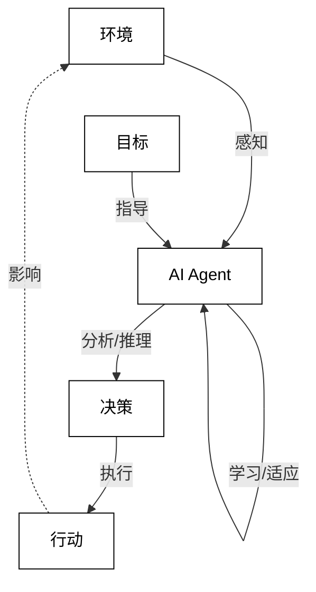
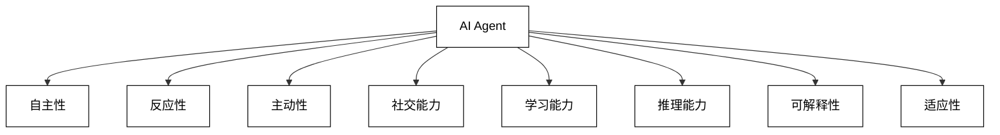
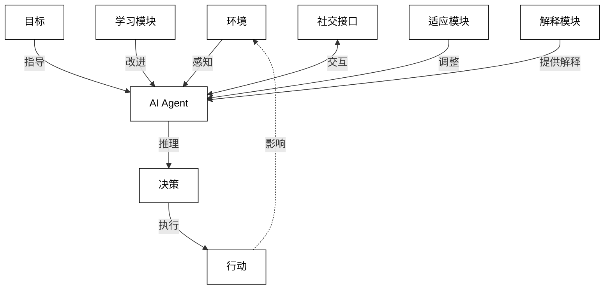
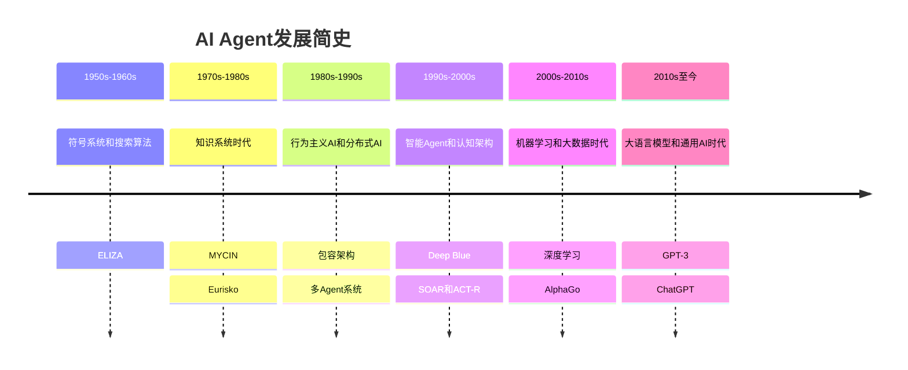
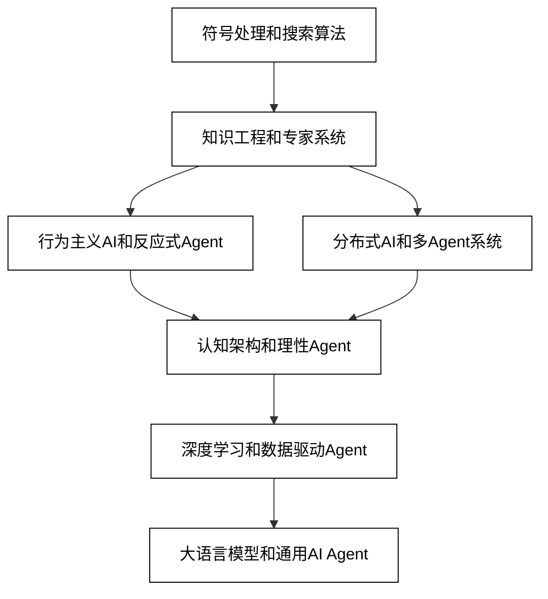
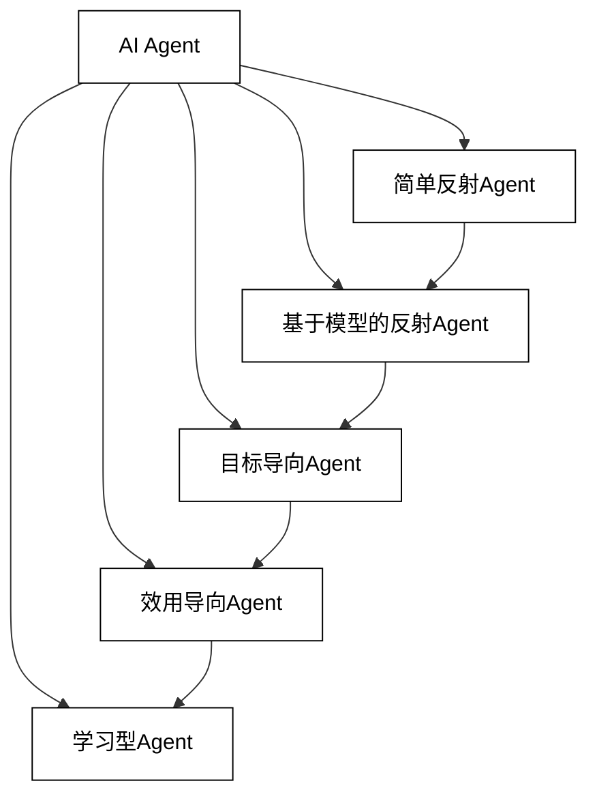
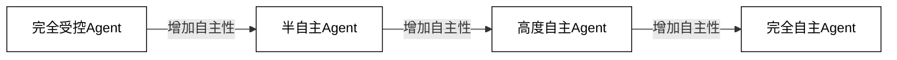
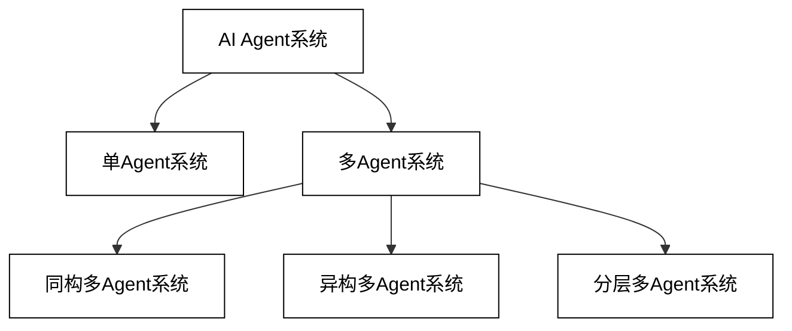
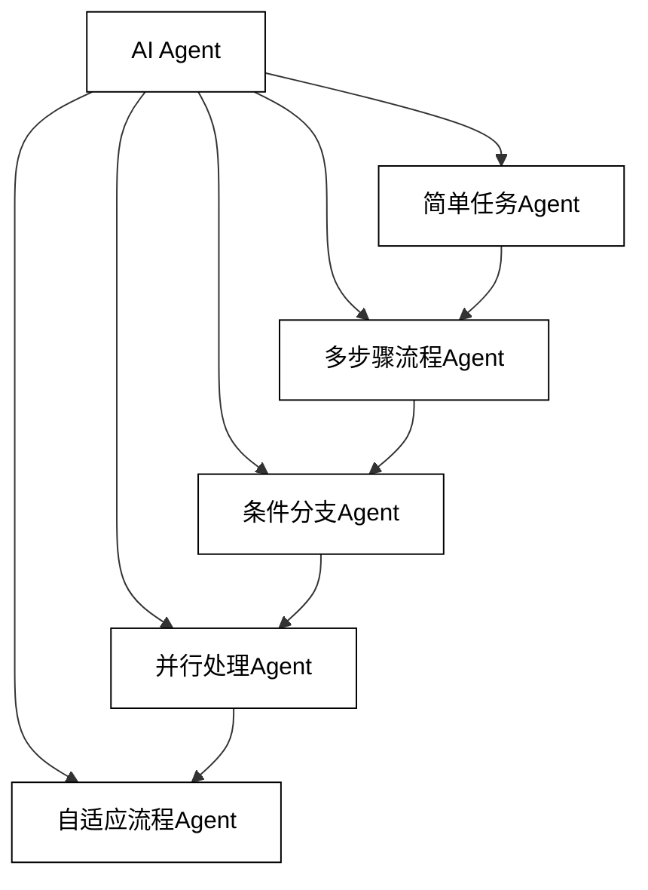
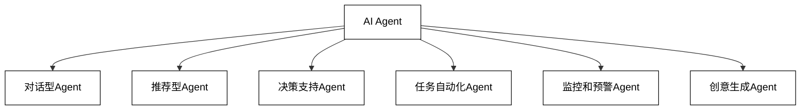

# AI Agent：技术原理与应用实战

## 关键词

AI Agent, 人工智能, 大语言模型, 机器学习, 自然语言处理, 应用实战, 技术原理

## 摘要

本文深入探讨了AI Agent的技术原理与应用实战。从AI Agent的基本概念、特征和分类入手，详细阐述了其核心技术、架构组成以及评估方法。文章还重点介绍了AI Agent在教育、医疗、金融等多个领域的具体应用，并分析了其商业价值和市场前景。同时，本文也探讨了AI Agent面临的挑战和未来发展方向，为读者提供了全面而深入的AI Agent知识体系。

# 第一部分 技术认知

## 第1章 全面认识AI Agent

### 1.1 AI Agent的概念、特征与定义

#### 1.1.1 AI Agent的概念

AI Agent，即人工智能代理，是一种能够感知环境、做出决策并采取行动以实现特定目标的智能系统。它是人工智能领域中一个重要的研究方向和应用形态，代表了AI技术向更高级、更自主的方向发展的趋势。

AI Agent的核心思想是模拟人类智能代理的行为和决策过程。它不仅仅是一个被动的程序或算法，而是一个能够主动感知、学习、推理和行动的智能实体。这种智能实体可以是软件程序、机器人、或者嵌入式系统等多种形式。

为了更好地理解AI Agent的概念，我们可以从以下几个方面来看：

1. 感知能力：
   AI Agent能够通过各种传感器或数据接口感知其所处的环境。这种感知可以是对物理世界的感知（如摄像头、麦克风等），也可以是对数字世境的感知（如数据库查询、网络爬虫等）。
2. 决策能力：
   基于感知到的信息，AI Agent能够进行分析、推理和决策。这个过程可能涉及到机器学习、深度学习、规则推理等多种AI技术。
3. 行动能力：
   AI Agent能够根据决策结果采取相应的行动。这些行动可以是物理世界中的动作（如机器人移动），也可以是数字世界中的操作（如发送消息、修改数据等）。
4. 自主性：
   AI Agent具有一定程度的自主性，能够在没有人类直接干预的情况下完成任务。这种自主性的程度可以根据具体应用场景和技术水平而有所不同。
5. 目标导向：
   AI Agent的行为是为了实现特定的目标或完成特定的任务。这个目标可以是预先设定的，也可以是通过学习和交互动态调整的。
6. 适应性：
   AI Agent能够根据环境的变化和任务的需求进行学习和调整，以提高其性能和效率。
7. 交互能力：
   许多AI Agent能够与人类用户或其他AI Agent进行交互，这种交互可以是通过自然语言、图形界面或其他方式实现的。

为了更直观地理解AI Agent的概念和工作原理，我们可以使用以下Mermaid流程图来表示：



这个流程图展示了AI Agent的基本工作循环：

1. AI Agent从环境中感知信息
2. 基于感知到的信息进行分析和推理
3. 做出决策
4. 执行相应的行动
5. 行动反过来影响环境
6. 整个过程受到预设目标的指导
7. AI Agent通过不断的学习和适应来提高自身性能

值得注意的是，AI Agent的概念是一个宽泛的概念，可以涵盖从简单的规则基反应系统到复杂的认知架构。随着技术的发展，特别是大语言模型（LLM）等技术的突破，AI Agent的能力和应用范围正在不断扩大。

在实际应用中，AI Agent可能会以各种形式出现，例如：

- 智能助手：如Siri、Alexa等，能够理解自然语言指令并执行相应任务。
- 自动驾驶系统：能够感知道路环境，做出驾驶决策并控制车辆。
- 智能客服：能够理解客户问题，提供相应解答和服务。
- 游戏AI：能够在复杂的游戏环境中做出决策和行动。
- 智能家居系统：能够感知家庭环境，自动调节各种设备以提供舒适的生活体验。

总的来说，AI Agent代表了人工智能向更高级、更自主、更智能的方向发展的趋势。它不仅仅是一种技术，更是一种新的计算范式和问题解决方法，有望在未来改变我们与技术交互的方式，并在各个领域带来革命性的变革。

#### 1.1.2 AI Agent的特征

AI Agent作为人工智能领域的一个重要概念，具有一系列独特的特征。这些特征不仅定义了AI Agent的本质，也决定了其在实际应用中的能力和局限性。以下我们将详细探讨AI Agent的主要特征：

1. 自主性（Autonomy）

自主性是AI Agent最核心的特征之一。它指的是AI Agent能够在没有人类直接干预的情况下，独立地做出决策和采取行动。这种自主性体现在以下几个方面：

- 独立决策：AI Agent能够基于自身的知识库和推理能力，独立做出决策。
- 自我调节：能够根据环境变化和任务需求，自动调整自身的行为策略。
- 主动性：不仅能够被动地响应外部刺激，还能主动地采取行动以实现目标。

自主性的程度可以用一个连续谱来表示，从完全受人类控制到完全自主。大多数实际应用中的AI Agent都处于这个谱的中间位置，既有一定的自主性，又受到一定的人类监督和控制。


2. 反应性（Reactivity）

反应性指AI Agent能够及时感知环境的变化，并做出相应的反应。这个特征强调了AI Agent与环境之间的实时互动。反应性的关键点包括：

- 实时感知：能够快速捕捉环境中的变化。
- 快速响应：能够在合理的时间内做出反应。
- 适应性：能够根据环境变化调整自身行为。

反应性对于许多实时系统（如自动驾驶）至关重要，因为在这些场景中，快速准确的反应可能关系到生命安全。

3. 主动性（Proactivity）

主动性是指AI Agent不仅能够对环境变化做出反应，还能主动采取行动以实现其目标。这个特征体现了AI Agent的目标导向性质。主动性的表现包括：

- 目标驱动：AI Agent的行为是为了实现特定的目标。
- 预测性行为：能够预测未来可能发生的情况，并提前采取行动。
- 创新性：能够在面对新情况时，创造性地寻找解决方案。

主动性使得AI Agent能够在复杂、动态的环境中更好地完成任务，而不仅仅是被动地响应环境变化。

4. 社交能力（Social Ability）

社交能力指AI Agent能够与其他Agent（包括人类用户和其他AI Agent）进行交互和协作。这个特征在多Agent系统和人机交互场景中尤为重要。社交能力的关键点包括：

- 通信能力：能够通过各种方式（如自然语言、API接口等）与其他实体进行信息交换。
- 协作能力：能够与其他Agent合作完成复杂任务。
- 协商能力：能够在存在利益冲突的情况下进行协商和妥协。

社交能力使得AI Agent能够在更复杂的社会环境中运作，实现更高级的任务。

5. 学习能力（Learning Ability）

学习能力是指AI Agent能够从经验中学习，不断改进自身的性能。这个特征使得AI Agent能够适应新的环境和任务。学习能力的表现包括：

- 经验学习：从过去的经验中总结规律，改进未来的行为。
- 在线学习：在执行任务的过程中不断学习和调整。
- 迁移学习：将在一个任务中学到的知识应用到新的相关任务中。

学习能力是AI Agent实现持续改进和适应性的关键。

6. 推理能力（Reasoning Ability）

推理能力指AI Agent能够基于已知信息进行逻辑推理，得出新的结论或做出决策。这个特征体现了AI Agent的智能核心。推理能力的表现包括：

- 演绎推理：从一般原理推导出具体结论。
- 归纳推理：从具体事例总结出一般规律。
- 模糊推理：在不确定性条件下进行推理。

推理能力使得AI Agent能够处理复杂的问题，做出智能的决策。

7. 可解释性（Explainability）

可解释性是指AI Agent能够解释其决策和行为的原因。这个特征在提高用户信任和系统透明度方面非常重要。可解释性的关键点包括：

- 决策透明：能够清晰地展示决策过程。
- 行为追踪：能够追溯和解释特定行为的原因。
- 知识表示：以人类可理解的方式表示其知识和推理过程。

可解释性对于AI Agent在关键领域（如医疗诊断、金融决策）的应用至关重要。

8. 适应性（Adaptability）

适应性指AI Agent能够适应环境的变化和新的任务需求。这个特征使得AI Agent能够在动态变化的环境中保持高效。适应性的表现包括：

- 环境适应：能够适应不同的操作环境。
- 任务适应：能够快速适应新的任务要求。
- 错误恢复：能够从错误中恢复并调整策略。

适应性使得AI Agent能够在复杂、不确定的实际环境中长期有效运作。

为了更直观地理解这些特征之间的关系，我们可以使用以下Mermaid图来表示：



这个图展示了AI Agent的各个特征，以及它们之间的一些相互关系。例如，自主性与反应性和主动性密切相关，而学习能力、推理能力、可解释性和适应性之间也存在紧密的联系。

理解这些特征对于设计、开发和应用AI Agent至关重要。不同的应用场景可能会强调不同的特征。例如，在自动驾驶系统中，反应性和安全性可能是最重要的；而在智能助手系统中，社交能力和学习能力可能更为关键。

在实际应用中，这些特征往往是相互影响、相互促进的。例如，强大的学习能力可以提高AI Agent的适应性；良好的推理能力可以增强其自主性和主动性；而高度的可解释性则可以提升用户对AI Agent的信任，从而扩大其应用范围。

总的来说，这些特征共同定义了AI Agent的能力边界和应用潜力。随着技术的不断进步，特别是在机器学习、自然语言处理等领域的突破，AI Agent的这些特征正在不断得到增强和完善，推动着AI技术向更智能、更自主、更可信的方向发展。

#### 1.1.3 AI Agent的定义

在深入理解了AI Agent的概念和特征之后，我们可以给出一个更加全面和精确的AI Agent定义。这个定义不仅要概括AI Agent的本质，还要反映其主要特征和功能。

AI Agent的定义：

AI Agent是一个具有自主性、反应性和主动性的智能系统，能够感知环境、进行推理、做出决策并采取行动以实现特定目标。它具有学习能力、社交能力和适应性，能够在复杂、动态的环境中独立或协作完成任务，并能对其行为和决策提供解释。

这个定义包含了以下几个关键点：

1. 智能系统：强调AI Agent是一个具有智能的系统，而不仅仅是一个简单的程序或算法。
2. 自主性、反应性和主动性：这三个特征是AI Agent的核心特征，体现了其独立决策、快速响应和目标导向的能力。
3. 感知、推理、决策和行动：描述了AI Agent的基本工作流程，从环境感知到最终行动的整个过程。
4. 目标导向：强调AI Agent的行为是为了实现特定目标，而不是随机或无目的的。
5. 学习能力、社交能力和适应性：这些是AI Agent的高级特征，使其能够不断改进、与他人协作，并适应新环境。
6. 复杂、动态环境：说明AI Agent能够在现实世界的复杂情况下运作，而不仅限于简单、静态的环境。
7. 独立或协作：表明AI Agent既可以单独工作，也可以与其他Agent（包括人类）合作。
8. 可解释性：强调AI Agent能够对其行为和决策提供解释，这对于提高透明度和用户信任至关重要。

为了更好地理解这个定义，我们可以使用一个Mermaid图来可视化AI Agent的核心组成和工作流程：



这个图展示了AI Agent的主要组成部分和工作流程：

1. 环境感知：AI Agent从环境中获取信息。
2. 推理和决策：基于感知到的信息和内部知识进行推理，做出决策。
3. 行动执行：根据决策采取行动，这些行动会影响环境。
4. 目标指导：整个过程受到预设目标的指导。
5. 学习模块：不断学习和改进Agent的性能。
6. 社交接口：允许与其他Agent或人类进行交互。
7. 适应模块：根据环境变化调整行为。
8. 解释模块：为决策和行为提供解释。

这个定义和图示共同构成了对AI Agent的全面理解。它不仅描述了AI Agent的基本功能，还强调了其高级特征和在复杂环境中的应用能力。

值得注意的是，这个定义是一个理想化的描述。在实际应用中，不同的AI Agent可能会强调不同的特征，或者在某些方面的能力有所限制。例如，一个简单的反应型Agent可能只具有基本的感知和反应能力，而缺乏复杂的推理和学习能力。另一方面，一个高度复杂的认知Agent可能具备所有这些特征，能够在极其复杂的环境中自主运作。

随着技术的不断进步，特别是在机器学习、自然语言处理、计算机视觉等领域的突破，AI Agent的能力正在不断扩展和深化。未来的AI Agent可能会展现出更高度的自主性、更强的学习和推理能力，以及更自然的人机交互能力。

总的来说，这个定义为我们理解和开发AI Agent提供了一个全面的框架。它不仅概括了当前AI Agent的主要特征，也为未来AI Agent的发展指明了方向。在实际应用中，我们可以根据具体需求和技术条件，基于这个定义来设计和实现不同类型的AI Agent，以解决各种复杂的问题和任务。

### 1.2 AI Agent的发展历程

#### 1.2.1 AI Agent的发展简史

AI Agent的发展历程与人工智能（AI）的整体发展密切相关。从最初的简单反应系统到如今的复杂认知架构，AI Agent经历了几十年的演变和进步。以下我们将详细回顾AI Agent的发展简史，探讨其关键里程碑和技术突破。

1. 早期阶段（1950s-1960s）：符号系统和搜索算法

在这个阶段，AI研究主要集中在符号处理和问题求解上。虽然"Agent"这个术语还未被广泛使用，但这个时期的研究为后来的AI Agent奠定了基础。

关键事件和技术：

- 1956年：达特茅斯会议标志着AI作为一个独立学科的诞生。
- 1959年：Arthur Samuel开发了能学习下棋的程序，展示了机器学习的早期应用。
- 1965年：Joseph Weizenbaum创造了ELIZA，这是一个模拟心理治疗师的程序，被认为是早期的对话系统。

这个时期的"Agent"主要是基于规则的系统，能够执行简单的任务，但缺乏真正的自主性和学习能力。

2. 知识系统时代（1970s-1980s）：专家系统的兴起

这个时期见证了基于知识的系统的发展，特别是专家系统的兴起。这些系统可以被视为早期的AI Agent，它们能够在特定领域模拟人类专家的决策过程。

关键事件和技术：

- 1972年：MYCIN系统的开发，这是一个用于诊断血液感染的专家系统。
- 1976年：Douglas Lenat开始开发Eurisko，这是一个能够学习和改进自身启发式规则的系统。
- 1980年代：日本启动第五代计算机项目，推动了知识工程和逻辑编程的发展。

这个时期的AI Agent开始具备了一定的推理能力和领域特定的知识，但仍然缺乏灵活性和通用性。

3. 行为主义AI和分布式AI（1980s-1990s）：Agent概念的形成

这个时期见证了AI研究范式的转变，从中央集权的知识系统转向分布式和行为主义方法。"Agent"这个术语开始被广泛使用，并逐渐形成了独立的研究领域。

关键事件和技术：

- 1986年：Rodney Brooks提出了"包容架构"（Subsumption Architecture），强调了基于行为的机器人控制。
- 1988年：Phil Agre和David Chapman提出了"计划即通信"（Plans-as-Communication）理论，强调了Agent之间的交互。
- 1990年代初：多Agent系统（MAS）成为一个热门研究领域，探讨了Agent之间的协作和竞争。

这个时期的AI Agent开始具备了更多的自主性和适应性，能够在动态环境中做出反应和决策。

4. 智能Agent和认知架构（1990s-2000s）：Agent理论的成熟

这个时期见证了AI Agent理论的成熟和系统化，以及更复杂的Agent架构的出现。

关键事件和技术：

- 1995年：Michael Wooldridge和Nicholas Jennings提出了智能Agent的形式定义。
- 1997年：IBM的Deep Blue击败了国际象棋世界冠军Garry Kasparov。
- 2000年：DARPA开始资助认知架构研究，如SOAR和ACT-R。

这个时期的AI Agent开始具备了更强的推理能力、学习能力和目标导向性，能够处理更复杂的任务和环境。

5. 机器学习和大数据时代（2000s-2010s）：数据驱动的Agent

随着机器学习技术的进步和大数据的出现，AI Agent的能力得到了显著提升。

关键事件和技术：

- 2006年：Geoffrey Hinton提出深度学习的概念，为AI Agent提供了强大的学习工具。
- 2011年：IBM Watson在Jeopardy!问答节目中击败人类冠军。
- 2016年：Google DeepMind的AlphaGo击败世界围棋冠军李世石。

这个时期的AI Agent开始能够从大量数据中学习，展现出前所未有的性能和适应性。

6. 大语言模型和通用AI时代（2010s至今）：走向通用智能

近年来，大语言模型的出现和通用AI的发展，为AI Agent带来了革命性的变化。

关键事件和技术：

- 2018年：Google发布BERT，开启了预训练语言模型的新时代。
- 2020年：OpenAI发布GPT-3，展示了大语言模型的强大能力。
- 2022年：ChatGPT的发布引发了AI应用的新浪潮。
- 2023年：GPT-4等更先进的模型继续推动AI能力的边界。

这个时期的AI Agent开始展现出接近人类水平的语言理解和生成能力，以及跨领域的知识迁移能力。

为了更直观地展示AI Agent的发展历程，我们可以使用以下Mermaid时间线图：



这个时间线展示了AI Agent从最初的简单系统到如今的复杂智能体的演变过程。每个阶段都有其特征性的技术和代表性的系统，反映了AI Agent能力的不断提升。

AI Agent的发展历程反映了整个AI领域的进步。从早期的基于规则的系统，到知识工程和专家系统，再到行为主义AI和分布式系统，每一步都为AI Agent的发展添加了新的维度。近年来，随着机器学习特别是深度学习技术的突破，以及大语言模型的出现，AI Agent的能力得到了质的飞跃。

值得注意的是，这个发展过程并非线性的。不同的研究方向和技术路线常常并行发展，相互影响。例如，虽然近年来深度学习和大语言模型占据了主导地位，但符号AI、知识图谱等技术仍在继续发展，并在某些领域发挥着重要作用。

展望未来，AI Agent的发展趋势可能包括：

1. 更强的通用性：能够处理更广泛的任务和领域。
2. 更深的理解能力：不仅能处理表面信息，还能理解深层语义和上下文。
3. 更好的可解释性：能够清晰地解释其决策过程和推理逻辑。
4. 更高的自主性：能够在更复杂的环境中独立做出决策和行动。
5. 更自然的人机交互：能够以更接近人类的方式进行交流和协作。
6. 更强的学习能力：能够更快速、更高效地从经验中学习和适应。
7. 更好的伦理意识：能够在决策过程中考虑道德和伦理因素。

总的来说，AI Agent的发展历程反映了人类对智能的不断探索和追求。从最初的简单反应系统到如今的复杂认知架构，AI Agent已经取得了巨大的进步。然而，与人类级别的通用智能相比，当前的AI Agent仍然存在诸多限制。未来的发展将继续推动AI Agent向更智能、更自主、更可信的方向迈进，有望在更广泛的领域中发挥重要作用。

#### 1.2.2 AI Agent的技术演变史

AI Agent的技术演变史是一个复杂而富有动态的过程，涉及多个学科和技术领域的进步。这个演变过程不仅反映了AI技术的整体发展，也体现了人们对智能系统的理解和期望的变化。以下我们将详细探讨AI Agent技术的主要演变阶段，分析每个阶段的关键技术突破和典型应用。

1. 符号处理和搜索算法阶段（1950s-1960s）

这个阶段的AI技术主要基于符号处理和搜索算法。虽然当时还没有明确的"Agent"概念，但这些技术为后来的AI Agent奠定了基础。

关键技术：

- 启发式搜索算法（如A*算法）
- 符号逻辑推理
- 基于规则的系统

典型应用：

- 定理证明程序
- 早期的棋类游戏AI（如Samuel的跳棋程序）

技术特点：
这个阶段的技术主要关注如何在给定的问题空间中高效搜索解决方案。系统的行为主要由预定义的规则和逻辑推理驱动，缺乏学习和适应能力。

2. 知识工程和专家系统阶段（1970s-1980s）

这个阶段见证了知识表示和推理技术的发展，专家系统成为AI研究的主流。

关键技术：

- 知识表示方法（如语义网络、框架理论）
- 推理引擎
- 不确定性推理（如贝叶斯网络）

典型应用：

- MYCIN（医疗诊断系统）
- DENDRAL（化学结构分析系统）
- R1/XCON（计算机配置系统）

技术特点：
这个阶段的AI系统开始具备了领域特定的专业知识，能够在特定领域模拟人类专家的决策过程。然而，这些系统仍然缺乏学习能力和通用性。

3. 行为主义AI和反应式Agent阶段（1980s-1990s）

这个阶段出现了对传统符号AI的反思，提出了基于行为和反应的新范式。

关键技术：

- 包容架构（Subsumption Architecture）
- 有限状态机
- 反应式规划

典型应用：

- Brooks的机器人（如Genghis）
- 简单的自主移动机器人

技术特点：
这个阶段的AI Agent强调了与环境的直接交互，不再依赖复杂的内部表示和推理过程。这种方法在动态环境中表现出良好的实时性和鲁棒性。

4. 分布式AI和多Agent系统阶段（1990s-2000s）

这个阶段关注多个Agent之间的交互和协作，形成了多Agent系统（MAS）的研究领域。

关键技术：

- Agent通信语言（如KQML、FIPA-ACL）
- 协作和协调机制
- 分布式问题求解

典型应用：

- 分布式传感器网络
- 电子商务中的自动交易系统
- 交通管理系统

技术特点：
这个阶段的技术使得多个AI Agent能够协同工作，处理更复杂的任务和环境。Agent之间的通信和协作成为研究的重点。

5. 认知架构和理性Agent阶段（2000s-2010s）

这个阶段致力于构建更接近人类认知过程的AI系统，同时也强调了Agent的理性决策能力。

关键技术：

- 认知架构（如SOAR、ACT-R）
- BDI（Belief-Desire-Intention）模型
- 强化学习

典型应用：

- 认知模型和仿真
- 智能虚拟助手
- 自主决策系统

技术特点：
这个阶段的AI Agent具备了更复杂的内部结构，能够模拟人类的认知过程，包括记忆、学习、推理和决策。

6. 深度学习和数据驱动Agent阶段（2010s-至今）

这个阶段见证了深度学习技术的爆发性增长，为AI Agent带来了革命性的变化。

关键技术：

- 深度神经网络（如CNN、RNN、Transformer）
- 端到端学习
- 迁移学习和元学习

典型应用：

- 图像识别和生成Agent
- 自然语言处理Agent（如对话系统）
- 游戏AI（如AlphaGo、OpenAI Five）

技术特点：
这个阶段的AI Agent能够从大量数据中学习复杂的模式和表示，展现出前所未有的性能和适应性。

7. 大语言模型和通用AI Agent阶段（2020s-至今）

最近几年，大语言模型的出现开启了AI Agent发展的新纪元，朝着通用人工智能迈进。

关键技术：

- 大规模预训练语言模型（如GPT系列、BERT、T5）
- 少样本学习和零样本学习
- 多模态学习

典型应用：

- 通用对话系统（如ChatGPT）
- 代码生成和程序合成
- 多模态内容生成（如DALL-E、Midjourney）

技术特点：
这个阶段的AI Agent展现出了强大的语言理解和生成能力，以及跨领域的知识迁移能力，朝着通用人工智能的方向迈进。

为了更直观地展示AI Agent技术的演变，我们可以使用以下Mermaid流程图：



这个流程图展示了AI Agent技术的主要演变路径，反映了从早期的符号处理到当前的大语言模型的发展过程。

AI Agent技术的演变反映了几个重要的趋势：

1. 从规则到学习：早期的AI Agent主要依赖预定义的规则和知识，而现代AI Agent更多地依赖从数据中学习。
2. 从特定领域到通用能力：AI Agent的应用范围从特定领域（如专家系统）逐渐扩展到更广泛的领域。
3. 从简单反应到复杂认知：AI Agent的内部结构和处理过程变得越来越复杂，能够处理更高级的认知任务。
4. 从单一Agent到多Agent系统：研究重点从单个Agent扩展到多个Agent之间的交互和协作。
5. 从符号处理到神经网络：主导技术从基于符号的方法转向了基于神经网络的方法。
6. 从特征工程到端到端学习：减少了对人工设计特征的依赖，更多地依赖模型自动学习有用的表示。
7. 从狭义AI到通用AI：最新的发展趋势是朝着构建具有通用智能的AI Agent迈进。

尽管AI Agent技术取得了巨大进步，但仍然面临许多挑战，如：

- 可解释性：如何使AI Agent的决策过程更透明、可解释。
- 安全性和可控性：如何确保AI Agent的行为符合预期和伦理标准。
- 泛化能力：如何使AI Agent在新的、未见过的情况下也能表现良好。
- 常识推理：如何赋予AI Agent人类般的常识推理能力。
- 持续学习：如何使AI Agent能够在不断变化的环境中持续学习和适应。

未来的AI Agent技术发展可能会继续朝着更智能、更通用、更可信的方向前进。这可能包括更先进的神经-符号融合系统、更强大的多模态学习能力、更高效的知识获取和推理方法等。同时，如何将AI Agent技术与其他前沿技术（如量子计算、脑机接口等）结合，也将是未来研究的重要方向。

### 1.3 AI Agent的分类方式

AI Agent的分类是理解和应用这一技术的重要基础。不同的分类方式反映了AI Agent在不同维度上的特征和能力。本节将详细介绍几种主要的AI Agent分类方法，包括基于感知能力与作用目标、自主性能、Agent数量与协作能力、业务流程复杂程度，以及功能、任务与应用场景的分类。

#### 1.3.1 根据感知能力与作用目标划分

根据感知能力和作用目标，我们可以将AI Agent分为以下几类：

1. 简单反射Agent（Simple Reflex Agents）

特征：

- 基于当前感知直接做出反应
- 不考虑历史信息或未来影响
- 通常使用条件-动作规则

工作原理：

```python
def simple_reflex_agent(perception):
    if condition(perception):
        return action
    return default_action
```

应用场景：

- 简单的控制系统（如恒温器）
- 基础的游戏AI（如简单的乒乓游戏AI）

优点：

- 响应速度快
- 实现简单

缺点：

- 只能处理简单的环境
- 缺乏灵活性和适应性

2. 基于模型的反射Agent（Model-based Reflex Agents）

特征：

- 维护内部状态来跟踪环境
- 使用环境模型来更新内部状态
- 基于当前状态和感知做出决策

工作原理：

```python
def model_based_reflex_agent(perception, state):
    state = update_state(state, perception)
    rule = rule_match(state)
    action = rule.action
    state = update_state(state, action)
    return action
```

应用场景：

- 自动驾驶车辆的部分功能
- 智能家居系统

优点：

- 能够处理部分可观察环境
- 可以考虑环境的动态变化

缺点：

- 需要准确的环境模型
- 决策仍然基于预定义规则

3. 目标导向Agent（Goal-based Agents）

特征：

- 有明确的目标
- 考虑行动的结果是否能达成目标
- 使用搜索和规划算法

工作原理：

```python
def goal_based_agent(perception, state, goal):
    state = update_state(state, perception)
    if goal_test(state):
        return None  # Goal achieved
    possible_actions = formulate_problem(state, goal)
    return choose_best_action(possible_actions)
```

应用场景：

- 路径规划系统
- 棋类游戏AI

优点：

- 能够处理复杂的任务
- 可以适应不同的目标

缺点：

- 计算复杂度可能很高
- 可能需要大量的领域知识

4. 效用导向Agent（Utility-based Agents）

特征：

- 使用效用函数评估不同状态的"好坏"
- 选择能最大化预期效用的行动
- 能够处理不确定性和多目标情况

工作原理：

```python
def utility_based_agent(perception, state):
    state = update_state(state, perception)
    possible_actions = get_possible_actions(state)
    return argmax(possible_actions, key=lambda a: expected_utility(state, a))

def expected_utility(state, action):
    return sum(p * utility(outcome) for outcome, p in get_outcomes(state, action))
```

应用场景：

- 金融交易系统
- 资源分配优化

优点：

- 能够在复杂、不确定的环境中做出理性决策
- 可以平衡多个目标

缺点：

- 设计合适的效用函数可能很困难
- 计算复杂度高

5. 学习型Agent（Learning Agents）

特征：

- 能够从经验中学习和改进
- 包含性能元素、学习元素、批评元素和问题生成元素
- 可以适应新的、未知的环境

工作原理：

```python
def learning_agent(perception, state, model):
    state = update_state(state, perception)
    action = choose_action(state, model)
    reward = get_reward(state, action)
    model = update_model(model, state, action, reward)
    return action
```

应用场景：

- 推荐系统
- 强化学习的游戏AI（如AlphaGo）

优点：

- 能够不断改进性能
- 可以适应变化的环境

缺点：

- 可能需要大量的训练数据和时间
- 学习过程可能不稳定

为了更直观地展示这些不同类型的AI Agent之间的关系，我们可以使用以下Mermaid图：



这个图展示了不同类型AI Agent之间的层次关系，从简单的反射Agent到复杂的学习型Agent，反映了AI Agent能力的逐步提升。

在实际应用中，这些不同类型的Agent常常被结合使用，以应对复杂的环境和任务需求。例如，一个自动驾驶系统可能同时包含反射型Agent（用于紧急制动）、目标导向Agent（用于路径规划）和学习型Agent（用于优化驾驶策略）。

选择合适的Agent类型需要考虑以下因素：

1. 环境的复杂性：简单环境可以使用简单反射Agent，而复杂、动态环境可能需要更高级的Agent类型。
2. 任务的性质：明确的单一目标可以使用目标导向Agent，而多目标或需要权衡的任务可能更适合效用导向Agent。
3. 可用资源：学习型Agent通常需要更多的计算资源和数据。
4. 实时性要求：对于需要快速反应的任务，简单反射Agent可能更合适。
5. 适应性需求：如果环境或任务经常变化，学习型Agent可能是更好的选择。
6. 可解释性要求：简单反射Agent和基于模型的反射Agent通常更容易解释其决策过程。

随着技术的发展，特别是深度学习和大语言模型的进步，新的Agent类型和混合型Agent不断出现，进一步扩展了AI Agent的能力和应用范围。

#### 1.3.2 根据Agent的自主性能划分

自主性是AI Agent的一个关键特征，它反映了Agent独立做出决策和执行任务的能力。根据自主性能的不同程度，我们可以将AI Agent分为以下几类：

1. 完全受控Agent（Fully Controlled Agents）

特征：

- 完全依赖人类操作者的指令
- 没有自主决策能力
- 主要执行预定义的任务

工作原理：

```python
def fully_controlled_agent(human_command):
    return execute_command(human_command)
```

应用场景：

- 工业机器人
- 远程操控设备

优点：

- 行为可预测和可控
- 适合高度结构化和重复性的任务

缺点：

- 缺乏灵活性
- 完全依赖人类操作，效率可能受限

2. 半自主Agent（Semi-Autonomous Agents）

特征：

- 能够在某些情况下自主决策
- 在关键决策点需要人类干预
- 结合了自动化和人工控制

工作原理：

```python
def semi_autonomous_agent(perception, state):
    if requires_human_input(state):
        return get_human_input()
    else:
        return autonomous_decision(perception, state)
```

应用场景：

- 高级辅助驾驶系统
- 智能客服系统（复杂问题转人工）

优点：

- 平衡了自动化和人工控制
- 可以处理一定程度的复杂性和不确定性

缺点：

- 可能存在人机交互的延迟
- 需要设计合适的人机交互界面

3. 高度自主Agent（Highly Autonomous Agents）

特征：

- 能够在大多数情况下独立做出决策
- 只在极少数情况下需要人类干预
- 具有强大的学习和适应能力

工作原理：

```python
def highly_autonomous_agent(perception, state, model):
    action = autonomous_decision(perception, state, model)
    if requires_human_oversight(action):
        return get_human_approval(action)
    else:
        return action
```

应用场景：

- 自动驾驶汽车
- 高频交易系统

优点：

- 能够高效处理复杂任务
- 减少对人类操作的依赖

缺点：

- 可能存在安全和伦理风险
- 需要大量训练和验证

4. 完全自主Agent（Fully Autonomous Agents）

特征：

- 完全独立做出决策和执行任务
- 具有自我学习和自我改进的能力
- 可以适应各种未知情况

工作原理：

```python
def fully_autonomous_agent(perception, state, model):
    action = autonomous_decision(perception, state, model)
    result = execute_action(action)
    model = update_model(model, state, action, result)
    return action
```

应用场景：

- 深空探测器
- 高度复杂的AI系统（如AGI）

优点：

- 可以在无人干预的情况下长期运行
- 具有最大的灵活性和适应性

缺点：

- 行为可能难以预测和控制
- 可能引发伦理和安全问题

为了更直观地展示这些不同自主性级别的AI Agent之间的关系，我们可以使用以下Mermaid图：



这个图展示了AI Agent从完全受控到完全自主的连续谱，反映了自主性能的逐步提升。

在实际应用中，选择合适的自主性级别需要考虑以下因素：

1. 任务复杂性：简单任务可能只需要完全受控Agent，而复杂任务可能需要更高度的自主性。
2. 环境不确定性：高度不确定的环境可能需要更自主的Agent来应对各种情况。
3. 实时性要求：需要快速反应的场景可能更适合高度自主或完全自主的Agent。
4. 安全性考虑：关键安全系统可能需要保持一定程度的人类控制。
5. 法律和伦理约束：某些领域可能有法规限制AI系统的自主程度。
6. 可用资源：高度自主的Agent通常需要更多的计算资源和更复杂的算法。
7. 人机交互需求：需要频繁人机交互的场景可能更适合半自主Agent。

随着AI技术的不断进步，特别是在机器学习、自然语言处理和计算机视觉等领域的突破，AI Agent的自主性能正在不断提高。然而，提高自主性也带来了一系列挑战，包括：

1. 可解释性：随着自主性的提高，AI Agent的决策过程可能变得更加难以理解和解释。
2. 安全性：高度自主的AI Agent可能会做出意外或有害的决策，需要设计robust的安全机制。
3. 伦理问题：完全自主的AI Agent可能会面临复杂的伦理决策，需要考虑如何将人类价值观融入AI系统。
4. 法律责任：当自主AI Agent造成损害时，如何界定责任成为一个复杂的法律问题。
5. 人机协作：如何设计有效的人机协作机制，使人类能够在必要时干预或指导高度自主的AI Agent。
6. 性能评估：随着自主性的提高，评估AI Agent的性能变得更加复杂，需要开发新的评估方法和标准。

未来，AI Agent的自主性能可能会继续提升，朝着更智能、更灵活、更可靠的方向发展。同时，如何平衡自主性与可控性、效率与安全性，将成为AI研究和应用的重要课题。

#### 1.3.3 根据Agent数量与协作能力划分

根据Agent的数量和协作能力，我们可以将AI Agent系统分为以下几类：

1. 单Agent系统（Single-Agent Systems）

特征：

- 只有一个Agent独立运行
- 不需要与其他Agent协调或通信
- 通常用于解决独立的、封闭的问题

工作原理：

```python
def single_agent_system(environment):
    agent = create_agent()
    while not environment.is_done():
        perception = environment.get_state()
        action = agent.decide(perception)
        environment.execute(action)
```

应用场景：

- 个人助理（如Siri、Alexa）
- 单机游戏AI

优点：

- 设计和实现相对简单
- 不需要考虑复杂的协调问题

缺点：

- 处理能力有限
- 难以解决需要多方协作的复杂问题

2. 同构多Agent系统（Homogeneous Multi-Agent Systems）

特征：

- 多个相同类型的Agent
- Agents具有相同的能力和目标
- 通过协作来完成任务

工作原理：

```python
def homogeneous_multi_agent_system(environment, num_agents):
    agents = [create_agent() for _ in range(num_agents)]
    while not environment.is_done():
        for agent in agents:
            perception = environment.get_state()
            action = agent.decide(perception)
            environment.execute(action)
        environment.synchronize()
```

应用场景：

- 分布式计算系统
- 蜂群机器人

优点：

- 可以并行处理任务，提高效率
- 系统具有较好的可扩展性

缺点：

- 可能存在资源竞争问题
- 需要设计有效的协调机制

3. 异构多Agent系统（Heterogeneous Multi-Agent Systems）

特征：

- 包含不同类型或能力的Agents
- Agents可能有不同的目标和专长
- 需要复杂的协调和任务分配机制

工作原理：

```python
def heterogeneous_multi_agent_system(environment, agent_specs):
    agents = [create_agent(spec) for spec in agent_specs]
    while not environment.is_done():
        for agent in agents:
            perception = environment.get_state()
            action = agent.decide(perception)
            environment.execute(action)
        environment.coordinate_agents(agents)
```

应用场景：

- 智能交通系统（包括车辆、信号灯、行人等）
- 复杂的商业模拟系统

优点：

- 可以处理复杂的、多方面的问题
- 能够模拟现实世界中的复杂交互

缺点：

- 系统设计和实现复杂
- 可能存在Agent间的冲突和协调困难

4. 分层多Agent系统（Hierarchical Multi-Agent Systems）

特征：

- Agents按层级结构组织
- 高层Agent负责决策和协调，低层Agent执行具体任务
- 结合了集中式和分布式控制的优点

工作原理：

```python
def hierarchical_multi_agent_system(environment, hierarchy):
    agents = create_hierarchical_agents(hierarchy)
    while not environment.is_done():
        for level in agents:
            for agent in level:
                perception = environment.get_state()
                action = agent.decide(perception)
                if agent.is_executive():
                    environment.execute(action)
                else:
                    delegate_action(action, agents[level+1])
        environment.update()
```

应用场景：

- 大型组织的管理系统
- 复杂的军事指挥系统

优点：

- 可以有效处理大规模、复杂的问题
- 决策和执行分离，提高效率

缺点：

- 可能存在信息传递延迟
- 系统灵活性可能受到层级结构的限制

为了更直观地展示这些不同类型的AI Agent系统，我们可以使用以下Mermaid图：



这个图展示了AI Agent系统的主要分类，从单Agent系统到各种类型的多Agent系统。

在实际应用中，选择合适的Agent系统类型需要考虑以下因素：

1. 问题复杂性：简单问题可能只需要单Agent系统，而复杂问题可能需要多Agent系统。
2. 任务分解性：如果任务可以自然地分解为多个子任务，多Agent系统可能更合适。
3. 系统规模：大规模系统可能需要分层多Agent系统来有效管理。
4. 环境动态性：高度动态的环境可能需要更灵活的异构多Agent系统。
5. 资源限制：受限的计算资源可能更适合使用分布式的多Agent系统。
6. 容错要求：需要高可靠性的系统可能更适合使用冗余的多Agent系统。
7. 通信成本：如果Agent间通信成本高，可能需要考虑更独立的Agent设计。

随着AI技术的发展，特别是在分布式AI、联邦学习、群体智能等领域的进展，多Agent系统正变得越来越重要。未来的发展趋势可能包括：

1. 大规模多Agent系统：能够协调成千上万个Agent的系统，用于解决复杂的全局问题。
2. 自组织多Agent系统：Agents能够自主地形成有效的组织结构，适应动态变化的环境。
3. 混合智能系统：结合人工智能和人类智能的多Agent系统，实现人机协作。
4. 跨域多Agent系统：能够在不同领域和环境中无缝协作的Agent系统。
5. 自适应学习型多Agent系统：系统中的Agents能够不断学习和改进，优化整体性能。
6. 安全和隐私保护的多Agent系统：在保护个体Agent隐私的同时实现有效协作。
7. 可解释的多Agent系统：能够解释系统整体行为和决策过程的多Agent系统。

总的来说，根据Agent数量和协作能力的分类为我们提供了一个理解和设计复杂AI系统的框架。随着技术的进步和应用需求的增加，我们可能会看到更多创新的多Agent系统架构和应用场景的出现。这些系统将在解决复杂的实际问题、模拟复杂系统和推进人工智能研究方面发挥越来越重要的作用。

#### 1.3.4 根据业务流程复杂程度划分

根据AI Agent处理的业务流程复杂程度，我们可以将其分为以下几类：

1. 简单任务Agent（Simple Task Agents）

特征：

- 执行单一、明确定义的任务
- 通常不需要复杂的决策过程
- 输入和输出关系相对直接

工作原理：

```python
def simple_task_agent(input_data):
    processed_data = simple_processing(input_data)
    return generate_output(processed_data)
```

应用场景：

- 数据格式转换
- 简单的信息检索任务

优点：

- 实现简单，易于部署和维护
- 性能稳定，结果可预测

缺点：

- 功能有限，难以处理复杂情况

2. 多步骤流程Agent（Multi-step Process Agents）

特征：

- 执行包含多个步骤的任务
- 每个步骤可能依赖前一步骤的结果
- 需要一定的状态管理能力

工作原理：

```python
def multi_step_process_agent(input_data):
    state = initialize_state(input_data)
    for step in process_steps:
        state = execute_step(step, state)
    return generate_final_output(state)
```

应用场景：

- 订单处理系统
- 多步骤的数据分析流程

优点：

- 可以处理较复杂的业务流程
- 流程清晰，易于理解和调试

缺点：

- 可能存在步骤间的耦合问题
- 灵活性有限，难以应对流程变化

3. 条件分支Agent（Conditional Branching Agents）

特征：

- 能够根据不同条件选择不同的执行路径
- 包含复杂的决策逻辑
- 可以处理多种情况和异常

工作原理：

```python
def conditional_branching_agent(input_data):
    state = analyze_input(input_data)
    if condition_a(state):
        result = process_a(state)
    elif condition_b(state):
        result = process_b(state)
    else:
        result = default_process(state)
    return result
```

应用场景：

- 客户服务路由系统
- 金融风险评估

优点：

- 能够处理复杂的业务规则和逻辑
- 适应性强，可以处理多种情况

缺点：

- 决策逻辑可能变得复杂难维护
- 需要仔细设计以避免逻辑错误

4. 并行处理Agent（Parallel Processing Agents）

特征：

- 能够同时处理多个任务或流程
- 利用并行计算提高效率
- 需要处理任务同步和资源分配问题

工作原理：

```python
def parallel_processing_agent(input_data_list):
    with concurrent.futures.ThreadPoolExecutor() as executor:
        futures = [executor.submit(process_task, data) for data in input_data_list]
        results = [future.result() for future in concurrent.futures.as_completed(futures)]
    return aggregate_results(results)
```

应用场景：

- 大规模数据处理系统
- 并行计算任务调度器

优点：

- 显著提高处理效率
- 可以充分利用硬件资源

缺点：

- 需要处理复杂的并发问题
- 可能存在资源竞争和死锁风险

5. 自适应流程Agent（Adaptive Process Agents）

特征：

- 能够根据环境和任务动态调整处理流程
- 具有学习和优化能力
- 可以处理高度不确定和变化的业务场景

工作原理：

```python
def adaptive_process_agent(input_data, environment):
    state = initialize_state(input_data)
    while not is_task_complete(state):
        action = select_best_action(state, environment)
        state = execute_action(action, state)
        environment = update_environment(environment, state)
        update_action_selection_model(state, action, environment)
    return generate_output(state)
```

应用场景：

- 智能制造系统
- 自适应学习平台

优点：

- 能够适应复杂和变化的业务环境
- 持续优化性能和效率

缺点：

- 实现复杂，需要大量数据和计算资源
- 行为可能难以预测和解释

为了更直观地展示这些不同复杂程度的AI Agent，我们可以使用以下Mermaid图：



这个图展示了AI Agent从简单到复杂的演进过程，反映了处理业务流程复杂度的增加。

在实际应用中，选择合适的Agent类型需要考虑以下因素：

1. 业务复杂度：简单业务可以使用简单任务Agent，而复杂业务可能需要更高级的Agent类型。
2. 性能要求：对于高性能要求的场景，可能需要考虑并行处理Agent。
3. 灵活性需求：如果业务流程经常变化，自适应流程Agent可能是更好的选择。
4. 可维护性：条件分支Agent可能在逻辑复杂时难以维护，需要权衡。
5. 资源限制：复杂的Agent类型通常需要更多的计算资源和开发时间。
6. 可扩展性：考虑未来业务扩展的需求，选择具有良好扩展性的Agent类型。
7. 错误处理能力：复杂的业务流程可能需要更强大的错误处理和恢复机制。

随着技术的发展，特别是在工作流自动化、业务流程管理（BPM）和人工智能领域的进步，我们可能会看到更多创新的AI Agent类型出现。未来的发展趋势可能包括：

1. 智能工作流Agent：能够自动设计和优化复杂的业务流程。
2. 跨系统集成Agent：能够无缝集成和协调多个不同系统的Agent。
3. 自我修复Agent：能够检测和修复流程中的错误和异常。
4. 预测性流程Agent：能够预测未来的业务需求并提前调整流程。
5. 认知流程自动化（CPA）：结合AI和传统流程自动化技术，实现更智能的业务流程处理。
6. 低代码/无代码Agent平台：允许非技术人员快速创建和部署复杂的业务流程Agent。
7. 可解释的流程Agent：能够清晰解释其决策和行为，提高透明度和可信度。

总的来说，根据业务流程复杂程度的AI Agent分类为我们提供了一个理解和设计业务自动化系统的框架。随着技术的进步和业务需求的增加，我们可能会看到更多创新的Agent类型和应用场景的出现。这些Agent将在提高业务效率、优化决策过程和推动数字化转型方面发挥越来越重要的作用。

#### 1.3.5 根据功能、任务与应用场景划分

根据AI Agent的功能、任务和应用场景，我们可以将其分为以下几类：

1. 对话型Agent（Conversational Agents）

特征：

- 能够理解和生成自然语言
- 可以进行多轮对话
- 通常具有上下文理解能力

工作原理：

```python
def conversational_agent(user_input, context):
    intent = analyze_intent(user_input)
    response = generate_response(intent, context)
    context = update_context(context, user_input, response)
    return response, context
```

应用场景：

- 客户服务聊天机器人
- 智能个人助理（如Siri、Alexa）
- 教育辅导系统

优点：

- 提供自然、直观的人机交互界面
- 可以处理多样化的用户查询

缺点：

- 可能存在理解错误或不恰当回应的风险
- 需要大量训练数据和复杂的NLP模型

2. 推荐型Agent（Recommendation Agents）

特征：

- 基于用户偏好和历史行为推荐内容或产品
- 通常使用协同过滤或内容基础的算法
- 能够不断学习和优化推荐结果

工作原理：

```python
def recommendation_agent(user_profile, item_database):
    user_preferences = analyze_user_preferences(user_profile)
    candidate_items = filter_items(item_database, user_preferences)
    ranked_items = rank_items(candidate_items, user_profile)
    return top_n_recommendations(ranked_items)
```

应用场景：

- 电子商务产品推荐
- 内容平台（如Netflix、YouTube）的内容推荐
- 个性化新闻推送

优点：

- 提高用户体验和参与度
- 可以增加销售或内容消费

缺点：

- 可能导致"过滤泡沫"效应
- 需要处理冷启动问题

3. 决策支持Agent（Decision Support Agents）

特征：

- 分析复杂数据和情况，提供决策建议
- 通常结合多种AI技术，如机器学习、专家系统等
- 可以处理不确定性和风险评估

工作原理：

```python
def decision_support_agent(situation_data, decision_criteria):
    analyzed_data = analyze_situation(situation_data)
    options = generate_options(analyzed_data)
    evaluated_options = evaluate_options(options, decision_criteria)
    recommendation = select_best_option(evaluated_options)
    return recommendation, supporting_evidence(recommendation)
```

应用场景：

- 金融投资顾问
- 医疗诊断辅助系统
- 企业战略规划工具

优点：

- 能够处理大量数据和复杂情况
- 提供客观、数据驱动的决策建议

缺点：

- 可能难以解释复杂的决策过程
- 在高度不确定的情况下可能表现不佳

4. 任务自动化Agent（Task Automation Agents）

特征：

- 自动执行重复性或规则基础的任务
- 通常具有工作流管理能力
- 可以与其他系统和工具集成

工作原理：

```python
def task_automation_agent(task_queue, system_interfaces):
    while task_queue:
        task = task_queue.pop(0)
        task_type = identify_task_type(task)
        execution_plan = create_execution_plan(task_type, task)
        for step in execution_plan:
            result = execute_step(step, system_interfaces)
            if not result.success:
                handle_error(result.error)
        report_task_completion(task)
```

应用场景：

- IT运维自动化
- 财务报表生成
- 数据处理和ETL（提取、转换、加载）任务

优点：

- 提高效率，减少人为错误
- 可以24/7不间断工作

缺点：

- 可能难以处理异常情况
- 需要定期更新以适应流程变化

5. 监控和预警Agent（Monitoring and Alert Agents）

特征：

- 持续监控系统或环境状态
- 能够检测异常或预测潜在问题
- 及时发出警报或采取预防措施

工作原理：

```python
def monitoring_agent(data_stream, normal_patterns, alert_thresholds):
    while True:
        current_data = get_latest_data(data_stream)
        anomalies = detect_anomalies(current_data, normal_patterns)
        for anomaly in anomalies:
            if exceeds_threshold(anomaly, alert_thresholds):
                send_alert(anomaly)
        update_normal_patterns(current_data)
        sleep(monitoring_interval)
```

应用场景：

- 网络安全监控
- 工业设备预测性维护
- 金融市场风险监控

优点：

- 可以快速响应和预防问题
- 减少人工监控的需求

缺点：

- 可能产生误报或漏报
- 需要精心调整以平衡敏感度和准确性

6. 创意生成Agent（Creative Generation Agents）

特征：

- 能够生成原创内容，如文本、图像、音乐等
- 通常基于深度学习模型，如GAN、Transformer等
- 可以根据用户输入或约束条件生成内容

工作原理：

```python
def creative_generation_agent(prompt, style_parameters):
    encoded_prompt = encode_prompt(prompt)
    style_vector = create_style_vector(style_parameters)
    latent_representation = generate_latent_representation(encoded_prompt, style_vector)
    generated_content = decode_to_content(latent_representation)
    return post_process(generated_content)
```

应用场景：

- AI辅助写作和内容创作
- 自动生成广告文案
- 个性化艺术创作（如AI绘画）

优点：

- 可以快速生成大量创意内容
- 能够产生新颖、独特的创意

缺点：

- 生成的内容质量可能不稳定
- 可能涉及版权和伦理问题

为了更直观地展示这些不同类型的AI Agent，我们可以使用以下Mermaid图：



这个图展示了基于功能、任务和应用场景的AI Agent主要类型。每种类型都针对特定的应用需求，具有独特的特征和优势。

在实际应用中，选择合适的Agent类型需要考虑以下因素：

1. 业务需求：明确业务目标和具体需求，选择最匹配的Agent类型。
2. 数据可用性：不同类型的Agent可能需要不同类型和数量的训练数据。
3. 技术成熟度：考虑各种Agent技术的成熟度和可靠性。
4. 集成难度：评估Agent与现有系统的集成复杂度。
5. 用户接受度：考虑目标用户对不同类型AI交互的接受程度。
6. 性能要求：考虑响应时间、准确性等性能指标的要求。
7. 可扩展性：评估未来扩展和升级的需求。
8. 伦理和法律考虑：特别是对于决策支持和创意生成类Agent，需要考虑伦理和法律影响。

随着AI技术的不断发展，我们可能会看到更多创新的Agent类型和应用场景。未来的发展趋势可能包括：

1. 多模态Agent：能够处理和生成多种形式的数据，如文本、图像、语音等。
2. 情感智能Agent：能够理解和响应人类情感的Agent，提供更自然的交互体验。
3. 自主学习Agent：能够持续从交互和环境中学习，不断提高自身能力的Agent。
4. 协作型Agent：能够与其他AI Agent或人类专家协作完成复杂任务的Agent。
5. 可解释AI Agent：提供清晰、可理解的决策过程和推理逻辑的Agent。
6. 隐私保护Agent：在提供服务的同时，能够保护用户隐私和数据安全的Agent。
7. 跨领域Agent：能够在多个不同领域应用知识和技能的通用型Agent。
8. 元学习Agent：能够"学习如何学习"，快速适应新任务和环境的Agent。

总的来说，基于功能、任务与应用场景的AI Agent分类为我们提供了一个全面的视角，帮助我们理解AI Agent在不同领域的应用潜力。随着技术的进步和应用需求的多样化，我们可能会看到这些类别的进一步细分和新类别的出现。

未来，AI Agent的发展可能会朝着更智能、更自主、更通用的方向发展。我们可能会看到能够自主学习、跨领域应用、并与人类无缝协作的高级AI Agent。同时，如何确保这些Agent的可靠性、安全性和伦理性，将成为重要的研究课题。

在应用层面，我们可能会看到AI Agent在更多行业和场景中的深入应用，如：

1. 教育：个性化学习助手和智能导师系统
2. 医疗：辅助诊断和个性化治疗方案制定
3. 金融：智能投资顾问和风险管理系统
4. 制造业：智能生产调度和质量控制系统
5. 城市管理：智慧城市规划和资源优化Agent
6. 环境保护：生态系统监测和气候变化预测Agent
7. 科学研究：辅助科学发现和假设生成的Agent

这些应用将进一步推动AI Agent技术的发展，同时也会带来新的挑战和机遇。例如，如何确保AI Agent的决策过程透明和可解释，如何处理AI Agent可能带来的就业影响，如何在提高效率的同时保护个人隐私和数据安全等。

随着AI Agent在各个领域的广泛应用，我们可能需要建立新的规范和标准，以确保AI Agent的开发和使用符合道德和法律要求。这可能包括AI Agent的认证标准、使用指南、以及相关的法律法规。

总之，AI Agent的分类和应用是一个动态发展的领域，需要技术开发者、领域专家、政策制定者和最终用户的共同参与和探索。通过不断创新和优化，AI Agent有望成为推动社会进步和提高人类生活质量的重要力量。

