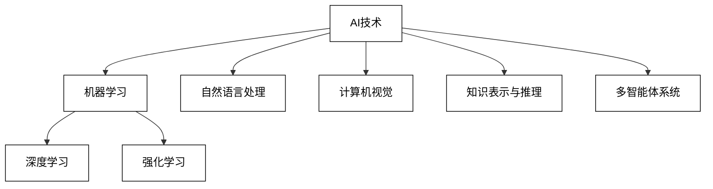
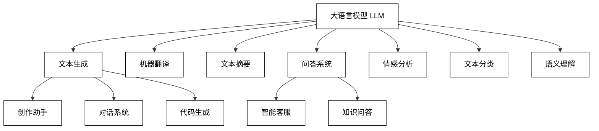
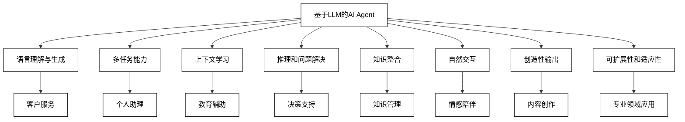
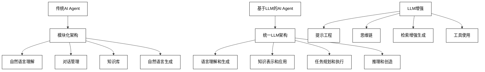
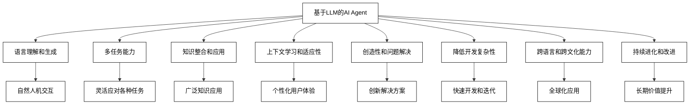
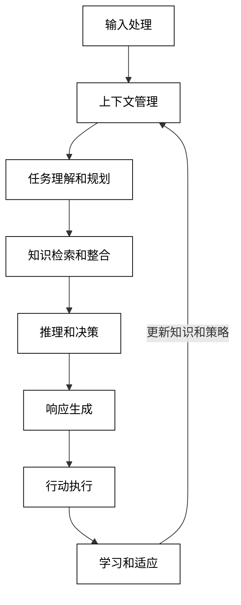
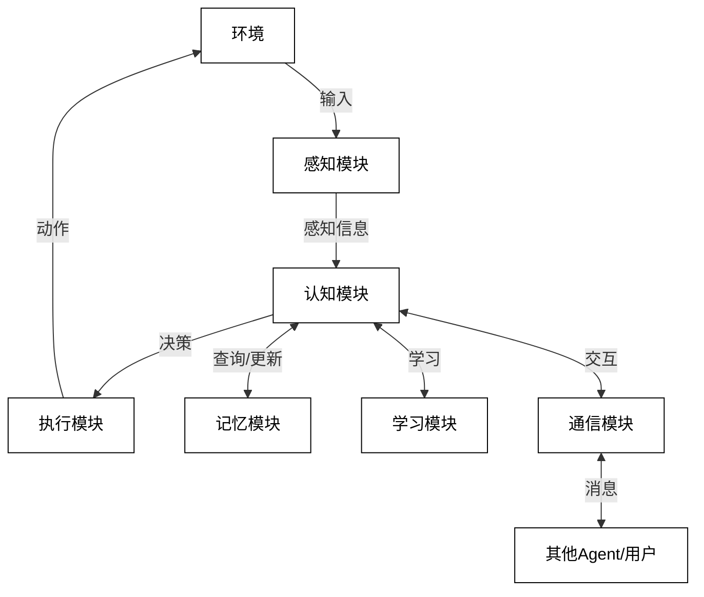
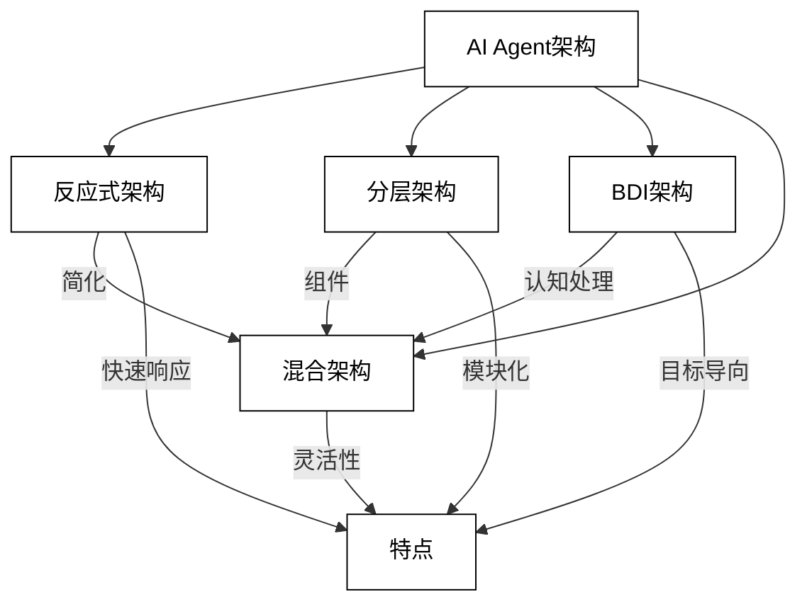
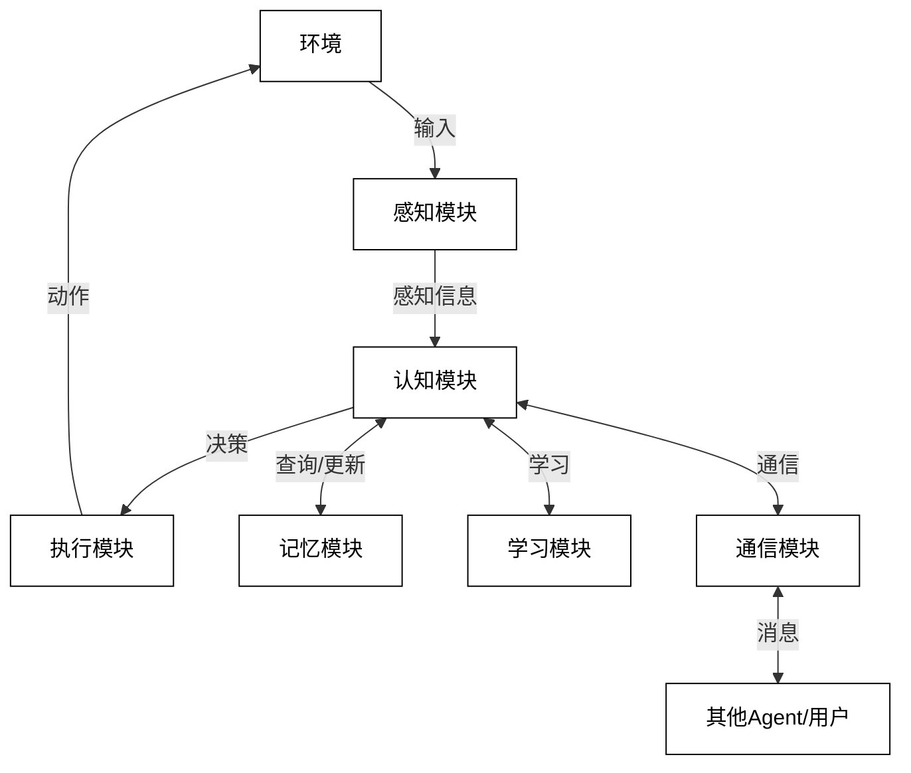
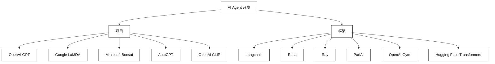

## 第2章 AI Agent核心技术

### 2.1 AI Agent的技术基础

#### 2.1.1 当前的主流AI技术

AI Agent的发展和应用离不开一系列核心AI技术的支持。这些技术为AI Agent提供了感知、学习、推理和决策的能力。以下我们将详细介绍当前主流的AI技术：

1. 机器学习（Machine Learning, ML）

机器学习是AI的核心技术之一，它使得计算机系统能够从数据中学习和改进，而无需显式编程。

主要方法：
- 监督学习：从标记数据中学习
- 无监督学习：从未标记数据中发现模式
- 半监督学习：结合标记和未标记数据
- 强化学习：通过与环境交互学习最优策略

关键算法：
- 决策树
- 支持向量机（SVM）
- k-最近邻（k-NN）
- 随机森林
- 梯度提升树（如XGBoost）

应用：
- 图像分类
- 自然语言处理
- 推荐系统
- 异常检测

2. 深度学习（Deep Learning）

深度学习是机器学习的一个子集，基于人工神经网络，能够自动学习数据的层次化表示。

主要架构：
- 卷积神经网络（CNN）
- 循环神经网络（RNN）
- 长短期记忆网络（LSTM）
- 变换器（Transformer）
- 生成对抗网络（GAN）

关键技术：
- 反向传播
- 梯度下降优化
- 批量归一化
- 注意力机制

应用：
- 计算机视觉
- 语音识别
- 自然语言处理
- 生成模型

3. 自然语言处理（Natural Language Processing, NLP）

NLP是使计算机能够理解、解释和生成人类语言的技术。

主要任务：
- 文本分类
- 命名实体识别
- 情感分析
- 机器翻译
- 问答系统
- 文本生成

关键技术：
- 词嵌入（如Word2Vec, GloVe）
- 序列到序列模型
- 注意力机制和Transformer
- BERT和GPT等预训练语言模型

应用：
- 智能客服
- 内容摘要
- 语音助手
- 自动写作

4. 计算机视觉（Computer Vision）

计算机视觉使机器能够从图像或视频中获取高层次的理解。

主要任务：
- 图像分类
- 目标检测
- 图像分割
- 人脸识别
- 姿态估计

关键技术：
- 卷积神经网络（CNN）
- 区域卷积神经网络（R-CNN系列）
- 单次检测器（SSD, YOLO）
- 生成对抗网络（GAN）

应用：
- 自动驾驶
- 医学影像分析
- 安防监控
- 增强现实

5. 强化学习（Reinforcement Learning）

强化学习是一种通过与环境交互来学习最优策略的方法。

主要方法：
- 值迭代
- 策略梯度
- Q-learning
- Actor-Critic方法

关键技术：
- 蒙特卡洛树搜索
- 深度Q网络（DQN）
- 近端策略优化（PPO）

应用：
- 游戏AI（如AlphaGo）
- 机器人控制
- 资源调度
- 自动交易系统

6. 知识表示与推理（Knowledge Representation and Reasoning）

这一领域关注如何形式化地表示知识，并基于这些知识进行推理。

主要方法：
- 逻辑推理（一阶逻辑、描述逻辑）
- 概率推理（贝叶斯网络、马尔可夫随机场）
- 模糊推理
- 案例推理

关键技术：
- 本体工程
- 知识图谱
- 语义网络
- 规则引擎

应用：
- 专家系统
- 智能问答
- 决策支持系统
- 知识管理

7. 多智能体系统（Multi-Agent Systems）

多智能体系统研究多个智能体如何协同工作以解决复杂问题。

主要概念：
- 分布式问题求解
- 协作与竞争
- 协商与共识
- 自组织系统

关键技术：
- 分布式强化学习
- 博弈论
- 拍卖机制
- 社会选择理论

应用：
- 智能交通系统
- 分布式控制系统
- 虚拟经济系统
- 群体机器人

为了更直观地展示这些AI技术之间的关系，我们可以使用以下Mermaid图：



这个图展示了主要AI技术领域及其关系，其中机器学习（特别是深度学习）作为核心技术，支撑着其他多个应用领域。

这些技术并不是相互独立的，而是紧密相连、相互促进的。例如：

- 深度学习为NLP和计算机视觉提供了强大的模型架构。
- 强化学习结合深度学习，产生了深度强化学习，在游戏AI和机器人控制等领域取得了突破性进展。
- 知识表示与推理技术与NLP结合，促进了知识图谱和语义理解的发展。
- 多智能体系统利用机器学习和强化学习技术，实现了复杂的协作行为。

这些技术的融合和发展为AI Agent提供了强大的技术支持，使得AI Agent能够在各种复杂环境中感知、学习、推理和决策。随着技术的不断进步，我们可能会看到更多创新的AI技术和应用场景的出现，进一步推动AI Agent的发展和应用。

#### 2.1.2 主流AI技术与AI Agent的关系

主流AI技术与AI Agent之间存在密切的关系，这些技术为AI Agent提供了核心能力，使其能够感知环境、学习知识、做出决策并采取行动。以下我们将详细探讨主流AI技术如何支持和影响AI Agent的发展：

1. 机器学习与AI Agent

机器学习为AI Agent提供了学习和适应能力，使其能够从经验中改进性能。

关系：
- 监督学习：用于训练Agent的感知和分类能力
- 无监督学习：帮助Agent发现数据中的隐藏模式
- 强化学习：使Agent能够通过与环境交互学习最优策略

应用示例：
- 使用监督学习训练Agent识别图像或文本
- 利用聚类算法帮助Agent对用户进行分组
- 通过强化学习优化Agent的决策策略

代码示例（使用强化学习训练Agent）：

```python
import gym
from stable_baselines3 import PPO

# 创建环境
env = gym.make("CartPole-v1")

# 初始化Agent
model = PPO("MlpPolicy", env, verbose=1)

# 训练Agent
model.learn(total_timesteps=10000)

# 使用训练好的Agent
obs = env.reset()
for _ in range(1000):
    action, _states = model.predict(obs, deterministic=True)
    obs, reward, done, info = env.step(action)
    if done:
        obs = env.reset()
```

2. 深度学习与AI Agent

深度学习为AI Agent提供了强大的表示学习能力，使其能够处理高维数据和复杂任务。

关系：
- CNN：增强Agent的视觉感知能力
- RNN和LSTM：提高Agent处理序列数据的能力
- Transformer：改进Agent的自然语言理解和生成能力

应用示例：
- 使用CNN实现Agent的图像识别功能
- 利用LSTM构建Agent的对话系统
- 基于Transformer开发Agent的语言翻译能力

代码示例（使用CNN构建图像识别Agent）：

```python
import torch
import torch.nn as nn
import torchvision.models as models

class ImageRecognitionAgent(nn.Module):
    def __init__(self, num_classes):
        super(ImageRecognitionAgent, self).__init__()
        self.resnet = models.resnet18(pretrained=True)
        self.fc = nn.Linear(self.resnet.fc.in_features, num_classes)
        self.resnet.fc = self.fc

    def forward(self, x):
        return self.resnet(x)

# 初始化Agent
agent = ImageRecognitionAgent(num_classes=10)

# 训练和使用Agent
# ... (省略训练代码)

# 使用Agent进行预测
image = torch.randn(1, 3, 224, 224)  # 模拟输入图像
prediction = agent(image)
```

3. 自然语言处理与AI Agent

NLP技术使AI Agent能够理解和生成人类语言，实现自然的人机交互。

关系：
- 文本分类：帮助Agent理解用户意图
- 命名实体识别：提取关键信息
- 情感分析：理解用户情绪
- 机器翻译：跨语言交流
- 文本生成：产生自然语言响应

应用示例：
- 构建智能客服Agent
- 开发多语言交互Agent
- 创建AI写作助手

代码示例（使用BERT构建意图分类Agent）：

```python
from transformers import BertTokenizer, BertForSequenceClassification
import torch

class IntentClassificationAgent:
    def __init__(self, model_name, num_labels):
        self.tokenizer = BertTokenizer.from_pretrained(model_name)
        self.model = BertForSequenceClassification.from_pretrained(model_name, num_labels=num_labels)

    def classify_intent(self, text):
        inputs = self.tokenizer(text, return_tensors="pt", padding=True, truncation=True)
        outputs = self.model(**inputs)
        probabilities = torch.softmax(outputs.logits, dim=1)
        return probabilities.argmax().item()

# 初始化Agent
agent = IntentClassificationAgent("bert-base-uncased", num_labels=5)

# 使用Agent
user_input = "What's the weather like today?"
intent = agent.classify_intent(user_input)
print(f"Detected intent: {intent}")
```

4. 计算机视觉与AI Agent

计算机视觉技术增强了AI Agent的视觉感知能力，使其能够理解和分析图像和视频数据。

关系：
- 图像分类：识别物体和场景
- 目标检测：定位和识别多个物体
- 图像分割：精确划分图像区域
- 人脸识别：识别和验证身份

应用示例：
- 开发视觉导航Agent
- 构建安防监控Agent
- 创建虚拟试衣Agent

代码示例（使用YOLO实现目标检测Agent）：

```python
import cv2
import numpy as np
from ultralytics import YOLO

class ObjectDetectionAgent:
    def __init__(self, model_path):
        self.model = YOLO(model_path)

    def detect_objects(self, image):
        results = self.model(image)
        return results[0].boxes.data  # 返回检测到的物体信息

# 初始化Agent
agent = ObjectDetectionAgent("yolov8n.pt")

# 使用Agent
image = cv2.imread("example.jpg")
detections = agent.detect_objects(image)

# 在图像上绘制检测结果
for det in detections:
    bbox = det[:4].int().cpu().numpy()
    cv2.rectangle(image, (bbox[0], bbox[1]), (bbox[2], bbox[3]), (0, 255, 0), 2)

cv2.imshow("Detection Result", image)
cv2.waitKey(0)
```

5. 强化学习与AI Agent

强化学习使AI Agent能够通过与环境交互来学习最优策略，特别适用于需要序列决策的任务。

关系：
- 策略学习：学习最优的行动策略
- 值函数估计：评估状态和行动的价值
- 探索与利用：平衡新知识获取和已知策略利用

应用示例：
- 开发游戏AI Agent
- 构建自主导航Agent
- 创建资源调度Agent

代码示例（使用DQN实现简单的游戏AI Agent）：

```python
import gym
import numpy as np
from tensorflow.keras.models import Sequential
from tensorflow.keras.layers import Dense
from tensorflow.keras.optimizers import Adam

class DQNAgent:
    def __init__(self, state_size, action_size):
        self.state_size = state_size
        self.action_size = action_size
        self.memory = []
        self.gamma = 0.95  # 折扣因子
        self.epsilon = 1.0  # 探索率
        self.epsilon_decay = 0.995
        self.epsilon_min = 0.01
        self.learning_rate = 0.001
        self.model = self._build_model()

    def _build_model(self):
        model = Sequential([
            Dense(24, input_dim=self.state_size, activation='relu'),
            Dense(24, activation='relu'),
            Dense(self.action_size, activation='linear')
        ])
        model.compile(loss='mse', optimizer=Adam(lr=self.learning_rate))
        return model

    def act(self, state):
        if np.random.rand() <= self.epsilon:
            return np.random.randint(self.action_size)
        act_values = self.model.predict(state)
        return np.argmax(act_values[0])

    def train(self, state, action, reward, next_state, done):
        target = reward
        if not done:
            target = reward + self.gamma * np.amax(self.model.predict(next_state)[0])
        target_f = self.model.predict(state)
        target_f[0][action] = target
        self.model.fit(state, target_f, epochs=1, verbose=0)
        if self.epsilon > self.epsilon_min:
            self.epsilon *= self.epsilon_decay

# 使用Agent
env = gym.make('CartPole-v1')
state_size = env.observation_space.shape[0]
action_size = env.action_space.n
agent = DQNAgent(state_size, action_size)

for episode in range(1000):
    state = env.reset()
    state = np.reshape(state, [1, state_size])
    for time in range(500):
        action = agent.act(state)
        next_state, reward, done, _ = env.step(action)
        next_state = np.reshape(next_state, [1, state_size])
        agent.train(state, action, reward, next_state, done)
        state = next_state
        if done:
            print(f"Episode: {episode}/{1000}, Score: {time}")
            break
```

6. 知识表示与推理和AI Agent

知识表示与推理技术为AI Agent提供了结构化知识和逻辑推理能力，使其能够处理复杂的问题和任务。

关系：
- 知识图谱：提供结构化的领域知识
- 逻辑推理：实现基于规则的决策
- 概率推理：处理不确定性

应用示例：
- 开发智能问答Agent
- 构建专家系统Agent
- 创建知识管理Agent

代码示例（使用简单的知识图谱和推理引擎）：

```python
from rdflib import Graph, Literal, RDF, URIRef
from rdflib.namespace import FOAF, XSD

class KnowledgeBaseAgent:
    def __init__(self):
        self.g = Graph()
        self.load_knowledge()

    def load_knowledge(self):
        # 加载知识
        self.g.parse(data="""
            @prefix : <http://example.org/> .
            @prefix foaf: <http://xmlns.com/foaf/0.1/> .
            
            :Alice foaf:knows :Bob .
            :Bob foaf:knows :Charlie .
            :Charlie foaf:age "30"^^xsd:integer .
        """, format="turtle")

    def query(self, question):
        if "who knows" in question:
            person = question.split("who knows")[1].strip()
            results = self.g.query(f"""
                SELECT ?knower
                WHERE {{
                    ?knower foaf:knows :{person} .
                }}
            """)
            return [str(row.knower).split("/")[-1] for row in results]
        elif "age of" in question:
            person = question.split("age of")[1].strip()
            results = self.g.query(f"""
                SELECT ?age
                WHERE {{
                    :{person} foaf:age ?age .
                }}
            """)
            return [str(row.age) for row in results]
        else:
            return ["I don't understand the question."]

# 使用Agent
agent = KnowledgeBaseAgent()
print(agent.query("who knows Bob"))
print(agent.query("what is the age of Charlie"))
```

7. 多智能体系统与AI Agent

多智能体系统技术使得多个AI Agent能够协同工作，解决复杂的分布式问题。

关系：
- 协作学习：Agents共同学习和改进
- 任务分配：优化Agents间的任务分配
- 协商机制：实现Agents间的冲突解决

应用示例：
- 开发分布式控制系统
- 构建智能交通管理系统
- 创建虚拟经济模拟系统

代码示例（简单的多Agent协作系统）：

```python
import random

class ResourceAgent:
    def __init__(self, resource_id, capacity):
        self.id = resource_id
        self.capacity = capacity
        self.allocated = 0

    def can_allocate(self, amount):
        return self.allocated + amount <= self.capacity

    def allocate(self, amount):
        if self.can_allocate(amount):
            self.allocated += amount
            return True
        return False

class TaskAgent:
    def __init__(self, task_id, resource_need):
        self.id = task_id
        self.resource_need = resource_need
        self.allocated = False

    def try_allocate(self, resources):
        for resource in resources:
            if resource.can_allocate(self.resource_need):
                if resource.allocate(self.resource_need):
                    self.allocated = True
                    return True
        return False

class MultiAgentSystem:
    def __init__(self, num_resources, num_tasks):
        self.resources = [ResourceAgent(i, random.randint(50, 100)) for i in range(num_resources)]
        self.tasks = [TaskAgent(i, random.randint(10, 30)) for i in range(num_tasks)]

    def run_allocation(self):
        for task in self.tasks:
            if task.try_allocate(self.resources):
                print(f"Task {task.id} allocated successfully")
            else:
                print(f"Task {task.id} failed to allocate")

        print("\nResource allocation status:")
        for resource in self.resources:
            print(f"Resource {resource.id}: {resource.allocated}/{resource.capacity}")

# 使用多Agent系统
system = MultiAgentSystem(5, 10)
system.run_allocation()
```

这些示例展示了主流AI技术如何为AI Agent提供核心能力。在实际应用中，这些技术often会被结合使用，以创建更强大、更灵活的AI Agent系统。随着技术的不断进步，我们可能会看到更多创新的AI技术融合，进一步推动AI Agent的发展和应用。

### 2.2 基于LLM的AI Agent形态与特点

#### 2.2.1 从LLM说起

大语言模型（Large Language Models, LLMs）是近年来自然语言处理领域最重要的技术突破之一，它为AI Agent的发展带来了革命性的变化。要理解基于LLM的AI Agent，我们首先需要深入了解LLM本身。

1. LLM的定义

大语言模型是一种基于深度学习的自然语言处理模型，通常具有数十亿到数千亿个参数。这些模型通过在海量文本数据上进行预训练，学习到了语言的统计规律和丰富的知识。

2. LLM的关键特征

- 规模：参数数量巨大，通常在数十亿到数千亿级别。
- 自监督学习：主要通过预测下一个词的任务进行训练。
- 上下文学习：能够理解和利用长文本上下文。
- 少样本学习：能够通过少量示例快速适应新任务。
- 多任务能力：可以执行多种NLP任务，如翻译、摘要、问答等。

3. LLM的工作原理

LLM的核心是Transformer架构，特别是其中的自注意力机制。以GPT（Generative Pre-trained Transformer）系列为例，其工作原理可以简化为以下步骤：

```python
import torch
import torch.nn as nn

class SimplifiedGPT(nn.Module):
    def __init__(self, vocab_size, d_model, nhead, num_layers):
        super(SimplifiedGPT, self).__init__()
        self.embedding = nn.Embedding(vocab_size, d_model)
        self.transformer = nn.TransformerEncoder(
            nn.TransformerEncoderLayer(d_model, nhead),
            num_layers
        )
        self.fc = nn.Linear(d_model, vocab_size)

    def forward(self, x):
        x = self.embedding(x)
        x = self.transformer(x)
        x = self.fc(x)
        return x

# 初始化模型
model = SimplifiedGPT(vocab_size=50000, d_model=512, nhead=8, num_layers=6)

# 模拟输入
input_ids = torch.randint(0, 50000, (1, 100))  # 批次大小为1，序列长度为100
output = model(input_ids)

# output的形状为 (1, 100, 50000)，表示每个位置上所有词的概率分布
```

这个简化的例子展示了LLM的基本结构：输入经过词嵌入层，然后通过多层Transformer编码器处理，最后通过一个全连接层产生输出。

4. LLM的训练过程

LLM的训练通常分为两个阶段：

a. 预训练：
- 目标：预测下一个词或恢复被遮蔽的词。
- 数据：大规模、多样化的文本语料。
- 方法：自监督学习，无需人工标注。

b. 微调：
- 目标：适应特定任务或领域。
- 数据：针对特定任务的标注数据。
- 方法：有监督学习或少样本学习。

5. LLM的主要类型

a. 自回归模型（如GPT系列）：
- 特点：单向上下文，适合生成任务。
- 代表：GPT-3, GPT-4

b. 编码器-解码器模型（如T5）：
- 特点：双向上下文，适合各种NLP任务。
- 代表：T5, BART

c. 掩码语言模型（如BERT）：
- 特点：双向上下文，适合理解任务。
- 代表：BERT, RoBERTa

6. LLM的应用领域

- 文本生成：创作、对话、代码生成
- 机器翻译：跨语言交流
- 文本摘要：自动提取关键信息
- 问答系统：智能客服、知识问答
- 情感分析：理解文本情感倾向
- 文本分类：自动分类文档
- 语义理解：捕捉深层语义

7. LLM的局限性

- 计算资源需求大：训练和推理都需要大量计算资源。
- 偏见问题：可能继承训练数据中的偏见。
- 幻觉问题：有时会生成虚假或不一致的信息。
- 解释性差：难以解释模型的决策过程。
- 隐私concerns：可能泄露训练数据中的敏感信息。

8. LLM的发展趋势

- 规模更大：探索更大规模模型的潜力。
- 效率提升：研究更高效的训练和推理方法。
- 多模态集成：结合文本、图像、音频等多种模态。
- 持续学习：实现在线学习和适应能力。
- 可解释性：提高模型决策的透明度。
- 伦理和安全：解决偏见、隐私等问题。

为了更直观地理解LLM在NLP任务中的应用，我们可以使用以下Mermaid图：



这个图展示了LLM在各种NLP任务中的应用，突显了其versatility和广泛影响。

LLM的出现为AI Agent带来了革命性的变化。它们为Agent提供了强大的语言理解和生成能力，使Agent能够更自然地与人类交互，理解复杂的指令，并执行多样化的任务。基于LLM的AI Agent不仅可以处理传统的NLP任务，还可以执行推理、问题解决，甚至创造性工作。

然而，将LLM集成到AI Agent中也带来了新的挑战，如如何有效管理Agent的行为，如何确保Agent的输出准确可靠，以及如何处理伦理和安全问题。这些挑战正推动着研究者和开发者探索新的方法和技术，以充分发挥LLM的潜力，同时确保AI Agent的可控性和可靠性。

#### 2.2.2 基于LLM的AI Agent的特点

基于大语言模型（LLM）的AI Agent代表了AI技术的最新发展，它们具有一系列独特的特点，这些特点使其在许多应用场景中表现出色。以下我们将详细探讨基于LLM的AI Agent的主要特点：

1. 强大的语言理解和生成能力

基于LLM的AI Agent能够理解和生成自然、流畅的人类语言，这大大提高了人机交互的质量。

特点：
- 上下文理解：能够捕捉长文本中的上下文信息。
- 多语言支持：可以处理多种语言，甚至进行跨语言交互。
- 语义理解：能够理解深层语义，而不仅仅是表面文字。

代码示例（使用GPT-3进行对话）：

```python
import openai

openai.api_key = 'your-api-key'

def chat_with_gpt(prompt):
    response = openai.Completion.create(
        engine="text-davinci-002",
        prompt=prompt,
        max_tokens=150
    )
    return response.choices[0].text.strip()

conversation = [
    "Human: Hello, can you help me with a math problem?",
    "AI: Of course! I'd be happy to help you with a math problem. What's the question?",
    "Human: What's the square root of 144?",
]

prompt = "\n".join(conversation) + "\nAI:"
response = chat_with_gpt(prompt)
print("AI:", response)
```

2. 多任务能力

基于LLM的AI Agent可以执行多种不同类型的任务，无需为每个任务专门训练模型。

特点：
- 任务适应性：可以快速适应新任务，只需少量示例或清晰的指令。
- 零样本学习：在某些情况下，甚至不需要示例就能执行新任务。
- 任务组合：能够组合多个子任务来完成复杂任务。

代码示例（使用GPT-3执行多种任务）：

```python
def multi_task_agent(task, input_text):
    prompt = f"Task: {task}\nInput: {input_text}\nOutput:"
    response = openai.Completion.create(
        engine="text-davinci-002",
        prompt=prompt,
        max_tokens=100
    )
    return response.choices[0].text.strip()

# 执行不同任务
print(multi_task_agent("Summarize", "AI is transforming various industries..."))
print(multi_task_agent("Translate to French", "Hello, how are you?"))
print(multi_task_agent("Sentiment analysis", "I love this product!"))
```

3. 上下文学习能力

基于LLM的AI Agent能够从对话或任务上下文中学习，并将这些信息应用到后续交互中。

特点：
- 记忆保持：能够在长对话中保持上下文一致性。
- 动态适应：根据用户的反馈和偏好调整行为。
- 知识积累：在交互过程中积累和应用新知识。

代码示例（使用GPT-3实现上下文对话）：

```python
def contextual_chat(conversation):
    prompt = "\n".join(conversation) + "\nAI:"
    response = openai.Completion.create(
        engine="text-davinci-002",
        prompt=prompt,
        max_tokens=150
    )
    return response.choices[0].text.strip()

conversation = [
    "Human: My name is Alice.",
    "AI: Hello Alice! It's nice to meet you. How can I assist you today?",
    "Human: What's my name?",
]

response = contextual_chat(conversation)
print("AI:", response)
```

4. 推理和问题解决能力

基于LLM的AI Agent不仅能处理语言任务，还能进行逻辑推理和复杂问题解决。

特点：
- 逻辑推理：能够基于给定信息进行推理。
- 创造性问题解决：可以提出创新的解决方案。
- 多步骤规划：能够分解复杂问题并制定解决步骤。

代码示例（使用GPT-3进行推理）：

```python
def reasoning_agent(problem):
    prompt = f"Problem: {problem}\nLet's approach this step-by-step:\n1)"
    response = openai.Completion.create(
        engine="text-davinci-002",
        prompt=prompt,
        max_tokens=200
    )
    return response.choices[0].text.strip()

problem = "If a train travels 120 km in 2 hours, what is its average speed?"
solution = reasoning_agent(problem)
print(solution)
```

5. 知识整合能力

基于LLM的AI Agent能够整合和应用大量的知识，这些知识来自其预训练数据。

特点：
- 广泛的知识覆盖：涵盖多个领域的知识。
- 知识关联：能够建立不同知识点之间的联系。
- 知识应用：将抽象知识应用到具体问题中。

代码示例（使用GPT-3进行知识问答）：

```python
def knowledge_qa(question):
    prompt = f"Q: {question}\nA:"
    response = openai.Completion.create(
        engine="text-davinci-002",
        prompt=prompt,
        max_tokens=100
    )
    return response.choices[0].text.strip()

questions = [
    "Who wrote 'Romeo and Juliet'?",
    "What is the capital of France?",
    "How does photosynthesis work?"
]

for q in questions:
    print(f"Q: {q}")
    print(f"A: {knowledge_qa(q)}\n")
```

6. 自然交互能力

基于LLM的AI Agent能够进行自然、流畅的对话，理解上下文和隐含意图。

特点：
- 语言多样性：能够理解和使用俚语、幽默、反讽等。
- 情感理解：能够识别和回应用户的情感状态。
- 个性化交互：可以根据用户特征调整交互风格。

代码示例（使用GPT-3实现个性化对话）：

```python
def personalized_chat(user_profile, message):
    prompt = f"User profile: {user_profile}\nUser: {message}\nAI:"
    response = openai.Completion.create(
        engine="text-davinci-002",
        prompt=prompt,
        max_tokens=150
    )
    return response.choices[0].text.strip()

user_profile = "Name: John, Age: 25, Interests: technology, gaming"
message = "Can you recommend a new game for me?"

response = personalized_chat(user_profile, message)
print("AI:", response)
```

7. 创造性输出

基于LLM的AI Agent能够生成创造性的内容，如故事、诗歌、代码等。

特点：
- 内容生成：能够创作各种类型的文本内容。
- 风格模仿：可以模仿特定的写作风格或文学流派。
- 创意结合：能够将不同概念创造性地结合。

代码示例（使用GPT-3生成创意内容）：

```python
def creative_writing(prompt):
    response = openai.Completion.create(
        engine="text-davinci-002",
        prompt=prompt,
        max_tokens=200,
        temperature=0.8
    )
    return response.choices[0].text.strip()

writing_prompt = "Write a short story about a robot learning to paint:"
story = creative_writing(writing_prompt)
print(story)
```

8. 可扩展性和适应性

基于LLM的AI Agent可以通过微调或提示工程来适应特定领域或任务。

特点：
- 领域适应：通过微调可以适应特定领域的语言和知识。
- 任务定制：可以通过精心设计的提示来执行特定任务。
- 持续学习：能够通过持续交互来改进性能。

代码示例（使用GPT-3进行特定领域的对话）：

```python
def domain_specific_chat(domain, query):
    prompt = f"You are an AI assistant specialized in {domain}.\nUser: {query}\nAI:"
    response = openai.Completion.create(
        engine="text-davinci-002",
        prompt=prompt,
        max_tokens=150
    )
    return response.choices[0].text.strip()

domain = "quantum physics"
query = "Can you explain the concept of quantum entanglement?"

response = domain_specific_chat(domain, query)
print("AI:", response)
```

这些特点使得基于LLM的AI Agent在各种应用场景中表现出色，从客户服务到创意写作，从教育辅助到科研支持。然而，这些Agent也面临一些挑战，如：

1. 计算资源需求：运行大型LLM需要大量计算资源。
2. 偏见和公平性：LLM可能继承训练数据中的偏见。
3. 事实准确性：LLM有时会生成不准确或虚构的信息。
4. 隐私问题：处理敏感信息时可能存在隐私风险。
5. 控制和安全：确保Agent行为符合预期和伦理标准。

为了更好地理解基于LLM的AI Agent的特点及其应用，我们可以使用以下Mermaid图：



这个图展示了基于LLM的AI Agent的主要特点及其对应的典型应用场景。这些特点使得基于LLM的AI Agent能够在各种复杂任务中表现出色，为人工智能应用开辟了新的可能性。

然而，要充分发挥基于LLM的AI Agent的潜力，还需要解决一些关键挑战：

1. 提高推理能力：
   虽然LLM展现了强大的语言能力，但在复杂逻辑推理方面仍有提升空间。研究者正在探索将符号推理与神经网络结合的方法。

2. 增强记忆和学习能力：
   当前的LLM主要依赖于预训练知识，缺乏长期记忆和持续学习能力。开发能够动态更新知识的架构是一个重要方向。

3. 提高可控性和安全性：
   确保AI Agent的行为符合预期和伦理标准至关重要。这包括开发更好的控制机制和安全guardrails。

4. 优化资源效率：
   降低LLM的计算资源需求，开发更高效的训练和推理方法是实现广泛应用的关键。

5. 增强多模态能力：
   将LLM与视觉、听觉等其他模态结合，开发真正的多模态AI Agent是未来的重要方向。

6. 改善可解释性：
   提高模型决策过程的透明度和可解释性，有助于增加用户信任和支持更复杂的应用。

7. 处理偏见和公平性：
   开发方法来检测和缓解模型中的偏见，确保AI Agent在各种应用中的公平性。

8. 增强特定领域知识：
   虽然LLM具有广泛的知识，但在特定专业领域可能需要更深入的知识。开发有效的领域适应方法很重要。

为了应对这些挑战，研究者和开发者正在探索多种方法：

1. 混合架构：
   结合神经网络和符号AI的优势，如神经符号AI系统。

```python
class HybridAISystem:
    def __init__(self, llm, knowledge_base):
        self.llm = llm
        self.knowledge_base = knowledge_base

    def process(self, query):
        # 使用LLM生成初步回答
        initial_response = self.llm.generate(query)
        
        # 使用知识库进行事实检查和推理
        verified_response = self.knowledge_base.verify_and_enhance(initial_response)
        
        return verified_response
```

2. 持续学习框架：
   开发能够从交互中学习并更新知识的系统。

```python
class ContinualLearningAgent:
    def __init__(self, model, memory):
        self.model = model
        self.memory = memory

    def interact(self, input_data):
        response = self.model.generate(input_data)
        self.memory.store(input_data, response)
        return response

    def update(self):
        new_data = self.memory.retrieve_recent()
        self.model.fine_tune(new_data)
```

3. 安全性增强技术：
   实现更强大的内容过滤和行为约束机制。

```python
class SafetyEnhancedAgent:
    def __init__(self, base_model, safety_filter):
        self.base_model = base_model
        self.safety_filter = safety_filter

    def generate_response(self, input_text):
        initial_response = self.base_model.generate(input_text)
        safe_response = self.safety_filter.process(initial_response)
        return safe_response
```

4. 模型压缩和优化：
   开发更高效的模型架构和训练方法。

```python
def knowledge_distillation(teacher_model, student_model, data_loader):
    for batch in data_loader:
        teacher_output = teacher_model(batch)
        student_output = student_model(batch)
        loss = kl_divergence(teacher_output, student_output)
        student_model.optimize(loss)
```

5. 多模态集成：
   开发能够处理和生成多种模态数据的统一框架。

```python
class MultimodalAgent:
    def __init__(self, text_model, image_model, audio_model):
        self.text_model = text_model
        self.image_model = image_model
        self.audio_model = audio_model

    def process_multimodal_input(self, text, image, audio):
        text_features = self.text_model.encode(text)
        image_features = self.image_model.encode(image)
        audio_features = self.audio_model.encode(audio)
        
        combined_features = self.fusion_layer([text_features, image_features, audio_features])
        return self.decision_layer(combined_features)
```

6. 可解释性增强：
   开发能够提供决策解释的模型和方法。

```python
class ExplainableAgent:
    def __init__(self, model, explainer):
        self.model = model
        self.explainer = explainer

    def predict_and_explain(self, input_data):
        prediction = self.model.predict(input_data)
        explanation = self.explainer.explain(self.model, input_data)
        return prediction, explanation
```

这些方法和技术的发展将推动基于LLM的AI Agent向更智能、更可靠、更有用的方向发展。未来的AI Agent可能将具备更强的推理能力、更好的知识整合和应用能力、更自然的交互方式，以及更高的可信度和安全性。

随着这些技术的成熟，我们可能会看到AI Agent在更广泛的领域发挥作用，如：

1. 高级决策支持系统：在复杂的商业、医疗、法律等领域提供专业建议。
2. 个性化教育助手：根据学生的个体需求提供定制化的学习支持。
3. 创意合作伙伴：在艺术创作、科学研究等领域与人类合作，激发创新。
4. 智能环境管理：优化城市规划、资源分配和环境保护策略。
5. 高级情感陪伴：提供更深入、更有同理心的心理支持和陪伴。

总的来说，基于LLM的AI Agent代表了AI技术的一个重要发展方向。它们的特点和潜力正在重塑我们与技术交互的方式，并有可能在解决复杂问题、推动创新和改善生活质量方面发挥重要作用。然而，实现这一潜力还需要克服诸多技术和伦理挑战，这将是未来AI研究和应用的重要焦点。

#### 2.2.3 LLM成为AI Agent的全新大脑

大语言模型（LLM）的出现和快速发展为AI Agent提供了一个全新的"大脑"，这种转变不仅提升了AI Agent的能力，也改变了我们设计和实现AI系统的方式。本节将深入探讨LLM如何成为AI Agent的新型大脑，以及这一转变带来的影响和机遇。

1. LLM作为AI Agent大脑的核心特性

a. 通用知识表示：
LLM通过预训练获得了广泛的知识表示，使AI Agent能够处理各种领域的任务。

b. 上下文理解：
LLM能够理解长文本的上下文，使AI Agent能够进行更自然的对话和任务处理。

c. 少样本学习：
LLM的少样本学习能力使AI Agent能够快速适应新任务，无需大量标注数据。

d. 多任务处理：
单个LLM可以执行多种NLP任务，使AI Agent具备多功能性。

2. LLM改变AI Agent架构

传统的AI Agent架构通常包含多个独立的模块，如自然语言理解、对话管理、知识库等。LLM的引入使得这些功能可以集成到一个统一的模型中。

```python
class TraditionalAgent:
    def __init__(self):
        self.nlu = NaturalLanguageUnderstanding()
        self.dm = DialogueManager()
        self.kb = KnowledgeBase()
        self.nlg = NaturalLanguageGeneration()

    def process(self, user_input):
        intent = self.nlu.understand(user_input)
        context = self.dm.update_context(intent)
        response = self.kb.query(context)
        return self.nlg.generate(response)

class LLMBasedAgent:
    def __init__(self, llm):
        self.llm = llm

    def process(self, user_input):
        prompt = f"User: {user_input}\nAI:"
        return self.llm.generate(prompt)
```

3. LLM增强AI Agent的能力

a. 语言理解和生成：
LLM大大提高了AI Agent的语言处理能力，使其能够理解和生成更自然、更复杂的语言。

b. 知识应用：
LLM使AI Agent能够灵活应用其预训练知识，回答开放域问题。

c. 推理能力：
虽然仍有改进空间，但LLM为AI Agent提供了基本的推理能力。

d. 创造性：
LLM使AI Agent能够生成创造性内容，如故事、诗歌、代码等。

4. LLM带来的新挑战

a. 控制和引导：
如何有效控制和引导基于LLM的AI Agent的行为成为一个重要问题。

b. 事实准确性：
LLM可能生成虚假信息，需要额外的机制来确保输出的准确性。

c. 计算资源：
运行大型LLM需要大量计算资源，这可能限制其在某些场景下的应用。

d. 隐私和安全：
LLM可能无意中泄露训练数据中的敏感信息，需要特别注意数据安全。

5. 适应LLM的新型AI Agent设计模式

a. 提示工程（Prompt Engineering）：
精心设计提示以引导LLM的行为成为一种关键技能。

```python
class PromptEngineeringAgent:
    def __init__(self, llm):
        self.llm = llm

    def generate_response(self, user_input, task):
        prompt = self.create_prompt(user_input, task)
        return self.llm.generate(prompt)

    def create_prompt(self, user_input, task):
        prompts = {
            "summarize": f"Summarize the following text:\n{user_input}\nSummary:",
            "translate": f"Translate the following text to French:\n{user_input}\nTranslation:",
            "analyze": f"Analyze the sentiment of the following text:\n{user_input}\nSentiment:"
        }
        return prompts.get(task, f"User: {user_input}\nAI:")
```

b. 思维链（Chain of Thought）：
通过引导LLM展示其推理过程来提高复杂任务的性能。

```python
class ChainOfThoughtAgent:
    def __init__(self, llm):
        self.llm = llm

    def solve_problem(self, problem):
        prompt = f"Problem: {problem}\nLet's approach this step-by-step:\n1)"
        solution = self.llm.generate(prompt)
        return f"Problem: {problem}\nSolution:\n{solution}"
```

c. 检索增强生成（Retrieval-Augmented Generation）：
结合外部知识库来增强LLM的准确性和知识覆盖范围。

```python
class RetrievalAugmentedAgent:
    def __init__(self, llm, knowledge_base):
        self.llm = llm
        self.kb = knowledge_base

    def answer_question(self, question):
        relevant_info = self.kb.retrieve(question)
        prompt = f"Question: {question}\nRelevant information: {relevant_info}\nAnswer:"
        return self.llm.generate(prompt)
```

d. 工具使用（Tool Use）：
教会LLM使用外部工具来扩展其能力。

```python
class ToolUsingAgent:
    def __init__(self, llm, tools):
        self.llm = llm
        self.tools = tools

    def execute_task(self, task):
        prompt = f"Task: {task}\nAvailable tools: {list(self.tools.keys())}\nThought process:"
        plan = self.llm.generate(prompt)
        for step in plan.split('\n'):
            if step.startswith("Use tool:"):
                tool_name = step.split(":")[1].strip()
                result = self.tools[tool_name]()
                prompt += f"\nTool result: {result}\nNext step:"
                plan += self.llm.generate(prompt)
        return plan
```

6. LLM驱动的AI Agent应用场景

a. 智能客服：
LLM使AI Agent能够理解复杂的客户查询，提供更准确、更有帮助的回答。

b. 个人助理：
基于LLM的AI Agent可以执行各种任务，从日程管理到信息检索。

c. 教育辅助：
LLM可以为学生提供个性化的解释和辅导，适应不同的学习风格。

d. 创意写作：
AI Agent可以协助人类进行创意写作，提供灵感和建议。

e. 代码生成：
LLM可以理解自然语言描述并生成相应的代码，辅助软件开发。

7. 未来展望

随着LLM技术的不断进步，我们可以预见基于LLM的AI Agent将在以下方面继续发展：

a. 多模态集成：
结合视觉、听觉等其他模态，创造更全面的AI Agent。

b. 持续学习：
开发能够从交互中学习和更新知识的LLM系统。

c. 个性化定制：
为不同用户和场景定制LLM的行为和知识。

d. 伦理和安全增强：
开发更可靠、更安全的LLM系统，确保AI Agent的行为符合道德和法律标准。

e. 推理能力增强：
结合符号推理和神经网络，提高LLM的逻辑推理能力。

f. 效率优化：
开发更高效的LLM架构和训练方法，降低计算资源需求。

为了更好地理解LLM如何成为AI Agent的新型大脑，我们可以使用以下Mermaid图来展示这种转变：



这个图展示了从传统模块化AI Agent架构到基于LLM的统一架构的转变，以及LLM带来的各种增强技术。

结论：

LLM作为AI Agent的新型大脑，代表了人工智能领域的一个重要里程碑。它不仅大幅提升了AI Agent的语言处理能力，还为创建更灵活、更智能的AI系统开辟了新的可能性。通过统一的架构，LLM简化了AI Agent的设计和实现过程，同时也带来了新的挑战和研究方向。

随着LLM技术的不断进步和新型AI Agent设计模式的发展，我们可以期待看到更多创新的应用和突破。这些进展将进一步推动AI技术在各个领域的应用，从而对社会、经济和科技发展产生深远的影响。

然而，我们也需要认识到，尽管LLM为AI Agent提供了强大的能力，但它并不是万能的。在实际应用中，我们仍然需要根据具体任务和场景的需求，选择合适的技术和方法。有时，这可能意味着将LLM与其他AI技术（如计算机视觉、强化学习等）结合，或者与传统的符号AI方法融合，以创建更全面、更强大的AI系统。

此外，随着基于LLM的AI Agent在各个领域的广泛应用，我们还需要密切关注和解决相关的伦理、隐私和安全问题。确保这些强大的AI系统被负责任地开发和使用，将是技术发展过程中的一个重要课题。

总之，LLM成为AI Agent的新型大脑，标志着AI技术进入了一个新的发展阶段。这一转变不仅改变了我们设计和实现AI系统的方式，也为解决复杂问题和创造新价值提供了强大的工具。未来，随着技术的不断进步和应用的深入，我们有理由期待基于LLM的AI Agent将在推动科技创新、提高生产效率和改善人类生活质量方面发挥越来越重要的作用。

#### 2.2.4 为什么需要基于LLM的AI Agent

基于大语言模型（LLM）的AI Agent代表了人工智能技术的一个重要发展方向，它们在多个方面展现出了显著的优势，这也解释了为什么我们需要这种新型的AI Agent。以下我们将详细探讨基于LLM的AI Agent的必要性和优势：

1. 语言理解和生成能力的质的飞跃

基于LLM的AI Agent在语言处理方面展现出前所未有的能力，这是其最显著的优势之一。

优势：
- 更自然的人机交互
- 理解复杂的语言表达和上下文
- 生成流畅、连贯的回应

实例代码：

```python
import openai

def natural_language_interaction(user_input):
    response = openai.Completion.create(
        engine="text-davinci-002",
        prompt=f"Human: {user_input}\nAI:",
        max_tokens=150
    )
    return response.choices[0].text.strip()

# 使用示例
user_query = "Can you explain quantum entanglement in simple terms?"
ai_response = natural_language_interaction(user_query)
print(ai_response)
```

2. 多任务能力和灵活性

基于LLM的AI Agent能够处理多种不同类型的任务，无需为每个任务专门训练模型。

优势：
- 单一模型支持多种功能
- 快速适应新任务
- 降低开发和维护成本

实例代码：

```python
def multi_task_agent(task, input_text):
    prompt = f"Task: {task}\nInput: {input_text}\nOutput:"
    response = openai.Completion.create(
        engine="text-davinci-002",
        prompt=prompt,
        max_tokens=100
    )
    return response.choices[0].text.strip()

# 使用示例
print(multi_task_agent("Summarize", "AI is transforming various industries..."))
print(multi_task_agent("Translate to French", "Hello, how are you?"))
print(multi_task_agent("Sentiment analysis", "I love this product!"))
```

3. 知识整合和应用

LLM在预训练过程中学习了大量的知识，使AI Agent能够应用这些知识来解决问题和回答问题。

优势：
- 广泛的知识覆盖
- 知识的灵活应用
- 减少对专门知识库的依赖

实例代码：

```python
def knowledge_query(question):
    prompt = f"Q: {question}\nA:"
    response = openai.Completion.create(
        engine="text-davinci-002",
        prompt=prompt,
        max_tokens=100
    )
    return response.choices[0].text.strip()

# 使用示例
print(knowledge_query("What are the main causes of climate change?"))
print(knowledge_query("Who wrote 'To Kill a Mockingbird'?"))
```

4. 上下文学习和适应性

基于LLM的AI Agent能够从对话或任务上下文中学习，并将这些信息应用到后续交互中。

优势：
- 持续的对话理解
- 个性化交互
- 动态适应用户需求

实例代码：

```python
class ContextualAgent:
    def __init__(self):
        self.conversation_history = []

    def chat(self, user_input):
        self.conversation_history.append(f"Human: {user_input}")
        prompt = "\n".join(self.conversation_history) + "\nAI:"
        response = openai.Completion.create(
            engine="text-davinci-002",
            prompt=prompt,
            max_tokens=150
        )
        ai_response = response.choices[0].text.strip()
        self.conversation_history.append(f"AI: {ai_response}")
        return ai_response

# 使用示例
agent = ContextualAgent()
print(agent.chat("My name is Alice."))
print(agent.chat("What's my name?"))
```

5. 创造性和问题解决能力

LLM展现出了一定的创造性思维和问题解决能力，这使AI Agent能够处理更复杂、更开放的任务。

优势：
- 生成创意内容
- 提供新颖的解决方案
- 辅助创新和头脑风暴

实例代码：

```python
def creative_problem_solving(problem):
    prompt = f"Problem: {problem}\nLet's think creatively to solve this problem:\n1."
    response = openai.Completion.create(
        engine="text-davinci-002",
        prompt=prompt,
        max_tokens=200
    )
    return response.choices[0].text.strip()

# 使用示例
print(creative_problem_solving("How can we reduce plastic waste in oceans?"))
```

6. 降低开发复杂性

基于LLM的AI Agent简化了AI系统的开发过程，减少了对复杂的规则设计和特征工程的需求。

优势：
- 快速原型开发
- 减少领域专家依赖
- 易于迭代和改进

实例代码：

```python
def quick_prototype_agent(description):
    prompt = f"Create a Python function based on this description:\n{description}\n\nPython code:"
    response = openai.Completion.create(
        engine="text-davinci-002",
        prompt=prompt,
        max_tokens=200
    )
    return response.choices[0].text.strip()

# 使用示例
function_description = "A function that calculates the Fibonacci sequence up to n terms"
print(quick_prototype_agent(function_description))
```

7. 跨语言和跨文化能力

LLM通常训练了多种语言的数据，使AI Agent能够处理多语言任务和跨文化交流。

优势：
- 支持多语言交互
- 跨语言信息检索和翻译
- 文化敏感的交流

实例代码：

```python
def multilingual_agent(text, source_lang, target_lang):
    prompt = f"Translate the following {source_lang} text to {target_lang}:\n{text}\n\nTranslation:"
    response = openai.Completion.create(
        engine="text-davinci-002",
        prompt=prompt,
        max_tokens=100
    )
    return response.choices[0].text.strip()

# 使用示例
print(multilingual_agent("Hello, how are you?", "English", "French"))
print(multilingual_agent("Bonjour, comment allez-vous?", "French", "Japanese"))
```

8. 持续进化和改进

LLM技术正在快速发展，这意味着基于LLM的AI Agent可以通过简单的模型更新来获得新能力。

优势：
- 易于升级
- 持续获得新功能
- 性能不断提升

为了更好地理解为什么我们需要基于LLM的AI Agent，我们可以使用以下Mermaid图来展示其优势：



这个图展示了基于LLM的AI Agent的主要优势及其带来的价值。

结论：

基于LLM的AI Agent代表了AI技术的一个重要发展方向，它们在语言处理、多任务能力、知识应用、创造性思维等方面展现出了显著的优势。这些优势使得基于LLM的AI Agent能够更好地满足复杂、动态的应用需求，为用户提供更自然、更智能的交互体验。

同时，基于LLM的AI Agent也简化了AI系统的开发过程，降低了开发成本和门槛，使得更多的开发者和企业能够快速构建和部署AI应用。这种开发模式的转变有望加速AI技术的普及和创新。

然而，我们也需要认识到，基于LLM的AI Agent并非万能的。它们仍然面临着一些挑战，如计算资源需求、模型偏见、事实准确性等问题。在实际应用中，我们需要根据具体需求和场景，权衡使用基于LLM的AI Agent的优势和潜在风险。

总的来说，基于LLM的AI Agent为我们提供了一种强大而灵活的工具，有潜力在多个领域带来变革性的影响。随着技术的不断进步和应用实践的深入，我们有理由期待这种新型AI Agent将在推动技术创新、提高生产效率和改善人类生活质量方面发挥越来越重要的作用。

#### 2.2.5 AI Agent如何工作

基于大语言模型（LLM）的AI Agent的工作原理涉及多个关键步骤和技术。理解这些工作机制对于有效开发和应用AI Agent至关重要。以下我们将详细探讨AI Agent的工作流程、核心技术和实现方法：

1. 输入处理

AI Agent首先需要处理来自用户或环境的输入。这可能是文本、语音、图像或其他形式的数据。

关键技术：
- 自然语言处理（NLP）
- 语音识别
- 计算机视觉

示例代码（文本输入处理）：

```python
def preprocess_input(text):
    # 简单的预处理：转小写，去除多余空格
    return ' '.join(text.lower().split())

user_input = "  Hello,  How are you?  "
processed_input = preprocess_input(user_input)
print(processed_input)  # 输出: "hello, how are you?"
```

2. 上下文管理

AI Agent需要维护对话或任务的上下文，以提供连贯的交互体验。

关键技术：
- 上下文编码
- 记忆机制示例代码（简单的上下文管理）：

```python
class ContextManager:
    def __init__(self, max_history=5):
        self.conversation_history = []
        self.max_history = max_history

    def add_to_context(self, message):
        self.conversation_history.append(message)
        if len(self.conversation_history) > self.max_history:
            self.conversation_history.pop(0)

    def get_context(self):
        return "\n".join(self.conversation_history)

context_manager = ContextManager()
context_manager.add_to_context("User: What's the weather like?")
context_manager.add_to_context("AI: It's sunny today.")
context_manager.add_to_context("User: Should I bring an umbrella?")
print(context_manager.get_context())
```

3. 任务理解和规划

AI Agent需要理解用户的意图和任务要求，并制定相应的执行计划。

关键技术：
- 意图识别
- 任务分解
- 规划算法

示例代码（简单的意图识别）：

```python
import re

def identify_intent(user_input):
    intents = {
        r'\b(weather|temperature|forecast)\b': 'weather_inquiry',
        r'\b(schedule|appointment|meeting)\b': 'scheduling',
        r'\b(translate|translation)\b': 'translation',
        r'\b(calculate|compute|math)\b': 'calculation'
    }
    
    for pattern, intent in intents.items():
        if re.search(pattern, user_input, re.IGNORECASE):
            return intent
    return 'general_inquiry'

print(identify_intent("What's the weather like today?"))  # 输出: weather_inquiry
print(identify_intent("Can you schedule a meeting for tomorrow?"))  # 输出: scheduling
```

4. 知识检索和整合

AI Agent需要从其知识库或外部资源中检索相关信息，并将其整合以回答问题或执行任务。

关键技术：
- 信息检索
- 知识图谱
- 语义匹配

示例代码（简单的知识检索）：

```python
class KnowledgeBase:
    def __init__(self):
        self.data = {
            "weather": "The weather is sunny today.",
            "capital_of_France": "The capital of France is Paris.",
            "python_creator": "Python was created by Guido van Rossum."
        }

    def query(self, key):
        return self.data.get(key, "I don't have information about that.")

kb = KnowledgeBase()
print(kb.query("weather"))  # 输出: The weather is sunny today.
print(kb.query("capital_of_France"))  # 输出: The capital of France is Paris.
```

5. 推理和决策

基于检索到的信息和上下文，AI Agent需要进行推理和决策，以生成适当的响应或行动。

关键技术：
- 逻辑推理
- 概率推理
- 决策树

示例代码（简单的推理决策）：

```python
def simple_reasoning(temperature, humidity):
    if temperature > 30 and humidity > 70:
        return "It's hot and humid. Stay hydrated and seek air-conditioned spaces."
    elif temperature > 30:
        return "It's hot. Remember to drink plenty of water."
    elif temperature < 10:
        return "It's cold. Dress warmly."
    else:
        return "The weather is moderate. Enjoy your day!"

print(simple_reasoning(32, 75))  # 输出: It's hot and humid. Stay hydrated and seek air-conditioned spaces.
print(simple_reasoning(5, 50))   # 输出: It's cold. Dress warmly.
```

6. 响应生成

AI Agent需要生成自然、连贯且符合上下文的响应。

关键技术：
- 自然语言生成（NLG）
- 模板填充
- 生成预训练变换器（GPT）

示例代码（使用LLM生成响应）：

```python
import openai

def generate_response(prompt):
    response = openai.Completion.create(
        engine="text-davinci-002",
        prompt=prompt,
        max_tokens=150
    )
    return response.choices[0].text.strip()

user_query = "Explain the concept of artificial intelligence to a 10-year-old."
prompt = f"User: {user_query}\nAI: Let me explain artificial intelligence in a way that's easy for a 10-year-old to understand.\n"
response = generate_response(prompt)
print(response)
```

7. 行动执行

对于某些任务，AI Agent可能需要执行具体的行动，如调用API、控制设备等。

关键技术：
- API集成
- 机器人控制
- 自动化脚本

示例代码（模拟API调用）：

```python
import requests

def weather_api_call(city):
    # 这里使用一个模拟的天气API
    api_url = f"https://api.example.com/weather?city={city}"
    response = requests.get(api_url)
    if response.status_code == 200:
        return response.json()
    else:
        return {"error": "Unable to fetch weather data"}

def weather_action(city):
    weather_data = weather_api_call(city)
    if "error" in weather_data:
        return weather_data["error"]
    else:
        return f"The temperature in {city} is {weather_data['temperature']}°C and it's {weather_data['condition']}."

print(weather_action("New York"))
```

8. 学习和适应

高级AI Agent能够从交互中学习，不断改进其性能。

关键技术：
- 强化学习
- 在线学习
- 反馈机制

示例代码（简单的反馈学习）：

```python
class LearningAgent:
    def __init__(self):
        self.knowledge = {}

    def respond(self, query):
        return self.knowledge.get(query, "I don't know the answer to that.")

    def learn(self, query, correct_answer):
        self.knowledge[query] = correct_answer

agent = LearningAgent()
print(agent.respond("What is the capital of France?"))  # 输出: I don't know the answer to that.
agent.learn("What is the capital of France?", "The capital of France is Paris.")
print(agent.respond("What is the capital of France?"))  # 输出: The capital of France is Paris.
```

为了更好地理解AI Agent的工作流程，我们可以使用以下Mermaid图来展示：



这个图展示了AI Agent的主要工作步骤及其之间的关系，形成一个闭环的工作流程。

总结：

AI Agent的工作过程是一个复杂的、多步骤的流程，涉及多个AI技术领域。从输入处理到最终的响应生成和行动执行，每个步骤都扮演着重要角色。理解这个工作流程对于设计和实现高效、智能的AI Agent至关重要。

关键点包括：
1. 有效的上下文管理确保了交互的连贯性。
2. 准确的任务理解和规划是执行复杂任务的基础。
3. 知识检索和整合能力决定了AI Agent回答问题的广度和深度。
4. 推理和决策能力使AI Agent能够处理复杂、模糊的情况。
5. 高质量的响应生成是用户体验的关键。
6. 行动执行能力使AI Agent能够直接影响现实世界。
7. 学习和适应能力使AI Agent能够不断改进其性能。

在实际应用中，这些步骤可能会根据具体需求进行调整或简化。例如，一个简单的问答系统可能不需要复杂的推理步骤，而一个高级的决策支持系统可能需要更复杂的知识整合和推理过程。

随着AI技术的不断进步，特别是在大语言模型、强化学习、多模态AI等领域的发展，我们可以期待看到更加智能、更加自然的AI Agent出现。这些Agent将能够更好地理解人类意图、更准确地回答问题、更有效地执行任务，从而在各个领域发挥越来越重要的作用。

### 2.3 AI Agent的架构和组成

#### 2.3.1 AI Agent的结构

AI Agent的结构是其功能和性能的基础。一个well-designed的AI Agent结构应该能够有效地处理输入、做出决策、执行动作，并从经验中学习。以下我们将详细探讨AI Agent的基本结构及其各个组成部分：

1. 感知模块（Perception Module）

感知模块负责从环境中获取信息，并将其转换为Agent可以处理的格式。

关键功能：
- 数据采集
- 信号处理
- 特征提取

示例代码（简单的文本感知模块）：

```python
import re

class TextPerceptionModule:
    def __init__(self):
        self.patterns = {
            'greeting': r'\b(hi|hello|hey)\b',
            'question': r'\?$',
            'command': r'\b(please|could you)\b'
        }

    def perceive(self, text):
        features = {
            'text': text.lower(),
            'word_count': len(text.split()),
            'type': 'unknown'
        }
        
        for type, pattern in self.patterns.items():
            if re.search(pattern, text, re.IGNORECASE):
                features['type'] = type
                break
        
        return features

perception = TextPerceptionModule()
print(perception.perceive("Hello, how are you?"))
print(perception.perceive("Please turn on the lights."))
```

2. 认知模块（Cognition Module）

认知模块处理感知到的信息，进行推理、规划和决策。

关键功能：
- 信息解释
- 知识表示
- 推理和决策

示例代码（简单的认知模块）：

```python
class SimpleCognitionModule:
    def __init__(self):
        self.knowledge_base = {
            'greeting': 'Hello! How can I assist you today?',
            'question': 'I'll do my best to answer your question.',
            'command': 'Certainly, I'll try to do that for you.',
            'unknown': 'I'm not sure how to respond to that.'
        }

    def process(self, perception):
        response_type = perception['type']
        return self.knowledge_base.get(response_type, self.knowledge_base['unknown'])

cognition = SimpleCognitionModule()
perception1 = {'type': 'greeting', 'text': 'hello'}
perception2 = {'type': 'command', 'text': 'please help'}
print(cognition.process(perception1))
print(cognition.process(perception2))
```

3. 执行模块（Execution Module）

执行模块负责将决策转化为具体的行动。

关键功能：
- 动作规划
- 任务执行
- 结果验证

示例代码（简单的执行模块）：

```python
class SimpleExecutionModule:
    def __init__(self):
        self.actions = {
            'greet': lambda: print("Hello! Nice to meet you."),
            'inform': lambda: print("Here's the information you requested."),
            'apologize': lambda: print("I'm sorry, I can't do that.")
        }

    def execute(self, action):
        if action in self.actions:
            self.actions[action]()
        else:
            print("I don't know how to perform this action.")

execution = SimpleExecutionModule()
execution.execute('greet')
execution.execute('dance')  # 未定义的动作
```

4. 学习模块（Learning Module）

学习模块使Agent能够从经验中改进其性能。

关键功能：
- 经验收集
- 模型更新
- 性能评估

示例代码（简单的学习模块）：

```python
class SimpleLearningModule:
    def __init__(self):
        self.experience = {}

    def learn(self, input, output, reward):
        if input not in self.experience or reward > self.experience[input]['reward']:
            self.experience[input] = {'output': output, 'reward': reward}

    def get_learned_response(self, input):
        if input in self.experience:
            return self.experience[input]['output']
        return None

learning = SimpleLearningModule()
learning.learn("What's the weather?", "It's sunny today.", 0.8)
learning.learn("What's the weather?", "It's raining today.", 0.9)
print(learning.get_learned_response("What's the weather?"))
```

5. 记忆模块（Memory Module）

记忆模块存储Agent的知识和经验，支持长期学习和决策。

关键功能：
- 信息存储
- 快速检索
- 记忆更新

示例代码（简单的记忆模块）：

```python
class SimpleMemoryModule:
    def __init__(self, capacity=5):
        self.short_term_memory = []
        self.long_term_memory = {}
        self.capacity = capacity

    def add_to_short_term(self, item):
        self.short_term_memory.append(item)
        if len(self.short_term_memory) > self.capacity:
            self.short_term_memory.pop(0)

    def add_to_long_term(self, key, value):
        self.long_term_memory[key] = value

    def retrieve_short_term(self):
        return self.short_term_memory

    def retrieve_long_term(self, key):
        return self.long_term_memory.get(key, None)

memory = SimpleMemoryModule()
memory.add_to_short_term("User asked about weather")
memory.add_to_long_term("weather_api", "https://api.weather.com")
print(memory.retrieve_short_term())
print(memory.retrieve_long_term("weather_api"))
```

6. 通信模块（Communication Module）

通信模块负责Agent与外部环境（包括用户和其他Agent）的交互。

关键功能：
- 消息编码/解码
- 协议管理
- 错误处理

示例代码（简单的通信模块）：

```python
import json

class SimpleCommunicationModule:
    def __init__(self):
        self.protocols = {
            'json': json.dumps,
            'string': str
        }

    def encode(self, message, protocol='json'):
        if protocol in self.protocols:
            return self.protocols[protocol](message)
        raise ValueError(f"Unsupported protocol: {protocol}")

    def decode(self, message, protocol='json'):
        if protocol == 'json':
            return json.loads(message)
        elif protocol == 'string':
            return message
        raise ValueError(f"Unsupported protocol: {protocol}")

communication = SimpleCommunicationModule()
message = {"action": "greet", "content": "Hello, world!"}
encoded = communication.encode(message)
decoded = communication.decode(encoded)
print(f"Encoded: {encoded}")
print(f"Decoded: {decoded}")
```

为了更好地理解AI Agent的整体结构，我们可以使用以下Mermaid图来展示各个模块之间的关系：



这个图展示了AI Agent的主要模块及其之间的交互关系。环境为Agent提供输入，感知模块处理这些输入，认知模块进行决策，执行模块将决策转化为行动。同时，记忆模块、学习模块和通信模块支持整个过程，使Agent能够存储知识、从经验中学习，并与外部世界交互。

整合示例：

下面是一个简单的AI Agent类，整合了上述所有模块：

```python
class SimpleAIAgent:
    def __init__(self):
        self.perception = TextPerceptionModule()
        self.cognition = SimpleCognitionModule()
        self.execution = SimpleExecutionModule()
        self.learning = SimpleLearningModule()
        self.memory = SimpleMemoryModule()
        self.communication = SimpleCommunicationModule()

    def process_input(self, input_text):
        # 感知
        perceived = self.perception.perceive(input_text)
        self.memory.add_to_short_term(perceived)

        # 认知
        response = self.cognition.process(perceived)

        # 学习
        learned_response = self.learning.get_learned_response(input_text)
        if learned_response:
            response = learned_response

        # 执行
        self.execution.execute(perceived['type'])

        # 通信
        encoded_response = self.communication.encode(response)

        # 学习新经验
        self.learning.learn(input_text, response, 0.5)

        return encoded_response

# 使用示例
agent = SimpleAIAgent()
user_input = "Hello, can you help me?"
response = agent.process_input(user_input)
print(f"Agent response: {response}")
```

这个简单的AI Agent整合了所有基本模块，展示了一个完整的工作流程：从接收输入到生成响应。虽然这是一个非常简化的实现，但它展示了AI Agent的基本结构和工作原理。

在实际应用中，每个模块都可能更加复杂和精细。例如：

1. 感知模块可能包括自然语言处理、计算机视觉或语音识别等高级功能。
2. 认知模块可能使用复杂的推理引擎或大型语言模型。
3. 执行模块可能控制物理设备或复杂的软件系统。
4. 学习模块可能实现高级的机器学习算法，如深度强化学习。
5. 记忆模块可能使用分布式数据库或知识图谱来存储和检索信息。
6. 通信模块可能实现复杂的网络协议或加密机制。

此外，现代AI Agent可能还包括其他专门的模块，如：

- 目标管理模块：负责设定、调整和追踪Agent的长期和短期目标。
- 情感模拟模块：模拟人类情感，使Agent的反应更自然。
- 自我监控模块：监控Agent自身的性能和状态，进行自我诊断和调整。
- 伦理决策模块：确保Agent的行为符合预定的伦理标准。

随着AI技术的不断进步，特别是在大语言模型、强化学习、多模态AI等领域的发展，AI Agent的结构也在不断演化。未来的AI Agent可能会更加模块化、可扩展，并能够动态地组合和调整其内部结构以适应不同的任务和环境。

总结：

AI Agent的结构是一个复杂的系统，各个模块相互协作，共同实现智能行为。理解这种结构对于设计和实现高效、灵活的AI Agent至关重要。通过合理的模块化设计，我们可以创建出能够感知环境、进行推理、执行动作、学习经验，并与外界有效交互的智能系统。

随着技术的发展，我们可以期待看到更加先进的AI Agent结构，它们将能够更好地模拟人类认知过程，处理更复杂的任务，并在更广泛的领域中发挥作用。同时，如何在提高Agent能力的同时确保其行为的可控性和伦理性，也将是未来研究的重要方向。

#### 2.3.2 AI Agent的主流架构

AI Agent的架构设计直接影响其功能、性能和可扩展性。随着AI技术的发展，多种Agent架构已经被提出和应用。本节将介绍几种主流的AI Agent架构，分析它们的特点、优缺点和适用场景。

1. 反应式架构（Reactive Architecture）

反应式架构是最简单的Agent架构之一，它直接将感知映射到动作，不维护内部状态。

特点：
- 快速响应
- 简单直接
- 无内部状态

适用场景：
- 简单任务
- 实时响应要求高的环境

示例代码：

```python
class ReactiveAgent:
    def __init__(self):
        self.rules = {
            'see_enemy': 'attack',
            'low_health': 'retreat',
            'see_food': 'eat'
        }

    def act(self, perception):
        for condition, action in self.rules.items():
            if condition in perception:
                return action
        return 'do_nothing'

agent = ReactiveAgent()
print(agent.act(['see_enemy', 'low_health']))  # 输出: retreat
print(agent.act(['see_food']))  # 输出: eat
```

优点：
- 响应速度快
- 实现简单
- 适合处理明确的刺激-反应对

缺点：
- 缺乏灵活性
- 无法处理复杂任务
- 不能学习或改进

2. 分层架构（Layered Architecture）

分层架构将Agent的功能分为多个层次，每个层次负责不同抽象级别的任务。

特点：
- 模块化设计
- 不同抽象级别的处理
- 可以结合反应式和认知处理

适用场景：
- 复杂环境中的机器人控制
- 需要同时处理低级和高级任务的系统

示例代码：

```python
class LayeredAgent:
    def __init__(self):
        self.reactive_layer = ReactiveAgent()
        self.planning_layer = self.PlanningLayer()
        self.learning_layer = self.LearningLayer()

    class PlanningLayer:
        def plan(self, goal):
            return f"Plan to achieve {goal}"

    class LearningLayer:
        def learn(self, experience):
            return f"Learned from {experience}"

    def process(self, perception, goal):
        reaction = self.reactive_layer.act(perception)
        plan = self.planning_layer.plan(goal)
        learning = self.learning_layer.learn(perception)
        return f"Reaction: {reaction}, Plan: {plan}, Learning: {learning}"

agent = LayeredAgent()
print(agent.process(['see_enemy'], 'survive'))
```

优点：
- 可以处理不同复杂度的任务
- 模块化设计便于维护和扩展
- 可以结合反应式和认知处理

缺点：
- 层间通信可能成为瓶颈
- 设计复杂度较高
- 可能存在层间冲突

3. BDI架构（Belief-Desire-Intention Architecture）

BDI架构基于人类的信念(Beliefs)、欲望(Desires)和意图(Intentions)模型，是一种认知架构。

特点：
- 模拟人类决策过程
- 维护内部状态
- 目标导向

适用场景：
- 复杂的决策系统
- 需要长期规划的任务
- 模拟人类行为的应用

示例代码：

```python
class BDIAgent:
    def __init__(self):
        self.beliefs = set()
        self.desires = set()
        self.intentions = set()

    def update_beliefs(self, perception):
        self.beliefs.update(perception)

    def generate_options(self):
        return [d for d in self.desires if d not in self.beliefs]

    def filter_intentions(self, options):
        self.intentions = set(options[:2])  # 简化：选择前两个选项作为意图

    def execute(self):
        for intention in self.intentions:
            print(f"Executing intention: {intention}")

    def bdi_loop(self, perception):
        self.update_beliefs(perception)
        options = self.generate_options()
        self.filter_intentions(options)
        self.execute()

agent = BDIAgent()
agent.desires = {"get_food", "find_shelter", "explore"}
agent.bdi_loop(["rain", "night"])
```

优点：
- 能处理复杂的决策问题
- 模拟人类认知过程，行为更自然
- 适合长期规划和目标追踪

缺点：
- 计算复杂度高
- 实现复杂，需要精心设计
- 可能不适合需要快速反应的场景

4. 混合架构（Hybrid Architecture）

混合架构结合了多种架构的优点，通常包括反应式组件和认知组件。

特点：
- 结合多种架构的优点
- 可以同时处理快速反应和复杂推理
- 灵活可配置

适用场景：
- 需要同时具备快速反应和复杂推理能力的系统
- 多功能机器人
- 高级智能助手

示例代码：

```python
class HybridAgent:
    def __init__(self):
        self.reactive = ReactiveAgent()
        self.bdi = BDIAgent()

    def process(self, perception, allow_deliberation=True):
        reaction = self.reactive.act(perception)
        if not allow_deliberation:
            return f"Reactive action: {reaction}"
        
        self.bdi.bdi_loop(perception)
        deliberative_action = list(self.bdi.intentions)[0] if self.bdi.intentions else "no_action"
        return f"Reactive action: {reaction}, Deliberative action: {deliberative_action}"

agent = HybridAgent()
agent.bdi.desires = {"get_food", "find_shelter", "explore"}
print(agent.process(["see_enemy", "night"]))
print(agent.process(["see_food"], allow_deliberation=False))
```

优点：
- 结合快速反应和复杂推理的能力
- 适应性强，可以处理多种类型的任务
- 可以根据需求调整反应式和认知处理的比重

缺点：
- 设计和实现复杂
- 可能存在组件间的协调问题
- 性能开销较大

为了更好地理解这些架构之间的关系和特点，我们可以使用以下Mermaid图：



这个图展示了主要的AI Agent架构类型及其关系。混合架构可以看作是其他架构的组合和扩展。

选择合适的AI Agent架构需要考虑以下因素：

1. 任务复杂度：简单任务可以使用反应式架构，复杂任务可能需要BDI或混合架构。
2. 响应时间要求：需要快速反应的场景可能更适合反应式或分层架构。
3. 学习和适应能力：如果需要Agent能够学习和改进，BDI或混合架构可能更合适。
4. 资源限制：在资源受限的环境中，简单的反应式架构可能是更好的选择。
5. 可扩展性需求：如果系统需要频繁更新或扩展，分层或混合架构可能更合适。
6. 模拟人类行为：如果目标是模拟人类决策过程，BDI架构可能是好选择。

随着AI技术的发展，特别是在深度学习和强化学习领域的突破，新的Agent架构也在不断涌现。例如：

- 基于深度强化学习的架构：利用深度神经网络直接从原始感知输入学习策略。

- 元学习架构：能够"学习如何学习"，快速适应新任务。

- 注意力机制架构：借鉴人类注意力机制，更有效地处理复杂信息。

- 图神经网络架构：利用图结构表示和处理复杂关系。

这些新兴架构正在推动AI Agent向更智能、更灵活的方向发展。未来的AI Agent架构可能会更加模块化、可组合，并能够根据任务需求动态调整其内部结构。

示例：基于深度强化学习的Agent架构

```python
import numpy as np
import tensorflow as tf

class DRLAgent:
    def __init__(self, state_size, action_size):
        self.state_size = state_size
        self.action_size = action_size
        self.model = self.build_model()

    def build_model(self):
        model = tf.keras.Sequential([
            tf.keras.layers.Dense(24, activation='relu', input_shape=(self.state_size,)),
            tf.keras.layers.Dense(24, activation='relu'),
            tf.keras.layers.Dense(self.action_size, activation='linear')
        ])
        model.compile(optimizer=tf.keras.optimizers.Adam(0.001), loss='mse')
        return model

    def act(self, state):
        state = np.reshape(state, [1, self.state_size])
        action_values = self.model.predict(state)
        return np.argmax(action_values[0])

    def train(self, state, action, reward, next_state, done):
        target = reward
        if not done:
            target = reward + 0.95 * np.amax(self.model.predict(next_state)[0])
        target_f = self.model.predict(state)
        target_f[0][action] = target
        self.model.fit(state, target_f, epochs=1, verbose=0)

# 使用示例
agent = DRLAgent(4, 2)  # 假设状态空间大小为4，动作空间大小为2
state = np.random.rand(4)
action = agent.act(state)
print(f"Chosen action: {action}")
```

这个例子展示了一个基于深度Q网络的Agent架构，它能够直接从原始状态输入学习最优策略。

总结：

AI Agent的架构设计是一个复杂的话题，需要根据具体的应用场景和需求来选择合适的架构。从简单的反应式架构到复杂的混合架构，每种架构都有其特定的优势和适用场景。随着AI技术的不断发展，我们可以期待看到更多创新的Agent架构出现，这些架构将能够更好地处理复杂的实际问题，展现出更高级的智能行为。

在实际应用中，可能需要根据具体需求对这些基本架构进行定制和扩展。例如，可以在BDI架构中加入学习组件，或在混合架构中集成自然语言处理能力。关键是要根据任务的特性和系统的约束条件，设计出最适合的Agent架构。

未来的AI Agent架构研究可能会更多地关注以下方向：

1. 可解释性：开发能够解释其决策过程的Agent架构。
2. 迁移学习：设计能够在不同任务间迁移知识的架构。
3. 多Agent协作：开发支持多Agent协同工作的分布式架构。
4. 情感和社交智能：集成情感理解和社交互动能力的架构。
5. 自主学习和适应：能够持续学习和自我改进的架构。
6. 安全性和鲁棒性：设计能够应对对抗性攻击和不确定环境的架构。

这些发展将推动AI Agent向更智能、更自然、更可靠的方向演进，为解决复杂的实际问题提供更强大的工具。

#### 2.3.3 AI Agent的主要模块

AI Agent的功能是通过其各个模块协同工作来实现的。每个模块负责特定的任务，共同构成了Agent的整体能力。本节将详细介绍AI Agent的主要模块，包括它们的功能、工作原理和实现方法。

1. 感知模块（Perception Module）

感知模块是AI Agent与外部环境交互的第一道关口，负责收集和处理来自环境的信息。

功能：
- 数据采集：从各种传感器或输入源获取原始数据。
- 信号处理：对原始数据进行滤波、降噪等预处理。
- 特征提取：从处理后的数据中提取有用的特征。

实现示例（基于计算机视觉的感知模块）：

```python
import cv2
import numpy as np

class VisionPerceptionModule:
    def __init__(self):
        self.camera = cv2.VideoCapture(0)

    def capture_image(self):
        ret, frame = self.camera.read()
        return frame

    def preprocess_image(self, image):
        # 转换为灰度图
        gray = cv2.cvtColor(image, cv2.COLOR_BGR2GRAY)
        # 高斯模糊
        blurred = cv2.GaussianBlur(gray, (5, 5), 0)
        return blurred

    def extract_features(self, image):
        # 使用Canny边缘检测
        edges = cv2.Canny(image, 100, 200)
        # 查找轮廓
        contours, _ = cv2.findContours(edges, cv2.RETR_EXTERNAL, cv2.CHAIN_APPROX_SIMPLE)
        return contours

    def perceive(self):
        image = self.capture_image()
        processed_image = self.preprocess_image(image)
        features = self.extract_features(processed_image)
        return features

# 使用示例
perception = VisionPerceptionModule()
features = perception.perceive()
print(f"Detected {len(features)} objects")
```

2. 认知模块（Cognition Module）

认知模块是AI Agent的"大脑"，负责处理感知信息，进行推理和决策。

功能：
- 信息解释：理解感知模块提供的信息。
- 知识表示：维护Agent的知识库。
- 推理：基于知识和当前情况进行逻辑推理。
- 决策：选择最佳行动方案。

实现示例（基于规则的简单认知模块）：

```python
class SimpleCognitionModule:
    def __init__(self):
        self.knowledge_base = {
            "apple": "fruit",
            "carrot": "vegetable",
            "dog": "animal"
        }
        self.rules = [
            (lambda x: self.knowledge_base.get(x) == "fruit", "eat"),
            (lambda x: self.knowledge_base.get(x) == "vegetable", "cook"),
            (lambda x: self.knowledge_base.get(x) == "animal", "pet")
        ]

    def interpret(self, perception):
        return perception.lower()

    def reason(self, interpretation):
        for condition, action in self.rules:
            if condition(interpretation):
                return action
        return "ignore"

    def decide(self, reasoning):
        return f"I will {reasoning} the {interpretation}"

    def process(self, perception):
        interpretation = self.interpret(perception)
        reasoning = self.reason(interpretation)
        decision = self.decide(reasoning)
        return decision

# 使用示例
cognition = SimpleCognitionModule()
print(cognition.process("Apple"))
print(cognition.process("Dog"))
```

3. 执行模块（Execution Module）

执行模块负责将认知模块的决策转化为具体的行动。

功能：
- 动作规划：将高级决策分解为具体的动作序列。
- 动作执行：控制执行器执行动作。
- 反馈收集：监控动作执行的结果。

实现示例（模拟机器人执行模块）：

```python
class RobotExecutionModule:
    def __init__(self):
        self.position = [0, 0]
        self.actions = {
            "move_forward": lambda: self.move(1, 0),
            "move_backward": lambda: self.move(-1, 0),
            "move_left": lambda: self.move(0, -1),
            "move_right": lambda: self.move(0, 1)
        }

    def move(self, x, y):
        self.position[0] += x
        self.position[1] += y

    def execute(self, action):
        if action in self.actions:
            self.actions[action]()
            return f"Executed {action}, new position: {self.position}"
        else:
            return f"Unknown action: {action}"

# 使用示例
execution = RobotExecutionModule()
print(execution.execute("move_forward"))
print(execution.execute("move_right"))
```

4. 学习模块（Learning Module）

学习模块使AI Agent能够从经验中改进其性能。

功能：
- 经验收集：记录Agent的行动和结果。
- 模型更新：基于新的经验更新内部模型。
- 策略优化：改进决策策略。

实现示例（简单的强化学习模块）：

```python
import random

class ReinforcementLearningModule:
    def __init__(self, actions, learning_rate=0.1, discount_factor=0.9, epsilon=0.1):
        self.q_table = {}
        self.actions = actions
        self.lr = learning_rate
        self.gamma = discount_factor
        self.epsilon = epsilon

    def get_q_value(self, state, action):
        return self.q_table.get((state, action), 0.0)

    def choose_action(self, state):
        if random.random() < self.epsilon:
            return random.choice(self.actions)
        else:
            q_values = [self.get_q_value(state, a) for a in self.actions]
            max_q = max(q_values)
            best_actions = [a for a, q in zip(self.actions, q_values) if q == max_q]
            return random.choice(best_actions)

    def learn(self, state, action, reward, next_state):
        current_q = self.get_q_value(state, action)
        next_max_q = max([self.get_q_value(next_state, a) for a in self.actions])
        new_q = current_q + self.lr * (reward + self.gamma * next_max_q - current_q)
        self.q_table[(state, action)] = new_q

# 使用示例
learning = ReinforcementLearningModule(actions=["up", "down", "left", "right"])
state = "A"
action = learning.choose_action(state)
next_state = "B"
reward = 1
learning.learn(state, action, reward, next_state)
print(f"Chosen action: {action}")
print(f"Updated Q-value: {learning.get_q_value(state, action)}")
```

5. 通信模块（Communication Module）

通信模块负责Agent与外部环境（包括其他Agent）的信息交换。

功能：
- 消息编码/解码：将内部信息转换为可传输的格式，反之亦然。
- 协议管理：处理不同的通信协议。
- 网络管理：管理网络连接和数据传输。

实现示例（简单的消息传递系统）：

```python
import json

class CommunicationModule:
    def __init__(self):
        self.inbox = []
        self.outbox = []

    def encode_message(self, message):
        return json.dumps(message)

    def decode_message(self, encoded_message):
        return json.loads(encoded_message)

    def send_message(self, recipient, content):
        message = {
            "to": recipient,
            "content": content
        }
        encoded = self.encode_message(message)
        self.outbox.append(encoded)
        return f"Message to {recipient} queued for sending"

    def receive_message(self, encoded_message):
        message = self.decode_message(encoded_message)
        self.inbox.append(message)
        return f"Received message from {message['from']}"

    def process_messages(self):
        while self.inbox:
            message = self.inbox.pop(0)
            print(f"Processing message: {message['content']}")

# 使用示例
comm = CommunicationModule()
print(comm.send_message("Agent2", "Hello, how are you?"))
received = comm.receive_message('{"from": "Agent2", "content": "I am fine, thank you!"}')
print(received)
comm.process_messages()
```

6. 记忆模块（Memory Module）

记忆模块负责存储和检索Agent的经验和知识。

功能：
- 短期记忆：存储最近的经验和状态。
- 长期记忆：存储持久的知识和学习结果。
- 工作记忆：支持当前任务的执行。

实现示例（简单的记忆系统）：

```python
from collections import deque

class MemoryModule:
    def __init__(self, short_term_size=10):
        self.short_term_memory = deque(maxlen=short_term_size)
        self.long_term_memory = {}
        self.working_memory = {}

    def add_to_short_term(self, item):
        self.short_term_memory.append(item)

    def add_to_long_term(self, key, value):
        self.long_term_memory[key] = value

    def set_working_memory(self, key, value):
        self.working_memory[key] = value

    def get_from_short_term(self):
        return list(self.short_term_memory)

    def get_from_long_term(self, key):
        return self.long_term_memory.get(key)

    def get_from_working_memory(self, key):
        return self.working_memory.get(key)

# 使用示例
memory = MemoryModule()
memory.add_to_short_term("Recent event 1")
memory.add_to_short_term("Recent event 2")
memory.add_to_long_term("important_fact", "The sky is blue")
memory.set_working_memory("current_task", "Writing an email")

print(f"Short-term memory: {memory.get_from_short_term()}")
print(f"Long-term memory fact: {memory.get_from_long_term('important_fact')}")
print(f"Current task: {memory.get_from_working_memory('current_task')}")
```

为了更好地理解AI Agent的主要模块及其相互关系，我们可以使用以下Mermaid图：



这个图展示了AI Agent的主要模块及其之间的交互关系。环境为Agent提供输入，感知模块处理这些输入，认知模块进行决策，执行模块将决策转化为行动。同时，记忆模块、学习模块和通信模块支持整个过程，使Agent能够存储知识、从经验中学习，并与外部世界交互。

集成示例：

下面是一个简单的AI Agent类，集成了上述所有模块：

```python
class IntegratedAIAgent:
    def __init__(self):
        self.perception = VisionPerceptionModule()
        self.cognition = SimpleCognitionModule()
        self.execution = RobotExecutionModule()
        self.learning = ReinforcementLearningModule(actions=["move_forward", "move_backward", "move_left", "move_right"])
        self.communication = CommunicationModule()
        self.memory = MemoryModule()

    def run(self, iterations=5):
        for i in range(iterations):
            print(f"\nIteration {i+1}:")
            
            # 感知
            perception_data = self.perception.perceive()
            self.memory.add_to_short_term(f"Perceived {len(perception_data)} objects")
            
            # 认知
            interpretation = self.cognition.interpret(str(perception_data))
            decision = self.cognition.process(interpretation)
            self.memory.set_working_memory("current_decision", decision)
            
            # 执行
            action = decision.split()[-1]  # 简化：取决策的最后一个词作为动作
            result = self.execution.execute(action)
            
            # 学习
            state = str(self.execution.position)
            reward = 1 if "new position" in result else 0
            self.learning.learn(state, action, reward, str(self.execution.position))
            
            # 通信
            message = f"Executed action: {action}, Result: {result}"
            self.communication.send_message("Control Center", message)
            
            # 更新长期记忆
            self.memory.add_to_long_term(f"experience_{i}", message)
            
            print(f"Action: {action}")
            print(f"Result: {result}")
            print(f"Current position: {self.execution.position}")
            print(f"Short-term memory: {self.memory.get_from_short_term()}")

# 使用示例
agent = IntegratedAIAgent()
agent.run()
```

这个集成示例展示了一个简单但完整的AI Agent，它能够感知环境、做出决策、执行动作、学习from经验、进行通信，并管理自己的记忆。虽然这是一个简化的实现，但它展示了AI Agent各个模块如何协同工作。

在实际应用中，每个模块都可能更加复杂和精细。例如：

1. 感知模块可能包括多种传感器的数据融合。
2. 认知模块可能使用更复杂的推理引擎或深度学习模型。
3. 执行模块可能需要处理更复杂的动作序列和反馈。
4. 学习模块可能实现更高级的机器学习算法。
5. 通信模块可能需要处理各种网络协议和安全问题。
6. 记忆模块可能使用更先进的知识表示和检索技术。

此外，随着AI技术的发展，我们可能会看到更多创新的模块出现，如：

- 自我监控模块：监控Agent自身的性能和状态。
- 目标管理模块：管理和调整Agent的长期和短期目标。
- 情感模拟模块：模拟人类情感，使Agent的行为更自然。
- 伦理决策模块：确保Agent的行为符合预定的伦理标准。

总结：

AI Agent的模块化设计使得我们能够构建复杂、灵活的智能系统。每个模块负责特定的功能，通过协同工作实现Agent的整体智能行为。理解这些模块的功能和相互关系对于设计和实现高效的AI Agent至关重要。

随着技术的不断进步，特别是在深度学习、强化学习、自然语言处理等领域的突破，我们可以期待看到更加先进的AI Agent模块出现。这些进步将使AI Agent能够处理更复杂的任务，展现出更高级的智能行为，并在更广泛的领域中发挥作用。

然而，构建复杂的AI Agent系统也面临着诸多挑战，如：

1. 模块间的有效集成和协调。
2. 处理大规模、高维度的数据和知识。
3. 在实时性和准确性之间找到平衡。
4. 确保系统的可解释性和可控性。
5. 处理不确定性和部分可观察环境。
6. 适应动态变化的任务和环境。

克服这些挑战将是未来AI Agent研究和开发的重要方向。随着技术的进步和应用实践的深入，我们有理由期待看到更加智能、更加自然、更加可靠的AI Agent系统出现，为解决复杂的实际问题提供强大的工具。

### 2.4 AI Agent能力评估

评估AI Agent的能力是一个复杂而重要的任务。它不仅关系到Agent的性能优化，也是衡量AI技术进展的重要指标。本节将介绍两种主流的AI Agent评估方法：复旦大学NLP团队的方法和中国人民大学高瓴人工智能学院的方法。

#### 2.4.1 复旦大学NLP团队的AI Agent评估方法

复旦大学NLP团队提出了一种全面的AI Agent评估框架，旨在从多个维度评估Agent的能力。

1. 评估维度

复旦大学的评估方法包括以下主要维度：

a. 语言理解能力
b. 任务规划能力
c. 工具使用能力
d. 记忆和学习能力
e. 推理和问题解决能力
f. 创造力
g. 社交互动能力

2. 评估方法

对于每个维度，评估方法包括：

a. 标准化测试：设计一系列标准化的任务和问题。
b. 人机对比：将Agent的表现与人类表现进行对比。
c. 多轮交互：通过多轮对话评估Agent的持续性能。
d. 复杂场景模拟：在模拟的复杂环境中评估Agent的表现。

3. 评分系统

使用5分制评分系统：
1分：基础能力
2分：初级能力
3分：中级能力
4分：高级能力
5分：专家级能力

4. 实现示例

以下是一个简化的评估系统实现示例：

```python
class FudanAgentEvaluator:
    def __init__(self):
        self.dimensions = [
            "language_understanding",
            "task_planning",
            "tool_usage",
            "memory_and_learning",
            "reasoning",
            "creativity",
            "social_interaction"
        ]
        self.scores = {dim: 0 for dim in self.dimensions}

    def evaluate_language_understanding(self, agent):
        # 实现语言理解能力评估
        score = self._run_language_tests(agent)
        self.scores["language_understanding"] = score

    def evaluate_task_planning(self, agent):
        # 实现任务规划能力评估
        score = self._run_planning_tests(agent)
        self.scores["task_planning"] = score

    # ... 其他维度的评估方法 ...

    def _run_language_tests(self, agent):
        tests = [
            ("What is the capital of France?", "Paris"),
            ("Translate 'Hello' to French", "Bonjour"),
            ("Summarize this text: ...", "..."),
        ]
        correct = sum(agent.respond(q).lower() == a.lower() for q, a in tests)
        return min(5, int((correct / len(tests)) * 5) + 1)

    def _run_planning_tests(self, agent):
        tasks = [
            "Plan a birthday party",
            "Organize a work project",
            "Schedule a vacation",
        ]
        scores = []
        for task in tasks:
            plan = agent.create_plan(task)
            scores.append(self._rate_plan(plan))
        return min(5, int(sum(scores) / len(scores)) + 1)

    def _rate_plan(self, plan):
        # 简化的计划评分逻辑
        return len(plan.split('\n')) / 3  # 假设每3个步骤得1分

    def get_overall_score(self):
        return sum(self.scores.values()) / len(self.dimensions)

    def print_evaluation_report(self):
        print("AI Agent Evaluation Report (Fudan Method)")
        print("=" * 40)
        for dim, score in self.scores.items():
            print(f"{dim.replace('_', ' ').title()}: {score}/5")
        print("-" * 40)
        print(f"Overall Score: {self.get_overall_score():.2f}/5")

# 使用示例
class SimpleAgent:
    def respond(self, question):
        # 简单的响应逻辑
        if "capital of France" in question.lower():
            return "Paris"
        elif "translate" in question.lower() and "hello" in question.lower():
            return "Bonjour"
        else:
            return "I'm not sure."

    def create_plan(self, task):
        # 简单的计划生成逻辑
        return f"1. Analyze {task}\n2. Create timeline\n3. Assign tasks\n4. Execute plan\n5. Review results"

agent = SimpleAgent()
evaluator = FudanAgentEvaluator()
evaluator.evaluate_language_understanding(agent)
evaluator.evaluate_task_planning(agent)
evaluator.print_evaluation_report()
```

5. 优点

- 全面性：涵盖了AI Agent的多个关键能力维度。
- 标准化：使用标准化的测试和评分系统，便于比较不同Agent的能力。
- 人机对比：通过与人类表现对比，提供了一个直观的参考标准。

6. 局限性

- 复杂性：全面评估所有维度可能耗时且资源密集。
- 主观性：某些维度（如创造力）的评估可能涉及主观判断。
- 动态性：难以捕捉Agent在实际应用中的动态表现。

#### 2.4.2 中国人民大学高瓴人工智能学院的AI Agent评估方法

中国人民大学高瓴人工智能学院提出了一种基于任务完成度和效率的AI Agent评估方法，更注重Agent在实际应用中的表现。

1. 评估维度

主要关注以下维度：

a. 任务完成度
b. 执行效率
c. 资源利用
d. 适应性
e. 鲁棒性

2. 评估方法

a. 任务导向评估：设计一系列代表性任务，评估Agent的完成情况。
b. 效率测量：记录完成任务所需的时间和计算资源。
c. 压力测试：在各种条件下测试Agent的性能稳定性。
d. 长期观察：评估Agent在长期使用中的学习和适应能力。

3. 评分系统

使用百分制评分系统：
- 任务完成度：0-100%
- 执行效率：相对基准时间的百分比
- 资源利用：相对基准资源使用的百分比
- 适应性和鲁棒性：基于特定指标的百分制评分

4. 实现示例

以下是一个简化的评估系统实现示例：

```python
import time
import random

class RUCAgentEvaluator:
    def __init__(self):
        self.dimensions = [
            "task_completion",
            "execution_efficiency",
            "resource_utilization",
            "adaptability",
            "robustness"
        ]
        self.scores = {dim: 0 for dim in self.dimensions}

    def evaluate_task_completion(self, agent, tasks):
        completed_tasks = sum(agent.execute_task(task) for task in tasks)
        self.scores["task_completion"] = (completed_tasks / len(tasks)) * 100

    def evaluate_execution_efficiency(self, agent, tasks, baseline_time):
        start_time = time.time()
        for task in tasks:
            agent.execute_task(task)
        execution_time = time.time() - start_time
        efficiency = min(200, (baseline_time / execution_time) * 100)  # Cap at 200%
        self.scores["execution_efficiency"] = efficiency

    def evaluate_resource_utilization(self, agent, tasks, baseline_resources):
        # Simplified resource measurement
        resources_used = sum(agent.get_resource_usage(task) for task in tasks)
        utilization = min(200, (baseline_resources / resources_used) * 100)  # Cap at 200%
        self.scores["resource_utilization"] = utilization

    def evaluate_adaptability(self, agent, tasks):
        original_performance = self.evaluate_task_completion(agent, tasks)
        modified_tasks = [self._modify_task(task) for task in tasks]
        new_performance = self.evaluate_task_completion(agent, modified_tasks)
        adaptability = (new_performance / original_performance) * 100
        self.scores["adaptability"] = adaptability

    def evaluate_robustness(self, agent, tasks):
        normal_performance = self.evaluate_task_completion(agent, tasks)
        noisy_tasks = [self._add_noise(task) for task in tasks]
        noisy_performance = self.evaluate_task_completion(agent, noisy_tasks)
        robustness = (noisy_performance / normal_performance) * 100
        self.scores["robustness"] = robustness

    def _modify_task(self, task):
        # 简化的任务修改逻辑
        return task + " with additional constraints"

    def _add_noise(self, task):
        # 简化的噪声添加逻辑
        return task + " " + "".join(random.choices("abcdefghijklmnopqrstuvwxyz", k=5))

    def get_overall_score(self):
        return sum(self.scores.values()) / len(self.dimensions)

    def print_evaluation_report(self):
        print("AI Agent Evaluation Report (RUC Method)")
        print("=" * 40)
        for dim, score in self.scores.items():
            print(f"{dim.replace('_', ' ').title()}: {score:.2f}%")
        print("-" * 40)
        print(f"Overall Score: {self.get_overall_score():.2f}%")

# 使用示例
class SimpleAgent:
    def execute_task(self, task):
        # 简单的任务执行逻辑
        return "constraints" not in task and "abcde" not in task

    def get_resource_usage(self, task):
        # 简单的资源使用估算
        return len(task) * 0.1

# 评估
agent = SimpleAgent()
evaluator = RUCAgentEvaluator()
tasks = ["Task 1", "Task 2", "Task 3", "Task 4", "Task 5"]
baseline_time = 10  # 假设基准时间为10秒
baseline_resources = 5  # 假设基准资源使用为5单位

evaluator.evaluate_task_completion(agent, tasks)
evaluator.evaluate_execution_efficiency(agent, tasks, baseline_time)
evaluator.evaluate_resource_utilization(agent, tasks, baseline_resources)
evaluator.evaluate_adaptability(agent, tasks)
evaluator.evaluate_robustness(agent, tasks)

evaluator.print_evaluation_report()
```

5. 优点

- 实用性：直接关注Agent在实际任务中的表现。
- 量化性：提供了明确的量化指标，便于比较和改进。
- 全面性：考虑了效率、资源利用等多个实际应用中的关键因素。

6. 局限性

- 任务依赖：评估结果可能受特定任务设计的影响。
- 复杂性评估：可能难以全面评估Agent处理复杂、开放性任务的能力。
- 创新性评估：可能不足以评估Agent的创新和创造能力。

比较两种评估方法：

1. 关注点：
   - 复旦方法更注重Agent的认知能力和通用智能。
   - 人大方法更关注Agent在实际应用中的性能和效率。

2. 评估维度：
   - 复旦方法涵盖了更广泛的能力维度，包括语言、推理、创造力等。
   - 人大方法集中于任务完成度、效率和适应性等实用维度。

3. 评分系统：
   - 复旦方法使用5分制，更适合能力水平的分级。
   - 人大方法使用百分制，提供了更精细的量化评估。

4. 应用场景：
   - 复旦方法可能更适合评估通用AI系统和研究导向的Agent。
   - 人大方法可能更适合评估特定领域的应用型Agent。

5. 实施复杂度：
   - 复旦方法可能需要更复杂的测试设计和人工评判。
   - 人大方法相对更容易自动化和标准化。

为了全面评估AI Agent的能力，可以考虑结合这两种方法的优点。例如：

```python
class ComprehensiveAgentEvaluator:
    def __init__(self):
        self.fudan_evaluator = FudanAgentEvaluator()
        self.ruc_evaluator = RUCAgentEvaluator()

    def evaluate(self, agent, tasks):
        # 复旦方法评估
        self.fudan_evaluator.evaluate_language_understanding(agent)
        self.fudan_evaluator.evaluate_task_planning(agent)
        # ... 其他维度的评估 ...

        # 人大方法评估
        self.ruc_evaluator.evaluate_task_completion(agent, tasks)
        self.ruc_evaluator.evaluate_execution_efficiency(agent, tasks, baseline_time=10)
        self.ruc_evaluator.evaluate_resource_utilization(agent, tasks, baseline_resources=5)
        self.ruc_evaluator.evaluate_adaptability(agent, tasks)
        self.ruc_evaluator.evaluate_robustness(agent, tasks)

    def print_comprehensive_report(self):
        print("Comprehensive AI Agent Evaluation Report")
        print("=" * 50)
        print("Fudan Method Results:")
        self.fudan_evaluator.print_evaluation_report()
        print("\nRUC Method Results:")
        self.ruc_evaluator.print_evaluation_report()
        print("=" * 50)
        print(f"Combined Score: {self.get_combined_score():.2f}")

    def get_combined_score(self):
        fudan_score = self.fudan_evaluator.get_overall_score() * 20  # 转换为百分制
        ruc_score = self.ruc_evaluator.get_overall_score()
        return (fudan_score + ruc_score) / 2

# 使用示例
agent = SimpleAgent()
evaluator = ComprehensiveAgentEvaluator()
tasks = ["Task 1", "Task 2", "Task 3", "Task 4", "Task 5"]
evaluator.evaluate(agent, tasks)
evaluator.print_comprehensive_report()
```

这种综合评估方法结合了两种方法的优点，提供了更全面的AI Agent能力评估。它既考虑了Agent的认知能力和通用智能，也关注了实际应用中的性能和效率。

总结：

AI Agent能力评估是一个复杂而重要的任务，需要考虑多个维度和方法。复旦大学NLP团队的方法和中国人民大学高瓴人工智能学院的方法代表了两种不同的评估思路，各有优点和局限性。

在实际应用中，选择合适的评估方法应该基于以下考虑：

1. 评估目的：是为了研究还是实际应用？
2. Agent类型：是通用AI系统还是特定领域的应用？
3. 资源限制：有多少时间和资源可以用于评估？
4. 评估维度：哪些能力维度对特定应用最重要？
5. 可比性：是否需要与其他Agent或人类表现进行比较？

未来的AI Agent评估方法可能会朝着以下方向发展：

1. 更加动态和持续的评估方法，能够捕捉Agent在长期使用中的学习和适应能力。
2. 结合大规模真实世界数据的评估，提高评估的真实性和相关性。
3. 自动化和标准化的评估工具，降低评估的成本和复杂度。
4. 更注重Agent的创新能力、道德决策能力和与人类的协作能力的评估。
5. 多Agent系统的评估方法，关注Agent之间的协作和竞争能力。

随着AI技术的不断进步，评估方法也需要不断更新和完善，以准确反映AI Agent的能力和潜力。这不仅对于技术开发至关重要，也是确保AI系统安全、可靠和有效应用的基础。

### 2.5 流行的AI Agent项目与构建框架

随着AI技术的快速发展，特别是在大语言模型和强化学习领域的突破，涌现出了许多创新的AI Agent项目和构建框架。这些项目和框架为开发者提供了强大的工具，使得构建复杂的AI Agent变得更加容易和高效。本节将介绍一些流行的AI Agent项目和构建框架，分析它们的特点、优势和应用场景。

#### 2.5.1 流行的AI Agent项目

1. OpenAI's GPT Agent

OpenAI的GPT（Generative Pre-trained Transformer）系列模型，特别是GPT-3和GPT-4，为构建高级AI Agent提供了强大的基础。

特点：
- 强大的自然语言处理能力
- 多任务学习能力
- 少样本学习能力

应用场景：
- 智能对话系统
- 内容生成
- 代码辅助

示例代码（使用OpenAI API）：

```python
import openai

openai.api_key = 'your-api-key'

def gpt_agent(prompt):
    response = openai.Completion.create(
        engine="text-davinci-002",
        prompt=prompt,
        max_tokens=150
    )
    return response.choices[0].text.strip()

# 使用示例
result = gpt_agent("Explain the concept of AI agents in simple terms.")
print(result)
```

2. Google's LaMDA

LaMDA（Language Model for Dialogue Applications）是Google开发的对话AI系统，专注于开放式对话。

特点：
- 高度自然的对话能力
- 上下文理解和维护
- 安全性和事实性考虑

应用场景：
- 智能客服
- 虚拟助手
- 教育辅助工具

3. Microsoft's Project Bonsai

Project Bonsai是Microsoft的一个工业AI平台，用于开发智能控制系统。

特点：
- 结合机器教学和深度强化学习
- 专注于工业自动化和控制
- 可解释性和可视化工具

应用场景：
- 制造业优化
- 能源管理
- 自动驾驶系统

4. AutoGPT

AutoGPT是一个基于GPT-4的自主AI Agent项目，能够自主执行复杂任务。

特点：
- 自主任务规划和执行
- 长期记忆管理
- 工具使用能力

应用场景：
- 自动化研究助手
- 复杂任务执行
- 创意项目管理

示例代码（AutoGPT简化版）：

```python
import openai

class AutoGPTAgent:
    def __init__(self, api_key, goal):
        openai.api_key = api_key
        self.goal = goal
        self.memory = []

    def think(self):
        prompt = f"Goal: {self.goal}\nCurrent memory: {self.memory}\nNext step:"
        response = openai.Completion.create(
            engine="text-davinci-002",
            prompt=prompt,
            max_tokens=100
        )
        return response.choices[0].text.strip()

    def act(self, action):
        # 简化的动作执行逻辑
        result = f"Executed: {action}"
        self.memory.append(result)
        return result

    def run(self, steps=5):
        for _ in range(steps):
            action = self.think()
            result = self.act(action)
            print(f"Step: {action}\nResult: {result}\n")

# 使用示例
agent = AutoGPTAgent('your-api-key', "Research and summarize recent advancements in AI")
agent.run()
```

5. OpenAI's CLIP (Contrastive Language-Image Pre-training)

CLIP是一个多模态AI系统，能够理解图像和文本之间的关系。

特点：
- 图像-文本联合理解
- 零样本学习能力
- 广泛的视觉任务适应性

应用场景：
- 图像搜索
- 视觉问答
- 跨模态内容生成

这些项目代表了AI Agent技术的不同方向和应用领域。它们展示了AI Agent在自然语言处理、对话系统、工业控制、自主任务执行和多模态理解等方面的潜力。

#### 2.5.2 流行的AI Agent构建框架

1. Langchain

Langchain是一个用于构建基于语言模型的应用的框架，特别适合开发AI Agent。

特点：
- 模块化设计
- 易于集成各种LLM和工具
- 支持复杂的工作流程

示例代码：

```python
from langchain import OpenAI, LLMChain
from langchain.prompts import PromptTemplate

llm = OpenAI(temperature=0.9)
prompt = PromptTemplate(
    input_variables=["product"],
    template="What is a good name for a company that makes {product}?",
)
chain = LLMChain(llm=llm, prompt=prompt)

# 运行
print(chain.run("eco-friendly water bottles"))
```

2. Rasa

Rasa是一个开源机器学习框架，用于自动化基于文本和语音的对话。

特点：
- 端到端对话AI开发
- 支持自定义NLU和对话管理
- 强大的集成能力

示例代码：

```python
from rasa.nlu.model import Interpreter
from rasa.core.agent import Agent

# 加载NLU模型
interpreter = Interpreter.load("./models/nlu")

# 加载对话模型
agent = Agent.load("./models/dialogue")

# 处理用户输入
user_input = "Hello!"
nlu_result = interpreter.parse(user_input)
responses = agent.handle_message(user_input)

for response in responses:
    print(response["text"])
```

3. Ray

Ray是一个用于构建分布式应用的框架，特别适合开发和部署大规模AI系统。

特点：
- 分布式计算支持
- 强化学习库（RLlib）
- 超参数调优工具（Tune）

示例代码：

```python
import ray
from ray import tune

ray.init()

def objective(config):
    # 你的模型训练代码
    return {"score": config["x"] ** 2}

analysis = tune.run(
    objective,
    config={
        "x": tune.uniform(0, 10)
    }
)

print("Best config:", analysis.get_best_config(metric="score", mode="min"))
```

4. ParlAI

ParlAI是Facebook AI Research开发的一个对话AI研究和开发平台。

特点：
- 丰富的对话数据集
- 多种对话模型实现
- 易于进行对话系统评估

示例代码：

```python
from parlai.core.agents import Agent
from parlai.core.worlds import create_task

class MyAgent(Agent):
    def __init__(self, opt, shared=None):
        super().__init__(opt, shared)
        self.id = 'MyAgent'

    def act(self):
        observation = self.observation
        return {'text': 'Hello, ' + observation['text']}

# 创建agent和world
agent = MyAgent({})
world = create_task({'task': 'echo'}, [agent])

# 运行对话
for _ in range(3):
    world.parley()
    print(world.display())
```

5. OpenAI Gym

OpenAI Gym是一个用于开发和比较强化学习算法的工具包。

特点：
- 丰富的预定义环境
- 标准化的环境接口
- 易于集成自定义环境

示例代码：

```python
import gym

env = gym.make('CartPole-v1')
observation = env.reset()

for _ in range(1000):
    env.render()
    action = env.action_space.sample()  # 随机动作
    observation, reward, done, info = env.step(action)
    
    if done:
        observation = env.reset()

env.close()
```

6. Hugging Face Transformers

Hugging Face Transformers是一个流行的自然语言处理库，提供了多种预训练模型和工具。

特点：
- 大量预训练模型
- 易用的API
- 支持多种深度学习框架

示例代码：

```python
from transformers import pipeline

# 使用预训练的情感分析模型
classifier = pipeline('sentiment-analysis')
result = classifier('I love this framework!')[0]
print(f"Label: {result['label']}, Score: {result['score']:.4f}")
```

这些框架和工具为AI Agent的开发提供了强大的支持，使得开发者能够更容易地构建复杂的AI系统。选择合适的框架取决于具体的应用需求、开发团队的技术栈以及项目的规模和复杂度。

为了更好地理解这些项目和框架的关系，我们可以使用以下Mermaid图：



这个图展示了主要的AI Agent项目和构建框架，以及它们在AI Agent开发生态系统中的位置。

在选择和使用这些项目和框架时，开发者应考虑以下因素：

1. 项目需求：确定项目的具体需求，如自然语言处理、对话系统、强化学习等。

2. 技术复杂度：评估团队的技术能力和项目的复杂度，选择适合的工具。

3. 可扩展性：考虑项目未来的扩展需求，选择具有良好可扩展性的框架。

4. 社区支持：活跃的社区可以提供更多资源和支持，有助于解决问题和学习新技术。

5. 集成难度：考虑与现有系统的集成难度，选择易于集成的工具。

6. 性能要求：根据项目的性能需求，选择合适的框架和工具。

7. 许可和成本：考虑开源许可和商业使用成本。

随着AI技术的快速发展，我们可以预期看到更多创新的AI Agent项目和构建框架出现。这些工具将进一步降低AI Agent开发的门槛，使得更多开发者能够参与到AI Agent的创新中来。同时，我们也可能看到更专业化的工具出现，针对特定领域或特定类型的AI Agent提供优化的解决方案。

未来的发展趋势可能包括：

1. 更强大的多模态AI Agent框架，支持文本、图像、语音等多种输入输出。

2. 更智能的自主学习和适应能力，使AI Agent能够在复杂环境中持续学习和改进。

3. 更好的可解释性和透明度，使AI Agent的决策过程更容易理解和审核。

4. 更强的安全性和隐私保护机制，确保AI Agent在处理敏感信息时的安全性。

5. 更高效的分布式和边缘计算支持，使AI Agent能够在资源受限的环境中运行。

6. 更深入的人机协作能力，使AI Agent能够更好地理解和配合人类用户的需求。

总之，AI Agent的项目和构建框架正在快速发展，为AI技术的应用提供了强大的支持。开发者应该密切关注这个领域的最新进展，选择合适的工具来构建下一代的智能应用。同时，也要注意平衡技术创新和实际应用需求，确保开发的AI Agent能够真正解决实际问题，为用户创造价值。
