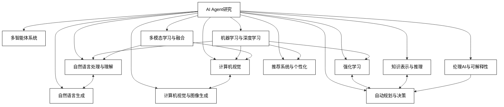

## 第3章 AI Agent的研究进展和挑战

### 3.1 AI Agent的12个研究领域与方向

AI Agent的研究是一个广泛而深入的领域，涉及多个学科和技术方向。本节将介绍AI Agent研究的12个主要领域和方向，探讨每个领域的核心问题、最新进展和未来挑战。

1. 自然语言处理与理解

核心问题：
- 如何使AI Agent更好地理解和生成人类语言
- 如何处理语言的歧义性和上下文依赖性

最新进展：
- 大规模预训练语言模型（如GPT-3, BERT）
- 多轮对话系统
- 跨语言理解和翻译

未来挑战：
- 常识推理能力的提升
- 长文本理解和生成
- 多语言、多方言的无缝处理

示例代码（使用Hugging Face Transformers进行情感分析）：

```python
from transformers import pipeline

def sentiment_analysis(text):
    classifier = pipeline('sentiment-analysis')
    result = classifier(text)[0]
    return f"Sentiment: {result['label']}, Score: {result['score']:.4f}"

print(sentiment_analysis("I love AI agents, they're so helpful!"))
```

2. 计算机视觉

核心问题：
- 如何使AI Agent理解和解释视觉信息
- 如何实现实时、准确的物体检测和识别

最新进展：
- 深度卷积神经网络（CNN）
- 目标检测算法（YOLO, Faster R-CNN）
- 图像生成模型（GAN, Diffusion Models）

未来挑战：
- 小样本学习和零样本学习
- 3D场景理解
- 视觉常识推理

示例代码（使用OpenCV进行人脸检测）：

```python
import cv2

def detect_faces(image_path):
    face_cascade = cv2.CascadeClassifier(cv2.data.haarcascades + 'haarcascade_frontalface_default.xml')
    image = cv2.imread(image_path)
    gray = cv2.cvtColor(image, cv2.COLOR_BGR2GRAY)
    faces = face_cascade.detectMultiScale(gray, 1.1, 4)
    for (x, y, w, h) in faces:
        cv2.rectangle(image, (x, y), (x+w, y+h), (255, 0, 0), 2)
    cv2.imshow('Detected Faces', image)
    cv2.waitKey(0)

detect_faces('path_to_your_image.jpg')
```

3. 强化学习

核心问题：
- 如何使AI Agent通过与环境交互学习最优策略
- 如何处理大规模、复杂环境中的决策问题

最新进展：
- 深度强化学习（DQN, A3C）
- 多智能体强化学习
- 元强化学习

未来挑战：
- 样本效率的提高
- 安全强化学习
- 迁移学习在强化学习中的应用

示例代码（使用OpenAI Gym和DQN进行简单的强化学习）：

```python
import gym
import numpy as np
from keras.models import Sequential
from keras.layers import Dense
from keras.optimizers import Adam

class DQNAgent:
    def __init__(self, state_size, action_size):
        self.state_size = state_size
        self.action_size = action_size
        self.memory = []
        self.gamma = 0.95
        self.epsilon = 1.0
        self.epsilon_decay = 0.995
        self.epsilon_min = 0.01
        self.learning_rate = 0.001
        self.model = self._build_model()

    def _build_model(self):
        model = Sequential()
        model.add(Dense(24, input_dim=self.state_size, activation='relu'))
        model.add(Dense(24, activation='relu'))
        model.add(Dense(self.action_size, activation='linear'))
        model.compile(loss='mse', optimizer=Adam(lr=self.learning_rate))
        return model

    def act(self, state):
        if np.random.rand() <= self.epsilon:
            return random.randrange(self.action_size)
        act_values = self.model.predict(state)
        return np.argmax(act_values[0])

    def train(self, state, action, reward, next_state, done):
        target = reward
        if not done:
            target = reward + self.gamma * np.amax(self.model.predict(next_state)[0])
        target_f = self.model.predict(state)
        target_f[0][action] = target
        self.model.fit(state, target_f, epochs=1, verbose=0)
        if self.epsilon > self.epsilon_min:
            self.epsilon *= self.epsilon_decay

# 使用示例
env = gym.make('CartPole-v1')
state_size = env.observation_space.shape[0]
action_size = env.action_space.n
agent = DQNAgent(state_size, action_size)

for episode in range(1000):
    state = env.reset()
    state = np.reshape(state, [1, state_size])
    for time in range(500):
        action = agent.act(state)
        next_state, reward, done, _ = env.step(action)
        next_state = np.reshape(next_state, [1, state_size])
        agent.train(state, action, reward, next_state, done)
        state = next_state
        if done:
            print(f"Episode: {episode}/{1000}, Score: {time}")
            break
```

4. 多智能体系统

核心问题：
- 如何协调多个AI Agent的行为
- 如何在竞争和合作环境中制定策略

最新进展：
- 多智能体强化学习算法
- 分布式AI系统
- 群体智能

未来挑战：
- 大规模多智能体系统的可扩展性
- 异构智能体的协作
- 多智能体系统的安全性和鲁棒性

示例代码（简单的多智能体通信模拟）：

```python
import random

class Agent:
    def __init__(self, id):
        self.id = id
        self.knowledge = set()

    def receive_info(self, info):
        self.knowledge.add(info)

    def share_info(self):
        if self.knowledge:
            return random.choice(list(self.knowledge))
        return None

def simulate_communication(agents, rounds):
    for _ in range(rounds):
        for agent in agents:
            info = agent.share_info()
            if info:
                recipient = random.choice([a for a in agents if a != agent])
                recipient.receive_info(info)

    for agent in agents:
        print(f"Agent {agent.id} knowledge: {agent.knowledge}")

# 使用示例
agents = [Agent(i) for i in range(5)]
for i, agent in enumerate(agents):
    agent.receive_info(f"Initial info {i}")

simulate_communication(agents, 10)
```

5. 知识表示与推理

核心问题：
- 如何有效地表示和组织知识
- 如何基于已有知识进行推理和决策

最新进展：
- 知识图谱
- 神经符号AI
- 概率图模型

未来挑战：
- 大规模知识的高效管理和查询
- 不确定性和不完整信息的处理
- 常识推理能力的提升

示例代码（简单的知识图谱构建和查询）：

```python
from rdflib import Graph, Literal, RDF, URIRef
from rdflib.namespace import FOAF, XSD

def build_knowledge_graph():
    g = Graph()
    # 添加三元组
    g.add((URIRef("http://example.org/Alice"), FOAF.knows, URIRef("http://example.org/Bob")))
    g.add((URIRef("http://example.org/Bob"), FOAF.age, Literal("30", datatype=XSD.integer)))
    return g

def query_knowledge_graph(g, query):
    results = g.query(query)
    for row in results:
        print(row)

# 使用示例
g = build_knowledge_graph()
query = """
SELECT ?person ?age
WHERE {
    ?person foaf:age ?age .
}
"""
query_knowledge_graph(g, query)
```

6. 机器学习与深度学习

核心问题：
- 如何从数据中学习模式和规律
- 如何提高模型的泛化能力和鲁棒性

最新进展：
- 自监督学习
- 元学习
- 神经架构搜索

未来挑战：
- 小样本学习和零样本学习
- 可解释性AI
- 持续学习和适应性

示例代码（使用PyTorch实现简单的神经网络）：

```python
import torch
import torch.nn as nn
import torch.optim as optim

class SimpleNet(nn.Module):
    def __init__(self):
        super(SimpleNet, self).__init__()
        self.fc1 = nn.Linear(10, 5)
        self.fc2 = nn.Linear(5, 1)

    def forward(self, x):
        x = torch.relu(self.fc1(x))
        x = self.fc2(x)
        return x

# 创建模型、损失函数和优化器
model = SimpleNet()
criterion = nn.MSELoss()
optimizer = optim.SGD(model.parameters(), lr=0.01)

# 模拟训练过程
for epoch in range(100):
    # 假设输入数据
    inputs = torch.randn(32, 10)
    targets = torch.randn(32, 1)

    # 前向传播
    outputs = model(inputs)
    loss = criterion(outputs, targets)

    # 反向传播和优化
    optimizer.zero_grad()
    loss.backward()
    optimizer.step()

    if epoch % 10 == 0:
        print(f'Epoch [{epoch+1}/100], Loss: {loss.item():.4f}')
```

7. 自然语言生成

核心问题：
- 如何生成连贯、流畅、符合上下文的文本
- 如何控制生成文本的风格和内容

最新进展：
- 基于Transformer的大规模语言模型
- 可控文本生成
- 多模态文本生成

未来挑战：
- 生成文本的事实准确性
- 长文本生成的连贯性
- 个性化和定制化文本生成

示例代码（使用GPT-2进行简单的文本生成）：

```python
from transformers import GPT2LMHeadModel, GPT2Tokenizer

def generate_text(prompt, max_length=100):
    model = GPT2LMHeadModel.from_pretrained("gpt2")
    tokenizer = GPT2Tokenizer.from_pretrained("gpt2")

    input_ids = tokenizer.encode(prompt, return_tensors="pt")
    output = model.generate(input_ids, max_length=max_length, num_return_sequences=1)

    generated_text = tokenizer.decode(output[0], skip_special_tokens=True)
    return generated_text

# 使用示例
prompt = "AI agents are becoming increasingly sophisticated. They can now"
generated_text = generate_text(prompt)
print(generated_text)
```

8. 计算机视觉与图像生成

核心问题：
- 如何实现高精度的图像识别和分割
- 如何生成高质量、多样化的图像

最新进展：
- 自注意力机制在视觉任务中的应用
- 生成对抗网络（GAN）的改进
- 扩散模型

未来挑战：
- 跨模态视觉理解
- 少样本图像生成
- 视觉常识推理

示例代码（使用PyTorch实现简单的GAN）：

```python
import torch
import torch.nn as nn

class Generator(nn.Module):
    def __init__(self):
        super(Generator, self).__init__()
        self.model = nn.Sequential(
            nn.Linear(100, 256),
            nn.ReLU(),
            nn.Linear(256, 784),
            nn.Tanh()
        )

    def forward(self, z):
        return self.model(z)

class Discriminator(nn.Module):
    def __init__(self):
        super(Discriminator, self).__init__()
        self.model = nn.Sequential(
            nn.Linear(784, 256),
            nn.ReLU(),
            nn.Linear(256, 1),
            nn.Sigmoid()
        )

    def forward(self, x):
        return self.model(x)

# 初始化生成器和判别器
generator = Generator()
discriminator = Discriminator()

# 定义损失函数和优化器
criterion = nn.BCELoss()
g_optimizer = torch.optim.Adam(generator.parameters(), lr=0.0002)
d_optimizer = torch.optim.Adam(discriminator.parameters(), lr=0.0002)

# 训练循环（简化版）
for epoch in range(100):
    # 训练判别器
    real_data = torch.randn(64, 784)  # 假设的真实数据
    z = torch.randn(64, 100)
    fake_data = generator(z)
    
    d_loss_real = criterion(discriminator(real_data), torch.ones(64, 1))
    d_loss_fake = criterion(discriminator(fake_data), torch.zeros(64, 1))
    d_loss = d_loss_real + d_loss_fake

    d_optimizer.zero_grad()
    d_loss.backward()
    d_optimizer.step()

    # 训练生成器
    z = torch.randn(64, 100)
    fake_data = generator(z)
    g_loss = criterion(discriminator(fake_data), torch.ones(64, 1))

    g_optimizer.zero_grad()
    g_loss.backward()
    g_optimizer.step()

    if epoch % 10 == 0:
        print(f'Epoch [{epoch+1}/100], d_loss: {d_loss.item():.4f}, g_loss: {g_loss.item():.4f}')
```

9. 推荐系统与个性化

核心问题：
- 如何准确预测用户偏好
- 如何平衡推荐的准确性和多样性

最新进展：
- 基于深度学习的推荐算法
- 多目标推荐系统
- 上下文感知推荐

未来挑战：
- 冷启动问题
- 隐私保护推荐
- 跨域推荐

示例代码（简单的基于协同过滤的推荐系统）：

```python
import numpy as np
from sklearn.metrics.pairwise import cosine_similarity

class SimpleRecommender:
    def __init__(self, user_item_matrix):
        self.user_item_matrix = user_item_matrix
        self.user_similarity = cosine_similarity(user_item_matrix)

    def recommend(self, user_id, n_recommendations=5):
        user_ratings = self.user_item_matrix[user_id]
        similar_users = np.argsort(self.user_similarity[user_id])[::-1][1:]
        
        recommendations = []
        for item_id in range(self.user_item_matrix.shape[1]):
            if user_ratings[item_id] == 0:  # 用户未评价的物品
                score = np.sum(self.user_item_matrix[similar_users, item_id] * self.user_similarity[user_id, similar_users])
                recommendations.append((item_id, score))
        
        recommendations.sort(key=lambda x: x[1], reverse=True)
        return recommendations[:n_recommendations]

# 使用示例
user_item_matrix = np.array([
    [4, 3, 0, 5, 0],
    [5, 0, 4, 0, 2],
    [3, 1, 2, 5, 0],
    [0, 0, 0, 4, 4],
])

recommender = SimpleRecommender(user_item_matrix)
print(recommender.recommend(0))
```

10. 自动规划与决策

核心问题：
- 如何在复杂环境中制定最优策略
- 如何处理不确定性和部分可观察性

最新进展：
- 分层强化学习
- 模型预测控制
- 概率规划

未来挑战：
- 长期规划
- 多目标决策优化
- 实时规划和决策

示例代码（简单的A*寻路算法）：

```python
import heapq

def heuristic(a, b):
    return abs(b[0] - a[0]) + abs(b[1] - a[1])

def a_star(start, goal, grid):
    neighbors = [(0,1), (0,-1), (1,0), (-1,0)]
    close_set = set()
    came_from = {}
    gscore = {start:0}
    fscore = {start:heuristic(start, goal)}
    open_set = []
    heapq.heappush(open_set, (fscore[start], start))
    
    while open_set:
        current = heapq.heappop(open_set)[1]
        
        if current == goal:
            path = []
            while current in came_from:
                path.append(current)
                current = came_from[current]
            path.append(start)
            path.reverse()
            return path

        close_set.add(current)
        
        for i, j in neighbors:
            neighbor = current[0] + i, current[1] + j
            tentative_g_score = gscore[current] + 1
            if 0 <= neighbor[0] < len(grid) and 0 <= neighbor[1] < len(grid[0]):
                if grid[neighbor[0]][neighbor[1]] == 1:
                    continue
            else:
                continue
                
            if neighbor in close_set and tentative_g_score >= gscore.get(neighbor, 0):
                continue
                
            if  tentative_g_score < gscore.get(neighbor, 0) or neighbor not in [i[1]for i in open_set]:
                came_from[neighbor] = current
                gscore[neighbor] = tentative_g_score
                fscore[neighbor] = gscore[neighbor] + heuristic(neighbor, goal)
                heapq.heappush(open_set, (fscore[neighbor], neighbor))
    
    return False

# 使用示例
grid = [
    [0, 0, 0, 0, 1],
    [1, 1, 0, 1, 0],
    [0, 0, 0, 0, 0],
    [0, 1, 1, 1, 0],
    [0, 0, 0, 1, 0]
]
start = (0, 0)
goal = (4, 4)

path = a_star(start, goal, grid)
print(path)
```

11. 多模态学习与融合

核心问题：
- 如何有效整合不同模态的信息
- 如何处理模态间的不一致性和缺失

最新进展：
- 跨模态预训练模型
- 多模态对比学习
- 多模态生成模型

未来挑战：
- 模态间的知识迁移
- 多模态推理
- 多模态数据的隐私保护

示例代码（简单的图像文本多模态融合）：

```python
import torch
import torch.nn as nn

class MultimodalFusion(nn.Module):
    def __init__(self, image_dim, text_dim, output_dim):
        super(MultimodalFusion, self).__init__()
        self.image_encoder = nn.Linear(image_dim, 128)
        self.text_encoder = nn.Linear(text_dim, 128)
        self.fusion = nn.Linear(256, output_dim)

    def forward(self, image, text):
        image_features = torch.relu(self.image_encoder(image))
        text_features = torch.relu(self.text_encoder(text))
        fused_features = torch.cat((image_features, text_features), dim=1)
        output = self.fusion(fused_features)
        return output

# 使用示例
model = MultimodalFusion(image_dim=2048, text_dim=300, output_dim=10)
image_input = torch.randn(1, 2048)
text_input = torch.randn(1, 300)
output = model(image_input, text_input)
print(output.shape)
```

12. 伦理AI与可解释性

核心问题：
- 如何确保AI系统的决策符合伦理标准
- 如何提高AI系统的透明度和可解释性

最新进展：
- 公平性感知机器学习算法
- 可解释的深度学习模型
- AI伦理准则和框架

未来挑战：
- AI系统的道德决策
- 跨文化AI伦理
- 隐私保护与透明度的平衡

示例代码（简单的模型解释工具）：

```python
from sklearn.ensemble import RandomForestClassifier
from sklearn.inspection import PartialDependenceDisplay
import matplotlib.pyplot as plt

# 假设我们有一个训练好的随机森林模型和特征
X, y = ...  # 训练数据
model = RandomForestClassifier().fit(X, y)

# 计算部分依赖图
features = [0, 1]  # 我们想要解释的特征索引
PartialDependenceDisplay.from_estimator(model, X, features)
plt.show()
```

这12个研究领域代表了AI Agent研究的主要方向。它们相互关联，共同推动了AI Agent技术的发展。未来，我们可能会看到这些领域之间的更多融合，产生新的研究方向和突破性成果。

为了更好地理解这些研究领域之间的关系，我们可以使用以下Mermaid图：



这个图展示了AI Agent研究的主要领域及其之间的一些关键联系。例如，自然语言处理与自然语言生成密切相关，计算机视觉与图像生成相互支持，强化学习为自动规划与决策提供了重要工具，而机器学习与深度学习则是多个领域的基础。

总结与展望：

1. 跨领域融合：未来的AI Agent研究将更加注重不同领域的融合。例如，将自然语言处理、计算机视觉和知识推理结合，创造出能够理解和描述复杂场景的AI Agent。

2. 通用人工智能（AGI）：随着各个领域的进展，我们可能会看到更接近AGI的AI Agent出现，它们能够在多个领域展现人类级别的智能。

3. 人机协作：AI Agent研究将更多地关注如何增强人类能力，而不是替代人类。这将导致更多的研究集中在人机协作界面和交互模式上。

4. 可解释性和伦理：随着AI Agent在更多关键领域的应用，可解释性和伦理问题将成为研究的重中之重。

5. 环境适应性：未来的AI Agent需要能够适应更加复杂和动态的环境，这将推动自适应学习和迁移学习等领域的发展。

6. 能源效率：随着AI模型规模的增长，如何开发更加节能高效的AI Agent将成为一个重要的研究方向。

7. 安全性和鲁棒性：随着AI Agent在关键系统中的应用，提高其安全性和鲁棒性将变得越来越重要。

8. 情感和社交智能：未来的AI Agent研究可能会更多地关注情感理解和社交互动能力，使AI Agent能够更自然地与人类交互。

为了应对这些挑战和机遇，研究人员需要采取跨学科的方法，结合计算机科学、认知科学、神经科学、心理学等多个领域的知识。同时，也需要考虑AI Agent的社会影响，确保其发展方向符合人类的长远利益。

在实际应用中，这些研究成果将推动AI Agent在各个领域的应用，如：

1. 智能助手：更智能、更自然的个人助理，能够理解复杂指令和上下文。

2. 自动驾驶：能够处理复杂交通场景，做出安全决策的AI驾驶系统。

3. 医疗诊断：结合多模态数据的AI诊断系统，提供更准确的疾病诊断和治疗建议。

4. 智能教育：个性化的AI教学系统，能够适应每个学生的学习风格和进度。

5. 科学研究：AI Agent辅助科学家进行复杂的数据分析和假设验证。

6. 创意产业：能够生成高质量内容的AI创作工具，辅助人类创作者。

7. 智能制造：优化生产流程、预测设备故障的AI生产管理系统。

8. 环境保护：监测和预测环境变化，提供决策支持的AI环境管理系统。

为了更好地推动这些应用的发展，我们需要：

1. 加强产学研合作：促进学术研究成果向实际应用的转化。

2. 建立开放平台：鼓励研究者和开发者共享数据、模型和工具。

3. 制定标准和规范：确保AI Agent的开发和应用符合伦理和安全标准。

4. 培养跨学科人才：培养具备AI技术和领域知识的复合型人才。

5. 加强国际合作：推动全球范围内的AI Agent研究合作和交流。

最后，我们应该认识到，尽管AI Agent研究已经取得了巨大进展，但距离真正的人类级别智能还有很长的路要走。每个研究领域都面临着独特的挑战，需要研究人员的持续努力和创新。同时，我们也需要警惕AI技术可能带来的风险，如隐私侵犯、就业替代、决策偏见等，并积极采取措施来应对这些挑战。

通过持续的研究和负责任的开发，AI Agent有望成为解决人类面临的复杂问题的强大工具，为创造更美好的未来做出贡献。

### 3.2 AI Agent的研究成果与典型案例

#### 3.2.1 AI Agent的研究成果

AI Agent的研究在近年来取得了显著的进展，涵盖了多个领域和应用场景。以下是一些重要的研究成果：

1. 大规模语言模型

研究成果：GPT-3、BERT、T5等大规模语言模型的出现标志着自然语言处理领域的重大突破。

关键技术：
- Transformer架构
- 自监督学习
- 少样本学习

实际应用：
- 智能对话系统
- 自动文本生成
- 语言翻译

代码示例（使用Hugging Face Transformers库加载和使用BERT模型）：

```python
from transformers import BertTokenizer, BertModel
import torch

# 加载预训练的BERT模型和分词器
tokenizer = BertTokenizer.from_pretrained('bert-base-uncased')
model = BertModel.from_pretrained('bert-base-uncased')

# 准备输入
text = "Hello, how are you?"
inputs = tokenizer(text, return_tensors="pt")

# 获取BERT输出
with torch.no_grad():
    outputs = model(**inputs)

# 获取最后一层的隐藏状态
last_hidden_states = outputs.last_hidden_state
print(last_hidden_states.shape)
```

2. 强化学习

研究成果：AlphaGo、OpenAI Five等展示了强化学习在复杂决策任务中的潜力。

关键技术：
- 深度Q网络（DQN）
- 策略梯度方法
- 模型预测控制

实际应用：
- 游戏AI
- 机器人控制
- 资源调度

代码示例（使用PyTorch实现简单的DQN）：

```python
import torch
import torch.nn as nn
import torch.optim as optim
import numpy as np

class DQN(nn.Module):
    def __init__(self, input_dim, output_dim):
        super(DQN, self).__init__()
        self.fc = nn.Sequential(
            nn.Linear(input_dim, 64),
            nn.ReLU(),
            nn.Linear(64, 64),
            nn.ReLU(),
            nn.Linear(64, output_dim)
        )

    def forward(self, x):
        return self.fc(x)

class DQNAgent:
    def __init__(self, state_dim, action_dim):
        self.q_network = DQN(state_dim, action_dim)
        self.target_network = DQN(state_dim, action_dim)
        self.target_network.load_state_dict(self.q_network.state_dict())
        self.optimizer = optim.Adam(self.q_network.parameters())
        self.criterion = nn.MSELoss()

    def select_action(self, state, epsilon):
        if np.random.random() < epsilon:
            return np.random.randint(0, self.q_network.fc[-1].out_features)
        else:
            with torch.no_grad():
                q_values = self.q_network(torch.FloatTensor(state))
                return torch.argmax(q_values).item()

    def update(self, state, action, reward, next_state, done):
        state = torch.FloatTensor(state)
        next_state = torch.FloatTensor(next_state)
        reward = torch.FloatTensor([reward])
        action = torch.LongTensor([action])

        q_values = self.q_network(state)
        next_q_values = self.target_network(next_state)
        q_value = q_values.gather(1, action.unsqueeze(1)).squeeze(1)
        next_q_value = next_q_values.max(1)[0]
        expected_q_value = reward + 0.99 * next_q_value * (1 - done)

        loss = self.criterion(q_value, expected_q_value.detach())
        self.optimizer.zero_grad()
        loss.backward()
        self.optimizer.step()

# 使用示例
agent = DQNAgent(state_dim=4, action_dim=2)
state = np.random.rand(4)
action = agent.select_action(state, epsilon=0.1)
next_state = np.random.rand(4)
reward = 1.0
done = False
agent.update(state, action, reward, next_state, done)
```

3. 计算机视觉

研究成果：YOLO、Mask R-CNN等算法大幅提高了物体检测和图像分割的性能。

关键技术：
- 卷积神经网络（CNN）
- 注意力机制
- 迁移学习

实际应用：
- 自动驾驶
- 医学图像分析
- 安防监控

代码示例（使用PyTorch和预训练的ResNet模型进行图像分类）：

```python
import torch
from torchvision import models, transforms
from PIL import Image

# 加载预训练的ResNet模型
model = models.resnet50(pretrained=True)
model.eval()

# 图像预处理
preprocess = transforms.Compose([
    transforms.Resize(256),
    transforms.CenterCrop(224),
    transforms.ToTensor(),
    transforms.Normalize(mean=[0.485, 0.456, 0.406], std=[0.229, 0.224, 0.225]),
])

# 加载和预处理图像
image = Image.open("path_to_your_image.jpg")
input_tensor = preprocess(image)
input_batch = input_tensor.unsqueeze(0)

# 进行推理
with torch.no_grad():
    output = model(input_batch)

# 获取预测结果
_, predicted_idx = torch.max(output, 1)
print(f"Predicted class index: {predicted_idx.item()}")
```

4. 多智能体系统

研究成果：在协作和竞争环境中的多智能体学习算法取得了显著进展。

关键技术：
- 分布式强化学习
- 博弈论
- 群体智能

实际应用：
- 交通管理
- 金融市场模拟
- 分布式控制系统

代码示例（简单的多智能体协作任务）：

```python
import numpy as np

class Agent:
    def __init__(self, id):
        self.id = id
        self.position = np.random.rand(2)
        self.velocity = np.zeros(2)

    def move(self, swarm):
        # 简单的群体行为规则
        separation = self.separate(swarm)
        alignment = self.align(swarm)
        cohesion = self.cohere(swarm)
        
        self.velocity += separation + alignment + cohesion
        self.velocity = self.velocity / np.linalg.norm(self.velocity)
        self.position += self.velocity

    def separate(self, swarm):
        # 分离：避免碰撞
        separation = np.zeros(2)
        for agent in swarm:
            if agent.id != self.id:
                diff = self.position - agent.position
                if np.linalg.norm(diff) < 0.1:
                    separation += diff
        return separation

    def align(self, swarm):
        # 对齐：与邻近智能体保持相同方向
        alignment = np.zeros(2)
        for agent in swarm:
            if agent.id != self.id:
                alignment += agent.velocity
        return alignment / (len(swarm) - 1)

    def cohere(self, swarm):
        # 内聚：向群体中心移动
        center = np.mean([agent.position for agent in swarm if agent.id != self.id], axis=0)
        return center - self.position

# 使用示例
swarm = [Agent(i) for i in range(10)]
for _ in range(100):
    for agent in swarm:
        agent.move(swarm)

for agent in swarm:
    print(f"Agent {agent.id} position: {agent.position}")
```

5. 自然语言生成

研究成果：GPT系列模型在文本生成、对话系统等方面取得了突破性进展。

关键技术：
- 序列到序列学习
- 注意力机制
- 强化学习优化

实际应用：
- 自动写作
- 对话系统
- 代码生成

代码示例（使用GPT-2生成文本）：

```python
from transformers import GPT2LMHeadModel, GPT2Tokenizer

def generate_text(prompt, max_length=100):
    model = GPT2LMHeadModel.from_pretrained("gpt2")
    tokenizer = GPT2Tokenizer.from_pretrained("gpt2")

    input_ids = tokenizer.encode(prompt, return_tensors="pt")
    output = model.generate(input_ids, max_length=max_length, num_return_sequences=1,
                            no_repeat_ngram_size=2, top_k=50, top_p=0.95)

    generated_text = tokenizer.decode(output[0], skip_special_tokens=True)
    return generated_text

# 使用示例
prompt = "AI agents are becoming increasingly sophisticated. They can now"
generated_text = generate_text(prompt)
print(generated_text)
```

这些研究成果展示了AI Agent在各个领域的快速发展。它们不仅推动了技术的进步，也为实际应用提供了强大的工具和解决方案。然而，这些成果也带来了新的挑战，如模型的可解释性、伦理问题、计算资源需求等，这些都是未来研究需要继续关注和解决的问题。
#### 3.2.2 AI Agent的典型案例

以下是一些AI Agent在实际应用中的典型案例，展示了这些技术如何解决实际问题并创造价值：

1. OpenAI的ChatGPT

应用领域：自然语言处理、对话系统

主要特点：
- 基于大规模语言模型
- 多轮对话能力
- 上下文理解和任务执行

实际应用：
- 客户服务
- 编程辅助
- 内容创作

案例分析：
ChatGPT展示了大规模语言模型在对话系统中的强大能力。它能够理解复杂的上下文，生成连贯的回复，并执行各种语言相关的任务。ChatGPT的成功引发了对AI伦理和对人类工作影响的讨论，同时也推动了自然语言处理技术的进一步发展。

2. DeepMind的AlphaFold

应用领域：生物信息学、蛋白质结构预测

主要特点：
- 深度学习与生物学知识的结合
- 高精度的蛋白质结构预测
- 对科学研究的重大贡献

实际应用：
- 药物开发
- 疾病研究
- 生物技术创新

案例分析：
AlphaFold解决了长期以来困扰生物学家的蛋白质折叠问题。通过结合深度学习技术和生物学知识，AlphaFold能够以前所未有的精度预测蛋白质的三维结构。这一突破性成果为药物开发、疾病研究等领域提供了强大的工具，展示了AI在科学研究中的巨大潜力。

3. Tesla的自动驾驶系统

应用领域：计算机视觉、自动控制

主要特点：
- 多传感器融合
- 实时环境感知和决策
- 持续学习和更新

实际应用：
- 辅助驾驶
- 自动泊车
- 交通安全改善

案例分析：
Tesla的自动驾驶系统是AI Agent在复杂实时环境中应用的典型案例。系统需要处理大量的传感器数据，进行实时的环境感知和决策。通过持续的数据收集和模型更新，Tesla不断改进其自动驾驶系统的性能。这个案例展示了AI在处理高度动态和不确定环境中的潜力，同时也凸显了安全性和可靠性的重要性。

4. IBM Watson for Oncology

应用领域：医疗诊断、知识图谱

主要特点：
- 大规模医学知识处理
- 个性化治疗推荐
- 持续学习和更新

实际应用：
- 癌症诊断辅助
- 治疗方案制定
- 医学研究支持

案例分析：
IBM Watson for Oncology展示了AI Agent在专业领域决策支持中的应用。系统通过处理大量医学文献和临床数据，为医生提供个性化的癌症治疗建议。这个案例强调了AI与人类专家协作的重要性，同时也提出了如何确保AI系统在关键决策中的可靠性和可解释性的问题。

5. Google的 DeepMind AlphaGo

应用领域：博弈论、强化学习

主要特点：
- 深度强化学习
- 蒙特卡洛树搜索
- 自我对弈学习

实际应用：
- 复杂策略游戏
- 决策支持系统
- 人工智能研究

案例分析：
AlphaGo在围棋领域战胜世界顶级选手，标志着AI在复杂决策任务中的重大突破。AlphaGo的成功不仅推动了强化学习技术的发展，也为AI在其他复杂决策领域的应用提供了inspiration。这个案例展示了AI如何在高度复杂和抽象的问题空间中学习和决策。

6. Amazon的推荐系统

应用领域：个性化推荐、机器学习

主要特点：
- 大规模用户行为数据处理
- 实时个性化推荐
- 多目标优化

实际应用：
- 电子商务
- 内容推荐
- 用户体验优化

案例分析：
Amazon的推荐系统是AI Agent在大规模个性化服务中的典型应用。系统通过分析用户的浏览历史、购买行为和其他用户的数据，为每个用户提供个性化的产品推荐。这个案例展示了AI如何处理大规模数据并提供实时的个性化服务，同时也引发了关于用户隐私和算法偏见的讨论。

代码示例（简化的推荐系统）：

```python
import numpy as np
from sklearn.metrics.pairwise import cosine_similarity

class SimpleRecommender:
    def __init__(self, user_item_matrix):
        self.user_item_matrix = user_item_matrix
        self.item_similarity = cosine_similarity(user_item_matrix.T)

    def recommend(self, user_id, n_recommendations=5):
        user_ratings = self.user_item_matrix[user_id]
        weighted_sum = np.zeros_like(user_ratings)
        for item_id, rating in enumerate(user_ratings):
            if rating > 0:
                similar_items = self.item_similarity[item_id]
                weighted_sum += rating * similar_items
        
        weighted_sum[user_ratings > 0] = 0  # 排除用户已评价的物品
        recommendations = np.argsort(weighted_sum)[::-1][:n_recommendations]
        return recommendations

# 使用示例
user_item_matrix = np.array([
    [4, 3, 0, 5, 0],
    [5, 0, 4, 0, 2],
    [3, 1, 2, 5, 0],
    [0, 0, 0, 4, 4],
])

recommender = SimpleRecommender(user_item_matrix)
user_id = 0
recommendations = recommender.recommend(user_id)
print(f"Recommendations for user {user_id}: {recommendations}")
```

这些典型案例展示了AI Agent在各个领域的实际应用和影响。它们不仅展示了AI技术的强大能力，也凸显了在实际应用中面临的挑战，如：

1. 可解释性：如何使AI Agent的决策过程更透明、可解释。
2. 安全性和可靠性：如何确保AI系统在关键应用中的安全性和可靠性。
3. 伦理和隐私：如何平衡AI的能力和用户隐私保护。
4. 人机协作：如何设计AI系统以最好地augment人类能力，而不是替代人类。
5. 适应性：如何使AI Agent能够适应动态变化的环境和需求。
6. 泛化能力：如何提高AI Agent在未见过的情况下的表现。

这些案例也为未来AI Agent的研究和应用指明了方向：

1. 跨领域集成：结合不同领域的AI技术，创造更强大的综合系统。
2. 持续学习：开发能够从实际使用中不断学习和改进的AI系统。
3. 人机协作界面：设计更自然、更直观的人机交互方式。
4. 可解释AI：开发能够解释其决策过程的AI模型和工具。
5. 安全性和隐私保护：在AI系统中集成更强的安全和隐私保护机制。
6. 社会影响评估：更全面地评估AI技术的社会影响，并制定相应的政策和规范。

通过这些典型案例的学习和分析，我们可以更好地理解AI Agent的潜力和挑战，为未来的研究和应用提供指导。同时，这些案例也提醒我们，在推进AI技术发展的同时，需要谨慎考虑其对社会、经济和伦理的影响，确保AI的发展方向与人类的长远利益相一致。

### 3.3 AI Agent的研究难点与未来展望

#### 3.3.1 AI Agent的研究难点

尽管AI Agent技术在近年来取得了显著进展，但仍然面临着许多挑战和研究难点。以下是一些主要的研究难点：

1. 通用人工智能（AGI）的实现

挑战：
- 跨领域知识的整合和迁移
- 抽象推理和创造性思维的模拟
- 自主学习和适应能力的提升

研究方向：
- 元学习和迁移学习
- 神经符号AI系统
- 认知架构研究

代码示例（简单的元学习模型）：

```python
import torch
import torch.nn as nn
import torch.optim as optim

class MetaLearner(nn.Module):
    def __init__(self, input_size, hidden_size, output_size):
        super(MetaLearner, self).__init__()
        self.net = nn.Sequential(
            nn.Linear(input_size, hidden_size),
            nn.ReLU(),
            nn.Linear(hidden_size, output_size)
        )
        self.meta_optimizer = optim.Adam(self.parameters(), lr=0.01)

    def forward(self, x):
        return self.net(x)

    def adapt(self, support_set, support_labels, num_steps=5):
        optimizer = optim.SGD(self.parameters(), lr=0.1)
        criterion = nn.MSELoss()

        for _ in range(num_steps):
            predictions = self(support_set)
            loss = criterion(predictions, support_labels)
            optimizer.zero_grad()
            loss.backward()
            optimizer.step()

    def meta_learn(self, tasks):
        meta_loss = 0
        for task in tasks:
            support_set, support_labels, query_set, query_labels = task
            self.adapt(support_set, support_labels)
            predictions = self(query_set)
            loss = nn.MSELoss()(predictions, query_labels)
            meta_loss += loss

        self.meta_optimizer.zero_grad()
        meta_loss.backward()
        self.meta_optimizer.step()

# 使用示例
model = MetaLearner(input_size=10, hidden_size=20, output_size=1)
# 假设我们有一组任务，每个任务包含支持集和查询集
tasks = [generate_task() for _ in range(10)]
model.meta_learn(tasks)
```

2. 可解释性和透明度

挑战：
- 复杂模型决策过程的解释
- 可解释性与性能之间的权衡
- 用户友好的解释生成

研究方向：
- 可解释的机器学习模型
- 后验解释技术
- 可视化决策过程

代码示例（使用LIME进行模型解释）：

```python
from sklearn.ensemble import RandomForestClassifier
from lime import lime_tabular
import numpy as np

# 假设我们有训练好的随机森林模型和数据
X_train, y_train = ...  # 训练数据
X_test = ...  # 测试数据

model = RandomForestClassifier()
model.fit(X_train, y_train)

# 使用LIME解释预测
explainer = lime_tabular.LimeTabularExplainer(X_train, feature_names=['feature1', 'feature2', ...], class_names=['class0', 'class1'])

def explain_prediction(instance):
    exp = explainer.explain_instance(instance, model.predict_proba, num_features=5)
    print("Prediction:", model.predict([instance])[0])
    print("Explanation:")
    for feature, importance in exp.as_list():
        print(f"{feature}: {importance}")

# 解释一个测试实例
explain_prediction(X_test[0])
```

3. 安全性和鲁棒性

挑战：
- 对抗性攻击的防御
- 不确定性和噪声的处理
- 长期稳定性和可靠性

研究方向：
- 对抗训练
- 不确定性量化
- 形式化验证方法

代码示例（简单的对抗训练）：

```python
import torch
import torch.nn as nn
import torch.optim as optim

def generate_adversarial_example(model, x, y, epsilon=0.1):
    x.requires_grad = True
    output = model(x)
    loss = nn.CrossEntropyLoss()(output, y)
    loss.backward()

    adversarial_x = x + epsilon * x.grad.sign()
    adversarial_x = torch.clamp(adversarial_x, 0, 1)
    return adversarial_x.detach()

def adversarial_train(model, train_loader, epochs=10):
    criterion = nn.CrossEntropyLoss()
    optimizer = optim.Adam(model.parameters())

    for epoch in range(epochs):
        for x, y in train_loader:
            # 生成对抗样本
            x_adv = generate_adversarial_example(model, x, y)

            # 训练原始样本
            optimizer.zero_grad()
            output = model(x)
            loss = criterion(output, y)
            loss.backward()
            optimizer.step()

            # 训练对抗样本
            optimizer.zero_grad()
            output_adv = model(x_adv)
            loss_adv = criterion(output_adv, y)
            loss_adv.backward()
            optimizer.step()

        print(f"Epoch {epoch+1}/{epochs} completed")

# 使用示例
model = ...  # 定义你的模型
train_loader = ...  # 准备数据加载器
adversarial_train(model, train_loader)
```

4. 多模态学习和融合

挑战：
- 不同模态数据的对齐和融合
- 模态间的知识迁移
- 处理模态缺失和不一致

研究方向：
- 跨模态表示学习
- 多模态预训练- 多模态注意力机制

代码示例（简单的多模态融合模型）：

```python
import torch
import torch.nn as nn

class MultimodalFusion(nn.Module):
    def __init__(self, text_dim, image_dim, fusion_dim):
        super(MultimodalFusion, self).__init__()
        self.text_encoder = nn.Linear(text_dim, fusion_dim)
        self.image_encoder = nn.Linear(image_dim, fusion_dim)
        self.fusion = nn.Sequential(
            nn.ReLU(),
            nn.Linear(fusion_dim * 2, fusion_dim),
            nn.ReLU(),
            nn.Linear(fusion_dim, 1)
        )

    def forward(self, text, image):
        text_features = self.text_encoder(text)
        image_features = self.image_encoder(image)
        fused_features = torch.cat([text_features, image_features], dim=1)
        output = self.fusion(fused_features)
        return output

# 使用示例
model = MultimodalFusion(text_dim=300, image_dim=2048, fusion_dim=512)
text_input = torch.randn(32, 300)
image_input = torch.randn(32, 2048)
output = model(text_input, image_input)
print(output.shape)
```

5. 长期记忆和持续学习

挑战：
- 知识的长期保存和更新
- 避免灾难性遗忘
- 动态环境中的适应性学习

研究方向：
- 终身学习算法
- 记忆增强神经网络
- 增量学习技术

代码示例（简单的增量学习模型）：

```python
import torch
import torch.nn as nn
import torch.optim as optim

class IncrementalLearner(nn.Module):
    def __init__(self, input_size, hidden_size, num_classes):
        super(IncrementalLearner, self).__init__()
        self.feature_extractor = nn.Sequential(
            nn.Linear(input_size, hidden_size),
            nn.ReLU(),
            nn.Linear(hidden_size, hidden_size),
            nn.ReLU()
        )
        self.classifier = nn.Linear(hidden_size, num_classes)
        self.optimizer = optim.SGD(self.parameters(), lr=0.01)
        self.criterion = nn.CrossEntropyLoss()

    def forward(self, x):
        features = self.feature_extractor(x)
        return self.classifier(features)

    def update(self, x, y):
        self.train()
        self.optimizer.zero_grad()
        output = self(x)
        loss = self.criterion(output, y)
        loss.backward()
        self.optimizer.step()
        return loss.item()

    def add_new_class(self, num_new_classes):
        old_weights = self.classifier.weight.data
        old_bias = self.classifier.bias.data
        in_features = self.classifier.in_features
        out_features = self.classifier.out_features + num_new_classes

        self.classifier = nn.Linear(in_features, out_features)
        self.classifier.weight.data[:out_features-num_new_classes] = old_weights
        self.classifier.bias.data[:out_features-num_new_classes] = old_bias

        self.optimizer = optim.SGD(self.parameters(), lr=0.01)

# 使用示例
model = IncrementalLearner(input_size=100, hidden_size=50, num_classes=10)
# 训练初始类别
for _ in range(1000):
    x = torch.randn(32, 100)
    y = torch.randint(0, 10, (32,))
    loss = model.update(x, y)

# 添加新类别
model.add_new_class(num_new_classes=5)
# 训练新类别
for _ in range(1000):
    x = torch.randn(32, 100)
    y = torch.randint(0, 15, (32,))
    loss = model.update(x, y)
```

6. 高效的探索和学习

挑战：
- 大规模状态空间的有效探索
- 样本效率的提高
- 好奇心驱动的学习

研究方向：
- 内在动机机制
- 分层强化学习
- 主动学习策略

代码示例（带有内在奖励的强化学习）：

```python
import numpy as np
import torch
import torch.nn as nn
import torch.optim as optim

class IntrinsicMotivationAgent(nn.Module):
    def __init__(self, state_dim, action_dim):
        super(IntrinsicMotivationAgent, self).__init__()
        self.policy = nn.Sequential(
            nn.Linear(state_dim, 64),
            nn.ReLU(),
            nn.Linear(64, action_dim)
        )
        self.value = nn.Sequential(
            nn.Linear(state_dim, 64),
            nn.ReLU(),
            nn.Linear(64, 1)
        )
        self.optimizer = optim.Adam(self.parameters(), lr=0.001)

    def forward(self, state):
        return self.policy(state), self.value(state)

    def get_action(self, state):
        policy, _ = self(state)
        return torch.argmax(policy).item()

    def update(self, state, action, reward, next_state, done):
        policy, value = self(state)
        _, next_value = self(next_state)

        # 计算内在奖励（简化版，基于状态新颖性）
        intrinsic_reward = 1.0 / (1.0 + np.sum(np.square(state - next_state)))

        # 总奖励 = 外在奖励 + 内在奖励
        total_reward = reward + 0.1 * intrinsic_reward

        # 计算优势
        advantage = total_reward + (0.99 * next_value * (1 - done)) - value

        # 计算损失
        actor_loss = -torch.log(policy[action]) * advantage.detach()
        critic_loss = advantage.pow(2)
        loss = actor_loss + 0.5 * critic_loss

        # 更新模型
        self.optimizer.zero_grad()
        loss.backward()
        self.optimizer.step()

# 使用示例
agent = IntrinsicMotivationAgent(state_dim=4, action_dim=2)
state = torch.randn(4)
action = agent.get_action(state)
next_state = torch.randn(4)
reward = 1.0
done = False
agent.update(state, action, reward, next_state, done)
```

#### 3.3.2 AI Agent的未来展望

尽管面临诸多挑战，AI Agent的未来仍然充满希望。以下是一些可能的发展方向和展望：

1. 通用人工智能（AGI）的突破

- 跨领域知识整合和迁移能力的显著提升
- 更接近人类水平的抽象推理和创造性思维
- 自主学习和适应能力的大幅增强

2. 人机协作的新范式

- 更自然、更直观的人机交互界面
- AI Agent作为人类能力的增强器，而不是替代品
- 协作智能系统的广泛应用

3. 可解释AI的普及

- 透明度和可解释性成为AI系统的标准特性
- 用户友好的解释生成技术
- 可解释性与性能之间的平衡得到优化

4. 安全和道德AI的发展

- 更强大的对抗性攻击防御机制
- AI系统的形式化验证方法的成熟
- 内置伦理决策能力的AI Agent

5. 多模态和跨模态AI的进步

- 无缝集成多种感知模态的AI系统
- 跨模态知识迁移和推理能力的提升
- 多模态数据的高效处理和融合技术

6. 分布式和边缘AI的普及

- 大规模分布式AI系统的高效协作
- 边缘设备上运行的高性能AI Agent
- 隐私保护和联邦学习技术的广泛应用

7. 生物启发的AI架构

- 受大脑结构和功能启发的新型AI架构
- 结合符号推理和神经网络的混合系统
- 更高效、更灵活的学习和适应机制

8. 量子计算与AI的结合

- 量子机器学习算法的实际应用
- 量子-经典混合AI系统
- 利用量子计算解决复杂优化问题

9. 情感和社交智能的提升

- 具有情感理解和表达能力的AI Agent
- 更自然、更有同理心的人机交互
- 社交场景中的AI辅助决策系统

10. 可持续和环保AI

- 能源效率更高的AI硬件和算法
- AI在环境保护和气候变化应对中的应用
- 可持续发展导向的AI研究和应用

为了实现这些未来展望，研究人员和开发者需要：

1. 跨学科合作：结合计算机科学、认知科学、神经科学、心理学等多个领域的知识。

2. 伦理和监管框架：制定和完善AI发展的伦理准则和监管框架。

3. 开放研究：促进开放源代码、开放数据集和研究成果的共享。

4. 教育和培训：培养跨学科AI人才，提高公众对AI的理解和接受度。

5. 产学研合作：加强学术界和产业界的合作，促进研究成果的转化和应用。

6. 长期投资：对基础研究和前沿技术进行持续的长期投资。

7. 国际合作：推动全球范围内的AI研究合作和交流。

总的来说，AI Agent的未来充满机遇和挑战。通过持续的创新和负责任的发展，AI Agent有望在解决人类面临的复杂问题、提高生活质量和推动科技进步方面发挥越来越重要的作用。然而，我们也需要警惕AI技术可能带来的风险，确保其发展方向与人类的长远利益相一致。
